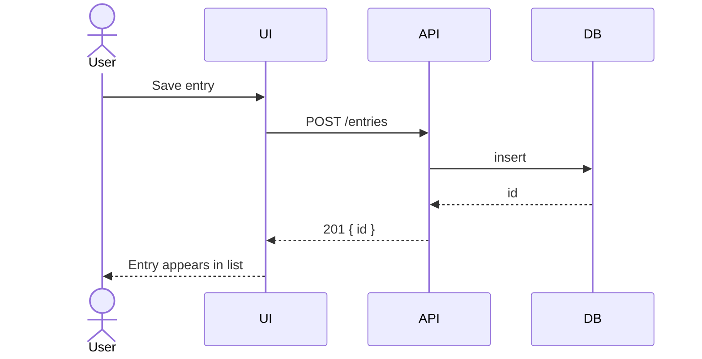
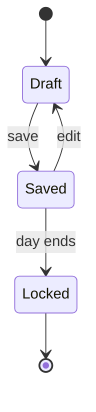
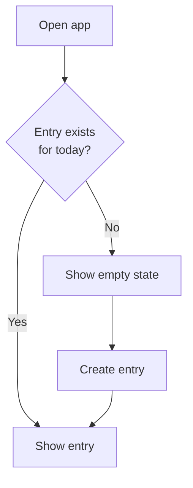
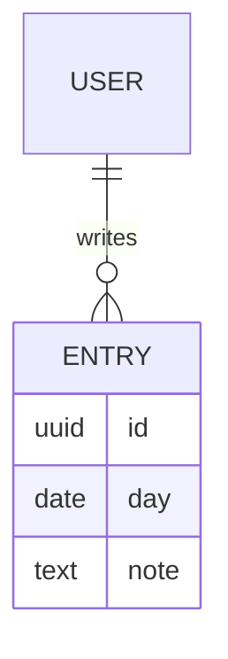
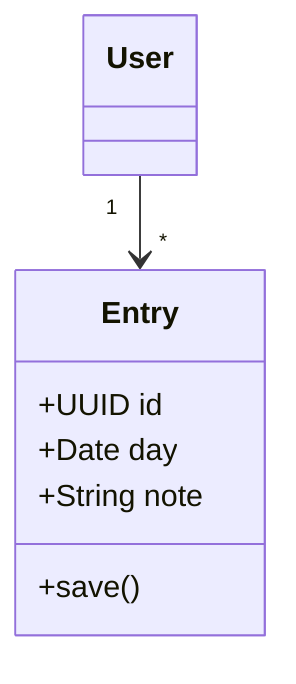

# Diagrams in a PRD

## When a diagram earns its place

A diagram is worth adding when the thing you're describing has *shape* — order,
branching, states, relations — that prose has to reconstruct sentence by
sentence. It is not worth adding when it restates a list you already wrote.

Ask: does this replace a paragraph someone would have to read twice? If not,
skip it. Most simple PRDs need zero or one. Every diagram is also a maintenance
liability — it goes stale silently, unlike prose, because nobody rereads it.

Use Mermaid in fenced ```mermaid blocks: it renders in GitHub, most editors, and
Claude Code, and it diffs as text.

## Choosing a type

| The thing you're describing | Diagram |
| :-- | :-- |
| Two or more actors exchanging messages in order | Sequence |
| One entity moving through a lifecycle | State |
| A user journey with decision points | Flowchart |
| Data with relationships and cardinality | ER |
| Objects with fields and associations | Class |

If you can't tell which fits, the content probably isn't shaped enough to need
one.

## Sequence — who calls whom, in what order

Best for anything asynchronous, or where a round trip's ordering is the point.



## State — the lifecycle of one thing

Best when a requirement says "once it's X it can no longer be Y". The diagram
makes illegal transitions visible, which is usually where the missing
requirements are hiding.



## Flowchart — a journey with branches

Best for decision points. Keep it to one path per diagram; a flowchart that
tries to show every case becomes unreadable faster than any other type.



## ER — the data model

Best when cardinality matters to the requirements. Include only the fields a
reader needs to understand the behaviour, not the full schema — the schema
belongs in the code.



## Class — structure and associations

Use sparingly in a PRD. It describes implementation, which usually isn't a
product decision. Reach for it only when the object model *is* the requirement.


