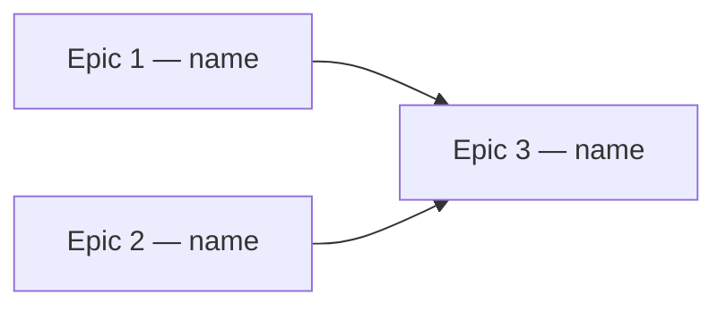

# Roadmap

Turn a feature briefing into a roadmap of epics that can actually be executed:
each one visible, independently validatable, and scheduled to run in parallel
where the dependencies allow it.

## 1. Resolve the feature

The skill runs for exactly one feature.

- Invoked as `/roadmap feature-3` → the target is `specs/feature-3/`.
- Invoked bare (`/roadmap`) → list the folders under `specs/` and ask which one.
  Don't guess, even when only one exists — confirming costs one line and
  prevents writing a roadmap into the wrong folder.
- Accept loose input: `3`, `feature 3`, and `specs/feature-3` all mean
  `specs/feature-3`. If it doesn't resolve to a real folder, show what's
  available and ask.

## 2. Read the inputs

**`specs/<feature>/briefing.md` is required.** Stop and tell the user if it is
missing or empty — a roadmap invented without a briefing looks authoritative
and is worthless, which is worse than no roadmap. Ask them to fill it in.

**If `roadmap.md` already exists, do not overwrite it.** Read it instead:

- Its open questions have ticked answers → fold them into the roadmap, remove
  the answered questions, and note what changed.
- Nothing has been answered → say it already exists, summarize it, and ask
  whether to regenerate from scratch or refine it.

**Read the project's conventions** if they exist — `AGENTS.md`, `CLAUDE.md`,
`docs/architecture.md`, `docs/testing.md`. Epics should land as the repo
expects them to (feature slices, colocated tests, whatever the project says),
so the roadmap doesn't quietly contradict the codebase's own rules.

## 3. Shape the epics

An epic is a slice of the feature that a team could pick up, finish, and prove
works — without the rest of the roadmap existing yet.

**Every epic ships something a person can see.** This is the constraint that
matters most. "Set up the database", "build the API layer", "add auth
scaffolding" are not epics — they're tasks hiding inside one. Infrastructure
never gets its own epic; it rides along inside the first epic that needs it,
and that epic is still named and judged by what becomes visible.

The reason is practical: infrastructure-only phases produce weeks with nothing
to look at, no way to tell whether the work is on track, and no early signal
that the design is wrong. Vertical slices surface that on day three instead of
week six.

So make Epic 1 the thinnest end-to-end path that renders something real — a
walking skeleton. Then each later epic thickens it along one dimension.

**How many.** Whatever the briefing actually justifies. One epic is a fine
answer for a small feature. Typically 2–6. If you're past 7, you're probably
slicing tasks rather than epics — or the briefing describes several features
and you should say so.

**Dependencies.** For each epic, ask what it truly needs to *start* versus what
it needs to be *complete*. Most apparent dependencies are on an agreed contract
— a route, a type, a payload shape — not on finished code. Pin the contract in
the earlier epic and the later one can proceed in parallel against it. Real
dependencies stay; invented ones cost you parallelism.

When two epics both need the same groundwork, put it in whichever ships first
and let the other depend on it. Don't hoist it into a shared prerequisite epic
— that's the infrastructure-epic trap wearing a different hat.

**Then check your work.** Read back the epic list and test each one:

1. Can I describe what's visibly different when this is done? If the answer is
   about internals, restructure it — merge it into the epic that makes it
   visible, or turn it inside out so the user-facing part leads.
2. Could someone validate this without the later epics existing?
3. Is this blocked for a real reason, or just because I listed it second?

Restructuring at this point is normal, not a sign of a bad first pass.

## 4. Write the roadmap

Write to `specs/<feature>/roadmap.md` using this structure:

````markdown
# Roadmap — <Feature Name>

Source: [briefing.md](briefing.md)

## Overview

Two to four sentences: what gets built, and the order the value arrives in.

## Epics

### Epic 1 — <name describing the visible outcome>

**Visible when done:** what a person can see or do that they couldn't before.
**Depends on:** none
**Parallel with:** Epic 2

**Scope**
- ...

**Out of scope**
- what a reader would reasonably assume is here but isn't, and which epic has it

**Validation**
- the demo path: click here, see this
- the tests that prove it, per the project's testing rules

### Epic 2 — ...

## Dependency map



## Execution waves

- **Wave 1 (parallel):** Epic 1, Epic 2
- **Wave 2:** Epic 3 — needs the contract from Epic 1

## Assumptions

Anything you decided that the briefing didn't settle. Keep these honest — they
are the roadmap's load-bearing guesses.

## Open questions
````

Omit `Assumptions` or `Open questions` if genuinely empty. Keep the prose
tight; this is a document someone will act on, not a proposal to sell.

## 5. Ask what you don't know

Write down every question where you are less than ~90% confident and where the
answer would change the roadmap's shape — epic boundaries, ordering, scope,
what "done" means. Skip trivia and anything you can decide sensibly yourself;
those become `Assumptions` instead. A roadmap with fifteen questions is
abdicating, one that quietly guesses on the big fork is worse.

Ask them in the document, at the end, as tickable options:

```markdown
## Open questions

Tick one option per question (`- [x]`), then tell me — I'll fold the answers in
and update the roadmap.

### Q1. Can an entry be edited after the day it belongs to has ended?

- [ ] A) Editable forever *(recommended — no lockout logic, simplest to ship)*
- [ ] B) Editable for 24 hours, then locked
- [ ] C) Never editable once saved
- [ ] D) Editable, with a visible edit history
```

Up to four options, each a real and distinct choice — not three straw men
around the one you want. Mark your recommendation and say in one clause why.
When none of the four fits, the user will write their own; that's expected.

Write the roadmap even when questions remain. State the assumption you proceeded
under so the document stands on its own, and let the answers refine it.

## 6. Report back

Tell the user the path you wrote, the epic names in wave order, and the count of
open questions — pointing them at the bottom of the file to answer.
