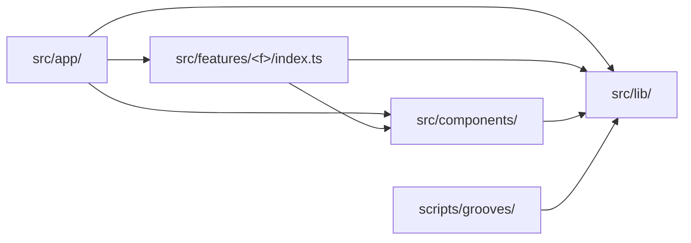

# Coding guidelines

This document is the concrete rulebook: specific, example-driven, "do this, not
that". [architecture.md](architecture.md) keeps the principles and the reasoning
behind the shape of the tree — read it for *why*; read this for what to type.
[testing.md](testing.md) sets the standard for what must be tested.

Every rule here was motivated by code in this repository and names the file that
motivated it. A rule this project has never had a reason for does not belong in
this document.

Each rule is tagged:

- *lint-enforced* — `npm run lint` fails on a violation. The mechanism is one
  rule, `import/no-restricted-paths` in `eslint.config.mjs`; see
  [Enforcement](#enforcement) for the zone behind each.
- *human-checked* — no linter checks it; a reviewer does. Several are
  additionally guarded by tests that read the tree from disk —
  `src/components/structure.test.ts`,
  `src/features/daily-groove/structure.test.ts`,
  `src/app/route-boundary.test.ts`, `scripts/grooves/boundary.test.ts` and
  `src/lib/hash.test.ts` — but a test is not a linter, so the tag stays honest.

---

## The design system

`src/components/` holds five role folders plus `tokens.ts`. The folders are
navigational, not import boundaries — any component may use any other component
and `tokens.ts` regardless of group.

**Put a new component in the group that matches its role, and pick the group by
the one-line test.**

| Group | Holds today | The test |
| :-- | :-- | :-- |
| `layout/` | `Container`, `PageShell`, `Row`, `Stack`, `LabelledColumn` | Does it only arrange its children — spacing, direction, the page frame — and render no content of its own? |
| `surfaces/` | `Card`, `Panel` | Is it a background other content sits *on*: a border, a fill, a gradient? |
| `controls/` | `Button`, `Chip`, `ChipGroup`, `PlayControl` | Does the user press, toggle or select it? |
| `typography/` | `Heading`, `Text`, `EyebrowLabel`, `SectionLabel` | Is it text styling and nothing else? |
| `display/` | `Pill`, `ProgressTrack` | Does it render a value read-only — no input, no children to arrange? |

`tokens.ts` stays at the root of `src/components/`, outside every group: it is
the system's shared vocabulary, not a component. `Space` in
`src/components/tokens.ts` is the closed spacing scale that `layout/Row.tsx` and
`layout/Stack.tsx` take instead of a raw length, so a caller can never smuggle
an arbitrary spacing decision in from outside.

*human-checked* — motivated by the whole of `src/components/`; the current
placement is asserted by `src/components/structure.test.ts`.

**Name a design-system component for what it is, never for where it is used.**
The names in `src/components/controls/Button.tsx`,
`src/components/surfaces/Card.tsx` and
`src/components/display/ProgressTrack.tsx` carry no domain word. Write `Button`,
not `CheckoutButton`; `Card`, not `GrooveCard`. Domain naming belongs to the
feature: `GrooveCard` exists, and it lives in
`src/features/daily-groove/components/puzzle/GrooveCard.tsx`, where it composes
`Card` rather than replacing it.

*human-checked* — motivated by `src/components/display/ProgressTrack.tsx`
versus `src/features/daily-groove/components/puzzle/GrooveCard.tsx`. A linter
cannot tell a generic noun from a domain one.

**Nothing under `src/components/` may import from `src/features/`.** The
dependency runs one way only:
`src/features/daily-groove/components/puzzle/GuessCard.tsx` imports five
primitives from `@/components/…`, and no file under `src/components/` names a
feature. If a primitive seems to need a feature's type, the type is in the wrong
place — lift it to `src/lib/`, or pass it in as a prop.

*lint-enforced* (zone 1) — motivated by the import direction every consumer
already relies on, e.g.
`src/features/daily-groove/components/puzzle/GuessCard.tsx`.

**Inside `src/components/`, import a sibling in your own group relatively and a
component in another group through the `@/` alias. No specifier begins with
`../`.** Crossing a group boundary must read as crossing one:

```ts
// src/components/controls/ChipGroup.tsx
import { Chip } from './Chip'                                        // same group
import { EyebrowLabel } from '@/components/typography/EyebrowLabel'  // crossing

// src/components/layout/Row.tsx and layout/Stack.tsx
import type { Space } from '@/components/tokens'                     // crossing

// not this
import { EyebrowLabel } from '../typography/EyebrowLabel'
```

`src/components/typography/SectionLabel.tsx` and
`src/components/controls/ChipGroup.tsx` show the same-group half:
`./EyebrowLabel` and `./Chip` stay relative because they do not cross.

*human-checked* — motivated by `src/components/controls/ChipGroup.tsx`,
`src/components/layout/Row.tsx` and `src/components/layout/Stack.tsx`; asserted
by the "no import that climbs out of its own folder" case in
`src/components/structure.test.ts`.

**No barrel files under `src/components/`.** There is no `index.ts` in any group
and none at the root; import each component from its own path. A barrel lets one
import pull in the whole design system — every consumer of `Button` would drag
in `ProgressTrack`, `Panel` and the rest, and the grouping would stop telling a
reader anything, because every path would end at the barrel.

*human-checked* — motivated by the absence of any `index.ts` under
`src/components/`, locked in by the "has no barrel files" case in
`src/components/structure.test.ts`.

---

## Feature slices

A feature folder separates its concerns by folder, not by convention:
`components/`, `hooks/`, `state/`, `data/` and `lib/`, with `types.ts` and
`index.ts` at the root. `src/features/daily-groove/` is the worked example.

**Reach a feature only through its `index.ts` — tests included.** From outside
`src/features/<feature>/`, import `@/features/daily-groove` and nothing deeper.
Today that surface is `GroovePuzzle` plus the `Answer`, `Attempt`,
`DailyResult`, `Flavour`, `Groove` and `Root` types. If you need something the
index does not export, export it there rather than reaching past it.

The rule binds consumers, not the feature itself: inside its own folder a
feature's files import each other freely by relative path, which is why
`components/puzzle/GuessCard.tsx` importing `../../lib/presentation/feedback` is
fine. `index.ts` is the surface for the outside world, not an internal routing
table.

A test is a consumer, and the violation that motivated this rule was in one.
`src/app/page.test.tsx` deep-imported
`@/features/daily-groove/lib/puzzle/selectGroove`,
`@/features/daily-groove/lib/theory/music` and
`@/features/daily-groove/data/grooves.generated`, and `vi.mock`ed a fourth path,
`@/features/daily-groove/lib/audio/audio`. None of the four was an import the
route needed; all four were there to assert on puzzle behaviour from the route
layer, which meant deleting `src/features/daily-groove/` would break the route's
*tests* however clean `page.tsx` was. A mocked path counts: `vi.mock` names a
module by path and breaks with it, while looking like setup rather than
coupling. Those assertions moved into the feature in Epic 3; the route test is
now 92 lines and imports only `./page`. `src/app/route-boundary.test.ts` reads
both route files and fails on any specifier — or `vi.mock` path — that is not
exactly `@/features/daily-groove`, catching the mock case that an import rule
structurally cannot.

*lint-enforced* (zone 2) — motivated by the four specifiers formerly in
`src/app/page.test.tsx` and by `src/features/daily-groove/index.ts`.

**No feature may import another feature — not even through its `index.ts`.**
Anything two slices both need moves *up* into `src/lib/` (logic) or
`src/components/` (UI), never sideways. There is one feature today, so this rule
has no violation to point at yet; it exists because a sideways import is what
makes a slice undeletable, and the zone is generated per feature so the second
slice inherits it with no config edit.

*lint-enforced* (zone 3) — motivated by the removability standard in
[architecture.md](architecture.md) and by `src/features/daily-groove/index.ts`
being the single inbound reference the route uses today.

**Put a `lib/` module in the concern folder that matches what it computes.**
`lib/` holds business logic only, split five ways:

| Folder | Holds today | Motivated by |
| :-- | :-- | :-- |
| `theory/` | `notes`, `music`, `options` | `lib/theory/notes.ts` — how a diatonic scale spells itself; pure music theory with no puzzle in it |
| `puzzle/` | `selectGroove`, `scoring`, `resolveGroove` | `lib/puzzle/scoring.ts` — the rules of the game: which groove today plays, whether a guess is right |
| `persistence/` | `storage`, `streak` | `lib/persistence/storage.ts` — the one seam onto stored results; nothing else touches `localStorage` |
| `presentation/` | `feedback`, `archive` | `lib/presentation/feedback.ts` — turning state into what the UI says, without rendering anything |
| `audio/` | `audio`, `transport` | `lib/audio/transport.ts` — the browser audio element and who is currently sounding |

A module that does not fit one of the five is a signal, not an exception: it is
either two modules, or it belongs in `state/` or `data/`.

*human-checked* — motivated by the twelve modules under
`src/features/daily-groove/lib/`; the folder set is asserted by
`src/features/daily-groove/structure.test.ts`.

**Group feature components by the screen region that renders them, and let the
grouping follow the composition tree.** `src/features/daily-groove/components/`
holds `header/` (`GrooveHeader`, `StreakBadge`), `puzzle/` (`GrooveCard`,
`TransportPanel`, `GuessCard`, `AttemptDots`, `FeedbackLine`, `NudgeBox`,
`SolvedPanel`) and `archive/` (`ArchiveStrip`). Each region is a subtree of one
composer, which is why no component appears in two of them. The root composer
`GroovePuzzle.tsx` sits above the regions at the `components/` root and belongs
to none: it is the thing that assembles them, reaching down with
`./header/GrooveHeader`, `./puzzle/GuessCard`, `./archive/ArchiveStrip`. A
component used by two regions has stopped being regional — move it up to the
`components/` root, or out to `src/components/` if the domain naming can be
stripped.

*human-checked* — motivated by
`src/features/daily-groove/components/GroovePuzzle.tsx` and its region imports;
asserted by `src/features/daily-groove/structure.test.ts`. Which region a
component belongs to is a judgement about the screen, not a fact about the
import graph, so no linter can make it.

**Generated data lives in `data/`, never in `lib/`.**
`src/features/daily-groove/data/grooves.generated.ts` is written by
`npm run grooves` and once sat among the hand-written business logic in `lib/`,
where nothing distinguished a file you may edit from a file that is overwritten
on the next render. Generator output goes in `data/`; the generator's write
target is a path constant (`DEFAULT_MANIFEST_PATH` in `scripts/grooves/cli.ts`
and `scripts/grooves/verify-cli.ts`) and must be updated with it.

*human-checked* — motivated by
`src/features/daily-groove/data/grooves.generated.ts` and the two path
constants that point at it.

**A generated file is never hand-edited — not even its comments.**
`scripts/grooves/lock.ts` records `manifestSha256` as `sha256File(manifestPath)`,
the hash of the *whole* file including its `GENERATED FILE - DO NOT EDIT`
banner. Touching a single character of
`src/features/daily-groove/data/grooves.generated.ts` — reflowing the banner,
fixing a typo in a comment — changes that hash and fails
`npm run grooves:verify`. The only correct fix at that point is to change the
input (`scripts/grooves/catalogue.json`) or the generator and re-render; running
`npm run grooves` merely to quiet the guard re-renders all the audio.

*human-checked* — motivated by
`src/features/daily-groove/data/grooves.generated.ts` and
`scripts/grooves/lock.ts`. No lint rule is added for this: the manifest hash in
`scripts/grooves/grooves.lock.json` already catches a hand edit, `prebuild` runs
`grooves:verify`, and a second guard would only be a worse copy of the first.

**`hooks/` holds only genuine hooks — modules that call React hooks and are
called during render.** `useDailyGrooveStore.ts` was filed there while actually
exporting a vanilla zustand store factory: it imports from `zustand/vanilla`,
calls no React hook, and is consumed through `useStore(...)` at the call site in
`GroovePuzzle.tsx`. It now lives in `src/features/daily-groove/state/`, leaving
`hooks/` holding `useProgress.ts`, `usePuzzleSession.ts` and `useTransport.ts`,
which are hooks. A `use` prefix is not the test; calling React hooks is.

*human-checked* — motivated by
`src/features/daily-groove/state/useDailyGrooveStore.ts` versus
`src/features/daily-groove/hooks/useProgress.ts`; asserted by
`src/features/daily-groove/structure.test.ts`.

---

## Shared code (`src/lib/`)

`src/lib/` is not a second junk drawer beside `src/features/<feature>/lib/`. It
holds one thing: code that both the app *and* the groove generator under
`scripts/` must run, and must run identically. `src/lib/hash.ts` and
`src/lib/groove.ts` are the whole of it today.

**A module earns a place in `src/lib/` only if it is pure, dependency-free,
runtime-safe and genuinely shared.** All four bars, and each is load-bearing:

- **Pure** — a function of its arguments, with no state, no clock, no
  `localStorage`, no DOM. `hashString` returns the same integer for the same
  string in a browser, in jsdom and in Node.
- **Dependency-free** — it imports nothing.
  `src/lib/groove.test.ts` asserts that `src/lib/groove.ts` has zero import
  specifiers, because that is the property the generator depends on.
- **Runtime-safe TypeScript** — a plain function or a type: no enums, no
  namespaces, no decorators, and no `@/` imports of its own. The generator runs
  under Node's type stripping, which erases annotations but neither resolves the
  alias nor emits the runtime code an enum needs. Type-only crossings are exempt
  because they vanish; a value import like `hashString` is not.
- **Genuinely shared** — two callers on opposite sides of the app/generator
  boundary. Something only the feature uses belongs in
  `src/features/<feature>/lib/`, where deleting the feature deletes it.

*human-checked* — motivated by `src/lib/hash.ts`, `src/lib/groove.ts`,
`scripts/grooves/rng.ts` and
`src/features/daily-groove/lib/puzzle/selectGroove.ts`, which held the second
copy of the hash.

**`src/lib/` is a leaf: nothing in it may import `src/features/` or
`src/components/`.** Being a leaf is not tidiness, it is the mechanism. Because
`src/lib/hash.ts` and `src/lib/groove.ts` import nothing, `scripts/` can reach
them by relative, extension-bearing path —
`import { hashString } from '../../src/lib/hash.ts'` in
`scripts/grooves/rng.ts`, `import type { Groove } from '../../src/lib/groove.ts'`
in `scripts/grooves/manifest.ts` — with no bundler and no build step in between.
Node's type stripping resolves no `@/` alias, so the moment a `src/lib/` module
imports app code through the alias, the generator stops being able to run it.

*lint-enforced* (zone 4) — motivated by `src/lib/hash.ts`,
`src/lib/groove.ts` and `scripts/grooves/rng.ts`.

**The generator's only channel into the app is `src/lib/`. Nothing under
`scripts/` may import `src/features/` or `src/components/`.** The generator
produces grooves, so `Groove`, `Root` and `Flavour` are the contract between the
two halves of the system and live in `src/lib/groove.ts`; `Answer`, `Attempt`
and `DailyResult` are gameplay and persistence concepts the generator has never
heard of and stay in `src/features/daily-groove/types.ts`, which re-exports the
three shared types so the feature's own modules keep importing `'../types'`
unchanged. Before Epic 4 the generator deep-imported the feature's `types.ts`
from `cli.ts`, `manifest.ts`, `pools.ts` and two of their tests.

Two consequences worth knowing before you "tidy" anything:

- **`scripts/grooves/types.ts` still declares its own `Flavour`, and that is not
  a duplicate.** The generator's `Flavour` is a union of eight internal
  lowercase mode names (`'dorian'`, `'harmonic-minor'`); the app's
  `Flavour` in `src/lib/groove.ts` is a display string (`'Dorian'`).
  `displayFlavour()` in `scripts/grooves/cli.ts` is the single conversion point
  between them. Unifying the two would be a behaviour change wearing a
  de-duplication's clothes. The generator's `Root`, which *was* genuinely the
  same type declared twice, has been deleted;
  `scripts/grooves/boundary.test.ts` asserts that `types.ts` declares no `Root`
  and still declares `Flavour`.
- **The manifest's own output path is not a crossing.** `scripts/` names
  `src/features/daily-groove/data/grooves.generated.ts` in four places —
  `cli.ts`, `verify-cli.ts` and their tests — as the file it *writes*. That is a
  string, not an import.

*lint-enforced* (zone 5) — motivated by the five `Groove` and `Root` imports
formerly crossing from `scripts/grooves/` into
`src/features/daily-groove/types.ts`.

**`src/lib/hash.ts` is frozen. Editing it is a re-release, not a refactor.** The
same `hashString` seeds the generator's RNG *and* picks the player's groove of
the day. Change one character and both move: every groove re-renders to
different audio, breaking the freeze rule in `scripts/grooves/README.md`, and
every past date is reassigned a different puzzle from the one the player was
actually shown. It was duplicated across the boundary until Epic 3, held
together by a comment in `scripts/grooves/rng.ts` claiming the two copies were
"byte-for-byte the same", with nothing checking it. `src/lib/hash.test.ts` now
pins the function against a fixed input/output table. When that table fails, the
fix is to restore the function — never to regenerate the table.

The same test asserts the FNV prime appears in exactly one file under `src/` and
`scripts/`, by reading the source of both trees. Note how it spells the
constant: `const FNV_PRIME = String(2 ** 24 + 403)`, never as a literal. A
literal would make `src/lib/hash.test.ts` itself a second place the constant is
written, and the test would fail its own single-holder assertion. A guard that
reads source has to keep itself out of its own search.

*human-checked* — motivated by `src/lib/hash.ts`, `src/lib/hash.test.ts` and
`scripts/grooves/rng.ts`. A linter can forbid an import; it cannot know that
this particular function's output is baked into sixteen committed mp3s.

---

## Anti-patterns and their fixes

Three shapes this repository has actually grown, each with the file it grew in
and the move that fixed it.

**No component file constructs an I/O adapter.** A component may *use* audio,
storage or the network; it may not build the thing that touches them.
`createTransport` was defined inside
`src/features/daily-groove/components/GroovePuzzle.tsx` — a `new Audio(...)`
owner, its listener set and its disposal, all in the file whose job is to
arrange cards on a page. Feature-4 moved it to
`src/features/daily-groove/lib/audio/transport.ts` as `createPageTransport`, and
the component now reaches it through `hooks/useTransport.ts`, which orchestrates
a lifetime rather than building one. The fix has a shape: the adapter goes to
`lib/<concern>/`, a hook owns its lifetime, and the component takes values. An
adapter in a component file cannot be tested without rendering, cannot be
swapped in a test without mocking the component's own module, and is invisible
to anyone reading the folder as a list of concerns.

*human-checked* — motivated by
`src/features/daily-groove/components/GroovePuzzle.tsx` before feature-4, versus
`src/features/daily-groove/lib/audio/transport.ts` now. `new Audio(...)` is a
constructor call, not an import, so `import/no-restricted-paths` cannot see it.

**A test lives beside the code it covers, and asserts that code's subject.**
[testing.md](testing.md) asks for colocation; the deep imports in
`src/app/page.test.tsx` were the symptom of breaking it. Thirteen assertions
about flavour options, root chips, attempt dots, the archive strip and the
transport sat in the route's test file, where nobody looking at
`components/puzzle/GuessCard.tsx` would find them and where deleting the feature
orphaned them. They now sit in the file that owns each subject —
`components/puzzle/GuessCard.test.tsx`,
`components/puzzle/AttemptDots.test.tsx`,
`components/archive/ArchiveStrip.test.tsx`, `lib/theory/music.test.ts` and the
rest. Relocating an assertion does not license rewriting it: one written against
the whole page keeps that render, in a
`describe('through the composed page', ...)` block that says so, via
`src/features/daily-groove/testing/renderFeature.tsx`. Rewriting it as an
isolated render with hand-made props is a different assertion wearing the old
one's name.

*human-checked* — motivated by `src/app/page.test.tsx` and the destination table
in `specs/feature-5/prd/epic-3-god-component.md`.

**A component that imports most of its own feature's modules is doing too much.**
`src/features/daily-groove/components/GroovePuzzle.tsx` reached 362 lines
importing eight `lib/` modules, the data file, both hooks and every region
component, and carried a 1,226-line test — three times the next largest file in
`src/`. The import list is the tell, and it is countable: a composer reaches
*down* into the regions it assembles, so a long list of sideways `../lib/`
imports means the file is holding logic that belongs behind a seam. The fix is
to name the seams the file already has and lift them out:
`hooks/usePuzzleSession.ts` took store creation, hydration and the check;
`hooks/useTransport.ts` took the transport's lifetime and its error flag; what
was left is the date, the derived view data and the JSX — 274 lines. Extract
along seams the tests are already organised around: if the existing assertions
have to be rewritten to fit the new shape, the split has gone past a refactor
and into a redesign.

*human-checked* — motivated by
`src/features/daily-groove/components/GroovePuzzle.tsx` versus
`src/features/daily-groove/hooks/usePuzzleSession.ts` and
`src/features/daily-groove/hooks/useTransport.ts`.

---

## Enforcement

The lint-enforced rules above are all one ESLint rule:
`import/no-restricted-paths`, configured as an **error** in the
`daily-groove/import-boundaries` block of `eslint.config.mjs`. There is no
second mechanism — the `no-restricted-imports` fallback the spec allowed for was
never needed, because a zone's `target` and `except` clauses express every case,
including the "consumers, not the feature" carve-out.

`basePath` is pinned to `import.meta.dirname`, so the zones resolve against the
repo root whatever directory `eslint` runs from.

The allowed import graph — an arrow is permitted, every pair not drawn is an
error:



### The five zones

| # | Zone | Rule it encodes | How it is expressed |
| :-- | :-- | :-- | :-- |
| 1 | `target: src/components`, `from: src/features` | The design system may not know about features | one static zone |
| 2 | `target:` everything outside the slice, `from: src/features/<f>`, `except: ['index.ts']` | A feature is reached only through its `index.ts` | one zone **per feature**, generated |
| 3 | `target:` the sibling features, `from: src/features/<f>`, no `except` | No feature imports another, not even its `index.ts` | one zone **per feature**, generated |
| 4 | `target: src/lib`, `from: ['src/features', 'src/components']` | `src/lib/` is a leaf | one static zone |
| 5 | `target: scripts`, `from: ['src/features', 'src/components']`, no `except` | `src/lib/` is the generator's only channel | one static zone |

Five things about that table are easy to get wrong:

**Zones 2 and 3 are generated from `readdirSync('src/features')`, not
hard-coded.** Add a second slice and it gets both boundaries with no config
edit. This matters most for zone 3, which would silently stop existing if the
sibling list were maintained by hand: with one feature its `target` list is
empty and the zone is inert, and it only becomes load-bearing at exactly the
moment someone forgets to update it.

**The feature carve-out is expressed by zone 2's `target`, not by an
exception.** The `target` list enumerates the places *outside* the feature —
`src/app`, `src/components`, `src/lib`, `scripts` and the sibling features. A
file inside `src/features/daily-groove/` is in no zone's target, so its own
relative imports are never examined. `except: ['index.ts']` is the separate,
smaller thing: it is what lets the listed consumers reach the public surface at
all.

**Zone 5 has no `except`, and that is deliberate.** `scripts/` cannot reach a
feature even through its `index.ts` — stricter than zone 2, because `src/lib/`
is meant to be the generator's only channel into the app, not a preferred one.

**The zones bind test files exactly as they bind source.** The
`daily-groove/import-boundaries` block carries no `files` key, and the only
`globalIgnores` are `.next/**`, `out/**`, `build/**`, `next-env.d.ts` and
`specs/**` — nothing exempts `*.test.ts(x)`. This is the part that matters most:
both violations this project actually found were in tests.

**Every zone carries a `message` that names the rule and the reason**, not just
the restricted path, because a lint error is where most people meet these rules
first.

### What lint structurally cannot see

`import/no-restricted-paths` inspects **import and require specifiers only**. It
does not read path strings. `scripts/grooves/cli.ts` and
`scripts/grooves/verify-cli.ts` build the generated manifest's location by
joining `'../../src/features/daily-groove/data/grooves.generated.ts'` onto their
own directory, and their tests do the same with `import.meta.dirname`. Those
four files are correctly not flagged — they name a write target, not a
dependency — and no configuration of this rule could flag them.

That is why `scripts/grooves/boundary.test.ts` *also* string-scans every `.ts`
under `scripts/`: it checks no import specifier mentions `src/features`, and
separately that the literal string appears nowhere except the one manifest
output path, held in a named constant. **The two guards are complementary, not
redundant.** Lint catches the import a string scan would have to guess at;
the scan catches the `readFileSync`, `vi.mock` or dynamic path that lint cannot
see. Deleting either one as "duplication" removes a case the other never
covered.

### What is not lint-enforced, and why

The *human-checked* tag is not a softer version of *lint-enforced*; it means the
rule is about meaning rather than about the import graph, so no configuration
would catch it. Five of them in particular are conventions a reviewer owns:

| Convention | Where it is stated | Why no linter |
| :-- | :-- | :-- |
| Design-system components are named generically | [The design system](#the-design-system) | `GrooveCard` and `Card` are the same shape to a parser |
| No I/O adapter is constructed in a component file | [Anti-patterns](#anti-patterns-and-their-fixes) | `new Audio(...)` is a constructor call, not an import |
| Generated data lives in `data/`, never `lib/` | [Feature slices](#feature-slices) | nothing in a file's text says it was generated |
| Feature components are grouped by screen region | [Feature slices](#feature-slices) | which region a component belongs to is a judgement about the screen |
| `src/lib/hash.ts` is frozen | [Shared code](#shared-code-srclib) | a linter cannot know this function's output is baked into sixteen committed mp3s |

Several human-checked rules do have a test standing behind them —
`src/components/structure.test.ts`,
`src/features/daily-groove/structure.test.ts`,
`src/app/route-boundary.test.ts`, `scripts/grooves/boundary.test.ts` and
`src/lib/hash.test.ts` all read the tree or the source from disk and fail on
drift. They run under `npm test`, not `npm run lint`, and none of them replaces
a reviewer's judgement about a rule's intent.

### The generated manifest

No lint rule guards `src/features/daily-groove/data/grooves.generated.ts`
against a hand edit, and none is being added. `npm run grooves:verify` already
covers it: `scripts/grooves/lock.ts` records the hash of the whole file as
`manifestSha256` in `scripts/grooves/grooves.lock.json`, so any character
changed anywhere in it — comment, banner or data — fails verification. `prebuild`
runs `grooves:verify`, so a hand edit cannot reach a build. A second guard in
`eslint.config.mjs` would only restate the first, less precisely.
