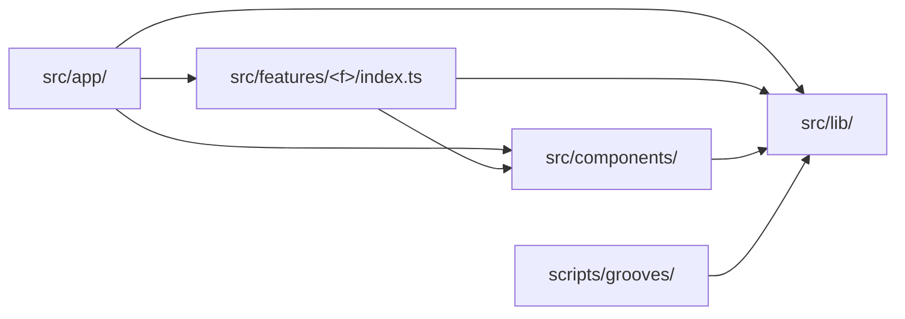

# Coding guidelines

This document is the concrete rulebook: specific, example-driven, "do this, not
that". [architecture.md](architecture.md) keeps the principles and the reasoning
behind the shape of the tree — read it for *why*; read this for what to type.
[testing.md](testing.md) sets the standard for what must be tested.

Every rule here was motivated by code in this repository and names the file that
motivated it. A rule this project has never had a reason for does not belong in
this document.

Each rule is tagged:

- *lint-enforced* — `npm run lint` fails on a violation. Two rules in
  `eslint.config.mjs` do that work: `import/no-restricted-paths` for the import
  graph, and `no-restricted-syntax` for one folder's test literals; see
  [Enforcement](#enforcement) for the block behind each.
- *human-checked* — no linter checks it; a reviewer does. Several are
  additionally guarded by tests that read the tree from disk —
  `src/components/structure.test.ts`,
  `src/features/daily-groove/structure.test.ts`,
  `src/app/route-boundary.test.ts`, `scripts/grooves/boundary.test.ts` and
  `src/lib/hash.test.ts` — but a test is not a linter, so the tag stays honest.

---

## The design system

`src/components/` holds five role folders plus `tokens.ts`. The folders are
navigational, not import boundaries — any component may use any other component
and `tokens.ts` regardless of group.

**Put a new component in the group that matches its role, and pick the group by
the one-line test.**

| Group | Holds today | The test |
| :-- | :-- | :-- |
| `layout/` | `Container`, `PageShell`, `Row`, `Stack`, `LabelledColumn` | Does it only arrange its children — spacing, direction, the page frame — and render no content of its own? |
| `surfaces/` | `Card`, `Panel` | Is it a background other content sits *on*: a border, a fill, a gradient? |
| `controls/` | `Button`, `Chip`, `ChipGroup`, `InlineButton`, `PlayControl`, `Select`, `Switch` | Does the user press, toggle or select it? |
| `typography/` | `Heading`, `Text`, `Lettering`, `EyebrowLabel`, `SectionLabel` | Is it text styling and nothing else? |
| `display/` | `Pill`, `ProgressTrack`, `Toast` | Does it render a value read-only — no input, no children to arrange? |

`tokens.ts` stays at the root of `src/components/`, outside every group: it is
the system's shared vocabulary, not a component. `Space` in
`src/components/tokens.ts` is the closed spacing scale that `layout/Row.tsx` and
`layout/Stack.tsx` take instead of a raw length, so a caller can never smuggle
an arbitrary spacing decision in from outside.

*human-checked* — motivated by the whole of `src/components/`; the current
placement is asserted by `src/components/structure.test.ts`.

**Name a design-system component for what it is, never for where it is used.**
The names in `src/components/controls/Button.tsx`,
`src/components/surfaces/Card.tsx` and
`src/components/display/ProgressTrack.tsx` carry no domain word. Write `Button`,
not `CheckoutButton`; `Card`, not `GrooveCard`. Domain naming belongs to the
feature: `GrooveCard` exists, and it lives in
`src/features/daily-groove/components/puzzle/GrooveCard.tsx`, where it composes
`Card` rather than replacing it.

*human-checked* — motivated by `src/components/display/ProgressTrack.tsx`
versus `src/features/daily-groove/components/puzzle/GrooveCard.tsx`. A linter
cannot tell a generic noun from a domain one.

**Nothing under `src/components/` may import from `src/features/`.** The
dependency runs one way only:
`src/features/daily-groove/components/puzzle/GuessCard.tsx` imports five
primitives from `@/components/…`, and no file under `src/components/` names a
feature. If a primitive seems to need a feature's type, the type is in the wrong
place — lift it to `src/lib/`, or pass it in as a prop.

*lint-enforced* (zone 1) — motivated by the import direction every consumer
already relies on, e.g.
`src/features/daily-groove/components/puzzle/GuessCard.tsx`.

**Inside `src/components/`, import a sibling in your own group relatively and a
component in another group through the `@/` alias. No specifier begins with
`../`.** Crossing a group boundary must read as crossing one:

```ts
// src/components/controls/ChipGroup.tsx
import { Chip } from './Chip'                                        // same group
import { EyebrowLabel } from '@/components/typography/EyebrowLabel'  // crossing

// src/components/layout/Row.tsx and layout/Stack.tsx
import type { Space } from '@/components/tokens'                     // crossing

// not this
import { EyebrowLabel } from '../typography/EyebrowLabel'
```

`src/components/typography/SectionLabel.tsx` and
`src/components/controls/ChipGroup.tsx` show the same-group half:
`./EyebrowLabel` and `./Chip` stay relative because they do not cross.

*human-checked* — motivated by `src/components/controls/ChipGroup.tsx`,
`src/components/layout/Row.tsx` and `src/components/layout/Stack.tsx`; asserted
by the "no import that climbs out of its own folder" case in
`src/components/structure.test.ts`.

**No barrel files under `src/components/`.** There is no `index.ts` in any group
and none at the root; import each component from its own path. A barrel lets one
import pull in the whole design system — every consumer of `Button` would drag
in `ProgressTrack`, `Panel` and the rest, and the grouping would stop telling a
reader anything, because every path would end at the barrel.

A feature's `lib/` folder is the case where the opposite holds — see
[A concern folder earns a door](#feature-slices). A primitive is one of twenty
interchangeable pieces; a concern folder is one seam with a job, and naming the
job is what its `index.ts` is for.

*human-checked* — motivated by the absence of any `index.ts` under
`src/components/`, locked in by the "has no barrel files" case in
`src/components/structure.test.ts`.

---

## Feature slices

A feature folder separates its concerns by folder, not by convention:
`components/`, `hooks/`, `state/`, `data/` and `lib/`, with `types.ts` and
`index.ts` at the root. `src/features/daily-groove/` is the worked example.

**Reach a feature only through its `index.ts` — tests included.** From outside
`src/features/<feature>/`, import `@/features/daily-groove` and nothing deeper.
Today that surface is five values — `GroovePuzzle`, `grooveByUuid`,
`isTodaysGroove`, `grooveHref` and `shareUrlOf` — plus the `Answer`, `Attempt`,
`DailyResult`, `Flavour`, `Groove` and `Root` types. Read
`src/features/daily-groove/index.ts` rather than this sentence if the two
disagree; the file is the surface, and this list has been wrong before. If you
need something the index does not export, export it there rather than reaching
past it.

The rule binds consumers, not the feature itself: inside its own folder a
feature's files import each other freely by relative path, which is why
`components/puzzle/NudgeBox.tsx` importing `../../lib/presentation/feedback` is
fine. `index.ts` is the surface for the outside world, not an internal routing
table.

**One file is the exception, for one folder.**
`src/features/daily-groove/components/GroovePuzzle.tsx` may not import a module
inside `lib/presentation/`; it reaches coaching through
`lib/presentation/index.ts` and nothing else. The reason is that it is the
composer: it assembles every region, so its import list is the one place the
whole slice's graph is visible, and it is the one file that has been cut and has
grown back. Measured: 362 lines at feature-4, cut to 288 by feature-5's split,
488 by feature-12, 750 after the mode playback landed, 406 when feature-20 began.
Its imports into `lib/presentation/` went 2 → 3 → 4 → 6 over the four releases
since feature-12 and never once down.

The exception stops there, in both directions. Its four other concern
imports — `@/lib/theory/*`, `../lib/audio/*`, `../lib/puzzle/selectGroove` and
`../lib/persistence/storage` — are ordinary intra-slice imports and no rule
touches them, because those folders have no door (see *A concern folder earns a
door* below). And no other file in the slice is bound. The population a
slice-wide rule would have to bind is countable, and here is the count with the
command that produces it — 64 specifiers reach from outside `lib/` into a module
inside one of its concern folders, 28 of them in non-test files:

```
grep -rhoE "from '(\.\./)+lib/[a-z]+/[A-Za-z]+'" \
  src/features/daily-groove --include=*.ts --include=*.tsx | wc -l
```

Binding all 64 would be guarding a collision that has never happened between two
region components. (The number moves with the tree, so re-run the command rather
than trusting it; what should not move is the reasoning, which is that the
measured pain is in one file and one folder.)

*human-checked* — motivated by
`src/features/daily-groove/components/GroovePuzzle.tsx`; asserted by the "holds
the shell to the door" case in `src/features/daily-groove/structure.test.ts`,
which reads that one file from disk. The routes are covered separately, by
`src/app/route-boundary.test.ts`.

A test is a consumer, and the violation that motivated this rule was in one.
`src/app/page.test.tsx` deep-imported
`@/features/daily-groove/lib/puzzle/selectGroove`,
`@/features/daily-groove/lib/theory/music` — the theory module has since moved
out of the feature to `src/lib/theory/music.ts` — and
`@/features/daily-groove/data/grooves.generated`, and `vi.mock`ed a fourth path,
`@/features/daily-groove/lib/audio/audio`. None of the four was an import the
route needed; all four were there to assert on puzzle behaviour from the route
layer, which meant deleting `src/features/daily-groove/` would break the route's
*tests* however clean `page.tsx` was. A mocked path counts: `vi.mock` names a
module by path and breaks with it, while looking like setup rather than
coupling. Those assertions moved into the feature in Epic 3; the route test is
now 70 lines and imports only `./page` and `@/lib/branding`.
`src/app/route-boundary.test.ts` reads both route files and fails on any
specifier — or `vi.mock` path — that is not exactly `@/features/daily-groove`,
catching the mock case that an import rule structurally cannot.

*lint-enforced* (zone 2) — motivated by the four specifiers formerly in
`src/app/page.test.tsx` and by `src/features/daily-groove/index.ts`.

**No feature may import another feature — not even through its `index.ts`.**
Anything two slices both need moves *up* into `src/lib/` (logic) or
`src/components/` (UI), never sideways. There is one feature today, so this rule
has no violation to point at yet; it exists because a sideways import is what
makes a slice undeletable, and the zone is generated per feature so the second
slice inherits it with no config edit.

*lint-enforced* (zone 3) — motivated by the removability standard in
[architecture.md](architecture.md) and by `src/features/daily-groove/index.ts`
being the single inbound reference the route uses today.

**Put a `lib/` module in the concern folder that matches what it computes.**
`lib/` holds business logic only, split five ways:

| Folder | Holds today | Motivated by |
| :-- | :-- | :-- |
| `puzzle/` | `selectGroove`, `scoring`, `narrowing`, `grooveByUuid`, `isTodaysGroove` | `lib/puzzle/scoring.ts` — the rules of the game: which groove today plays, whether a guess is right |
| `persistence/` | `storage`, `streak`, `lapsed`, `preferences` | `lib/persistence/storage.ts` — the one seam onto stored results; nothing else touches `localStorage` |
| `presentation/` | `feedback`, `coaching`, `verdict`, `moves` and their siblings | `lib/presentation/feedback.ts` — turning state into what the UI says, without rendering anything |
| `audio/` | `audio`, `transport`, `loop`, `lick`, `reference` and their siblings | `lib/audio/transport.ts` — the browser audio element and who is currently sounding |
| `share/` | `url`, `share` | `lib/share/share.ts` — handing a link to the world outside the page: which of the share sheet, the clipboard or the screen gets it |

There was a sixth, `theory/`. Feature-20 Epic 1 moved all thirteen of its
modules to `src/lib/theory/`, because the generator was rendering from a second
copy of the same scales; § [Shared code](#shared-code-srclib) says on what terms
they live there and what that cost. It is not a precedent for the other five.

A module that does not fit one of the five is a signal, not an exception: it is
either two modules, or it belongs in `state/` or `data/`. `share/` is what that
signal looks like when it turns out to be a genuinely separate concern:
feature-12's `shareUrlOf` renders nothing, so it is not `presentation/`; it
stores nothing, so it is not `persistence/`; and it decides nothing about the
game, so it is not `puzzle/`.

*human-checked* — motivated by the thirty-two modules under
`src/features/daily-groove/lib/`; the folder set is asserted by
`src/features/daily-groove/structure.test.ts`.

**A concern folder earns a door, and a door lists its exports by name.** A
*door* is a concern folder's `index.ts`, and there is exactly one in this repo:
`src/features/daily-groove/lib/presentation/index.ts`, which fronts the eleven
coaching modules. It exports precisely the names its consumers import through
it, written out one by one — never `export *`. An export nobody imports is a
line to delete, and a barrel is worse than no door at all: it would let the
composer read as one tidy import while reaching exactly as far as before, so the
fan-in rule above would pass and the coupling would be invisible.

**A door is earned by measured growth, not granted by policy.**
`lib/presentation/` earned one: it went from two modules to eleven, and the
composer's imports into it went 2 → 3 → 4 → 6 without ever coming back down —
the shape this document calls "the tell" under
[Anti-patterns](#anti-patterns-and-their-fixes). The other four concern folders
supply the composer four, three, one and one specifier and have stayed flat or
come back down, so they have no `index.ts`, and the composer imports their
modules directly. If you are adding a twelfth module to `lib/audio/`, that is
the question to ask: has the fan-in into this folder only gone up? A door added
before the growth is a barrel with no measurement behind it.

Be clear about what this costs. Nothing guards the composer's imports into the
four undoored folders — no zone, no structural test — so a regrowth there is
caught by review alone, which is exactly what failed the two times this file was
cut and grew back. Adding a door later is one `index.ts` plus one entry in the
guard's ignore list, so the cheap thing to do is add it when a folder grows, not
to write four doors now.

This is the half of the [no-barrel rule](#the-design-system) that does *not*
transfer, and the difference is worth stating: `src/components/` is a flat
catalogue of interchangeable primitives, so a barrel there would make every path
end at the same place and tell a reader nothing about what they were importing.
A feature's concern folder is a seam with a job, so its `index.ts` is the thing
that names the job.

*human-checked* — motivated by
`src/features/daily-groove/lib/presentation/index.ts`; asserted by the "the
coaching door is narrow" cases in
`src/features/daily-groove/structure.test.ts`, which compare the door's export
list against every importer in the repo. A test file counts as an importer, so
the guard catches carelessness rather than determination.

**Group feature components by the screen region that renders them, and let the
grouping follow the composition tree.** `src/features/daily-groove/components/`
holds `header/` (`GrooveHeader`, `StreakBadge`, `ShareGroove`, `HelpToggle`),
`intro/` (`HowToPlay`), `puzzle/` (`GrooveCard`, `TransportPanel`, `GuessCard`,
`FeedbackLine`, `NudgeBox`, `ModeToggle` and their siblings) and `solved/`
(`SolvedPanel`, `LeadSheet`, `ScaleStaff`). Each region is a subtree of one
composer, which is why no component appears in two of them. The root composer
`GroovePuzzle.tsx` sits above the regions at the `components/` root and belongs
to none: it is the thing that assembles them, reaching down with
`./header/GrooveHeader`, `./puzzle/GuessCard`, `./solved/SolvedPanel`. A
component used by two regions has stopped being regional — move it up to the
`components/` root, or out to `src/components/` if the domain naming can be
stripped.

*human-checked* — motivated by
`src/features/daily-groove/components/GroovePuzzle.tsx` and its region imports;
asserted by `src/features/daily-groove/structure.test.ts`. Which region a
component belongs to is a judgement about the screen, not a fact about the
import graph, so no linter can make it.

**Generated data lives in `data/`, never in `lib/`.**
`src/features/daily-groove/data/grooves.generated.ts` is written by
`npm run grooves` and once sat among the hand-written business logic in `lib/`,
where nothing distinguished a file you may edit from a file that is overwritten
on the next render. Generator output goes in `data/`; the generator's write
target is a path constant (`DEFAULT_MANIFEST_PATH` in `scripts/grooves/cli.ts`
and `scripts/grooves/verify-cli.ts`) and must be updated with it.

*human-checked* — motivated by
`src/features/daily-groove/data/grooves.generated.ts` and the two path
constants that point at it.

**A generated file is never hand-edited — not even its comments.**
`scripts/grooves/lock.ts` records `manifestSha256` as `sha256File(manifestPath)`,
the hash of the *whole* file including its `GENERATED FILE - DO NOT EDIT`
banner. Touching a single character of
`src/features/daily-groove/data/grooves.generated.ts` — reflowing the banner,
fixing a typo in a comment — changes that hash and fails
`npm run grooves:verify`. The only correct fix at that point is to change the
input (`scripts/grooves/catalogue.json`) or the generator and re-render; running
`npm run grooves` merely to quiet the guard re-renders all the audio.

*human-checked* — motivated by
`src/features/daily-groove/data/grooves.generated.ts` and
`scripts/grooves/lock.ts`. No lint rule is added for this: the manifest hash in
`scripts/grooves/grooves.lock.json` already catches a hand edit, `prebuild` runs
`grooves:verify`, and a second guard would only be a worse copy of the first.

**`hooks/` holds only genuine hooks — modules that call React hooks and are
called during render.** `useDailyGrooveStore.ts` was filed there while actually
exporting a vanilla zustand store factory: it imports from `zustand/vanilla`,
calls no React hook, and is consumed through `useStore(...)` at the call site in
`GroovePuzzle.tsx`. It now lives in `src/features/daily-groove/state/`, leaving
`hooks/` holding `useProgress.ts`, `usePuzzleSession.ts` and `useTransport.ts`,
which are hooks. A `use` prefix is not the test; calling React hooks is.

*human-checked* — motivated by
`src/features/daily-groove/state/useDailyGrooveStore.ts` versus
`src/features/daily-groove/hooks/useProgress.ts`; asserted by
`src/features/daily-groove/structure.test.ts`.

---

## Shared code (`src/lib/`)

`src/lib/` is not a second junk drawer beside `src/features/<feature>/lib/`. It
holds the code that sits *below* the app: what the app and the groove generator
under `scripts/` must both run and run identically, plus the body of domain
logic that shared core was cut out of. Today that is `hash.ts`, `groove.ts`,
`date.ts`, the seven area files of `snippets/` and the eighteen modules of
`theory/`.

**A module earns a place in `src/lib/` only if it is pure, dependency-free of
app code, runtime-safe TypeScript, and either shared across the app/generator
boundary or part of a body of domain logic that has to stay in one piece for the
shared half to be coherent.** The first three bars are absolute. The fourth is
the one feature-20 widened, and the paragraph after this list says what that
cost:

- **Pure** — a function of its arguments, with no state, no clock, no
  `localStorage`, no DOM. `hashString` returns the same integer for the same
  string in a browser, in jsdom and in Node.
- **Dependency-free of app code** — it imports nothing outside `src/lib/`, and
  nothing at all where it can manage that. `src/lib/groove.test.ts` asserts that
  `src/lib/groove.ts` has zero import specifiers, because that is the property
  the generator depends on; the `theory/` modules import each other and
  `../groove`, `../date` and `../hash`, and nothing else.
- **Runtime-safe TypeScript** — a plain function or a type: no enums, no
  namespaces, no decorators, and no `@/` imports of its own. The generator runs
  under Node's type stripping, which erases annotations but neither resolves the
  alias nor emits the runtime code an enum needs. Type-only crossings are exempt
  because they vanish; a value import like `hashString` is not.
- **Domain, not product** — the module is knowledge about the domain, not
  knowledge about this product. What a Dorian scale spells and how a chord is
  derived from a scale are domain; the ladder, the nudge, the streak and the
  stored result are product. `src/lib/theory/` qualifies whether or not the
  generator happens to call any given module, which is why all eighteen live
  here: `phrase.ts` needs `licks.ts`, `numerals.ts` and `degrees.ts` spell
  accidentals against the same ionian ruler the generator renders from,
  `music.ts` reaches `options.ts`, which seeds the day's shuffle from `../hash`.
  `lib/puzzle/scoring.ts`, `lib/puzzle/narrowing.ts`,
  `lib/persistence/streak.ts` and `lib/presentation/coaching.ts` never will,
  however reusable they look — they are rules and wording this product chose.

  **Two callers across the app/generator boundary is sufficient evidence, not
  the test.** It is what made `hash.ts` and `groove.ts` obvious, and it is what
  `theory/names.ts`, `roots.ts` and `scales.ts` meet outright: those five are
  exactly what `scripts/grooves/` imports. The other thirteen `theory/` modules
  have only app callers — nothing under `scripts/` calls `licks.ts` or
  `staff.ts` — and they belong here anyway, because the subject does. The bar
  the old wording set, *genuinely shared*, would have split one body of theory
  across the boundary, which is precisely what feature-20 Epic 1 undid.

**What the fourth bar costs, said plainly.** After feature-20 Epic 1, deleting
`src/features/daily-groove/` and its route folder leaves sixteen modules in
`src/lib/` that nothing imports: fifteen of the eighteen under `theory/` — every
one but `names.ts`, `roots.ts` and `scales.ts` — and `date.ts` with them. The
app still builds, so [architecture.md](architecture.md)'s removability standard
holds literally, but the cut is no longer clean. That is the price of one body of
theory instead of two, and it was paid once, for one named subject whose
canonical tables the generator renders from.

It is not a general licence, and *domain* is the word that will be stretched.
The test is not "reusable", not "used in more than one place", and not "hard to
file" — it is whether the knowledge would still be true if this product did not
exist. A Dorian scale spells the same notes in an app that has no ladder and no
streak; `shouldShowNudge` does not. Before moving anything else down here, answer
that question out loud. If `src/lib/` becomes where a module goes because nobody
wanted to decide which slice owns it, this is the paragraph that let it happen.

*human-checked* — motivated by `src/lib/hash.ts`, `src/lib/groove.ts`,
`scripts/grooves/rng.ts` and
`src/features/daily-groove/lib/puzzle/selectGroove.ts`, which held the second
copy of the hash; and by `src/lib/theory/scales.ts`, which held the second copy
of the twelve interval sets. `src/lib/theory/roots.test.ts` and
`src/lib/theory/scales.test.ts` each assert that their table is declared in
exactly one non-test file under `src/` and `scripts/`, the way
`src/lib/hash.test.ts` does for the FNV prime.

**No user-facing string is written inside a component. The app's words live in
`src/lib/snippets/`.** A component composes and renders language; it does not
hold it. That is two habits to break, not one, because the sweep that moved
eighty-nine strings out found prose in two shapes and only one of them greps:

```tsx
// not this — a quoted literal
const STEPS = ['Listen to the groove 🎧', 'Jam along 🎸']
<button aria-label="Close how to play" />

// nor this — JSX text between tags, which a search for quotes never finds
<Heading level={1} size="lg">Groove not found</Heading>
<Link href="/">Play today&apos;s groove</Link>

// this
import { intro } from '@/lib/snippets'
<Heading level={2} size="sm">{intro.title}</Heading>
<button aria-label={intro.closeName} />
```

An `aria-label`, a `title` or an `alt` written inline is the same violation as
visible text: an accessible name is a word the player is read.

Import the area object and read a key off it — `intro.title`, never a
destructure at module scope, so any line tells a reader which area the word came
from. **No file outside `src/lib/snippets/` may write `snippets/en` in a
specifier**: `en/` is the part a second language replaces, and a consumer that
names it pins the app to English. `@/lib/snippets` is the only path a caller
writes.

What this rule does *not* count as a word: glyphs (`▶`, `♪`, `✕`), separators
(`' · '`), URLs, licence identifiers, storage keys, locales and theory names
(`'Dorian'`, `'E♭'`) are data, and they stay in the component that uses them.
`HowToPlay.tsx` kept `DRUM_CREDIT_URL` and `'CC BY 4.0'` and gave up only the
sentence beside them.

The rule covers feature components and routes. The design system is held to a
stricter version of the same thing by [its own section](#the-design-system) and
by `src/components/structure.test.ts`: no file under `src/components/` holds an
app word *or* imports `@/lib/snippets` at all. `PlayControl` takes its labels
and its accessible names as required props, and the caller passes the snippets
in.

**Why the words sit down here.** Snippets strain the fourth bar above — wording
this product chose is product, not domain, and by that bar alone it would belong
to a slice. They are in `src/lib/` because the three absolute bars all hold
(pure constants and pure functions, nothing imported from outside `src/lib/`,
runtime-safe TypeScript), because `src/lib/branding.ts` already put product
wording here at a scale of two, and because `src/app/groove/not-found.tsx`
renders words and may not import a feature's internals, so app-wide wording has
to sit above the slices. This generalises a file that was already here; it does
not widen the bar for anything else.

**What a linter stops, and what it does not.** Nothing mechanical fires on an
inline string in a component. The one lint block this subject gets — [the
copied-sentence block](#the-copied-sentence-block), beside the
`import-boundaries` zones — covers the *other* half of it, a test that quotes
the app's words, and even there it is scoped by file to
`src/features/daily-groove/lib/presentation/`'s tests, minus `date.test.ts` and
`staffLabel.test.ts`, and fires only on whitespace-bearing literals passed to
`toBe`, `toEqual`, `toContain` and `toMatch`. It never reads component source,
and it never reads a component test. The next inline label is caught in review
or not at all.

*human-checked* — motivated by
`src/features/daily-groove/components/intro/HowToPlay.tsx`, which held its four
steps, its heading, the close button's `aria-label` and the DrumGizmo credit
sentence; and by `src/app/groove/not-found.tsx`, whose title, paragraph and link
text were JSX text with not a quote in sight. A linter cannot tell `'Aeolian'`
from `'No streak yet'`. `src/features/daily-groove/structure.test.ts` guards the
one arrow that would let the two leaves merge: neither `src/lib/snippets/` nor
`src/lib/theory/` may name the other, in an import or in a `vi.mock`.

**`src/lib/` is a leaf: nothing in it may import `src/features/` or
`src/components/`.** Being a leaf is not tidiness, it is the mechanism. Because
`src/lib/hash.ts` and `src/lib/groove.ts` import nothing, `scripts/` can reach
them by relative, extension-bearing path —
`import { hashString } from '../../src/lib/hash.ts'` in
`scripts/grooves/rng.ts`, `import type { Groove } from '../../src/lib/groove.ts'`
in `scripts/grooves/manifest.ts` — with no bundler and no build step in between.
Node's type stripping resolves no `@/` alias, so the moment a `src/lib/` module
imports app code through the alias, the generator stops being able to run it.

*lint-enforced* (zone 4) — motivated by `src/lib/hash.ts`,
`src/lib/groove.ts` and `scripts/grooves/rng.ts`.

**The generator's only channel into the app is `src/lib/`. Nothing under
`scripts/` may import `src/features/` or `src/components/`.** The generator
produces grooves, so `Groove`, `Root` and `Flavour` are the contract between the
two halves of the system and live in `src/lib/groove.ts`, along with `Answer`
and `Attempt`, which moved down with the theory in feature-20 Epic 1.
`DailyResult` is a persistence concept the generator has never heard of and
stays in `src/features/daily-groove/types.ts`, which re-exports the five shared
types so the feature's own modules keep importing `'../types'` unchanged. Before
Epic 4 the generator deep-imported the feature's `types.ts` from `cli.ts`,
`manifest.ts`, `pools.ts` and two of their tests.

Two consequences worth knowing before you "tidy" anything:

- **There are still two flavour types, and now neither is declared twice.** The
  slug union is `FlavourSlug` in `src/lib/theory/names.ts` — twelve lowercase
  mode names, `'dorian'`, `'harmonic-minor'`. The display string is `Flavour` in
  `src/lib/groove.ts` (`'Dorian'`, `'Harmonic minor'`). `scripts/grooves/types.ts`
  declares neither: it re-exports `FlavourSlug` under the name `Flavour` that the
  rest of the generator already uses, so `select.ts`, `theory/harmony.ts` and
  `theory/validity.ts` are untouched by where the union lives. The single
  conversion point is `displayFlavour()` in `src/lib/theory/names.ts`, beside the
  thirteen-entry map it reads, and it now has an exact inverse, `slugOf()`.

  What must not be "tidied" is no longer a second declaration — there isn't one.
  It is the **two-name arrangement itself.** Collapsing `FlavourSlug` into
  `Flavour`, or pointing `types.ts` at `src/lib/groove.ts`'s `Flavour`, is still
  a behaviour change wearing a de-duplication's clothes: the app's `Flavour` is
  `string`, so it would widen every generator signature, and
  `VALIDITY: Record<Flavour, ValidityRule>` in `theory/validity.ts` — the table
  that decides whether a rendered chord is legal in its named scale — would stop
  being exhaustive. Two things catch that today, and it is worth knowing which
  does what. `intervalsFor`, `pitchesOf` and `scaleName` take `ScaleSlug`, so a
  widened `Flavour` fails to type-check at their call sites in
  `theory/harmony.ts` and `theory/validity.ts`: the mistake does not compile.
  And `scripts/grooves/boundary.test.ts` asserts that `types.ts` declares no
  `Root`, declares no `Flavour` union of its own, imports the union from
  `src/lib/theory/names.ts`, and does **not** take `Flavour` from
  `src/lib/groove.ts` — which is the guard that names the mistake, in the tier
  that runs on every generator change, in milliseconds rather than a repo-wide
  type check. The generator's `Root`, which *was* genuinely the same type
  declared twice, has been deleted.
- **The manifest's own output path is not a crossing.** `scripts/` names
  `src/features/daily-groove/data/grooves.generated.ts` in four places —
  `cli.ts`, `verify-cli.ts` and their tests — as the file it *writes*. That is a
  string, not an import.

*lint-enforced* (zone 5) — motivated by the five `Groove` and `Root` imports
formerly crossing from `scripts/grooves/` into
`src/features/daily-groove/types.ts`.

**`src/lib/hash.ts` is frozen. Editing it is a re-release, not a refactor.** The
same `hashString` seeds the generator's RNG *and* picks the player's groove of
the day. Re-rendering a groove is a normal operation — the audio is output, and
`scripts/grooves/README.md` says so. The date mapping is not: change one
character of the hash and every past date is reassigned a different puzzle from
the one the player was actually shown, so a stored result describes music that
player never saw. It was duplicated across the boundary until Epic 3, held
together by a comment in `scripts/grooves/rng.ts` claiming the two copies were
"byte-for-byte the same", with nothing checking it. `src/lib/hash.test.ts` now
pins the function against a fixed input/output table. When that table fails, the
fix is to restore the function — never to regenerate the table.

The same test asserts the FNV prime appears in exactly one file under `src/` and
`scripts/`, by reading the source of both trees. Note how it spells the
constant: `const FNV_PRIME = String(2 ** 24 + 403)`, never as a literal. A
literal would make `src/lib/hash.test.ts` itself a second place the constant is
written, and the test would fail its own single-holder assertion. A guard that
reads source has to keep itself out of its own search.

*human-checked* — motivated by `src/lib/hash.ts`, `src/lib/hash.test.ts` and
`scripts/grooves/rng.ts`. A linter can forbid an import; it cannot know that
this particular function's output decides which puzzle every past date showed.

---

## Comments

**Code should explain itself, so avoid comments.** Don't narrate the code or the
change you just made. Leave a comment only for something genuinely non-obvious —
a workaround, a platform quirk, a ticket reference. Never write prose in a
comment.

`src/features/daily-groove/components/GroovePuzzle.tsx` is what the rule is
aimed at: 85 of its 750 lines are comments, and most of them either restate the
line below (`// The player's own preference, not the day's`) or narrate which
feature put it there (`(F16 E2 R1, R2, R3)`). Neither survives contact with the
next change — the code moves, the comment stays, and a reader now has two
sources of truth. A name is the cheaper fix: a `soundEnabled` flag read from its
own store does not need a paragraph saying so.

Reasoning worth keeping outlives the file it would sit in, so it goes where a
reader will look for it — [architecture.md](architecture.md) for shape,
[music.md](music.md) for musical decisions, `specs/features/feature-N/` for why a
requirement exists. A block comment is the worst place to leave it: nothing
points at it and nothing keeps it true.

*human-checked* — motivated by
`src/features/daily-groove/components/GroovePuzzle.tsx`. No linter can tell a
comment that earns its place from one that restates the code.

---

## Anti-patterns and their fixes

Five shapes this repository has actually grown, each with the file it grew in
and the move that fixed it. Two of them are one subject seen from both sides:
what a linter stops in one folder, and what only a reviewer will stop
everywhere else.

**No component file constructs an I/O adapter.** A component may *use* audio,
storage or the network; it may not build the thing that touches them.
`createTransport` was defined inside
`src/features/daily-groove/components/GroovePuzzle.tsx` — a `new Audio(...)`
owner, its listener set and its disposal, all in the file whose job is to
arrange cards on a page. Feature-4 moved it to
`src/features/daily-groove/lib/audio/transport.ts` as `createPageTransport`, and
the component now reaches it through `hooks/useTransport.ts`, which orchestrates
a lifetime rather than building one. The fix has a shape: the adapter goes to
`lib/<concern>/`, a hook owns its lifetime, and the component takes values. An
adapter in a component file cannot be tested without rendering, cannot be
swapped in a test without mocking the component's own module, and is invisible
to anyone reading the folder as a list of concerns.

*human-checked* — motivated by
`src/features/daily-groove/components/GroovePuzzle.tsx` before feature-4, versus
`src/features/daily-groove/lib/audio/transport.ts` now. `new Audio(...)` is a
constructor call, not an import, so `import/no-restricted-paths` cannot see it.

**A test lives beside the code it covers, and asserts that code's subject.**
[testing.md](testing.md) asks for colocation; the deep imports in
`src/app/page.test.tsx` were the symptom of breaking it. Thirteen assertions
about flavour options, root chips, the archive strip and the
transport sat in the route's test file, where nobody looking at
`components/puzzle/GuessCard.tsx` would find them and where deleting the feature
orphaned them. They went to the file that owned each subject —
`components/puzzle/GuessCard.test.tsx`, the archive strip's own test (the strip
and its test were both deleted with the archive region in a later feature), and
the theory test that has since moved down to `src/lib/theory/music.test.ts` with
its module. Relocating an assertion does not license rewriting it: one written
against the whole page keeps that render, in a
`describe('through the composed page', ...)` block that says so, via
`src/features/daily-groove/testing/renderFeature.tsx`. Rewriting it as an
isolated render with hand-made props is a different assertion wearing the old
one's name. Colocation survives a move: when a module changes folder its test
goes with it, and an assertion whose subject does not fit the new folder — a
case about the shipped catalogue, in a test that may no longer import the
feature — goes to the file that owns *that* subject, not into the nearest file
that still compiles.

*human-checked* — motivated by `src/app/page.test.tsx` and the destination table
in `specs/features/feature-5/prd/epic-3-god-component.md`.

**A test under `lib/presentation/` asserts *which* sentence a module selected,
never what the sentence says.** `src/features/daily-groove/lib/presentation/`
decides which line the player is shown; `src/lib/snippets/en/` decides what that
line says. A test in the first folder that writes the sentence out has asserted
the second folder's job, and has become a second place the wording lives — so a
reword has to find it.

```ts
// not this — the sentence, copied
expect(selectFeedback(attempts, false).message).toBe(
  'Right home note, wrong colour.',
)

// this — this input selects that snippet, which is all feedback.ts decides
expect(selectFeedback(attempts, false).message).toBe(coaching.rootMatched)

// a snippet that takes arguments is called with the ones the module passes
expect(hint()).toHaveTextContent(coaching.nearMiss({ notes: 2 }))
```

Three files in that folder are exempt, each named in the config with its reason
beside it rather than inferred from a path convention. `date.test.ts`: an
`Intl`-formatted date is produced by the platform, not written by us, so
`dateLine()` returning `'Sunday, 30 August'` is an assertion about en-GB and
there is no snippet to import. `staffLabel.test.ts`: a degree string is theory,
not language — `'1 G, 2 A, ♭3 B♭'` is data that happens to contain spaces, and a
translator translates neither half. `src/lib/snippets/**`: the module that
*defines* sentences is the one place a sentence must be written out, because a
test asserting `nearMiss({ notes: 2 })` against the snippet it imports asserts
nothing.

*lint-enforced* (`daily-groove/no-copied-sentences`) — motivated by
`src/features/daily-groove/lib/presentation/nearMiss.test.ts` and
`feedback.test.ts`, which between them held eleven copies of sentences that live
in `src/lib/snippets/en/`. What the block matches, and why its whitespace clause
is a heuristic rather than a test for language, is under
[Enforcement](#the-copied-sentence-block); `scripts/lintRules.test.ts` asserts
both that it fires and that it stays quiet.

**Every other test is held to that rule by a reviewer, and by nothing else.**
The block above covers one folder — ten test files, after its two exemptions.
The 28 test files outside it — the five `GroovePuzzle.*.test.tsx` shells, the
region components' tests, the harness under `testing/`, the route tests — carry
roughly 824 of the suite's 835 matcher call sites between them, and **nothing
mechanical stops a sentence being typed into one of them**. A prose literal in
`GuessCard.test.tsx` passes `npm run lint` today and will keep passing; it is
caught in review or not at all.

That is a measured choice, not an unfinished job. Counting the literals in
`{ name: … }` arguments across the suite, ~60 are roots, ~20 are modes and ~20
are fixture titles, so a rule scoped by matcher rather than by folder would need
an allowlist of the twelve flavour names — a second place the twelve are written
down, which is the duplication feature-20 Epic 1 existed to remove. Two things
separate language from data in this repo without a heuristic: **the folder an
assertion sits in, and a person reading the diff.** The block uses the first;
every test outside it has the second and nothing more.

Unenforced is not the same as permitted. If a prose literal lands in a component
test three weeks from now, that is the argument for widening the block, and it
is one config edit away. This is the same bet the inline-string rule under
[Shared code](#shared-code-srclib) takes on the other side of the render: that
one covers where a word is *written*, this one covers where a word is
*asserted*, and both stop at the edge of one narrow scope.

*human-checked* — motivated by
`src/features/daily-groove/components/GroovePuzzle.guessing.test.tsx`, whose 183
matcher call sites were copies of the app's words; and by feature-19, whose
reword of the hint lines had to be applied by hand across 209 assertions. No
test asserts this one.

**A component that imports most of its own feature's modules is doing too much.**
`src/features/daily-groove/components/GroovePuzzle.tsx` reached 362 lines
importing six `lib/` modules, the data file, both hooks and every region
component, and carried a 1,226-line test — three times the next largest file in
`src/`. The import list is the tell, and it is countable: a composer reaches
*down* into the regions it assembles, so a long list of sideways `../lib/`
imports means the file is holding logic that belongs behind a seam. The fix is
to name the seams the file already has and lift them out:
`hooks/usePuzzleSession.ts` took store creation, hydration and the check;
`hooks/useTransport.ts` took the transport's lifetime and its error flag; what
was left is the date, the derived view data and the JSX — 288 lines. Extract
along seams the tests are already organised around: if the existing assertions
have to be rewritten to fit the new shape, the split has gone past a refactor
and into a redesign.

And know that this one has not held on its own. The file went back to 488 lines
by feature-12 and 750 once mode playback landed, and its imports into
`lib/presentation/` climbed 2 → 3 → 4 → 6 while nothing was watching. Two of the
three features that cut it shipped with no guard at all. What guards it now is
one folder's worth of its fan-in — the door rule under
[Feature slices](#feature-slices) — and nothing guards the rest, so the tell is
still something a reviewer has to count.

*human-checked* — motivated by
`src/features/daily-groove/components/GroovePuzzle.tsx` versus
`src/features/daily-groove/hooks/usePuzzleSession.ts` and
`src/features/daily-groove/hooks/useTransport.ts`.

---

## Enforcement

The lint-enforced rules above are two ESLint rules, in two named blocks of
`eslint.config.mjs`, both configured as an **error**:

| Block | Rule | What it holds |
| :-- | :-- | :-- |
| `daily-groove/import-boundaries` | `import/no-restricted-paths` | eight zones — the whole import graph. No `files` key, because a boundary binds a test exactly as it binds source |
| `daily-groove/no-copied-sentences` | `no-restricted-syntax` | eight selectors — a sentence copied into a test under `lib/presentation/`. Scoped by `files`, with three named exclusions |

**The difference in scoping is the design, not an accident of configuration.** A
boundary is a fact about a path: `src/components/` importing `src/features/` is
wrong wherever it is written, so the block that catches it is scoped to nothing.
A copied sentence is not a fact about the literal — `'C Aeolian'` is data and
`'Right home note, wrong colour.'` is language, and no parser tells those apart.
It is knowable only from the folder the assertion sits in, so the block that
catches it is scoped by file, and says so.

Within the boundaries block, the `no-restricted-imports` fallback the spec
allowed for was never needed, because a zone's `target` and `except` clauses
express every case, including the "consumers, not the feature" carve-out.

`basePath` is pinned to `import.meta.dirname`, so the zones resolve against the
repo root whatever directory `eslint` runs from.

The allowed import graph — an arrow is permitted, every pair not drawn is an
error:



### The eight zones

`F` below is `src/features/daily-groove`.

| # | Zone | Rule it encodes | How it is expressed |
| :-- | :-- | :-- | :-- |
| 1 | `target: src/components`, `from: src/features` | The design system may not know about features | one static zone |
| 2 | `target:` everything outside the slice, `from: src/features/<f>`, `except: ['index.ts']` | A feature is reached only through its `index.ts` | one zone **per feature**, generated |
| 3 | `target:` the sibling features, `from: src/features/<f>`, no `except` | No feature imports another, not even its `index.ts` | one zone **per feature**, generated |
| 4 | `target: src/lib`, `from: ['src/features', 'src/components']` | `src/lib/` is a leaf | one static zone |
| 5 | `target: scripts`, `from: ['src/features', 'src/components']`, no `except` | `src/lib/` is the generator's only channel | one static zone |
| 6 | `target: F/lib`, `from: ['src/components', 'F/components', 'F/hooks', 'F/state']` | No `lib/` module imports UI, a hook or the store. Business logic does not depend on what renders it | one static zone |
| 7 | `target: F/lib/audio`, `from:` coaching, puzzle, persistence | `lib/audio/` imports neither coaching nor the puzzle module. It plays sound; it does not know the game | one static zone |
| 8 | `target: [F/lib/puzzle, F/lib/persistence]`, `from:` coaching, audio | The puzzle module imports neither coaching nor audio. The rules of the game do not depend on how they are described or heard | one static zone |

Zones 6–8 are the first zones whose `target` and `from` are both *inside* one
slice: they encode the arrows between a feature's concern folders, which zones
1–5 say nothing about. [architecture.md](architecture.md#the-arrows-inside-a-slice)
draws that graph and names what holds each arrow. Two consequences of writing
them at folder granularity: zone 6 subsumes "coaching does not import the design
system or the shell" as one case of a stronger rule, which is why four missing
arrows became three zones; and `F/testing` is deliberately absent from zone 6's
`from`, because five `lib/audio/*.test.ts` files import
`../../testing/fakeAudioContext`, which is a test double rather than app UI.

**The composer's rule is not a zone.** `GroovePuzzle.tsx` reaching coaching only
through `lib/presentation/index.ts` is about one file's specifiers resolving to
an `index.ts` rather than to a sibling in the same folder, and
`import/no-restricted-paths` has no way to express that: the file and the door
are inside the same `target`. It is a structural test instead — the "holds the
shell to the door" case in `src/features/daily-groove/structure.test.ts`.

Five more things about that table are easy to get wrong:

**Zones 2 and 3 are generated from `readdirSync('src/features')`, not
hard-coded.** Add a second slice and it gets both boundaries with no config
edit. This matters most for zone 3, which would silently stop existing if the
sibling list were maintained by hand: with one feature its `target` list is
empty and the zone is inert, and it only becomes load-bearing at exactly the
moment someone forgets to update it.

**The feature carve-out is expressed by zone 2's `target`, not by an
exception.** The `target` list enumerates the places *outside* the feature —
`src/app`, `src/components`, `src/lib`, `scripts` and the sibling features. A
file inside `src/features/daily-groove/` is in no zone's target, so its own
relative imports are never examined. `except: ['index.ts']` is the separate,
smaller thing: it is what lets the listed consumers reach the public surface at
all.

**Zone 5 has no `except`, and that is deliberate.** `scripts/` cannot reach a
feature even through its `index.ts` — stricter than zone 2, because `src/lib/`
is meant to be the generator's only channel into the app, not a preferred one.

**The zones bind test files exactly as they bind source.** The
`daily-groove/import-boundaries` block carries no `files` key, and the only
`globalIgnores` are `.next/**`, `out/**`, `build/**`, `next-env.d.ts` and
`specs/**` — nothing exempts `*.test.ts(x)`. This is the part that matters most:
both violations this project actually found were in tests.

**But only what lint can see, which in a test file is less than you would
hope.** No zone exempts a test, and every *static* `import` in one is checked —
that part is unqualified. What is not checked is the shape a test reaches for
first: `import/no-restricted-paths` reads import and require specifiers, so
`vi.mock('../presentation/coaching')` in a file under `lib/puzzle/` passes lint
with zero errors, though it violates zone 8 exactly as the import would. The
rule still binds it; the linter is simply not the thing that catches it. That is
why `src/app/route-boundary.test.ts` and
`src/features/daily-groove/structure.test.ts` both read source from disk and
match `vi.mock` paths themselves — see
[What lint structurally cannot see](#what-lint-structurally-cannot-see). When a
boundary matters in a test, the guard is a structural test, not a zone.

**Every zone carries a `message` that names the rule and the reason**, not just
the restricted path, because a lint error is where most people meet these rules
first.

### The copied-sentence block

`daily-groove/no-copied-sentences` sits directly after
`daily-groove/import-boundaries` in the config. It stands behind the
`lib/presentation/` test rule under
[Anti-patterns](#anti-patterns-and-their-fixes), and it reads the way the table
above reads a zone. `F` is again `src/features/daily-groove`.

| Part | Value |
| :-- | :-- |
| `files` | `F/lib/presentation/**/*.test.ts` — the modules whose job is *selecting* a sentence |
| matchers | `toBe`, `toEqual`, `toContain`, `toMatch`, enumerated rather than folded into one regex, so each can be proven separately |
| what it matches | a string `Literal` **containing whitespace**, as a direct child of the call — plus the substitution-free `TemplateLiteral` that would otherwise be the way around it |
| `ignores` | `date.test.ts`, an `Intl` date comes from the platform · `staffLabel.test.ts`, a degree string is theory · `src/lib/snippets/**`, the module that defines a sentence must write it out |
| `message` | names the rule, why it exists, and what to write instead — including that a one-word literal is data and stays legal |

**The whitespace clause is a heuristic, and it is exact only because the scope is
narrow.** Scoped by file alone the block fires 44 times inside
`lib/presentation/`, and only 11 of those are sentences: the other 33 are
`'warm'`, `'open'`, `'neutral'`, `'tonic'`, `'C'`, `'Dorian'` and `''`. Adding
the one clause — the literal contains whitespace — brings that to **11 fires on
the 11 sentences, no false positive and no miss**, measured against the real
tree with the real config. Do not read it as a general test for language. Applied
suite-wide it would be wrong immediately: `'C Aeolian'`, `'Cm–Fm–G7'` and
`'105 bpm · Sunday, 30 August'` are all whitespace-bearing data. None of them
occurs in the files this block covers, and the two files that do hold that shape
were already excluded by name for reasons of their own. What the clause has
going for it is that it names nothing — no flavour list, no word list, so it is
not the second copy of the twelve modes that an allowlist would be. What it
costs is that a one-word sentence is invisible to it; there are none today.

**Three mechanical details are load-bearing.** `> Literal` is a *direct* child of
the call, so `toEqual(['guessCardView', 'metaLine'])` stays legal — those strings
are elements of an array, not arguments of the call.
`[value=type(string)]` keeps a regex out, because `toMatch(/export \*/)`
stringifies to something with a space in it. And `expressions.length=0` on the
template selector is what keeps a composed assertion legal —
`` `${GROOVE.bpm} ${puzzle.bpm} · ${dateLine(DATE)}` `` has substitutions, a
whole sentence typed in backticks does not.

**The block is proven both ways, and permanently.** `scripts/lintRules.test.ts`
runs ESLint's Node API over this repo's own config on synthetic source text:
four cases that it fires, one per matcher, and six that it stays quiet — a mode,
a `data-` attribute value, the same prose literal written in a component test,
each of the two excluded files, and the snippets module's own test. The
`filePath` is virtual, so no file that violates the block has to exist on disk.
That is the thing the zones above cannot do — a fixture that breaks a zone fails
`npm run lint` for everyone, which is why they can only be demonstrated by hand.
A rule that has only been seen to pass is a comment; one that has never been seen
to stay quiet is a nuisance waiting to happen.

**The escape hatch** is
`// eslint-disable-next-line no-restricted-syntax -- <reason>`, with the reason
on the same line so every exception is greppable:
`grep -rn "eslint-disable.*no-restricted-syntax" src scripts`. Count today: zero.

### What lint structurally cannot see

`import/no-restricted-paths` inspects **import and require specifiers only**. It
does not read path strings. `scripts/grooves/cli.ts` and
`scripts/grooves/verify-cli.ts` build the generated manifest's location by
joining `'../../src/features/daily-groove/data/grooves.generated.ts'` onto their
own directory, and their tests do the same with `import.meta.dirname`. Those
four files are correctly not flagged — they name a write target, not a
dependency — and no configuration of this rule could flag them.

That is why `scripts/grooves/boundary.test.ts` *also* string-scans every `.ts`
under `scripts/`: it checks no import specifier mentions `src/features`, and
separately that the literal string appears nowhere except the one manifest
output path, held in a named constant. **The two guards are complementary, not
redundant.** Lint catches the import a string scan would have to guess at;
the scan catches the `readFileSync`, `vi.mock` or dynamic path that lint cannot
see. Deleting either one as "duplication" removes a case the other never
covered.

**And one thing lint could see but is not asked to.**
`expect(screen.getByText('Right home note, wrong colour.'))` in
`components/puzzle/GuessCard.test.tsx` is the same copied sentence the
`no-copied-sentences` block catches one folder over, and the block passes it
without a word. That is a scope decision rather than a limitation — the folder is
what makes the whitespace clause safe, and a component test is full of
whitespace-bearing data. The guard for those 824 call sites is a reviewer, and the
human-checked half under [Anti-patterns](#anti-patterns-and-their-fixes) has the
counting behind that choice.

### What is not lint-enforced, and why

The *human-checked* tag is not a softer version of *lint-enforced*; it means the
rule is about meaning rather than about the import graph, so no configuration
would catch it. Seven of them in particular are conventions a reviewer owns:

| Convention | Where it is stated | Why no linter |
| :-- | :-- | :-- |
| Design-system components are named generically | [The design system](#the-design-system) | `GrooveCard` and `Card` are the same shape to a parser |
| No I/O adapter is constructed in a component file | [Anti-patterns](#anti-patterns-and-their-fixes) | `new Audio(...)` is a constructor call, not an import |
| Generated data lives in `data/`, never `lib/` | [Feature slices](#feature-slices) | nothing in a file's text says it was generated |
| Feature components are grouped by screen region | [Feature slices](#feature-slices) | which region a component belongs to is a judgement about the screen |
| Comments are avoided unless genuinely non-obvious | [Comments](#comments) | whether a comment restates its code is a judgement about meaning |
| `src/lib/hash.ts` is frozen | [Shared code](#shared-code-srclib) | a linter cannot know this function's output decides which puzzle every past date showed |
| A test outside `lib/presentation/` does not quote the app's words | [Anti-patterns](#anti-patterns-and-their-fixes) | `'C Aeolian'` and `'Play the loop'` are the same shape to a parser; only the folder tells them apart |

The last row is the one place that phrasing needs qualifying: a heuristic *would*
catch part of it, and inside one narrow folder this repo runs one — see [the
copied-sentence block](#the-copied-sentence-block) for what had to be true first,
and for what widening it would cost.

Several human-checked rules do have a test standing behind them —
`src/components/structure.test.ts`,
`src/features/daily-groove/structure.test.ts`,
`src/app/route-boundary.test.ts`, `scripts/grooves/boundary.test.ts` and
`src/lib/hash.test.ts` all read the tree or the source from disk and fail on
drift. They run under `npm test`, not `npm run lint`, and none of them replaces
a reviewer's judgement about a rule's intent.

### The generated manifest

No lint rule guards `src/features/daily-groove/data/grooves.generated.ts`
against a hand edit, and none is being added. `npm run grooves:verify` already
covers it: `scripts/grooves/lock.ts` records the hash of the whole file as
`manifestSha256` in `scripts/grooves/grooves.lock.json`, so any character
changed anywhere in it — comment, banner or data — fails verification. `prebuild`
runs `grooves:verify`, so a hand edit cannot reach a build. A second guard in
`eslint.config.mjs` would only restate the first, less precisely.
