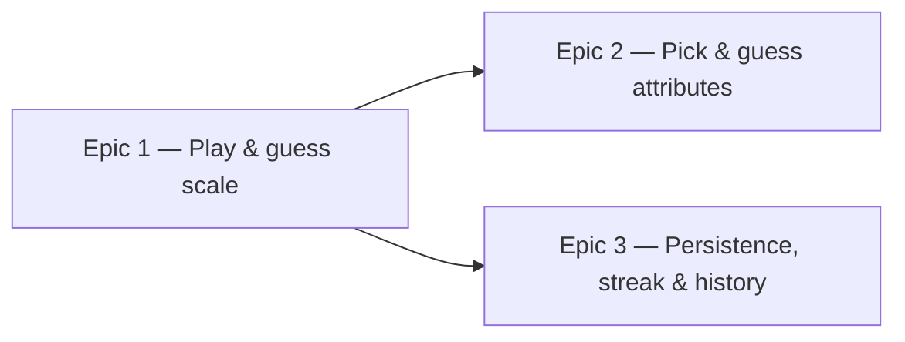

# Roadmap — Daily Groove (Core Game)

Source: [briefing.md](briefing.md)

## Overview

Daily Groove plays one groove per day and asks the player to guess its musical
attributes — scale, chord, and chord progression. We build it as a walking
skeleton first: hear today's groove, make one guess, see if it's right. Then we
let the player choose which attributes to take on and guess those, and — in
parallel — add browser-persisted progress with a streak and history. The daily
puzzle is deterministic by calendar date (shared for everyone, stable across
reloads); guesses are made through constrained pickers. Groove creation is out
of scope; the app ships with a small bundled seed set of grooves.

## Epics

### Epic 1 — Play today's groove and take a guess (walking skeleton)

**Visible when done:** A player opens the app, sees the Daily Groove layout,
presses play and hears today's groove, picks an answer for one attribute (the
scale), submits, and sees "correct" or "incorrect" with the right answer
revealed. The same groove appears for that whole calendar day.

**Depends on:** none
**Parallel with:** none (establishes the contracts the later epics build on)

**Scope**
- The `daily-groove` feature slice under `src/features/daily-groove`, plus the
  app route in `src/app` that renders it. The basic app layout/shell lives here.
- A small **bundled seed set** of grooves: a **pre-rendered audio file per
  groove** (static asset) plus the metadata needed to score guesses (scale,
  chord, progression), checked in with the feature — enough distinct entries to
  cover the first stretch of days.
- **Daily selection**: pick the day's groove deterministically from the calendar
  date, so everyone playing on the same day gets the same groove and it's stable
  across reloads.
- **Playback**: play the selected groove's audio file in the browser, with a
  play/replay control. Keep it behind an audio-playback utility so the UI never
  touches the audio element directly.
- **One guess dimension**: guess the scale via a constrained picker (multiple
  choice), submit, and reveal correctness.
- **Rides along (infrastructure — no epic of its own):** the test runner and
  React testing setup (none exists yet), the audio-playback utility, the seed
  data shape, and the `DailyResult` contract `{ date, guesses, correctness }`
  that Epics 2 and 3 depend on. Pin these shapes here.

**Out of scope**
- Guessing chord and chord progression — Epic 2.
- Remembering results across days, streaks, history — Epic 3.
- Groove authoring/creation — out of the whole feature per the briefing.

**Validation**
- Demo: open the app → press play, hear the groove → pick a scale → submit →
  see correct/incorrect + the answer. Reload → same groove, same day.
- Tests (colocated in the feature, per docs/testing.md):
  - `lib/` unit tests: deterministic daily selection returns the same groove for
    a fixed date and differs across dates; scale-guess scoring is correct.
  - Component test: rendering the game, submitting a right and a wrong guess,
    asserting the revealed result through the feature's public surface.

### Epic 2 — Pick your attributes and guess them

**Visible when done:** The daily puzzle now offers all three attributes — scale,
chord, chord progression — and the player chooses which one(s) to take on. They
answer only the attributes they selected, submit, and see a per-part breakdown
that marks each attempted attribute right/wrong with the correct value revealed
(un-attempted attributes are shown as skipped).

**Depends on:** Epic 1 (groove seed shape, playback, and the `DailyResult`
guess/correctness contract)
**Parallel with:** Epic 3

**Scope**
- Attribute selection UI: let the player pick any subset of {scale, chord,
  progression} to guess. Scale reuses the picker from Epic 1; chord and
  progression add pickers in the same constrained style.
- Scoring over the *attempted* attributes only; a result/reveal view that breaks
  down each attempted part and shows the rest as skipped.
- Extend `DailyResult.guesses`/`correctness` to record which attributes were
  attempted and each attempted part's outcome, against the contract Epic 1
  pinned.

**Out of scope**
- Persistence and streaks — Epic 3 (this epic still scores a single session).
- Forcing all three attributes — the player opts in per attribute (Q4-C).

**Validation**
- Demo: play today's groove → select, say, scale + chord (leave progression
  unselected) → answer them → submit → see a breakdown marking the two attempted
  parts right/wrong and progression as skipped.
- Tests: `lib/` scoring across selected-subset combinations (one/two/all
  attributes, all-correct / partial / all-wrong); component test driving
  attribute selection plus the chosen pickers and asserting the breakdown.

### Epic 3 — Remember my progress (browser persistence, streak & history)

**Visible when done:** After playing, the result is remembered. Returning later
the same day shows the already-played state instead of re-asking; returning on a
later day shows an updated streak and a history of past days. Nothing is lost on
reload.

**Depends on:** Epic 1 (the `DailyResult` contract — can start against that
contract before Epic 2 finishes)
**Parallel with:** Epic 2

**Scope**
- Persist `DailyResult`s in the browser (localStorage), keyed by date —
  including which attributes the player attempted and how each scored.
- "Already played today" state that blocks re-guessing and shows the stored
  result.
- Streak calculation and a simple history view of past days/results.
- Isolate storage behind a small interface in the feature's `lib/` so a future
  login-backed store can replace localStorage without touching the UI.

**Out of scope**
- Accounts/login and server sync — future, per the briefing ("in browser for
  now"). The storage interface leaves room for it; no backend is built here.

**Validation**
- Demo: play today → reload → see already-played + stored result. Simulate a new
  day → streak advances and the prior day appears in history.
- Tests: `lib/` unit tests for persistence round-trip, streak logic across
  consecutive/broken days, and the already-played guard (with a mocked/injected
  clock and storage).

## Dependency map

## Execution waves

- **Wave 1:** Epic 1 — the walking skeleton; pins the seed shape, playback, and
  `DailyResult` contract.
- **Wave 2 (parallel):** Epic 2 and Epic 3 — both build against the Epic 1
  contracts and don't depend on each other. Epic 2 adds attribute selection and
  the chord/progression guesses; Epic 3 thickens persistence.

## Decisions

Settled from the first round of open questions:

- **Deterministic daily puzzle** (Q2-A) — one groove per calendar date, shared
  for everyone, stable across reloads. This is what enables streaks.
- **Constrained pickers** (Q3-A) — guesses are multiple-choice per attribute,
  not free-text or an instrument control.
- **Player picks which attributes to guess** (Q4-C) — the puzzle offers scale,
  chord, and progression; the player opts in per attribute rather than being
  forced through all three. This shapes Epic 2 around a selection step and
  scoring over only the attempted attributes.
- **Pre-rendered audio files** (Q1-B) — each seed groove ships as a bundled
  audio asset played in the browser, rather than synthesized. Epic 1 plays the
  selected groove's file behind an audio-playback utility.

## Assumptions

- The seed grooves' audio files are **provided as content** (groove creation is
  out of scope per the briefing); Epic 1 bundles whatever files exist and does
  not generate them.
- Test runner: **Vitest + React Testing Library**, colocated per
  docs/testing.md. (No runner is installed yet; Epic 1 adds it.)
