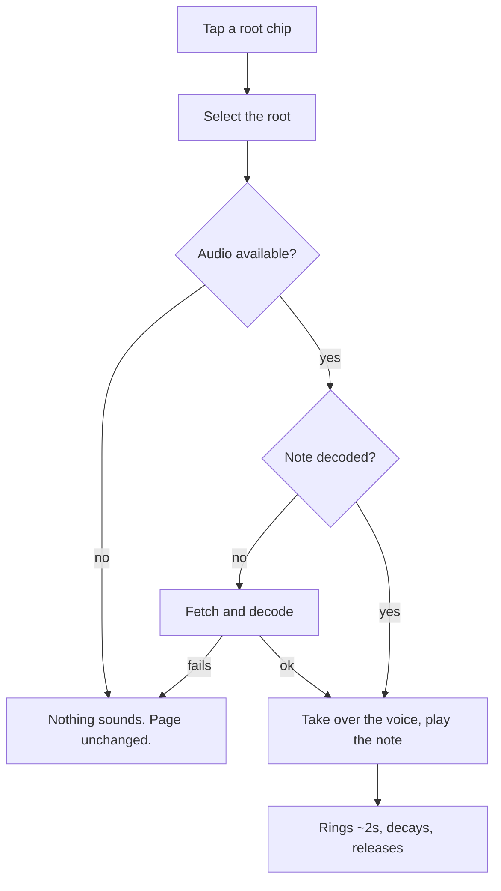

# PRD — Epic 1: Tap a root, hear it

Feature: [briefing.md](../briefing.md) · [roadmap.md](../roadmap.md)

## Summary

Tapping a chip in the root row sounds that root — the band's own keyboard, one
note, ringing for about two seconds over the groove — and selects the chip
exactly as it does today. Twelve notes are rendered offline from the sample
pack and shipped as files, covered by the same lock and build guard as the
grooves. Nothing new appears on the page: hearing a root is the gesture the
player was already making.

## Problem

The groove card tells the player to "find the note that feels like home", and
the app gives them nothing to check that feeling against. Naming an absolute
pitch by ear alone is a lottery for anyone without perfect pitch or an
instrument in reach, and the nudge only hands the root over after two misses —
so the first two attempts are spent on a coin toss rather than on listening.

## Scope

- A reference note per chromatic root, rendered offline from the sample pack.
- A voice in the app that plays one of them over the running groove.
- The tap wiring: the existing root chips sound, and still select.
- Extending the lock and `grooves:verify` to cover the new generated output.

**Out of scope**
- **The mark that tells the player the chips are audible**, and the caption
  that says it in words — Epic 2.
- **The mode row.** Mode chips stay silent; hearing what makes a mode a mode is
  the *Explain the answer* candidate in `specs/features.md`.
- **A tuner, a keyboard, a fretboard, a drone, transposition, tempo control.**
  Briefing non-goals; the on-screen instrument is the *Jam mode* candidate.
- **Anything about what the groove itself plays.** Feature-9 owns the pack and
  the feel. This epic renders *from* that pack and changes nothing inside it.
- **A mute, a volume control, or any preference of its own.** The device's
  volume is the control.

## Requirements

### What sounds

- **R1** — Tapping a chip in the root row sounds that root's note. This holds
  whether or not the chip is already selected, and whether or not the groove is
  playing.
- **R2** — The same tap also selects the chip. Selection behaves exactly as it
  does today, and no new control is added to the card.
- **R3** — The note sounds as soon as the tap is handled. It is not quantised to
  the groove's beat or bar.
- **R4** — The note rings for about two seconds and decays to silence on its
  own. There is no stop control, and no state on the page says a note is
  sounding.
- **R5** — At most one reference note sounds at a time. A tap while a note is
  still ringing takes the voice over, so running a finger down the row does not
  build a chord.
- **R6** — The note sounds *over* the groove. The groove is not stopped, paused,
  ducked or restarted, and its position, loop and progress bar are unaffected.
- **R7** — Every root the row can offer has a note: all twelve in `ROOTS`, which
  is what makes simple mode's six audible without any work of its own.
- **R8** — All twelve notes are the same instrument, the same register, the same
  length and the same nominal loudness, so no root reads as louder, longer or
  duller than its neighbour.

### When it does not sound

- **R9** — A tap always selects, whether or not a note sounds. No audio failure
  blocks, delays or undoes selection.
- **R10** — A note that cannot sound fails silently: no error banner, no retry
  control, no message, no console-visible break in the page. This covers a
  browser with no Web Audio, a context that will not resume, and a note file
  that is missing or will not decode.
- **R11** — The groove's own error banner and retry are unchanged, and are never
  raised by a reference note.
- **R12** — On a day that has ended — solved or revealed — the root chips are
  disabled and silent, as they are today.
- **R13** — Stopping the groove does not cut a ringing note, and a ringing note
  never prevents the groove from starting or stopping.

### The audio graph

- **R14** — The reference voice and the groove share one `AudioContext`. No
  second context is created.
- **R15** — No `AudioContext` is constructed during render or a server
  prerender. It is built on the first gesture that needs it, which may now be a
  chip tap rather than the play press.
- **R16** — Disposing the groove's player does not close a context the reference
  voice is still using.

### Fetching

- **R17** — A root's audio is fetched and decoded at most once per session and
  reused for every later tap of that root.
- **R18** — Once the groove's own fetch and decode have finished, all twelve
  notes are fetched in the background so the common case is already in hand when
  the player taps. The full twelve are warmed in both modes; simple mode's six
  are a subset of them, and switching modes fetches nothing further.
- **R19** — Background fetching never delays or contends with the groove's own
  fetch and decode. The groove is what the player pressed.
- **R19a** — A tap that arrives before warming has reached that root — including
  every tap made before the groove has ever been played — fetches it on demand.
  Warming is an optimisation, never a precondition for a note to sound.

### The render and the build guard

- **R20** — The twelve notes are produced by a command in `scripts/grooves/`
  from the sample pack. Nothing is synthesised in the browser.
- **R21** — Running the command twice against the same pack produces
  byte-identical files.
- **R22** — The command writes a generated manifest under the feature's `data/`
  folder mapping each root to its file. It is generated output, listed as such,
  and never hand-edited.
- **R23** — The notes, their manifest and the pack declaration are recorded in
  `grooves.lock.json` and checked by `npm run grooves:verify`, which `prebuild`
  runs. There is one lock and one verify command, not two.
- **R24** — `grooves:verify` fails when a note file is missing or altered, when
  the notes manifest is hand-edited, and when the pack declaration changes
  without a re-render.
- **R25** — Verification still renders nothing. It needs no ffmpeg and no sample
  pack, and the modules it is built from keep importing only `fs`, `crypto` and
  `path`.

## Behaviour details

**Selecting and sounding are one gesture, not one operation.** The chip's
handler does both, in that order, and only the first is allowed to fail
loudly — which is what R9 and R10 mean together.

The diagram has no edge back into the groove: nothing on this path stops,
starts or reads the groove's transport. That is R6, and it is the property that
keeps the two voices independent.

**Why the row is warmed rather than fetched on demand alone.** A file-backed
voice has one wrinkle a synthesised tone would not: the first tap of a root
costs a fetch and a decode, and a reference pitch that arrives late is worse
than useless — the player has already moved on. Warming after the groove's own
decode removes the gap for every tap but the unluckiest, without ever competing
with the sound the player actually pressed for.

**Why the build is the only place a missing note surfaces.** R10 makes the
voice swallow every runtime failure by design, so nothing in production will
ever report a note that did not sound. R23–R25 are the compensating control:
if the guard does not catch a stale or missing render, nothing will.

## Acceptance criteria

- **AC1** (R1, R2) — Given the puzzle is in progress, when a root chip is
  tapped, then that root is selected and its note sounds.
- **AC2** (R1) — Given a root chip is already selected, when it is tapped again,
  then its note sounds again and it stays selected.
- **AC3** (R1) — Given the groove has never been played, when a root chip is
  tapped, then its note sounds.
- **AC4** (R5) — Given a note is ringing, when another root chip is tapped, then
  the first note stops and only the second is heard.
- **AC5** (R6) — Given the groove is playing, when a root chip is tapped, then
  the groove keeps playing and its progress position is unchanged.
- **AC6** (R7) — Given simple mode is on, when each of the six offered roots is
  tapped, then each one sounds.
- **AC7** (R7, R22) — Given the generated manifest, then it holds an entry for
  every root in `ROOTS`, and every root carried by a groove in the catalogue
  resolves to a file.
- **AC8** (R9, R10) — Given Web Audio is unavailable, when a root chip is
  tapped, then the root is selected, nothing sounds, and no error is shown.
- **AC9** (R9, R10) — Given a note file cannot be fetched, when its chip is
  tapped, then the root is selected and no error is shown.
- **AC10** (R12) — Given the day has been solved or revealed, when a root chip
  is pressed, then nothing is selected and nothing sounds.
- **AC11** (R13) — Given a note is ringing, when the groove is stopped, then the
  note continues to its natural end.
- **AC12** (R15) — Given the page is rendered on the server, then no
  `AudioContext` is constructed.
- **AC13** (R16) — Given the groove's player has been disposed, when a root chip
  is tapped, then the note still sounds.
- **AC14** (R17) — Given a root has already sounded, when it is tapped again,
  then no second fetch is made for it.
- **AC15** (R21) — Given the render command is run twice against an unchanged
  pack, then the twelve files are byte-identical.
- **AC16** (R24) — Given a committed note file is deleted, when
  `npm run grooves:verify` runs, then it fails and names the missing note.
- **AC17** (R24) — Given the notes manifest is hand-edited, when
  `npm run grooves:verify` runs, then it fails.
- **AC18** (R24) — Given the pack declaration changes with no re-render, when
  `npm run grooves:verify` runs, then it fails.
- **AC19** (R25) — Given a machine with no ffmpeg and no sample pack, when
  `npm run grooves:verify` runs, then it completes and reports on the committed
  artifacts.
- **AC20** (R8) — Given all twelve notes, then their durations match within
  50 ms and their peak levels within 1 dB.
- **AC21** (R19a) — Given the groove has never been played and nothing has been
  warmed, when a root chip is tapped, then its note is fetched and sounds.

## Dependencies

**Needs first:** feature-9, which replaces the sample pack. This epic renders
from that pack; rendering against the current one would mean rendering twice.

**Hands to Epic 2:** the contract *a chip in the root row sounds when tapped,
and the mode row does not*. Epic 2 promises exactly that in the UI and needs
nothing else from here.

**Touches, and must leave working:** `grooves.lock.json`, `grooves:verify` and
`prebuild`; the groove's own transport and error banner; the five concern
folders asserted by `structure.test.ts`.

## Assumptions

- **The comp voice, not the bass.** A keyboard note around middle C is what the
  ear checks a tonic against; a bass note fights the groove's own bass line.
- **One fixed register for all twelve.** The row spans a single chromatic
  octave rather than following the day's groove. It keeps the row even, and it
  leaks nothing — the chip that sounds is the one the player chose.
- **Keyed by the twelve `ROOTS` spellings** — `C♯` and `E♭`, not their
  enharmonic twins. The row offers no other spelling, and the catalogue's roots
  are drawn from the same twelve.
- **Files live beside the grooves in `public/`,** under their own folder.
- **The note is mixed to sit above the groove without ducking it.** A fixed
  level chosen at the listen, not a runtime calculation.
- **No new storage.** Nothing about which roots have been heard is recorded, in
  this browser or any other.
- **Evenness has a number.** "Same length, same loudness" is checked as
  durations within 50 ms and peaks within 1 dB — tight enough that no root
  stands out, loose enough not to fail on encoder rounding.

## Question log

Answered questions, kept for traceability. The requirements above are the source
of truth — this records how they got there. Append-only.

### Cycle 1 — 2026-08-31

**Q1. When does the note sound relative to the groove?**
Answer: **A) Immediately on the tap** — a reference pitch is a response to a
gesture, not a musical event; at 96 bpm, waiting for a downbeat would cost up to
2.5 seconds and read as a broken control.
Applied to: R3, AC1

**Q2. How much is fetched, and when?**
Answer: **A) Warm all twelve in the background after the groove's decode** — the
notes are short and the groove is already the far larger download, so warming
the full set makes every tap instant and makes a mode switch free.
Applied to: R18, R19a, AC21

**Q3. Can a root be heard once the day is over?**
Answer: **A) No — the row stays disabled and silent** — it is today's behaviour,
and it keeps `SolvedPanel` the single payoff rather than splitting attention
back to a dead chip row.
Applied to: R12, AC10, Out of scope

### Superseded — 2026-09-03

Q3 / R12 / AC10 no longer hold: since feature-22, the root chips on a solved
or revealed day are settled (unpickable, dimmed) but still sound on a tap, so
the day's groove can be jammed over with the root one tap away. Decided in chat
during feature-22; the tests carry the `F22 chips keep sounding` tag.
