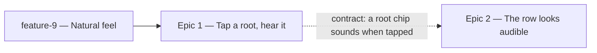

# Roadmap — Hear the Root

Source: [briefing.md](briefing.md)

## Overview

The groove card already tells the player to "find the note that feels like
home", and the app gives them nothing to check that feeling against: naming an
absolute pitch by ear alone is a lottery, and the first two attempts are spent
on it. This feature gives the root row a voice. Tapping a root chip sounds that
note over the running loop and still selects the chip, so there is no second
control to find — and the chips carry a mark that says so, before a guess has
been spent finding out.

The twelve notes are rendered offline through `scripts/grooves/` from the
sample pack and shipped as files (**Q1 → B**), so the reference pitch is the
band's own instrument rather than a synthesised tone. That makes this feature
wait for **feature-9**, which replaces the pack: rendering against today's FM
piano would mean re-rendering all twelve the week after.

Two epics, both small, both in one wave once feature-9 has landed. Epic 1 is
the mechanism end to end; Epic 2 is what tells you the mechanism is there.

## Epics

### Epic 1 — Tap a root, hear it

**Visible when done:** press play, then tap `E♭` in the root row. You hear an
E♭ against the loop, in the same instrument the groove is played on, and the
chip selects exactly as it always did. Tap it again and you hear it again. The
same is true of all twelve roots, and of the six that simple mode offers.
**Depends on:** feature-9 — it renders from the pack, and feature-9 replaces the
pack
**Parallel with:** Epic 2 (see the seam in *Out of scope*)

**Scope**
- **Render the twelve notes offline.** A step in `scripts/grooves/` that renders
  one short note per chromatic root and encodes it, reusing what is already
  there: `pack.ts` to load the voice, `voices.ts`'s `transpose`/`resample` to
  reach the eleven pitches the pack does not sample directly, `mix.ts` and
  `encode.ts` to render and encode. This is a new command over existing parts,
  not a second renderer.
- **The decay is in the file (Q2 → A).** Each note rings about two seconds and
  decays to silence. Baked at render time, so the browser plays a buffer and
  shapes no envelope of its own, and there is no stop control to design.
- **A generated manifest, in `data/`.** The render writes the twelve
  root→file entries the app reads, next to `grooves.generated.ts` — generated
  output goes in `data/`, never in `lib/`, and is never hand-edited. This is
  also why the app needs no pitch arithmetic: it resolves a root to a file, and
  the pitch was decided at render time.
- **One lock, one verify (Q4 → A).** The twelve notes and their manifest join
  `grooves.lock.json` and the `grooves:verify` that `prebuild` runs, rather than
  growing a second copy of the machinery. Concretely: `Lock` gains the notes'
  entries and their manifest hash, `LockPaths` gains their directory and
  manifest path, and `verifyLock` checks them the way it checks the grooves —
  `grooveFile()` hardcodes `<dir>/<id>.mp3`, so the notes need their own path
  derivation beside it. Two existing guarantees constrain this and must hold:
  `lock.ts` imports nothing but `fs`, `crypto` and `path` — `lock.test.ts`
  asserts it by reading the source, because the guard runs on a machine with no
  ffmpeg and no sample pack (R13) — and the write targets stay path constants in
  `cli.ts` and `verify-cli.ts`, updated together with the generator.
- **Catch the stale render.** `catalogueSha256` exists because a manifest and a
  lock can agree with each other while disagreeing with their input. The notes
  have no catalogue; their input is the pack, which is precisely what feature-9
  is about to change. Hash the pack declaration into the lock so a pack change
  with no re-render fails the build — noting the limit, that this catches a
  changed `pack.json` and not a swapped `.flac` of the same name.
- **A reference voice in `lib/audio/`,** alongside `audio.ts` and
  `transport.ts`. The `audio/` concern folder already exists, so this adds a
  module and not a folder — `structure.test.ts` asserts the five concern
  folders exactly, and this epic must not change that list.
- **Share the audio graph.** `createAudioPlayer` constructs its own
  `AudioContext` inside `decode()` and closes it in `dispose()`. A note that
  sounds *over* the groove needs the same context, not a second one: one
  latency story, one resume-on-gesture, one graph. Lift context ownership into
  a small lazy owner both take from. Two properties must survive the lift: no
  context is constructed during render or a server prerender (feature-6 R6,
  AC7), and the player's `dispose()` must stop closing a context the reference
  voice is still holding.
- **Fetch per root, decode once, warm early.** A tapped root that has never
  sounded costs a fetch and a decode, which is a gap between the tap and the
  note — the one wrinkle a file-backed voice has that a synthesised one would
  not. Decoded buffers are cached for the session, and the row is warmed in the
  background once the groove's own decode has finished, so the common case is
  already in hand. Warming must never contend with the groove's fetch: the
  groove is what the player pressed.
- **Wire the tap, add no control.** `GuessCard` passes the root `ChipGroup` an
  `onSelect`; `Chip` calls it on every tap, including a re-tap of the chip that
  is already selected. So "tap again to hear again" costs nothing, and hearing
  a root stays the same gesture as choosing it — which is the briefing's third
  bullet.
- **Retrigger, don't stack.** A tap while the previous note is still ringing
  takes the voice over. Running a finger down the row must not pile twelve
  notes into a chord.
- **Best-effort, never blocking.** A tap always selects, whether or not a note
  sounds. A browser with no Web Audio, a refused context, a missing or
  undecodable file — all of them fall through silently. The groove's own error
  banner and retry stay for the groove; a reference note that did not sound
  raises nothing.
- Simple mode needs no work of its own. Both modes hand `GuessCard` the same
  `roots` array and it is the array that differs, so the six roots are audible
  the moment the twelve are.
- Tests: the render step under `scripts/grooves/`, per its own boundary test;
  the voice against the existing `testing/fakeAudioContext.ts`; and the tap
  behaviour as a feature test through `index.ts` via `testing/renderFeature.tsx`,
  never by reaching past it.

**Out of scope**
- **The affordance that says the chips are audible.** Epic 2 owns it. That is
  the seam between the two: Epic 1 owns `scripts/grooves/`, `lib/audio/`,
  `data/` and the `onSelect` handler inside `GuessCard`; Epic 2 owns the chip
  adornment, the props that carry it, and the copy. Neither touches the other's
  half of the file.
- **The mode row.** A briefing non-goal, and hearing what makes a mode a mode
  is the *Explain the answer* candidate in `specs/features.md`.
- **A tuner, a keyboard, a fretboard, a drone control, transposition.** All
  briefing non-goals; the on-screen instrument belongs to the *Jam mode*
  candidate.
- **Hearing the answer once the day is over.** The root chips are already
  `disabled` on a solved or revealed day, and this epic does not re-enable
  them. `SolvedPanel` stays the payoff.
- **Anything about what the groove itself plays.** Feature-9 owns the
  instruments and the feel. This epic renders *from* that pack and changes
  nothing inside it — which is exactly why it waits rather than racing it.

**Validation**
- Demo: press play; tap along the root row and hear each note over the loop;
  tap the selected chip again and hear it again; turn on simple mode and hear
  all six; solve or give up and the row goes quiet with the rest of the card.
- Demo the failure: with Web Audio unavailable, tapping a root still selects it
  and the page shows no error.
- Listen to all twelve back to back. Even loudness, even length, no root
  noticeably duller than its neighbour — the pack samples every four semitones,
  so the roots furthest from a sampled note are the ones to check.
- `npm run grooves:verify` passes on the committed notes, and fails when one is
  deleted, when its manifest is hand-edited, and when the pack changes without a
  re-render. That last one is the case this epic exists to be protected from.
- `npm test` across `src/` and `scripts/grooves/`, plus `structure.test.ts`
  still green — the concern-folder list and the region declarations are
  unchanged by this epic. `lock.test.ts` still passes untouched: the extended
  lock must not have gained an import.

### Epic 2 — The row looks audible

**Visible when done:** before tapping anything, you can tell that a root chip
will sound. Each root chip carries a small mark, and the caption under the play
control says what the row does (**Q3 → A**).
**Depends on:** none to build — Epic 1's contract is "a root chip sounds when
tapped", and this epic promises exactly that in the UI. Its end-to-end demo
needs Epic 1 landed.
**Parallel with:** Epic 1

**Scope**
- A small mark on each root chip. `Chip` gains a **generic optional adornment**
  — the design-system rule holds and the primitive does not learn what a root
  is, or that anything is audible. `ChipGroup` carries it through for the row
  that asks for it.
- The caption under the play control currently reads "Play along. Find the note
  that feels like home." It is the line that sets the player the task with no
  way to do it, so it is where the row's new answer gets said.
- The mark must be decoration, not the only signal: a chip's accessible name
  stays its label, as `HowToPlay`'s emoji and `ModeToggle`'s track already do.
- Tests: `Chip` and `ChipGroup` against their own contract — props, states,
  accessibility — independently of the feature, per `docs/testing.md`; and the
  feature test that the root row renders the mark and the mode row does not.

**Out of scope**
- The same mark on the mode row. The mode chips are silent and must not
  advertise otherwise.
- **Reworking the how-to-play box.** Feature-8 fixed those four lines and their
  exact wording (F8 E3 R4), and its tests assert them. **Q3 settled on A**, not
  C, so the box is left alone.
- The sound itself, and everything under `lib/audio/` and `scripts/grooves/`.
  Epic 1 owns it.

**Validation**
- Demo: load the page cold and, without tapping anything, point at what tells
  you the roots are audible. Then tap one and confirm it does what the mark
  promised.
- Component tests for the adornment; feature tests through `index.ts`.
- Screen-reader pass: the chips' names are unchanged.

## Dependency map

## Execution waves

- **Precondition:** feature-9 lands. Epic 1 renders the twelve notes from the
  sample pack, and feature-9 replaces that pack with a real kit, bass and
  keyboard. Rendering first would mean rendering twice.
- **Wave 1 (parallel):** Epic 1, Epic 2. Disjoint file sets either side of one
  named seam: Epic 1 has `scripts/grooves/`, `data/`, `lib/audio/` and
  `GuessCard`'s root `onSelect`; Epic 2 has `src/components/controls/` and the
  copy. Epic 1 is the long pole — the render is a generator run with a listen at
  the end of it — and the only one that can be demoed alone; Epic 2 landing
  first would promise a sound that is not there yet, so ship them together.

## Assumptions

- **The reference note is the band's instrument (Q1 → B).** The earlier draft
  assumed the opposite — that a reference pitch has to be separable from the
  music the way a pitch pipe is. It is worth checking at the listen in Epic 1's
  validation that the note reads *as* a reference and not as a wrong note
  someone played, especially in the roots furthest from the day's key.
- **The comp voice, not the bass.** A keyboard note around middle C is what the
  ear checks a tonic against; a bass note fights the groove's own bass line.
- **One fixed register for all twelve roots**, rather than following the day's
  groove. A fixed register keeps the row even, and leaks nothing — the chip that
  sounds is the one the player chose.
- **Selection is never blocked by audio.** A tap selects first and sounds
  second; audio is the part allowed to fail.
- **A finished day is silent.** Solved or revealed, the chips are already
  disabled and stay that way.
- **No mute or setting of its own.** The player pressed play on a groove
  already; the device's volume is the control.
- **Simple mode is free.** It differs only in which roots are in the array.
- **The render is re-runnable.** Nothing about the twelve notes is hand-made, so
  a later pack change is one command and a listen, not a rebuild of this
  feature. That is what makes waiting for feature-9 a preference about which
  sound ships first, rather than a hard block on the code.
- **The build is where a missing note is caught (Q4 → A).** The voice swallows
  every runtime failure by design, so nothing at runtime will ever report a note
  that did not sound. `grooves:verify` is therefore the only place the mistake
  can surface, which is why it is worth extending rather than duplicating.
- **The pack is hashed by its declaration, not by its samples.** Enough to catch
  the feature-9 case — a new pack, no re-render — and not enough to catch a
  `.flac` replaced under the same name. Hashing every sample would close that
  gap and slow every build; the cheap guard is the right trade until it misses
  something.
