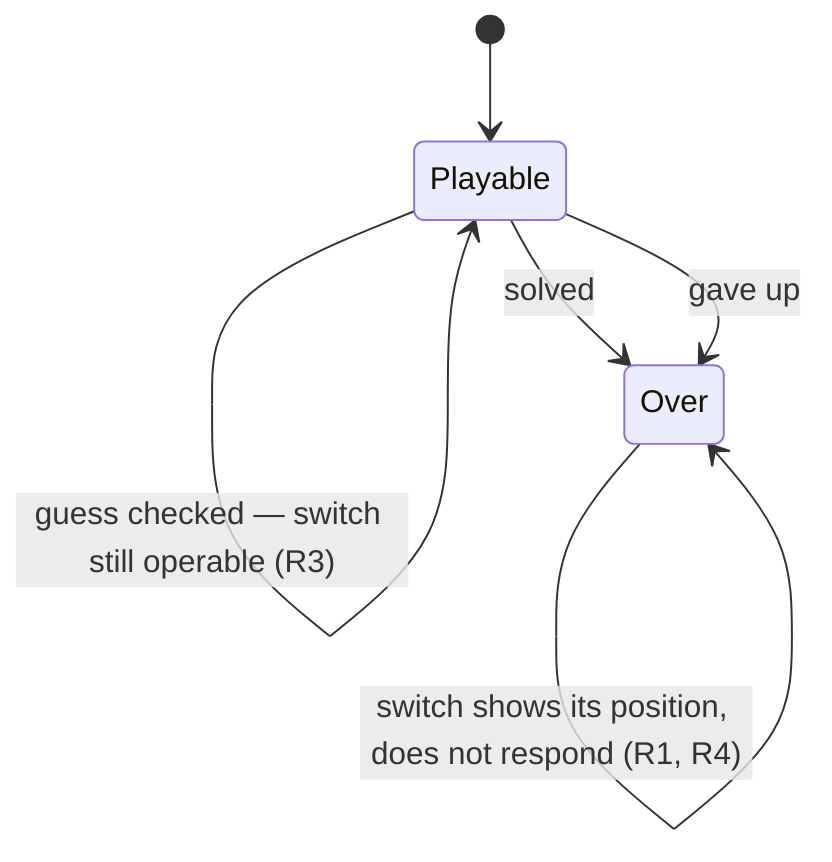

# PRD — Epic 4: The simple switch settles once the day is over

Feature: [briefing.md](../briefing.md) · [roadmap.md](../roadmap.md)

## Summary

Once the day has ended, the simple-mode switch stops responding. It stays on the
card, still showing which mode the day was played in, but it can no longer be
flipped. The chips already lock when the answer is on screen; the switch above
them now behaves the same way.

## Problem

Feature-7 deliberately left the switch operable for the whole day, so a player
who found the full twelve-root row too hard could narrow it mid-puzzle without
being punished. That reasoning ends when the puzzle does. On a finished day the
switch does nothing useful — the chips beneath it are disabled and the answer is
already shown — but it still moves, still redraws the row underneath, and still
reads as a control that might change something. It is the only live control on
a card that is otherwise over.

## Scope

- `ModeToggle` gaining a non-operable state.
- `GuessCard` driving it from the terminal state it already computes.
- Retiring the half of feature-7's R8a that this narrows.

**Out of scope**
- **What simple mode does**, which options it offers, or how the preference is
  stored. Unchanged.
- **Hiding or removing the switch.** It stays visible: it is the record of how
  the day was played.
- **The chips, the check button, the give-up control, the nudge.** Their
  terminal behaviour is feature-7's and is unchanged.
- **Everything to do with the lead sheet, the staff and the track.** Epics 1–3.

## Requirements

- **R1** — Once the day has ended, the simple-mode switch cannot be flipped.
  Clicking it, tapping it, or pressing space or enter on it changes nothing and
  emits no change.
- **R1a** — It is made non-operable with the native `disabled` attribute on the
  button, not by intercepting the handler. The browser then declines the click,
  the key press and the focus alike, and every assistive technology reads the
  state the same way without being told twice.
- **R2** — A day given up on counts as ended, the same as a day solved. The card
  already treats the two as one terminal state, and this uses that state rather
  than introducing a second notion of "over".
- **R3** — Until the day has ended, the switch behaves exactly as it does today:
  operable after any number of attempts, switchable mid-puzzle, and never itself
  an attempt.
- **R4** — The switch remains visible and keeps showing its position, so the
  finished card still says which mode the day was played in.
- **R5** — The non-operable state is announced to assistive technology, not only
  drawn. The switch keeps `role="switch"` and its `aria-checked`, so a screen
  reader that reaches it reads both that it is unavailable and which way it is
  set. It leaves the tab order, which is what `disabled` means and is correct
  here: it is a control that has nothing left to do.
- **R6** — The switch stops offering the affordances of a live control: no hover
  treatment, no pointer cursor.
- **R7** — Flipping the switch on a finished day cannot alter the day's record,
  its attempts, its streak, or which chips are shown. R1 makes this
  unreachable; it is stated so the check exists.
- **R7a** — The switch is not the control that ends the day. Checking a guess
  and giving up both act from their own buttons, so nothing is focused on the
  switch at the moment it disables, and no focus management is owed.
- **R8** — Feature-7's R8a is narrowed, not overridden in silence. The rule
  becomes: the switch stays operable for the whole *playable* day — it is never
  locked by having guessed — and settles when the day ends. `ModeToggle`'s doc
  comment and the two `GuessCard` tests that assert the old rule are rewritten
  to say the new one.

## Behaviour details

The card computes `over = solved || revealed` today and uses it to lock the
chips and to word the action button. This is the same state, reused. Nothing new
is derived, stored or passed down from `GroovePuzzle`.

## Acceptance criteria

- **AC1** (R1) — Given a solved day, when the switch is clicked, then no change
  is emitted and the chip row does not change shape.
- **AC2** (R2) — Given a day given up on, when the switch is clicked, then no
  change is emitted.
- **AC3** (R3) — Given two attempts spent on an unfinished day, when the switch
  is clicked, then the change is emitted as it is today.
- **AC4** (R4) — Given a day solved in simple mode, when the card renders, then
  the switch is present and still reads as on.
- **AC5** (R1a, R5) — Given a finished day, when the switch is inspected, then
  it is disabled and still exposes `role="switch"` with its checked state.
- **AC6** (R8) — Given the two `GuessCard` tests that assert the switch stays
  operable on a finished day, then they assert the opposite and cite this epic.

## Dependencies

None. It shares no file with Epics 1–3 and can be built at any point.

## Assumptions

- Simple mode's stored preference is untouched: the switch settling is a
  property of the finished card, not a write to storage. Tomorrow's puzzle opens
  in whichever mode the player last chose.
- The switch's dimmed treatment uses existing tokens; no new colour is added.
- The card's other terminal controls keep whatever mechanism they use today —
  this epic does not go through the chips or the action button to make them
  consistent with `disabled`.

## Question log

Answered questions, kept for traceability. The requirements above are the source
of truth — this records how they got there. Append-only: never rewrite or prune
a past cycle, or the record stops being trustworthy.

### Cycle 1 — 2026-08-31

**Q1. How is the switch made non-operable?**
Answer: **B) The native `disabled` attribute** — unambiguous to every assistive
technology, at the cost of focusability, which costs nothing here: the day ends
from the check or give-up button, never from the switch, so focus is never on it
when it disables.
Applied to: R1a, R5, R7a, AC5
