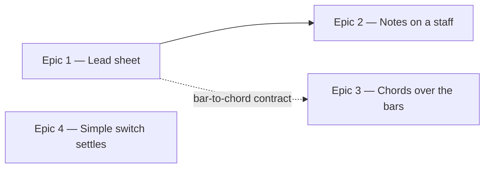

# Roadmap — Lead Sheet View

Source: [briefing.md](briefing.md)

## Overview

Four small adjustments, three of which are the same idea: the app already knows
the day's changes and the notes to live in, and it shows both as rows of grey
chips. This feature draws them as music instead — the changes as a four-bar lead
sheet, the scale as notes on a staff beneath it — and carries the chord symbols
up onto the four-bar progress track, so the harmony is readable while the loop
is running. The fourth is unrelated and tiny: the simple-mode switch stops
moving once the day is over.

**It should read as a jazz lead sheet — a page out of a Real Book.** Not a
table of chords, not a chart: hand-lettered chord symbols over ruled bars, in
the same face the masthead is set in. The app already ships it — Petaluma
Script, self-hosted in `src/app/fonts/PetalumaScript.woff2` and exposed as the
`--font-jazz` token / `font-jazz` utility, which today only `Heading` size `xl`
uses. Petaluma is a notation family, and its script companion is exactly the
hand a Real Book chord symbol is written in, so the lead sheet and the staff
both draw from it rather than inventing a second look.

Q1, Q2 and Q3 are answered and folded in: the chord symbols over the track
appear once the day has ended (Q1 → A), both drawings are hand-written SVG with
no new dependency (Q2 → A), and the staff carries the seven scale notes
(Q3 → A).

Epic 1 does the drawing groundwork and the lead sheet with it. Epic 4 is
independent of everything and can go at any time. Epics 2 and 3 both build on
what Epic 1 pins down.

## Epics

### Epic 1 — The changes as a lead sheet

**Visible when done:** solve the day (or give up). Where "The changes" was two
grey chips reading `C7` and `C7–Em7♭5–B♭maj7–Fmaj7`, there is now a four-bar
lead sheet: four bars divided by bar lines, each carrying the chord symbol that
sounds in it, with the final double bar closing the figure.
**Depends on:** none
**Parallel with:** Epic 4

**Scope**
- **A bar-to-chord function, in `lib/theory/`.** `progression` is a `–`-joined
  string of three or four chord symbols, and the generator lays it over the
  four-bar figure with `chords[bar % chords.length]`
  (`scripts/grooves/events.ts`, `chordFor`) — so a three-chord progression plays
  `1 2 3 1`, and bar four is *not* a change. The app must use the same
  arithmetic or the sheet will disagree with what is sounding. Plain functions
  in `lib/`, tested directly.
- **A lead-sheet component in `components/puzzle/`, hand-written SVG (Q2 → A).**
  Four bars, bar lines, a chord symbol per bar, a closing double bar. It takes
  the four symbols as props and knows nothing about how they were derived. No
  new dependency: the geometry is four verticals and a baseline.
- **It has to look like a jazz lead sheet.** Chord symbols in the `font-jazz`
  face — Petaluma Script, the masthead's hand — sitting above the bar as they do
  in a Real Book, not centred in a box. Bar lines ruled thin, the final one
  doubled, generous air between the bars. The one thing to get right is that a
  musician recognises the page before reading a symbol on it.
- **The jazz face needs a route out of the typography primitives.** `font-jazz`
  is reachable today only through `Heading` size `xl`, which is the masthead's
  size as well as its face. Either the typography primitive gains a face the
  lead sheet can ask for, or the symbols are drawn as SVG text carrying the
  token directly — decide it in the tech spec, but do not spread a raw font
  utility through the feature to get at it.
- **The panel's left column becomes the sheet.** `SolvedPanel`'s "The changes"
  column renders it in place of the two `ValueChips`. It keeps the
  `LabelledColumn` and the inverted ink — the panel inverts the surface, and the
  sheet has to stay legible on it in both palettes.
- **The tonic chord stops being its own chip.** `groove.chord` is bar one of the
  progression; the sheet already shows it. `SolvedPanel` keeps taking both props
  or drops `chord` — the implementer's call — but the reader sees it once.

**Out of scope**
- The scale notes: still chips in this epic, staff notation in Epic 2.
- The progress track: unchanged here, Epic 3.
- Any regeneration of the catalogue. Everything needed is already in
  `progression`; nothing under `scripts/grooves/` is touched.

**Validation**
- Demo: solve today's puzzle, read the four bars against what the loop plays.
- A `lib/theory/` unit test for the bar mapping, including the three-chord case
  where bar four repeats bar one, and a malformed or single-chord progression.
- Component tests for the sheet against its props; `SolvedPanel.test.tsx` updated
  where it asserted the chips.

### Epic 2 — The notes on a staff

**Visible when done:** below the lead sheet, the seven notes to live in are
drawn as notes on a staff — ascending from the root, spelled the way the panel
already spells them (F♯ not G♭), rather than listed as seven chips.
**Depends on:** Epic 1 — it sits below the lead sheet and shares its drawing
**Parallel with:** Epic 3

**Scope**
- **The seven scale notes (Q3 → A).** What "Notes to live in" already lists —
  no new generated data, and nothing under `scripts/grooves/` is touched.
- **Note names to staff positions.** `scaleNotes(answer)` already returns the
  scale correctly spelled, one letter each; a note's vertical position is its
  letter and octave, and its accidental is the rest of the symbol. That mapping
  is a plain function in `lib/theory/`, beside `notes.ts`.
- **A staff component in `components/puzzle/`, hand-written SVG (Q2 → A).** Five
  lines, a clef, ledger lines where the scale runs past the staff, whole notes at
  the positions it is given, accidentals to their left. Props are positions and
  accidentals, not scales — it draws what it is handed.
- **Same hand as the sheet above it.** The staff is ruled to match the lead
  sheet's bar lines and any lettering on it is set in `font-jazz`, so the panel
  reads as one page rather than a drawing pasted under a chart. Hand-lettered,
  slightly loose — a Real Book page, not engraved Finale output.
- **It goes under the sheet inside the panel.** The two-column
  `PanelColumns` layout is the open question of this epic: the notes column may
  move below the changes rather than beside them, since a staff wants width.
  Whatever the layout, it stays readable on the inverted surface and on a phone.

**Out of scope**
- Rhythm, stems, beams, time signature, key signature. Whole notes, evenly
  spaced: this is a picture of a scale, not a transcription.
- The groove's actual melody or bass line — the app has no note-level data for
  a groove, only its scale and its changes (Q3 → A settled this).

**Validation**
- Demo: solve a day whose scale carries a sharp and one whose scale carries a
  flat; the accidentals are right and the notes ascend.
- Unit tests for the note→position mapping over every flavour the seed set
  uses, including the double accidentals `notes.ts` can spell.
- A component test that the staff renders one notehead per note it is given,
  and an accessible text alternative naming the scale for a screen reader.

### Epic 3 — Chords over the playing bars

**Visible when done:** press play. Above the four-bar track, each bar carries
its chord symbol, and the symbol over the sounding bar is lit the way the
track's segment already is — so the changes can be read while playing along.
**Depends on:** Epic 1 for the bar-to-chord function only. Once that signature
is pinned, this can be built in parallel against it.
**Parallel with:** Epic 2

**Scope**
- **Chord symbols above the track, in `TransportPanel`.** Four labels on the
  same four-column geometry as the track's segments, so a symbol sits over its
  bar. The labels live in the feature: `ProgressTrack` is a design-system
  primitive and may not learn what a chord is.
- **The active bar's symbol follows the highlight.** One derived position, as
  now — `TransportPanel` already computes the sounding bar; the symbol reads off
  the same value so the two can never disagree at a bar line.
- **They appear only once the day has ended, solved or given up (Q1 → A).** A
  progression printed over the track before the puzzle is solved names the root
  and the mode outright, so until then the track is exactly what it is today.
  This makes the epic a payoff for jamming after the solve.
- **Same hand as the lead sheet.** The symbols are the `font-jazz` face at a
  small size, so the track reads as the same page as the panel below it. They
  sit over the bars, not inside boxes.

**Out of scope**
- Any change to the position or the segment highlight itself. The track behaves
  exactly as feature-6 left it; this adds a row above it.
- A second lead sheet. This is the track wearing chord labels, not the Epic 1
  component transplanted onto the groove card.

**Validation**
- Demo: end the day, press play, watch the lit symbol step through the four
  bars and wrap.
- `TransportPanel` tests: the four symbols come from the progression by the
  Epic 1 mapping; the lit one tracks the position; nothing is lit when stopped.
- A `GroovePuzzle` test that the symbols are absent mid-puzzle and present once
  the day has ended, both ways.

### Epic 4 — The simple switch settles once the day is over

**Visible when done:** solve the day. The simple-mode switch is still there,
still shows which mode you played in, and no longer responds — it cannot be
flipped once the answer is on screen.
**Depends on:** none
**Parallel with:** Epic 1

**Scope**
- **`ModeToggle` takes a disabled state**, announces it (`aria-disabled` or a
  disabled button, whichever reads correctly for `role="switch"`), and drops the
  hover affordance.
- **`GuessCard` passes it from the terminal state.** The card already computes
  `over = solved || revealed`; this is the same state, not a new one.
- **The old rule has to be retired, not just overridden.** Feature-7 R8a says in
  as many words that the switch is *never* locked by having guessed, and both
  `ModeToggle.tsx`'s doc comment and a test pin it. The rule still holds
  mid-puzzle — this narrows it to the terminal state, and the comment and the
  test must say the new thing.

**Out of scope**
- Any change to what simple mode does, or to which options it offers.
- Hiding the switch. It stays visible: it is the record of how the day was
  played.

**Validation**
- Demo: solve, then try to flip the switch — nothing happens, and the chip row
  does not change shape.
- `ModeToggle.test.tsx` for the disabled contract, `GuessCard.test.tsx` for it
  being driven by the terminal state, and the feature-7 test that asserted the
  opposite, rewritten rather than deleted.

## Dependency map

## Execution waves

- **Wave 1 (parallel):** Epic 1, Epic 4. Epic 3 may start alongside them once
  Epic 1's bar-to-chord signature is pinned.
- **Wave 2 (parallel):** Epic 2, Epic 3 — different files, no shared edits.

## Assumptions

- **"Already solved" means the day is over either way.** Epic 4 locks the switch
  on `solved || revealed`; giving up ends the day just as solving does, and the
  card already treats the two as one state.
- **The lead sheet is not a staff.** Bars, bar lines and chord symbols in the
  jazz hand; Epic 2's staff is the only place five lines appear. Both are the
  same page.
- **No new dependency.** The app runs on four runtime packages and stays there:
  both drawings are hand-written SVG (Q2 → A), and the face they are lettered in
  is already self-hosted.
- **Nothing generated changes.** No catalogue rebuild, no new fields in
  `grooves.generated.ts`, no `scripts/grooves/` work in any epic.

