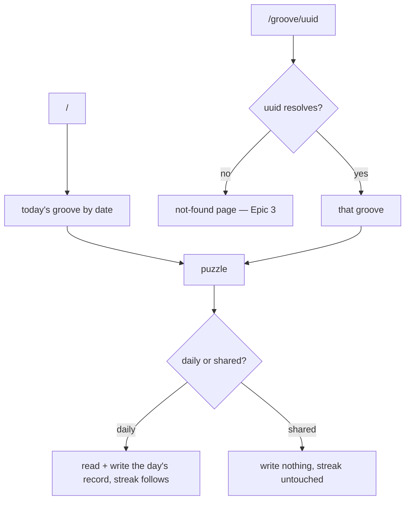

# PRD — Epic 1: Open a groove by its link

Feature: [briefing.md](../briefing.md) · [roadmap.md](../roadmap.md)

## Summary

Every groove gains a permanent uuid, minted once into the catalogue and carried
through the manifest into the app, and `/groove/<uuid>` opens that groove's
puzzle on any day. A shared groove is practice: it plays the full puzzle but
writes nothing to the daily record and neither advances nor breaks the streak.
This is the walking skeleton — the link works, even though nothing yet hands it
to you.

## Problem

A groove has no name that survives. Its `id` is `groove-NN`, a catalogue
position that doubles as an mp3 filename, and the only way to reach a groove at
all is to be alive on the day the rotation serves it. Nothing can be sent to
anyone, and nothing can be reopened. An archive would need exactly the same two
pieces this epic builds: a stable id per groove, and a route that opens one.

## Scope

- A uuid on every groove: minted into the catalogue, carried into the generated
  manifest, guarded by the build.
- A backfill for the grooves already in the catalogue, and minting for every
  groove `grooves:add` produces from here on.
- The `/groove/<uuid>` route, resolving a uuid to a groove and handing it to the
  existing puzzle.
- The rule that a shared groove records nothing.

**Out of scope**
- **Any control that produces the link** — Epic 2.
- **What the shared page says about itself** — the "this is a shared groove"
  framing, the way back to today, the wording of the not-found, and what the
  header and the card's date line show — all Epic 3. This epic only requires
  that an unresolvable uuid does not crash.
- **An archive, a groove list, or any index by uuid.** This feature leaves the
  pieces an archive would need and builds none of it.
- **Anything about the daily rotation.** `/` picks today's groove exactly as it
  does now; `selectGrooveForDate` is untouched.
- **Renaming the mp3s or the `groove-NN` ids.** The uuid joins them.
- **Keeping a link alive after its groove is gone.** Links are as durable as the
  catalogue and no more; a retired groove's link stops working.

## Requirements

### The uuid

- **R1** — Every groove carries a `uuid` alongside its existing `id`. `id` stays
  the catalogue key and the mp3 filename; `uuid` is the only identifier a link
  carries, and it is carried whole.
- **R1a** — A uuid is a canonical v4 uuid, lowercase and hyphenated, all 36
  characters of it. There is no short form, no prefix and no second shareable
  id: one groove, one identifier.
- **R1b** — Resolution is case-insensitive, so a link a chat client or a mail
  program has capitalised still finds its groove.
- **R2** — A uuid is minted once and never changes. Re-rendering the audio,
  re-running the manifest, renaming a file, adding a groove or removing one
  leaves every existing uuid byte-identical.
- **R3** — No two grooves share a uuid.
- **R4** — `uuid` is a required field of `Groove` in `src/lib/groove.ts` — the
  contract the generator and the app hold jointly — and is carried into
  `src/features/daily-groove/data/grooves.generated.ts` by the manifest
  generator.
- **R5** — The uuid is stored in `scripts/grooves/catalogue.json`, the
  generator's input. The manifest generator copies it and never mints one, so
  rendering stays a pure function of its input and two runs still produce
  byte-identical output.
- **R6** — Every groove already in the catalogue is backfilled with a uuid, once,
  and committed.
- **R7** — `grooves:add` mints a uuid for each groove it appends, at the moment
  it appends it.

### The build guard

- **R8** — `grooves:verify` fails when a catalogue entry has no uuid, and names
  the groove.
- **R9** — It fails when two entries share a uuid, and names both.
- **R10** — It fails when a uuid is malformed, and names the groove.
- **R11** — A uuid edited in the catalogue without a re-render is caught as
  staleness by the existing catalogue hash, exactly as any other catalogue edit
  is.

### The route

- **R12** — `/groove/<uuid>` renders the puzzle for the groove with that uuid.
- **R13** — The same URL resolves to the same groove on any day, for any player,
  regardless of where the rotation currently stands. Nothing about the resolution
  reads the clock.
- **R14** — An unresolvable uuid — unknown, retired, or malformed — renders a
  page rather than throwing, blanking, or 500ing. What that page says is Epic 3's.
- **R14a** — A link is not guaranteed to outlive its groove. Removing a groove
  from the catalogue takes its link with it, and the not-found page is the whole
  answer: the guard does not forbid removal, and the manifest does not retain
  retired grooves so their links keep working.
- **R15** — The route reaches the feature only through
  `@/features/daily-groove`, and mocks nothing inside it.
- **R16** — The route is one folder, `src/app/groove/`, so deleting the feature
  is still deleting a folder and a route folder.
- **R17** — The new route's files are added to `ROUTE_FILES` in
  `src/app/route-boundary.test.ts`, so the boundary test covers them.

### The shared session

- **R18** — Playing a shared groove writes nothing to the saved results. No
  record is created or amended under today's date, or under any date.
- **R19** — The streak is neither advanced nor broken by a shared play.
- **R20** — R18 and R19 hold even when the shared uuid is today's groove. A
  shared link is practice; today's puzzle is still waiting at `/`.
- **R21** — A shared groove opens fresh every visit. Reloading `/groove/<uuid>`
  gives a clean puzzle with no attempts, because nothing was stored to restore.
- **R22** — Everything else about the puzzle behaves as it does on the daily one:
  the same scoring, the same nudges, the same reveal, the same simple-mode
  toggle, the same audio.
- **R23** — The daily puzzle at `/` is behaviourally unchanged by this epic —
  its selection, its record and its streak all work as they do today.

## Behaviour details

The two entry points differ in exactly one thing — whether the day is written:

## Acceptance criteria

- **AC1** (R1, R4, R5) — Given the catalogue, when the manifest is generated,
  then every entry in `GROOVES` has a `uuid` and its original `id`, and the
  `Groove` type requires both.
- **AC2** (R2, R5) — Given a groove with a uuid, when the manifest is generated
  twice, then the uuid is identical in both runs and nothing re-mints it.
- **AC3** (R3, R9) — Given a catalogue where two entries share a uuid, when
  `grooves:verify` runs, then it fails and names both grooves.
- **AC4** (R8, R10) — Given a catalogue entry with a missing or malformed uuid,
  when `grooves:verify` runs, then it fails and names that groove.
- **AC5** (R6) — Given the committed catalogue, when it is read, then every
  groove in it has a uuid.
- **AC6** (R7) — Given `grooves:add` runs, when it appends a groove, then that
  groove has a uuid no existing groove holds.
- **AC7** (R12, R13) — Given any date, when `/groove/<uuid>` is opened, then the
  groove with that uuid is the one shown and played — including on a date whose
  daily groove is a different one.
- **AC8** (R14) — Given a uuid no groove holds, when `/groove/<uuid>` is opened,
  then a page renders and nothing throws.
- **AC9** (R18, R19) — Given a saved day and a streak, when a shared groove is
  played through to solved or revealed, then the saved results and the streak are
  byte-identical to what they were before.
- **AC10** (R20) — Given today's groove's own uuid, when it is opened at
  `/groove/<uuid>` and played, then still nothing is written and `/` still offers
  today's puzzle unplayed.
- **AC11** (R21) — Given a shared groove played to two attempts, when the page is
  reloaded, then the puzzle is clean with no attempts.
- **AC12** (R15, R17) — Given the route's source, when the boundary test runs,
  then it names no specifier past the feature's index and mocks nothing inside it.
- **AC13** (R23) — Given `/`, when it is played before and after this epic, then
  the groove selected, the record written and the streak derived are unchanged.
- **AC14** (R1, R1a) — Given any groove in the manifest, when its uuid is read,
  then it is a lowercase hyphenated 36-character v4 uuid, and the URL built for
  it contains that uuid entire.
- **AC15** (R1b) — Given a groove's uuid uppercased, when `/groove/<UUID>` is
  opened, then the same groove resolves.

## Dependencies

Nothing must exist first. This epic freezes two things Epic 2 builds against
from day one:

- `Groove.uuid: string` in `src/lib/groove.ts`.
- A share-URL builder inside the feature, turning a `Groove` into its absolute
  `/groove/<uuid>` URL against the current origin.

Epic 3 depends on this epic's route existing.

## Assumptions

- The route is a client-resolved dynamic route rather than a prerendered page per
  groove; the daily puzzle already resolves its groove on the client, so this
  adds no new pattern. Prerendering can be added later without changing the URL.
- The shared session reuses the whole puzzle — the same components and the same
  session hook, with persistence switched off — rather than a second, parallel
  puzzle implementation.
- The simple-mode preference is a preference, not a day: a shared page reads and
  writes it exactly as `/` does.

## Question log

Answered questions, kept for traceability. The requirements above are the source
of truth — this records how they got there. Append-only: never rewrite or prune
a past cycle, or the record stops being trustworthy.

### Cycle 1 — 2026-08-31

**Q1. What exactly does the link carry?**
Answer: **A) The full canonical v4 uuid** — the briefing asks for a uuid, it is
what the catalogue stores, and one identifier beats one plus a derived short form
that would have to stay unique alongside it.
Applied to: R1, R1a, R1b, AC14, AC15, Assumptions

**Q2. What happens if a groove is later removed from the catalogue?**
Answer: **A) The link dies, and Epic 3's not-found page handles it** — no groove
has ever been removed, and the alternatives buy permanence by either freezing the
catalogue or carrying retired audio forever.
Applied to: R14a, Out of scope
