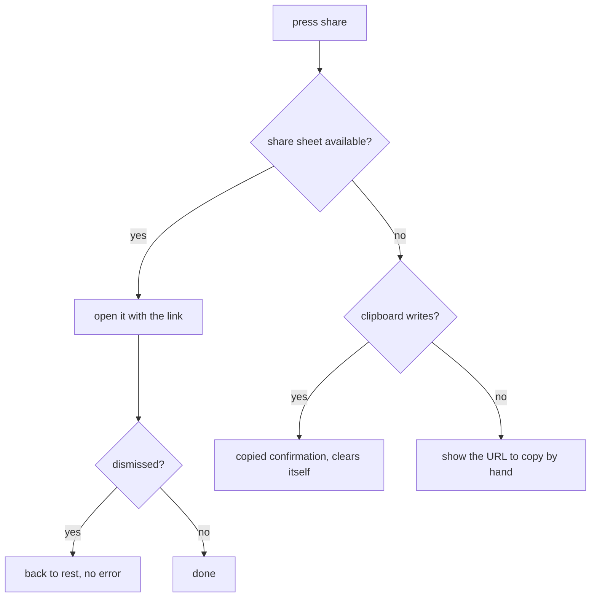

# PRD — Epic 2: Share the groove you're playing

Feature: [briefing.md](../briefing.md) · [roadmap.md](../roadmap.md)

## Summary

A share control on the puzzle hands the player the current groove's link — the
native share sheet where the browser has one, the clipboard otherwise, and the
bare URL on screen where neither is permitted. It is there from the moment the
puzzle loads, and the link it produces gives nothing away: a uuid and nothing
else.

## Problem

Epic 1 makes `/groove/<uuid>` work, and leaves no way to get one without reading
the source. A daily puzzle spreads by being sent to someone, and the send has to
be one press — nobody assembles a URL by hand to show a friend a groove.

## Scope

- One share control in the puzzle UI.
- Three routes out: the Web Share sheet, the clipboard, and the URL on screen.
- Confirmation that it worked, visible and announced.

**Out of scope**
- **Sharing your *result*** — the attempt dots, the streak, a score card. That is
  the separate *Share your result* candidate in `specs/features.md`, and nothing
  here writes toward it.
- **What the recipient sees on opening the link** — Epics 1 and 3.
- **The uuid and the route themselves** — Epic 1.
- **Any account, any server, any short-link service.** The URL is built in the
  browser from the current origin.
- **Social preview images (`og:image`) or per-groove metadata.** A later concern,
  and not one the briefing raises.

## Requirements

### The control

- **R1** — A share control appears from the moment the page loads, before any
  attempt has been made.
- **R1a** — It sits in the page header, beside the streak pill: a page-level
  action, not part of the groove card and not part of the transport.
- **R1b** — Below the header's stacking breakpoint the control stays on the
  right with the streak pill, at the end of its own line, rather than centring —
  the same anchoring the header's two halves already use.
- **R1c** — It is built from a new compact control in `src/components/controls`:
  driven by props, holding no state of the app's, knowing nothing of grooves or
  of sharing, and tested against its own contract. `Button` is unchanged and
  stays the full-width call to action.
- **R2** — It is available for the whole life of the page: before the first
  guess, between guesses, after solving, and after a reveal. Its label does not
  change between those states.
- **R3** — Pressing it offers the current groove's link, built from
  `/groove/<uuid>` and the page's own origin, as an absolute URL.
- **R4** — The control is present on a shared page too, so a groove that arrived
  by link can be passed on. The shared page keeps the same header, so this
  follows from where the control sits.
- **R5** — Pressing it never starts, stops, restarts or interrupts playback, and
  never changes the puzzle's state.
- **R6** — It is reachable and operable by keyboard, carries an accessible name
  that says what it does, and its confirmation is announced to a screen reader.

### What is shared

- **R7** — The link carries the uuid and nothing else. No answer, no root, no
  flavour, no attempt count, no result, no date.
- **R7a** — The share sheet is given the URL alone — no title and no
  accompanying line of text. Nothing to translate, nothing to age, and the
  receiving app renders its own preview.
- **R8** — The same groove always produces the same link, whoever presses it and
  whenever.

### The three routes out

- **R9** — Where the browser offers the Web Share sheet, pressing the control
  opens it with the link.
- **R10** — Where it does not, the link is copied to the clipboard.
- **R11** — Where neither is available or permitted, the link is shown on the
  page in a form the player can select and copy by hand.
- **R12** — A share sheet the player dismisses is not a failure. No error is
  shown, nothing is copied behind their back, and the control returns to rest.
- **R13** — A rejected or unavailable clipboard write falls back to R11 rather
  than failing silently or showing an error.
- **R14** — Every successful path confirms itself — a share sheet by opening, a
  copy by a visible, announced confirmation that clears on its own.

## Behaviour details

## Acceptance criteria

- **AC1** (R1, R2) — Given a freshly loaded puzzle with no attempts, when the
  page is read, then the share control is present; and it is still present, under
  the same label, after a solve and after a reveal.
- **AC2** (R3, R8) — Given a groove, when share is pressed, then the offered URL
  is the page's origin followed by `/groove/<that groove's uuid>`, and pressing
  again offers the identical URL.
- **AC3** (R7) — Given a puzzle with attempts spent and an answer known, when
  share is pressed, then the offered URL contains no root, flavour, attempt or
  result.
- **AC4** (R9) — Given a browser with the Web Share API, when share is pressed,
  then the share sheet is invoked with that URL.
- **AC5** (R10, R14) — Given a browser without the share sheet, when share is
  pressed, then the URL is written to the clipboard and a confirmation appears
  and later clears.
- **AC6** (R11, R13) — Given a clipboard write that rejects, when share is
  pressed, then the URL is rendered on the page for manual copying and no error
  is shown.
- **AC7** (R12) — Given a share sheet the player dismisses, when it closes, then
  no error appears and the control is usable again.
- **AC8** (R5) — Given a groove playing, when share is pressed, then playback
  continues uninterrupted and no attempt, selection or reveal changes.
- **AC9** (R6) — Given a keyboard, when the control is focused and activated,
  then it works, and its confirmation reaches an assistive technology.
- **AC10** (R4) — Given `/groove/<uuid>`, when the page is read, then the share
  control is present and offers that same groove's link.
- **AC11** (R1a, R1b) — Given the page at a wide and a narrow width, when the
  header is read, then the share control is in it beside the streak pill, and at
  the narrow width both sit at the end of their line rather than centred.
- **AC12** (R1c) — Given the new control alone, with no feature around it, when
  it is rendered from props, then it satisfies its own contract — label,
  disabled state, keyboard activation — and its source names nothing from
  `src/features`.
- **AC13** (R7a) — Given a browser with the Web Share API, when share is
  pressed, then `navigator.share` receives the URL and no title or text.

## Dependencies

Depends on Epic 1's contract, not its implementation, and starts on day one
against it:

- `Groove.uuid: string`
- the share-URL builder that turns a `Groove` into its absolute
  `/groove/<uuid>` URL

End-to-end validation — press share, open the link, land on the groove — needs
Epic 1's route to have landed.

## Assumptions

- The confirmation is transient text near the control, not a toast system; the
  app has no toasts and does not need one for this.
- Availability is feature-detected at press time, not sniffed from the user
  agent.

## Question log

Answered questions, kept for traceability. The requirements above are the source
of truth — this records how they got there. Append-only: never rewrite or prune
a past cycle, or the record stops being trustworthy.

### Cycle 1 — 2026-08-31

**Q1. Where does the share control sit?**
Answer: **C) In the page header, beside the streak pill** — sharing is a
page-level action rather than part of the guess, and the header is the one region
both the daily page and the shared page already have in common.
Applied to: R1, R1a, R1b, R4, AC11

**Q2. What control does it use?**
Answer: **A) A new compact control in `src/components/controls`** — `Button` is a
full-width call to action by construction, and widening it into two components
would blunt the one job it does.
Applied to: R1c, AC12

**Q3. What does the share sheet carry beside the URL?**
Answer: **A) The URL alone** — nothing to translate, nothing to age, and the
receiving app renders its own preview.
Applied to: R7a, AC13, Assumptions
