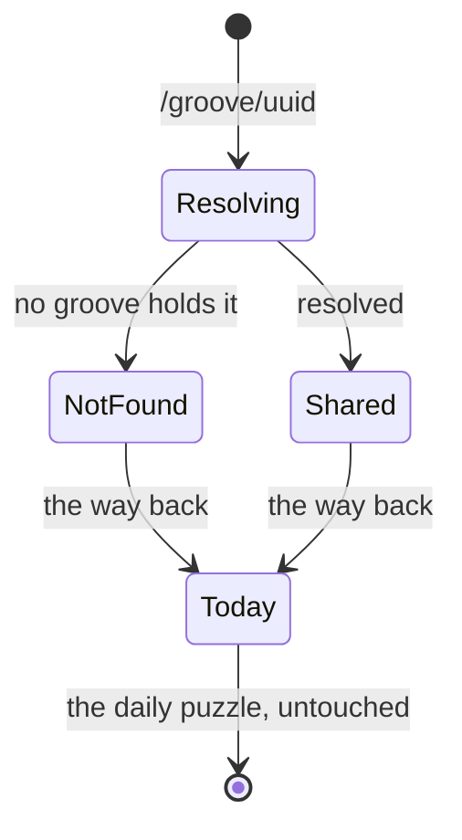

# PRD — Epic 3: A shared groove says what it is

Feature: [briefing.md](../briefing.md) · [roadmap.md](../roadmap.md)

## Summary

Opening a shared link makes plain that this is a shared groove and not today's
puzzle, and offers one obvious way back to today — and once the shared groove is
solved or given up on, invites the player straight to today's puzzle. A uuid that matches no groove
says so calmly and offers the same way back. This is the dressing on Epic 1's
route: the same puzzle, framed so nobody mistakes it for their daily one.

## Problem

After Epic 1 a shared link plays a groove that looks exactly like today's
puzzle. A player who solves it and finds their streak unmoved has been misled by
the page, and a player who never returns to `/` has quietly lost the day. A dead
link, meanwhile, has nothing at all to say.

## Scope

- The shared-groove framing on `/groove/<uuid>`.
- The way back to today's puzzle, and the invitation to it once the shared
  groove has been played out.
- The not-found page for an unknown, retired or malformed uuid.
- The case where the shared uuid is today's own groove.

**Out of scope**
- **The uuid, the route and the no-writing rule** — Epic 1 settled all three.
  Nothing here changes whether a shared play is recorded; it only makes the
  answer visible.
- **The share control** — Epic 2.
- **An archive, a "recently shared" list, or navigation between grooves.** The
  only link out of a shared page is back to today.
- **Any change to `/`.** The daily page's header, card and copy are untouched.

## Requirements

### Saying what it is

- **R1** — `/groove/<uuid>` states, in words, that this is a shared groove and
  not today's puzzle.
- **R1a** — The groove card's meta line carries it: the tempo, then the words
  "shared groove" where the date stands on `/`. The date is not shown at all — a
  shared groove belongs to no day, and today's date there would be the exact
  confusion this epic exists to prevent.
- **R2** — It says, or makes unmistakable, that playing it does not affect the
  streak or the day — so the absence of a change is expected rather than a bug.
- **R3** — The framing is visible before the first press, not only after a
  solve.
- **R4** — The framing is a difference in copy and emphasis, not a second
  layout. The puzzle is the same puzzle in the same shape.

### The way back

- **R5** — Every shared page carries a link back to today's puzzle, present at
  all times.
- **R5a** — When a shared groove ends — solved, or given up on — an invitation
  to play today's groove appears with the answer. It is the natural next move
  once the shared groove is over, and it is what stops a shared link from being
  a dead end.
- **R5b** — Both endings get it, worded the same way, and it stays for the rest
  of the session rather than clearing itself.
- **R5c** — It never appears on the daily page, in either ending. On `/` the
  player is already on today's groove.
- **R6** — Following it lands on `/`, showing today's groove with the day's saved
  state exactly as it was.
- **R7** — Every link leading away from a shared page points at `/`: the way
  back, and — once the puzzle has ended — the invitation. There is no third
  destination, and no navigation between grooves. The header's own controls — help, and the share control Epic 2
  adds — are actions, not navigation, and are unaffected by this.

### The header and the first arrival

- **R7a** — A shared page keeps the same header as `/`, streak pill included.
  The streak shown is the player's real one; it is simply not at stake here, and
  a different header would make the page read as a different app.
- **R7b** — A new or lapsed visitor arriving on a shared link gets the
  how-to-play box, on exactly the rule `/` uses, and can call it back up the same
  way. A shared link is the likeliest first contact anyone has with the app.

### When the uuid resolves to nothing

- **R8** — A uuid no groove holds renders a short, calm message saying the groove
  could not be found. No stack trace, no blank page, no generic framework error.
- **R9** — A malformed uuid — wrong shape, wrong length, junk — is treated
  identically to an unknown one.
- **R10** — The not-found page carries the same single way back to today's
  puzzle.
- **R11** — The not-found page responds as a genuine not-found, so a crawler or a
  chat client's link preview is not told the page exists.
- **R12** — The not-found page never plays audio, and never shows a puzzle,
  attempt row or answer.

### When the shared groove is today's groove

- **R13** — A link to today's own groove is still framed and still behaves as a
  shared groove: it records nothing, and it says so.
- **R14** — On that page the way back to today is unmistakable, because the two
  pages otherwise show the same groove and the difference is the part that
  matters.

## Behaviour details

## Acceptance criteria

- **AC1** (R1, R3) — Given `/groove/<uuid>` for a valid groove, when the page
  loads and before anything is pressed, then it says this is a shared groove
  rather than today's puzzle.
- **AC2** (R2) — Given that page, when it is read, then it states that playing
  it leaves the streak and the day alone.
- **AC3** (R4) — Given the shared page and the daily page for the same groove,
  when both are rendered, then the puzzle region has the same structure and the
  same controls in both.
- **AC4** (R5, R6) — Given a shared page, when the way back is followed, then `/`
  renders today's groove with the day's saved attempts and streak intact.
- **AC5** (R7) — Given a shared page, when its links are enumerated, then every
  link leading away from it points at `/` — one before the puzzle ends, two
  after it.
- **AC6** (R8, R10) — Given a uuid no groove holds, when the page is opened, then
  a not-found message renders with the way back to today, and nothing throws.
- **AC7** (R9) — Given a malformed uuid, when the page is opened, then the same
  not-found message renders.
- **AC8** (R11) — Given a request for an unknown uuid, when the response is
  inspected, then it is a not-found response.
- **AC9** (R12) — Given the not-found page, when it is read, then it contains no
  puzzle, no attempt row, no answer and no audio.
- **AC10** (R13, R14) — Given today's groove's own uuid, when opened at
  `/groove/<uuid>`, then it is framed as a shared groove, it records nothing, and
  the way back to today is present.
- **AC11** (R1a) — Given a shared page, when the groove card's meta line is read,
  then it shows the tempo followed by "shared groove" and no date; and given `/`,
  the same line still shows the tempo and today's date.
- **AC12** (R7a) — Given a player with a streak, when a shared page loads, then
  the header renders as it does on `/`, streak pill and value included.
- **AC13** (R7b) — Given a visitor with nothing saved, when a shared link is
  opened, then the how-to-play box appears; and given a returning player, it does
  not, but can still be called up.
- **AC14** (R5a, R5b) — Given a shared groove, when it is solved, then an
  invitation to today's groove appears beside the answer, linking to `/`; and
  when one is given up on instead, then the same invitation appears, worded the
  same way.
- **AC15** (R5a) — Given a shared groove still in play, when the page is read,
  then no invitation is shown — only the way back that was always there.
- **AC16** (R5c) — Given the daily page, when it is solved or given up on, then
  no invitation to today's groove appears.

## Dependencies

Depends on Epic 1: the `/groove/<uuid>` route, its resolution of a uuid to a
groove, and its rule that a shared play writes nothing. Epic 2's share control
is independent — this epic neither needs it nor changes it.

Hands nothing to a later epic; this is the last one in the feature.

## Assumptions

- The not-found page is rendered through Next's own not-found mechanism, so the
  status is honest without hand-rolling one.
- Beyond the card's meta line, R2's note about the streak is a short line of copy
  on or above the groove card, in the app's existing voice — not a banner, a
  modal or a new surface.
- The way back is a plain link, not a button; it is navigation, not an action.

## Question log

Answered questions, kept for traceability. The requirements above are the source
of truth — this records how they got there. Append-only: never rewrite or prune
a past cycle, or the record stops being trustworthy.

### Cycle 1 — 2026-08-31

**Q1. What does the card's date line show on a shared page?**
Answer: **C) The words "shared groove" in the date's place** — the framing lands
in a line the card already has, and the date, which would imply this is today's
puzzle, goes away with it.
Applied to: R1a, AC11

**Q2. What does the page header show on a shared page?**
Answer: **A) The same header as `/`, streak pill included** — the streak is still
true, it is just not at stake, and a different header would make the page read as
a different app. This is also what puts Epic 2's share control on the shared page
for free.
Applied to: R7a, AC12, Epic 2 R4

**Q3. Does a first-time visitor arriving on a shared link get the how-to-play
box?**
Answer: **A) Yes, on the same new-or-lapsed rule `/` uses** — a shared link is
the likeliest first contact anyone has with the app, and feature-8 built the box
for exactly that arrival.
Applied to: R7b, AC13
