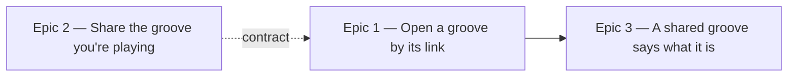

# Roadmap — Shareable grooves

Source: [briefing.md](briefing.md)

## Overview

Every groove gains a permanent uuid that survives renumbering, renaming and
regeneration of the catalogue, and a URL carrying that uuid opens that groove's
puzzle on any day. A share control on the puzzle hands the player that URL, and
a shared groove announces itself as one — not today's puzzle — with a way back
to today. The uuid and the by-id route are the same two pieces an archive would
need later; the archive itself is not built here.

## Epics

### Epic 1 — Open a groove by its link

**Visible when done:** paste `…/groove/<uuid>` into the address bar on any day and
that exact groove loads and plays as a puzzle — the same groove tomorrow, and
the same one for anyone else who opens the link. Today's daily puzzle and streak
are untouched by having played it.

**Depends on:** none
**Parallel with:** Epic 2, behind the frozen contract below

**Contract frozen here, for Epic 2 to build against**
- `Groove.uuid: string` — a v4 uuid, minted once per groove and committed
- a URL builder in the feature that turns a `Groove` into its share URL

**Scope**
- mint a uuid for every groove now in `scripts/grooves/catalogue.json`, and for
  every groove `grooves:add` mints from here on
- carry the uuid through the manifest generator into
  `src/features/daily-groove/data/grooves.generated.ts`
- guard against a uuid ever changing or repeating: the catalogue is the source
  of truth, minting is never re-run for a groove that has one, and the build
  guard (`scripts/grooves/lock.ts`, `gate.ts`) fails on a missing, duplicate or
  altered uuid
- the route is `/groove/<uuid>` — a path route of its own under
  `src/app/groove/`, so the whole thing is one folder to delete
- it resolves a uuid to a groove and hands it to the existing `GroovePuzzle`
  `groove` prop — the feature's public surface already takes one, so no new
  export is needed
- a shared groove plays in its own session: nothing it does is written to the
  daily record under today's date, and the streak neither advances nor breaks.
  This holds even when the shared uuid happens to be today's groove — a shared
  link is practice, and today's puzzle is still waiting when you go back to it
- add the new route's files to `ROUTE_FILES` in `src/app/route-boundary.test.ts`
  so the boundary test covers them too

**Out of scope**
- any control that produces the link — Epic 2
- telling the player they are on a shared groove rather than today's, and what
  happens on an unknown uuid — Epic 3
- an archive, or any listing of grooves by uuid — not in this feature

**Validation**
- open the app, note today's groove; open `/groove/<uuid>` for a different groove and
  play it; return to `/` — today's puzzle is untouched, streak unchanged
- unit: the uuid survives a regeneration of the manifest unchanged; the guard
  fails a catalogue with a duplicate, missing or edited uuid
- unit: resolving a uuid to a groove, colocated in the feature per
  `docs/testing.md`; the route tested through the feature's `index.ts` only

### Epic 2 — Share the groove you're playing

**Visible when done:** a share control on the puzzle produces the current
groove's link — the native share sheet where the browser has one, a copy to the
clipboard otherwise, with visible confirmation that it worked.

**Depends on:** Epic 1's `Groove.uuid` and URL-builder contract
**Parallel with:** Epic 1

**Scope**
- a share control in the puzzle UI, built from the design system's existing
  controls rather than a one-off button
- available from the moment the puzzle loads, under one label throughout — the
  link gives nothing away, so there is no reason to withhold it until the day
  ends
- Web Share API where available, clipboard fallback, and a third fallback that
  still shows the URL where neither is permitted
- confirmation feedback, and an accessible name and state that a screen reader
  can follow
- the link is spoiler-free: it carries the uuid and nothing else — no answer, no
  attempt count, no result

**Out of scope**
- sharing your *result* — the attempt dots, the streak, a score card. That is
  the separate "Share your result" candidate in `specs/features.md`
- what the recipient sees on opening the link — Epics 1 and 3

**Validation**
- press share on the puzzle, get the link; paste it in another browser and land
  on the same groove
- unit: the control renders the URL the builder produces; the clipboard path is
  taken when no share sheet exists; a rejected clipboard write still shows the
  URL rather than failing silently
- design-system component tested against its own contract, independently of the
  feature, per `docs/testing.md`

### Epic 3 — A shared groove says what it is

**Visible when done:** opening a shared link makes clear this is a shared groove
and not today's puzzle, and offers one obvious way back to today — and once the
shared groove is solved or given up on, the page invites the player straight to
today's puzzle. A uuid that matches no groove says so plainly instead of
breaking.

**Depends on:** Epic 1
**Parallel with:** none

**Scope**
- the shared page names itself as a shared groove, distinct from the daily card
- a way back to today's puzzle from the shared page
- once a shared groove ends — solved or given up on — an invitation to play
  today's groove, beside the answer
- an unknown or retired uuid renders a short, calm not-found with the same way
  back — never a crash and never a blank page
- the case where the shared uuid *is* today's groove reads sensibly rather than
  showing two contradictory framings — it still plays as a shared groove and
  still records nothing, so the way back to today has to be unmistakable

**Out of scope**
- the share control itself — Epic 2
- recording or scoring shared plays — Epic 1 settled that they are not recorded

**Validation**
- open a shared link: the page says it is a shared groove and links back to
  today; follow that link and today's puzzle is intact
- solve a shared groove, and give one up: both endings offer the invitation to
  today's puzzle, and following it lands on the daily page
- open `/groove/not-a-real-uuid`: a not-found message with the way back, no crash
- unit: the not-found branch, the shared-groove framing, the end-of-play
  invitation in both endings, and the shared-is-today's-groove case

## Dependency map

## Execution waves

- **Wave 1 (parallel):** Epic 1, Epic 2 — Epic 2 builds against the `Groove.uuid`
  and URL-builder contract Epic 1 freezes on day one
- **Wave 2:** Epic 3 — needs Epic 1's route to exist before it can dress it

## Assumptions

- Uuids are minted once into `catalogue.json` and committed. They are permanent:
  regenerating audio, renaming a file or renumbering the catalogue must never
  change one, because links already in the wild point at them.
- No backend. The link resolves entirely client-side against the committed
  manifest, exactly as the daily selection already does.
- The link is spoiler-free by construction — it carries the uuid only.
- The mp3 filenames and the existing `groove-NN` ids stay as they are: the uuid
  joins them rather than replacing them, and is the only id a link carries. No
  mp3 renames, no lock churn, no rewriting of the rotation.
- An archive is out of scope. This feature only leaves the two pieces an archive
  would need: a stable id per groove and a route that opens one.
