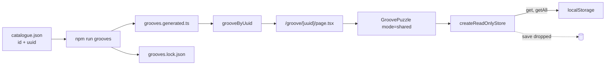

# Tech spec — Epic 1: Open a groove by its link

PRD: [../prd/epic-1-open-a-groove-by-its-link.md](../prd/epic-1-open-a-groove-by-its-link.md) ·
Roadmap: [../roadmap.md](../roadmap.md)

## Approach

`uuid` becomes a required field of both `GrooveSpec` (the generator's input) and
`Groove` (the contract in `src/lib/groove.ts`), minted into `catalogue.json` and
copied — never generated — by the manifest renderer, so `npm run grooves` stays
a pure function of its input. A new `scripts/grooves/uuid.ts` owns minting,
validation and the backfill; `grooves:verify` grows three catalogue checks that
name the offending groove. On the app side, `/groove/[uuid]` is a server
component that resolves the uuid through a new feature export and calls
`notFound()` when nothing matches, which is what gives Epic 3 an honest 404. The
"records nothing" rule is a decorator on the existing `ResultStore` seam rather
than a flag threaded through the session, so a shared page cannot write even by
accident, while still reading the real results the streak is derived from.

## Architecture

Three seams, each already present in the codebase and each extended rather than
bypassed:

1. **catalogue.json → manifest → lock.** The catalogue is the input, the
   manifest and the mp3s are outputs, and the lock hashes all three. A uuid is
   input: it is minted into the catalogue and copied outward. Minting inside the
   renderer would make two runs disagree and break `cli.test.ts`'s determinism
   assertions.
2. **`Groove` in `src/lib/groove.ts`.** The one declaration both `scripts/` and
   the app import. `uuid` goes here, required, so a groove without one does not
   type-check.
3. **`ResultStore` in `lib/persistence/storage.ts`.** Already the single
   persistence seam — "no component or hook touches `localStorage` directly".
   A shared session is handed `createReadOnlyStore(...)`, which delegates `get`
   and `getAll` and drops `save`. The streak stays honest because reads pass
   through; nothing is written because there is no write path to reach.

The route is a **server component**. It awaits `params` (Next 16 passes them as
a Promise), resolves the groove, and calls `notFound()` on a miss — the only
shape that produces a real not-found response for Epic 3's AC8. The resolved
`Groove` is passed to the existing `GroovePuzzle` `groove` prop, which is why
the client-side `useSyncExternalStore` fallback in `GroovePuzzle` is untouched:
given a groove, it already renders it directly.



## Contracts

Frozen before any track starts. Track C builds against the store contract while
Track A is still minting; Track B builds against `Groove.uuid`.

```ts
// src/lib/groove.ts — required, not optional: a groove without a uuid is not a groove
export type Groove = {
  id: string
  /** Canonical lowercase v4 uuid. The only identifier a share link carries. */
  uuid: string
  audioSrc: string
  // …unchanged
}
```

```ts
// scripts/grooves/types.ts
export type GrooveSpec = {
  id: string
  uuid: string
  template: string
  seed: number
}
```

```ts
// scripts/grooves/uuid.ts
export function isCanonicalUuid(value: unknown): boolean
export function mintUuid(): string                       // crypto.randomUUID()
export function assignMissingUuids(
  specs: readonly GrooveSpec[],
  mint?: () => string,
): GrooveSpec[]                                          // idempotent
export function uuidFailures(specs: readonly GrooveSpec[]): GateFailure[]
```

```ts
// src/features/daily-groove/lib/share/url.ts
export const GROOVE_PATH = '/groove'
export function grooveHref(groove: Groove): string        // "/groove/<uuid>"
export function shareUrlOf(groove: Groove, origin: string): string
```

```ts
// src/features/daily-groove/lib/persistence/storage.ts
export function createReadOnlyStore(inner: ResultStore): ResultStore
```

```ts
// src/features/daily-groove/index.ts — the feature's only inbound surface
export { GroovePuzzle } from './components/GroovePuzzle'
export { grooveByUuid } from './lib/puzzle/grooveByUuid'
export { grooveHref, shareUrlOf } from './lib/share/url'
```

```ts
// GroovePuzzle props
type GroovePuzzleProps = {
  groove?: Groove
  /** 'daily' persists the day; 'shared' persists nothing. Defaults to 'daily'. */
  mode?: 'daily' | 'shared'
}
```

## Tracks

### Track A — the uuid in the generator

- **Goal** — every committed groove has a permanent uuid, the renderer copies
  it, and `grooves:verify` fails on a missing, duplicate or malformed one.
- **Owns** — `scripts/grooves/uuid.ts`, `uuid.test.ts`, `uuid-cli.ts`,
  `types.ts`, `cli.ts`, `add.ts`, `select.ts`, `verify-cli.ts`, `lock.ts`,
  `catalogue.json`, `src/lib/groove.ts`,
  `src/features/daily-groove/data/grooves.generated.ts`,
  `scripts/grooves/grooves.lock.json`, `package.json`
- **Depends on** — nothing
- **Parallel with** — Track C
- **Done when** — `npm run grooves:verify` passes on the committed tree, and
  fails with a named groove on each of the three injected faults.

### Track B — resolving a uuid, and the URL it lives in

- **Goal** — `grooveByUuid`, `grooveHref` and `shareUrlOf` exist, are tested,
  and are exported from the feature's `index.ts`.
- **Owns** — `src/features/daily-groove/lib/puzzle/grooveByUuid.ts` and its
  test, `src/features/daily-groove/lib/share/url.ts` and its test,
  `src/features/daily-groove/index.ts`
- **Depends on** — `Groove.uuid` (Track A, Step A2)
- **Parallel with** — nothing in wave 2; it is the wave
- **Done when** — its own tests pass against the committed manifest.

### Track C — the session that records nothing

- **Goal** — a puzzle can be run in a mode that reads saved results and writes
  none.
- **Owns** — `src/features/daily-groove/lib/persistence/storage.ts` and its
  test, `hooks/usePuzzleSession.ts` and its tests,
  `components/GroovePuzzle.tsx` and its test
- **Depends on** — the `ResultStore` contract, which already exists
- **Parallel with** — Track A
- **Done when** — a `GroovePuzzle` rendered with `mode="shared"` can be played
  to solved with the injected store's `save` never called, and the daily mode's
  tests are untouched and still green.

### Track D — the route

- **Goal** — `/groove/<uuid>` renders the shared puzzle; an unknown uuid is a
  not-found.
- **Owns** — `src/app/groove/[uuid]/page.tsx` and its test,
  `src/app/route-boundary.test.ts`
- **Depends on** — Track B's exports and Track C's `mode` prop
- **Parallel with** — nothing
- **Done when** — its tests pass and the boundary test covers the new files.

## Execution waves

- **Wave 1 (parallel):** Track A, Track C
- **Wave 2:** Track B — needs `Groove.uuid` to exist and the manifest to carry it
- **Wave 3:** Track D, then integration

## Implementation

### Track A — the uuid in the generator

#### Step A1 — A canonical uuid is recognised, and anything else is not

Covers: R1a, AC14

- **Test first** — `scripts/grooves/uuid.test.ts`: assert
  `isCanonicalUuid('9f1c2e40-7b3a-4c15-9d8e-2a6b41f0c7de')` is true, and that
  it is false for `''`, `'groove-01'`, the same string uppercased, one with a
  version digit of `1`, and a 35-character truncation. Run it: fails with
  "Failed to resolve import ./uuid.ts".
- **Implement** — `scripts/grooves/uuid.ts`: `isCanonicalUuid` testing
  `/^[0-9a-f]{8}-[0-9a-f]{4}-4[0-9a-f]{3}-[89ab][0-9a-f]{3}-[0-9a-f]{12}$/`,
  and `mintUuid()` returning `crypto.randomUUID()`.
- **Green when** — all six assertions pass.
- **Refactor** — none.

#### Step A2 — `uuid` is part of both contracts

Covers: R1, R4

- **Test first** — `scripts/grooves/uuid.test.ts`: assert
  `isCanonicalUuid(mintUuid())` is true, and add a type-level use —
  `const spec: GrooveSpec = { id: 'groove-99', uuid: mintUuid(), template: 't', seed: 1 }`.
  Run it: fails to type-check with "Object literal may only specify known
  properties, and 'uuid' does not exist in type 'GrooveSpec'".
- **Implement** — `scripts/grooves/types.ts`: add `uuid: string` to
  `GrooveSpec`. `src/lib/groove.ts`: add `uuid: string` to `Groove`, documented
  as the only identifier a link carries.
- **Green when** — the file type-checks. The tree is now red elsewhere — the
  catalogue, the manifest and the fixtures have no uuids yet — which A3–A5 fix.
- **Refactor** — none.

#### Step A3 — Missing uuids are filled in, and existing ones are left alone

Covers: R2, R6

- **Test first** — `scripts/grooves/uuid.test.ts`: given three specs where the
  middle one already has a uuid, assert `assignMissingUuids(specs, fakeMint)`
  returns three specs, that the middle one's uuid is unchanged, that the other
  two got the fake mint's values, and that running the result through
  `assignMissingUuids` again changes nothing. Run it: fails with
  "assignMissingUuids is not a function".
- **Implement** — `scripts/grooves/uuid.ts`: `assignMissingUuids(specs, mint =
  mintUuid)` mapping each spec to itself when `isCanonicalUuid(spec.uuid)`, and
  to `{ ...spec, uuid: mint() }` otherwise. Field order places `uuid` directly
  after `id`.
- **Green when** — idempotence and preservation both assert green.
- **Refactor** — none.

#### Step A4 — The committed catalogue is backfilled

Covers: R5, R6, AC5

- **Test first** — `scripts/grooves/uuid.test.ts`: read the committed catalogue
  with `readCatalogue()` and assert every entry has a `uuid` that satisfies
  `isCanonicalUuid`, and that the set of uuids has the same size as the
  catalogue. Run it: fails with "expected undefined to satisfy isCanonicalUuid"
  on `groove-01`.
- **Implement** — `scripts/grooves/uuid-cli.ts`: read the catalogue, run
  `assignMissingUuids`, write it back with `writeCatalogue`, and print how many
  were minted and how many were already present. Add `"grooves:uuid": "node
  scripts/grooves/uuid-cli.ts"` to `package.json`. Run it once and commit
  `catalogue.json`.
- **Green when** — the assertions pass against the committed file, and a second
  run of `npm run grooves:uuid` reports 0 minted and leaves the file
  byte-identical.
- **Refactor** — none.

#### Step A5 — The manifest carries the uuid, and two renders agree

Covers: R2, R5, AC1, AC2

- **Test first** — `scripts/grooves/manifest.test.ts`: assert
  `toGroove(spec, music, 0).uuid === spec.uuid`; and in the determinism test,
  assert two `generate({ encode: false })` runs produce identical `uuid` values
  for every entry. Run it: fails with "expected undefined to be
  '9f1c2e40-…'".
- **Implement** — `scripts/grooves/cli.ts`: add `uuid: spec.uuid` to
  `toGroove`'s returned object, directly after `id`. Then run
  `npm run grooves -- --manifest-only` to regenerate
  `grooves.generated.ts` and the lock from the committed audio, and commit both.
- **Green when** — both assertions pass and `grooves.generated.ts` shows a uuid
  on every entry with no mp3 re-encoded.
- **Refactor** — none.

#### Step A6 — `grooves:add` mints a uuid for what it appends

Covers: R7, AC6

- **Test first** — `scripts/grooves/add.test.ts`: run `addGrooves(1, { … ,
  mintUuid: () => 'aaaaaaaa-bbbb-4ccc-8ddd-eeeeeeeeeeee' })` against a temp
  catalogue and assert the appended spec carries that uuid, that the existing
  entries' uuids are unchanged, and that the written manifest entry carries it
  too. Run it: fails with "expected undefined to be 'aaaaaaaa-…'".
- **Implement** — `scripts/grooves/add.ts`: add `mintUuid?: () => string` to
  `AddOptions`, defaulting to `uuid.ts`'s `mintUuid`, and stamp the uuid onto
  the candidate at the point it is pushed into `minted`. `selectSeeds` is not
  touched: it is deterministic and tested as such, and randomness must not
  enter it.
- **Green when** — the three assertions pass and `select.test.ts` is untouched
  and green.
- **Refactor** — none.

#### Step A7 — The guard fails on a missing, duplicate or malformed uuid

Covers: R8, R9, R10, AC3, AC4

- **Test first** — `scripts/grooves/uuid.test.ts`: assert `uuidFailures` returns
  `[]` for a clean list; one failure naming `groove-02` for a spec whose uuid is
  absent; one failure naming both `groove-01` and `groove-03` for a duplicated
  uuid; and one naming `groove-04` for `'not-a-uuid'`. Then in
  `scripts/grooves/lock.test.ts`, assert `verifyLock` surfaces those failures
  for a catalogue with a duplicate. Run them: fails with "uuidFailures is not a
  function".
- **Implement** — `scripts/grooves/uuid.ts`: `uuidFailures` returning
  `GateFailure[]` with checks `uuid-missing`, `uuid-duplicate` and
  `uuid-malformed`, each `detail` naming the groove id and the offending value.
  `scripts/grooves/lock.ts`: `verifyLock` reads the catalogue and appends
  `uuidFailures(specs)` to its result. `lock.ts` may import `uuid.ts` because
  `uuid.ts` imports nothing but `node:crypto` — the no-render guarantee
  `lock.test.ts` asserts by reading the source still holds.
- **Green when** — every assertion passes and `npm run grooves:verify` still
  reports the committed tree intact.
- **Refactor** — none.

### Track C — the session that records nothing

#### Step C1 — A read-only store reads through and drops writes

Covers: R18, AC9

- **Test first** — `src/features/daily-groove/lib/persistence/storage.test.ts`:
  given a fake `ResultStore` with `vi.fn()` methods, assert
  `createReadOnlyStore(inner).get('2026-08-31')` delegates and returns the inner
  value, that `getAll()` delegates, and that `save(result)` resolves without
  `inner.save` being called. Run it: fails with "createReadOnlyStore is not a
  function".
- **Implement** — `storage.ts`: `createReadOnlyStore(inner)` returning
  `{ get: inner.get, getAll: inner.getAll, save: async () => {} }`, documented
  as the seam a shared groove is played through.
- **Green when** — all three assertions pass.
- **Refactor** — none.

#### Step C2 — A session can be given a store

Covers: R18, R19

- **Test first** — `src/features/daily-groove/hooks/usePuzzleSession.test.ts`:
  render the hook with an injected read-only store, check a wrong pair, and
  assert the underlying store's `save` was never called while `streak` still
  reports the value its `getAll` returned. Run it: fails because the hook takes
  no store and writes through the module singleton.
- **Implement** — `usePuzzleSession.ts`: add an optional fourth parameter
  `store?: ResultStore`, passed straight to `useProgress(todayIso, store)`,
  which already accepts one.
- **Green when** — the assertion passes and the existing daily-mode tests are
  unchanged and green.
- **Refactor** — none.

#### Step C3 — A shared puzzle writes nothing, and reloads clean

Covers: R18, R20, R21, R22, AC9, AC10, AC11

- **Test first** — `src/features/daily-groove/components/GroovePuzzle.test.tsx`:
  render `<GroovePuzzle groove={fixture} mode="shared" />` with a spy store,
  play to a correct answer, and assert `save` was never called; assert the
  streak the header shows is the one the store's records imply; assert the root
  and mode rows, the check control and the reveal behave exactly as in the daily
  test; then re-render and assert the attempt row is empty. Run it: fails with
  "Property 'mode' does not exist on type 'GroovePuzzleProps'".
- **Implement** — `GroovePuzzle.tsx`: add `mode?: 'daily' | 'shared'`,
  defaulting to `'daily'`, thread it to `GroovePuzzleView`, and there build the
  store once — `useState(() => mode === 'shared' ? createReadOnlyStore(createLocalStore()) : undefined)`
  — passing it as `usePuzzleSession`'s fourth argument. Everything else in the
  view is untouched.
- **Green when** — every assertion passes and the existing daily tests stay
  green.
- **Refactor** — none. Epic 3 adds the copy differences behind the same prop.

### Track B — resolving a uuid, and the URL it lives in

#### Step B1 — A uuid resolves to its groove, case-insensitively

Covers: R12, R13, R1b, AC7, AC15

- **Test first** — `src/features/daily-groove/lib/puzzle/grooveByUuid.test.ts`:
  take the first entry of `GROOVES`, assert `grooveByUuid(entry.uuid)` is that
  entry, that the uppercased uuid resolves to the same entry, and that
  `grooveByUuid('nope')`, `grooveByUuid('')` and a well-formed-but-unused uuid
  are all `undefined`. Run it: fails with "Failed to resolve import
  ./grooveByUuid".
- **Implement** — `grooveByUuid.ts`: look the uuid up in `GROOVES` comparing
  lowercased values. Reads no clock and takes no date — that is what makes R13
  true by construction.
- **Green when** — all five assertions pass.
- **Refactor** — none.

#### Step B2 — A groove knows the URL it lives at

Covers: R12, AC14

- **Test first** — `src/features/daily-groove/lib/share/url.test.ts`: assert
  `grooveHref(groove)` is `/groove/<uuid>`, that `shareUrlOf(groove,
  'https://example.test')` is `https://example.test/groove/<uuid>`, that a
  trailing slash on the origin does not double the separator, and that the
  result contains no root, flavour or answer. Run it: fails with "Failed to
  resolve import ./url".
- **Implement** — `src/features/daily-groove/lib/share/url.ts`: `GROOVE_PATH`,
  `grooveHref`, and `shareUrlOf` normalising the origin's trailing slash.
- **Green when** — all four assertions pass.
- **Refactor** — none.

#### Step B3 — The feature offers all three from its index

Covers: R15

- **Test first** — `src/features/daily-groove/structure.test.ts`: assert the
  feature's `index.ts` names `grooveByUuid`, `grooveHref` and `shareUrlOf`
  among its exports. Run it: fails listing only the current exports.
- **Implement** — `index.ts`: re-export the three, keeping the file's comment
  about being the only public surface.
- **Green when** — the assertion passes.
- **Refactor** — none.

### Track D — the route

#### Step D1 — `/groove/<uuid>` renders that groove's puzzle

Covers: R12, R13, R16, R22, AC7

- **Test first** — `src/app/groove/[uuid]/page.test.tsx`: render the page's
  default export awaited with `params: Promise.resolve({ uuid })` for a groove
  that is *not* today's, and assert the rendered output names that groove and
  passes `mode="shared"`. Run it: fails with "Cannot find module
  './page'".
- **Implement** — `src/app/groove/[uuid]/page.tsx`: a server component that
  awaits `params`, calls `grooveByUuid`, and renders
  `<PageShell><Container><main><GroovePuzzle groove={groove} mode="shared" /></main></Container></PageShell>`
  — composition only, matching `src/app/page.tsx`.
- **Green when** — the assertion passes.
- **Refactor** — none.

#### Step D2 — An unresolvable uuid is a not-found

Covers: R14, R14a, AC8

- **Test first** — `src/app/groove/[uuid]/page.test.tsx`: assert the page throws
  the error `notFound()` throws for `'not-a-real-uuid'`, for `''`, and for a
  well-formed uuid no groove holds — and that nothing else is rendered. Run it:
  fails with "expected the promise to reject".
- **Implement** — `page.tsx`: `if (!groove) notFound()` from `next/navigation`,
  before any rendering. No `return` is needed: it throws.
- **Green when** — all three assertions pass.
- **Refactor** — none. The not-found *UI* is Epic 3's.

#### Step D3 — The new route respects the feature boundary

Covers: R15, R17, AC12

- **Test first** — `src/app/route-boundary.test.ts`: add
  `src/app/groove/[uuid]/page.tsx` and `src/app/groove/[uuid]/page.test.tsx` to
  `ROUTE_FILES`. Run it: fails if the page or its test names a specifier past
  `@/features/daily-groove` or mocks anything inside it.
- **Implement** — whatever the failure names: import only from
  `@/features/daily-groove` and the design system, and mock nothing internal.
- **Green when** — both boundary assertions pass for all four files.
- **Refactor** — none.

## Integration and verification

- **Step I1 — the daily page is untouched** (R23, AC13). Run the full suite:
  `src/app/page.test.tsx`, `selectGroove.test.ts`, `useProgress.integration.test.ts`
  and `streak.test.ts` must be green without edits. Any change needed there is a
  regression, not an integration.
- **Step I2 — the guard on the real tree.** `npm run grooves:verify` reports the
  committed grooves, notes, manifests and catalogue all matching, with uuids
  present and unique.
- **Step I3 — the demo path.** `npm run dev`; note today's groove at `/`; open
  `/groove/<a different groove's uuid>` and play it to solved; return to `/` and
  confirm today's puzzle is unplayed and the streak unchanged. Repeat with
  today's own groove's uuid — same result. Open
  `/groove/not-a-real-uuid` and get a not-found rather than a crash.
- **Step I4 — the whole suite.** `npm test`, `npx tsc --noEmit`, `npm run lint`,
  `npm run build` all green.

## Requirement coverage

| Requirement | Steps |
| :-- | :-- |
| R1 | A2, A5 |
| R1a | A1 |
| R1b | B1 |
| R2 | A3, A5 |
| R3 | A7 |
| R4 | A2, A5 |
| R5 | A4, A5 |
| R6 | A3, A4 |
| R7 | A6 |
| R8 | A7 |
| R9 | A7 |
| R10 | A7 |
| R11 | A5, I2 |
| R12 | B1, B2, D1 |
| R13 | B1, D1 |
| R14 | D2 |
| R14a | D2 |
| R15 | B3, D3 |
| R16 | D1 |
| R17 | D3 |
| R18 | C1, C2, C3 |
| R19 | C2, C3 |
| R20 | C3, I3 |
| R21 | C3 |
| R22 | C3, D1 |
| R23 | I1 |
| AC1 | A5 |
| AC2 | A5 |
| AC3 | A7 |
| AC4 | A7 |
| AC5 | A4 |
| AC6 | A6 |
| AC7 | B1, D1 |
| AC8 | D2 |
| AC9 | C1, C3 |
| AC10 | C3, I3 |
| AC11 | C3 |
| AC12 | D3 |
| AC13 | I1 |
| AC14 | A1, B2 |
| AC15 | B1 |

## Assumptions

- `crypto.randomUUID()` from `node:crypto` is the mint. No dependency is added.
- `uuid` is placed directly after `id` in both the catalogue's JSON and the
  generated manifest, so a diff of either reads as one added line per groove.
- The backfill ships as a committed, idempotent `npm run grooves:uuid` rather
  than a script deleted after one run — it is six lines, it is tested, and it is
  the repair path if a hand edit ever drops a uuid.
- `/groove/[uuid]` is rendered on demand; no `generateStaticParams`. Adding one
  later is additive and changes no URL.
- Test fixtures under `src/features/daily-groove/testing/` gain a uuid field as
  part of Step A2's type change.

## Decision log

Settled architectural decisions. The sections above are the source of truth —
this records how they got there, and what each one cost. Append-only.

### Cycle 1 — 2026-08-31

**Q1. How does a shared session avoid writing?**
Decision: **A) A read-only `ResultStore` decorator, injected into the session** —
`storage.ts` is already the single persistence seam, reads pass through so the
streak stays true, and there is no write path left to reach by accident.
Changed: nothing. The Architecture, the `createReadOnlyStore` contract and Track
C's steps C1–C3 were written against this and stand as they are. The alternatives
would have replaced C1 with a flag guarded at each write site (B), split
`GroovePuzzle` in two (C), or introduced a second body of saved state (D).

**Q2. Where does the backfill live?**
Decision: **A) A committed, idempotent `npm run grooves:uuid`** — testable, and
the repair path if a uuid is ever lost to a hand edit, while `grooves:add` keeps
minting on its own.
Changed: nothing. Steps A3 and A4 already build it, and the Assumptions already
record it as committed rather than deleted after one run.
