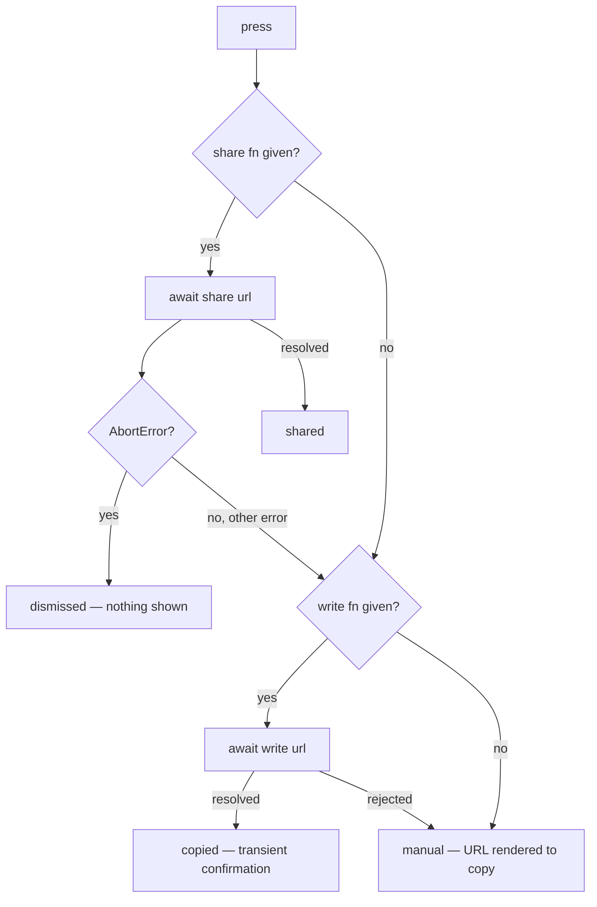

# Tech spec — Epic 2: Share the groove you're playing

PRD: [../prd/epic-2-share-the-groove-youre-playing.md](../prd/epic-2-share-the-groove-youre-playing.md) ·
Roadmap: [../roadmap.md](../roadmap.md)

## Approach

Three pieces, each testable alone. A new compact `InlineButton` in the design
system knows nothing but "small button with a label". A pure `shareLink(url,
deps)` in the feature owns the whole share/clipboard/manual decision as an
injected-dependency function returning a named outcome, so all four paths —
including a dismissed sheet and a rejected clipboard — are unit-testable with no
jsdom shimming of `navigator`. A `ShareGroove` component joins them, holds the
transient confirmation, and is dropped into the header through a slot, so
`GrooveHeader` never learns what sharing is. The URL comes from Epic 1's
`shareUrlOf`, read at press time from `window.location.origin`.

## Architecture

`shareLink` is a function, not a hook, and takes its capabilities as arguments:

```ts
shareLink(url, { share: navigator.share?.bind(navigator), write: navigator.clipboard?.writeText… })
```

Capability detection is therefore "was a function passed", not a user-agent
sniff, and the four outcomes are exhaustive: `shared`, `copied`, `dismissed`,
`manual`. `ShareGroove` calls it at press time, gathers the origin then rather
than at render — a page rendered on the server has no origin — and maps the
outcome to what the player sees: nothing extra on `shared`, a transient
"Link copied" on `copied`, nothing on `dismissed`, and the URL rendered for
manual copying on `manual`.

A dismissed share sheet rejects with an `AbortError`; that is the one rejection
that maps to `dismissed` rather than falling through to the clipboard, because
the player already had the link in front of them and said no.

The control sits in the header beside `StreakBadge`. `GrooveHeader` gains a
`share?: ReactNode` slot rather than a `groove` or a `url`: the header is a
layout of parts, and a slot keeps it from importing anything about sharing —
which is also what lets Epic 3 reuse it unchanged.



## Contracts

```ts
// src/components/controls/InlineButton.tsx — knows no domain concept
type InlineButtonProps = {
  children: ReactNode
  onPress: () => void
  /** Sets aria-label. Without it the accessible name stays the children. */
  label?: string
  disabled?: boolean
}
```

```ts
// src/features/daily-groove/lib/share/share.ts
export type ShareOutcome = 'shared' | 'copied' | 'dismissed' | 'manual'

export type ShareDeps = {
  /** navigator.share, bound — or absent when the browser has none. */
  share?: (data: { url: string }) => Promise<void>
  /** navigator.clipboard.writeText, bound — or absent. */
  write?: (text: string) => Promise<void>
}

export function shareLink(url: string, deps: ShareDeps): Promise<ShareOutcome>
export function browserShareDeps(): ShareDeps
```

```ts
// src/features/daily-groove/components/header/ShareGroove.tsx
type ShareGrooveProps = { groove: Groove; deps?: ShareDeps; origin?: string }
```

```ts
// src/features/daily-groove/components/header/GrooveHeader.tsx
type GrooveHeaderProps = {
  streak: number
  onShowHelp: (() => void) | null
  /** Rendered beside the streak badge. The header never learns what it is. */
  share?: ReactNode
}
```

Consumed from Epic 1, unchanged: `shareUrlOf(groove, origin)` and `Groove.uuid`.

## Tracks

### Track A — the compact control

- **Goal** — `InlineButton` exists in the design system, tested against its own
  contract, with no feature anywhere in its source.
- **Owns** — `src/components/controls/InlineButton.tsx`,
  `InlineButton.test.tsx`, `src/components/structure.test.ts`
- **Depends on** — nothing
- **Parallel with** — Track B
- **Done when** — its own tests and the design-system structure test pass.

### Track B — the share behaviour

- **Goal** — `shareLink` decides correctly among four outcomes, proven for every
  branch including both rejections.
- **Owns** — `src/features/daily-groove/lib/share/share.ts`, `share.test.ts`
- **Depends on** — nothing (it takes a URL string, not a groove)
- **Parallel with** — Track A
- **Done when** — its own tests pass.

### Track C — the control on the page

- **Goal** — pressing share in the header offers the current groove's link, on
  the daily page and on a shared one.
- **Owns** — `src/features/daily-groove/components/header/ShareGroove.tsx` and
  its test, `header/GrooveHeader.tsx` and its test,
  `components/GroovePuzzle.tsx` and its test
- **Depends on** — Tracks A and B, and Epic 1's `shareUrlOf`
- **Parallel with** — nothing
- **Done when** — the puzzle's own tests cover press → offered URL for all four
  outcomes.

## Execution waves

- **Wave 1 (parallel):** Track A, Track B
- **Wave 2:** Track C
- **Wave 3:** Integration

## Implementation

### Track A — the compact control

#### Step A1 — A compact button that presses

Covers: R1c, AC12

- **Test first** — `src/components/controls/InlineButton.test.tsx`: assert it
  renders a `button` whose accessible name is its children; that `onPress` fires
  on click and on Enter; that `label` overrides the accessible name; and that
  `disabled` prevents `onPress`. Run it: fails with "Cannot find module
  './InlineButton'".
- **Implement** — `InlineButton.tsx`: a `type="button"` element with the design
  system's `rounded-control`, small padding and type size, `focus-visible`
  outline in the accent colour, and a disabled style — deliberately *not*
  `w-full`, which is what separates it from `Button`.
- **Green when** — all four assertions pass.
- **Refactor** — none.

#### Step A2 — The design system knows it exists

Covers: R1c

- **Test first** — `src/components/structure.test.ts`: add `'InlineButton'` to
  `COMPONENTS.controls`. Run it: fails naming `controls/InlineButton.tsx` as
  missing if either the component or its test is absent.
- **Implement** — nothing beyond Step A1, which created both files.
- **Green when** — the structure test passes, including its no-feature-imports
  assertion over the new file.
- **Refactor** — none.

### Track B — the share behaviour

#### Step B1 — The share sheet is used when there is one

Covers: R9, R7a, AC4, AC13

- **Test first** — `src/features/daily-groove/lib/share/share.test.ts`: assert
  `shareLink('https://x.test/groove/u', { share })` calls `share` exactly once
  with `{ url: 'https://x.test/groove/u' }` — no `title`, no `text` — and
  resolves to `'shared'`. Run it: fails with "shareLink is not a function".
- **Implement** — `share.ts`: `shareLink` awaiting `deps.share({ url })` when
  present and returning `'shared'`.
- **Green when** — the argument assertion and the outcome both pass.
- **Refactor** — none.

#### Step B2 — A dismissed sheet is not a failure

Covers: R12, AC7

- **Test first** — `share.test.ts`: given a `share` that rejects with a
  `DOMException(…, 'AbortError')`, assert the outcome is `'dismissed'` and that
  a `write` also passed is never called. Run it: fails — the rejection escapes.
- **Implement** — `share.ts`: catch, and return `'dismissed'` when the error's
  `name` is `'AbortError'`.
- **Green when** — both assertions pass.
- **Refactor** — none.

#### Step B3 — Without a sheet, the link is copied

Covers: R10, R14, AC5

- **Test first** — `share.test.ts`: with no `share` and a resolving `write`,
  assert `write` receives the URL and the outcome is `'copied'`. Run it: fails
  with "expected undefined to be 'copied'".
- **Implement** — `share.ts`: fall through to `deps.write(url)` and return
  `'copied'`.
- **Green when** — both assertions pass.
- **Refactor** — none.

#### Step B4 — When neither works, the URL is handed over

Covers: R11, R13, AC6

- **Test first** — `share.test.ts`: assert the outcome is `'manual'` when no
  `write` is given; when `write` rejects; and when a non-abort `share` rejection
  is followed by a rejecting `write`. Run it: fails on the first case.
- **Implement** — `share.ts`: return `'manual'` for an absent or rejecting
  `write`, and treat a non-`AbortError` share rejection as a fall-through to the
  clipboard branch.
- **Green when** — all three assertions pass.
- **Refactor** — extract the abort test to a named `isAbort(error)` once B2 and
  B4 both need it.

#### Step B5 — The browser's own capabilities

Covers: R9, R10

- **Test first** — `share.test.ts`: with a stubbed global `navigator` carrying
  neither API, assert `browserShareDeps()` returns `{}`; with both, assert both
  are present and bound (calling them does not throw on `this`). Run it: fails
  with "browserShareDeps is not a function".
- **Implement** — `share.ts`: read `navigator.share` and
  `navigator.clipboard?.writeText`, bind each where present, guarding for a
  server render where `navigator` is undefined.
- **Green when** — both assertions pass.
- **Refactor** — none.

### Track C — the control on the page

#### Step C1 — Pressing share offers this groove's link

Covers: R3, R7, R8, AC2, AC3

- **Test first** —
  `src/features/daily-groove/components/header/ShareGroove.test.tsx`: render
  `<ShareGroove groove={fixture} origin="https://x.test" deps={{ share }} />`,
  press it, and assert `share` received `{ url: 'https://x.test/groove/<uuid>' }`;
  press again and assert the identical URL; assert the URL contains neither the
  groove's root nor its flavour. Run it: fails with "Cannot find module
  './ShareGroove'".
- **Implement** — `ShareGroove.tsx`: an `InlineButton` labelled "Share", whose
  handler builds the URL with `shareUrlOf(groove, origin ?? window.location.origin)`
  and calls `shareLink`.
- **Green when** — all three assertions pass.
- **Refactor** — none.

#### Step C2 — Copying confirms itself, and the confirmation clears

Covers: R6, R14, AC5, AC9

- **Test first** — `ShareGroove.test.tsx`: with only a resolving `write`, press
  and assert a "Link copied" confirmation appears inside a live region; advance
  timers and assert it is gone; assert the control is reachable and operable by
  keyboard throughout. Run it: fails — nothing is rendered after the press.
- **Implement** — `ShareGroove.tsx`: hold the outcome in state, render the
  confirmation in an `aria-live="polite"` node beside the control, and clear it
  on a timer that is cancelled on unmount.
- **Green when** — the appearance, the clearing and the keyboard assertions all
  pass.
- **Refactor** — none.

#### Step C3 — The last resort shows the URL

Covers: R11, R13, AC6

- **Test first** — `ShareGroove.test.tsx`: with no `share` and a rejecting
  `write`, press and assert the full URL is rendered as selectable text and that
  no `role="alert"` error appears. Run it: fails — nothing is rendered.
- **Implement** — `ShareGroove.tsx`: on `'manual'`, render the URL in a
  selectable node beneath the control. It persists rather than clearing on a
  timer: the player has to copy it by hand.
- **Green when** — both assertions pass.
- **Refactor** — none.

#### Step C4 — The header carries it, at both widths

Covers: R1, R1a, R1b, R2, AC1, AC11

- **Test first** — `header/GrooveHeader.test.tsx`: assert a node passed as
  `share` renders inside the header, in the same container as the streak badge,
  and that the header renders unchanged when `share` is omitted. Run it: fails
  with "Property 'share' does not exist".
- **Implement** — `GrooveHeader.tsx`: add the `share?: ReactNode` slot and
  render it beside `StreakBadge` inside the existing right-hand `div`, wrapped
  in a `Row` with `align="center"`; keep that div's `self-end sm:self-auto`, which
  is what holds both to the right of the stacked layout.
- **Green when** — both assertions pass and the header's existing tests are
  green.
- **Refactor** — none.

#### Step C5 — The puzzle wires it up, in both modes

Covers: R1, R2, R4, R5, AC1, AC8, AC10

- **Test first** — `components/GroovePuzzle.test.tsx`: assert the share control
  is present on first render with no attempts, still present after a solve and
  after a reveal, under the same label; assert pressing it while the groove is
  playing leaves `isPlaying` and the attempt list untouched; and assert the same
  control is present when `mode="shared"`. Run it: fails — no share control is
  rendered.
- **Implement** — `GroovePuzzle.tsx`: pass
  `share={<ShareGroove groove={groove} />}` to `GrooveHeader`, in both modes,
  outside every branch that depends on the day's outcome.
- **Green when** — all five assertions pass.
- **Refactor** — none.

## Integration and verification

- **Step I1 — the demo path.** `npm run dev`; press share on `/`; on a browser
  with a share sheet it opens with the URL, and on one without, the confirmation
  appears and the clipboard holds the link. Paste it into another browser and
  land on the same groove. Repeat from `/groove/<uuid>` and confirm the control
  is there and offers that groove.
- **Step I2 — accessibility.** Tab to the control, activate with Enter, and
  confirm a screen reader announces the confirmation.
- **Step I3 — the whole suite.** `npm test`, `npx tsc --noEmit`,
  `npm run lint`, `npm run build` all green, and
  `src/components/structure.test.ts` green with `InlineButton` listed.

## Requirement coverage

| Requirement | Steps |
| :-- | :-- |
| R1 | C4, C5 |
| R1a | C4 |
| R1b | C4 |
| R1c | A1, A2 |
| R2 | C5 |
| R3 | C1 |
| R4 | C5 |
| R5 | C5 |
| R6 | C2 |
| R7 | C1 |
| R7a | B1 |
| R8 | C1 |
| R9 | B1, B5 |
| R10 | B3, B5 |
| R11 | B4, C3 |
| R12 | B2 |
| R13 | B4, C3 |
| R14 | B3, C2 |
| AC1 | C5 |
| AC2 | C1 |
| AC3 | C1 |
| AC4 | B1 |
| AC5 | B3, C2 |
| AC6 | B4, C3 |
| AC7 | B2 |
| AC8 | C5 |
| AC9 | C2 |
| AC10 | C5 |
| AC11 | C4 |
| AC12 | A1 |
| AC13 | B1 |

## Assumptions

- The control's label is the word "Share" beside a small glyph; the glyph is
  inline SVG in `ShareGroove`, not an icon dependency.
- The confirmation clears after roughly two seconds, matching nothing else in
  the app because nothing else in the app is transient.
- `ShareGroove` lives under `components/header/` beside `StreakBadge` and
  `HelpToggle`, because that is where it renders.
- No `og:image` or per-groove metadata is added; a pasted link previews as the
  app.

## Decision log

Settled architectural decisions. The sections above are the source of truth —
this records how they got there, and what each one cost. Append-only.

### Cycle 1 — 2026-08-31

**Q1. Who owns the transient "Link copied" confirmation?**
Decision: **A) The feature** — `docs/architecture.md` holds that a design-system
component keeps no app state, and a primitive owning a timer hands that timer to
every future caller.
Changed: nothing. The `InlineButtonProps` contract carries no confirmation, Step
A1 builds a stateless button, and Step C2 puts the outcome, the timer and the
live region in `ShareGroove`.

**Q2. Where does the origin in the share URL come from?**
Decision: **A) `window.location.origin`, read at press time** — no
configuration, correct on localhost, and the PRD builds the URL from the page's
own origin. If feature-A's Vercel deployment later makes preview-origin links a
problem, an env var overrides it in one line.
Changed: nothing. Step C1 already reads the origin at press time and takes an
`origin` prop so the test never touches `window`.
