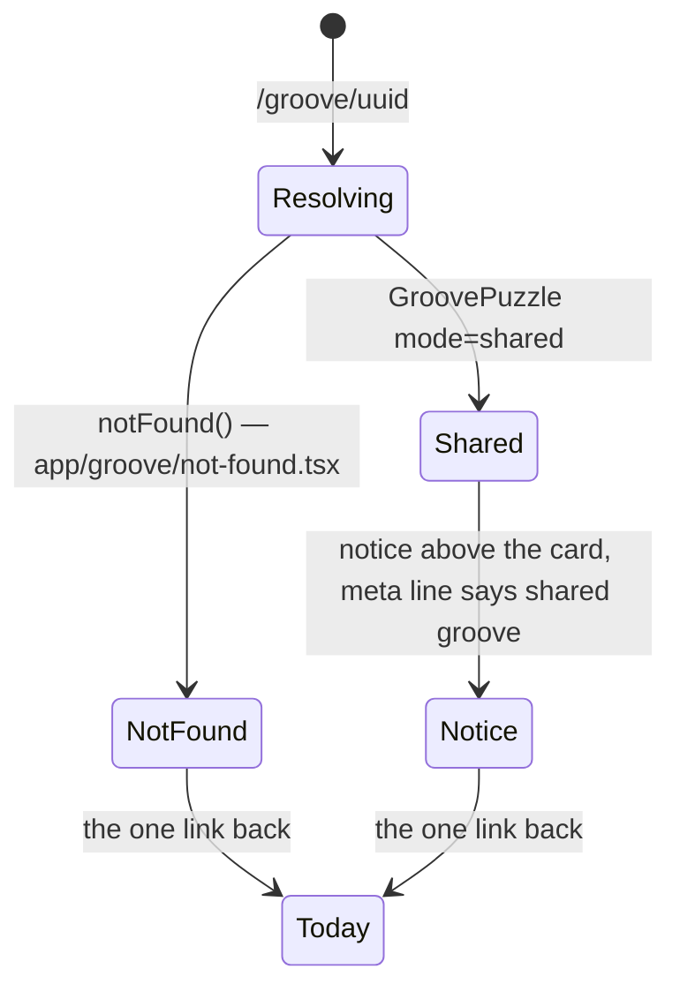

# Tech spec — Epic 3: A shared groove says what it is

PRD: [../prd/epic-3-a-shared-groove-says-what-it-is.md](../prd/epic-3-a-shared-groove-says-what-it-is.md) ·
Roadmap: [../roadmap.md](../roadmap.md)

## Approach

Epic 1 left `/groove/<uuid>` rendering the same puzzle as `/` with
`mode="shared"`, and that prop is the only signal this epic needs. Three visible
changes follow from it: the groove card's meta line reads "shared groove" where
the date stands on `/`, a short notice above the card says the streak is safe
and carries the link back to today, and — once the shared groove is solved or
given up on — an invitation below the answer panel sends the player to today's
puzzle. The not-found UI is a
`not-found.tsx` inside the route's own folder, which Next renders for the
`notFound()` Epic 1 already throws — so the whole feature stays two folders to
delete. The header, the streak pill and the how-to-play box are deliberately
untouched: keeping them identical is the requirement, so the work is assertions,
not code.

## Architecture

`GrooveCard` currently composes its own meta line from `bpm` and
`dateLine(date)`. It stops deciding: the view hands it the finished string, so
the daily page passes `"96 bpm · Sunday 31 August"` and the shared page passes
`"96 bpm · shared groove"`. One card, no branch, and the difference between the
two pages is data.

The notice is a separate component above the card rather than a change inside
it, so nothing about the daily card moves. It renders only in shared mode and
holds both R2's reassurance and R5's link.

The end-of-play invitation is a second small component, rendered as a sibling
*after* `SolvedPanel` under the same `solved || revealed` condition the panel
already uses, and gated additionally on shared mode. It is not folded into
`SolvedPanel`: that component is the day's payoff and takes an `answer`, a
`streak` and a `revealed` flag — teaching it what a shared groove is would make
the one component both pages render the second place that knows.

The not-found file sits at `src/app/groove/not-found.tsx`. Next resolves it for
the `notFound()` thrown in `src/app/groove/[uuid]/page.tsx`, and being inside
the same folder it is deleted with the route — the removability standard in
`docs/architecture.md` still reads "delete the folder and the route folder". It
composes `PageShell`/`Container` and the design system only, exactly as
`src/app/page.tsx` does, and imports nothing from the feature at all: it has no
puzzle, no audio and no groove to know about.



## Contracts

```ts
// src/features/daily-groove/components/puzzle/GrooveCard.tsx
type GrooveCardProps = {
  groove: Groove
  /** The finished meta line, e.g. "96 bpm · Sunday 31 August". */
  meta: string
  children?: ReactNode
}
```

```ts
// src/features/daily-groove/lib/presentation/date.ts
export function metaLine(groove: Groove, date: Date | null): string
// date → "96 bpm · Sunday 31 August"; null → "96 bpm · shared groove"
```

```ts
// src/features/daily-groove/components/puzzle/SharedGrooveNotice.tsx
type SharedGrooveNoticeProps = { homeHref?: string }   // defaults to '/'
```

```ts
// src/features/daily-groove/components/puzzle/PlayTodayLink.tsx
type PlayTodayLinkProps = { homeHref?: string }        // defaults to '/'
```

Consumed from Epic 1, unchanged: `GroovePuzzle`'s `mode` prop, and the
`notFound()` thrown by `src/app/groove/[uuid]/page.tsx`.

## Tracks

### Track A — the framing on the page

- **Goal** — a shared page says what it is, says the streak is safe, offers the
  way back, and invites the player to today's groove once the shared one is
  played out; the daily page is pixel-identical to before.
- **Owns** — `lib/presentation/date.ts` and its test,
  `components/puzzle/GrooveCard.tsx` and its test,
  `components/puzzle/SharedGrooveNotice.tsx` and its test,
  `components/puzzle/PlayTodayLink.tsx` and its test,
  `components/GroovePuzzle.tsx` and its test
- **Depends on** — Epic 1's `mode` prop
- **Parallel with** — Track B
- **Done when** — its own tests pass in both modes.

#### Step A6 — A finished shared groove points at today's

Covers: R5a, R5b, R5c, R7, AC5, AC14, AC15, AC16

- **Test first** — `components/puzzle/PlayTodayLink.test.tsx`: assert it renders
  exactly one link, that its href is `/`, and that its text invites the player to
  play today's groove. Then in `components/GroovePuzzle.test.tsx`: with
  `mode="shared"`, assert no invitation is present while the puzzle is in play;
  solve it and assert the invitation appears after the `SolvedPanel`; in a second
  render, give the groove up instead and assert the same invitation appears with
  the same wording; and with `mode="daily"`, assert that neither a solve nor a
  reveal produces one. Run it: fails with "Cannot find module './PlayTodayLink'".
- **Implement** — `PlayTodayLink.tsx`: a `Text` line and a `next/link` to `/`,
  in the app's existing voice. `GroovePuzzle.tsx`: render
  `{shared && (solved || revealed) && <PlayTodayLink />}` immediately after the
  existing `{(solved || revealed) && <SolvedPanel … />}` block, reusing that
  condition rather than deriving a second one. `SolvedPanel` is not touched.
- **Green when** — all six assertions pass, and the daily-mode solve and reveal
  tests from earlier features stay green.
- **Refactor** — none. `SharedGrooveNotice` and `PlayTodayLink` both link to `/`
  and both stay separate: one frames the page, the other closes it, and they are
  never on screen for the same reason.

### Track B — the not-found page

- **Goal** — an unknown, retired or malformed uuid renders a calm page with the
  way back, and no puzzle.
- **Owns** — `src/app/groove/not-found.tsx` and its test,
  `src/app/route-boundary.test.ts`
- **Depends on** — Epic 1's `notFound()` call
- **Parallel with** — Track A
- **Done when** — its own tests pass.

## Execution waves

- **Wave 1 (parallel):** Track A, Track B
- **Wave 2:** Integration

## Implementation

### Track A — the framing on the page

#### Step A1 — The meta line is computed, not decided by the card

Covers: R1a, R4, AC11

- **Test first** — `src/features/daily-groove/lib/presentation/date.test.ts`:
  assert `metaLine(groove, new Date(2026, 7, 31))` is
  `"96 bpm · Sunday 31 August"` — the string `dateLine` already produces — and
  that `metaLine(groove, null)` is `"96 bpm · shared groove"`. Run it: fails
  with "metaLine is not a function".
- **Implement** — `date.ts`: `metaLine(groove, date)` returning
  `` `${groove.bpm} bpm · ${date ? dateLine(date) : 'shared groove'}` ``.
  `dateLine` is unchanged.
- **Green when** — both assertions pass.
- **Refactor** — none.

#### Step A2 — The card renders the line it is given

Covers: R1a, R4, AC11

- **Test first** — `components/puzzle/GrooveCard.test.tsx`: relocate the
  existing meta-line assertions to pass `meta` and assert the card renders that
  exact string; assert the heading is still the groove's name and its level is
  unchanged; assert the card branches on nothing. Run it: fails with
  "Property 'date' is missing" until the prop is swapped.
- **Implement** — `GrooveCard.tsx`: replace `date: Date` with `meta: string` and
  render `{meta}` in the caption node. The `dateLine` import goes.
- **Green when** — the relocated assertions pass with the same subject they had
  before — the rendered line — not a new one.
- **Refactor** — none.

#### Step A3 — A shared page says the streak is safe, and offers the way back

Covers: R1, R2, R3, R5, R6, R7, AC1, AC2, AC4, AC5

- **Test first** — `components/puzzle/SharedGrooveNotice.test.tsx`: assert it
  names this a shared groove rather than today's puzzle; that it says playing it
  leaves the streak and the day alone; that it renders exactly one link, whose
  href is `/`, and whose text invites the player to today's puzzle. Run it:
  fails with "Cannot find module './SharedGrooveNotice'".
- **Implement** — `SharedGrooveNotice.tsx`: a `Card tone="inset"` with a `Text`
  line and a `next/link` back to `/`. Copy in the app's existing voice, no
  banner and no modal.
- **Green when** — all four assertions pass.
- **Refactor** — none.

#### Step A4 — The two modes differ in exactly these two things

Covers: R1, R1a, R3, R4, R5, R7, R7a, R7b, R13, R14, AC1, AC3, AC4, AC5, AC12, AC13, AC15

- **Test first** — `components/GroovePuzzle.test.tsx`: with `mode="shared"`,
  assert the notice renders above the groove card and before any press; assert
  the meta line reads "shared groove" and shows no date; assert every link
  leading away from the page points at `/`, and that while the puzzle is still
  in play there is exactly one; assert the header renders with
  the streak pill and its value, as on `/`; assert the how-to-play box follows
  the same new-or-lapsed rule in both modes; and assert the puzzle region — the
  root row, the mode row, the check control, the transport — has the same
  structure in both modes. With `mode="daily"`, assert the notice is absent and
  the meta line still carries today's date. Run it: fails — the notice does not
  render and the meta line is unchanged.
- **Implement** — `GroovePuzzle.tsx`: in `GroovePuzzleView`, derive
  `const shared = mode === 'shared'`; render `{shared && <SharedGrooveNotice />}`
  directly above the two-column `Row`; and pass
  `meta={metaLine(groove, shared ? null : today)}` to `GrooveCard`. Nothing else
  in the view changes — the header, the help box and the cards keep their
  current props.
- **Green when** — every assertion passes in both modes and the daily-mode tests
  from earlier epics stay green.
- **Refactor** — none.

#### Step A5 — Today's groove, shared, is still shared

Covers: R13, R14, AC10

- **Test first** — `components/GroovePuzzle.test.tsx`: render with
  `mode="shared"` and the groove that `selectGrooveForDate` returns for the test
  clock, play it to solved, and assert the notice is still present, the meta
  line still reads "shared groove", the injected store's `save` was never
  called, and the link back to `/` is present. Run it: fails only if the view
  branches on whether the groove is today's — it must not.
- **Implement** — nothing. The step exists to prove the absence of a special
  case; if it passes without code, that is the result.
- **Green when** — all four assertions pass with no change to the view.
- **Refactor** — none.

### Track B — the not-found page

#### Step B1 — A missing groove says so, calmly

Covers: R8, R9, R10, R12, AC6, AC7, AC9

- **Test first** — `src/app/groove/not-found.test.tsx`: render the default
  export and assert it says the groove could not be found; that it renders
  exactly one link and its href is `/`; that it contains no heading, control or
  text belonging to the puzzle — no play control, no root chips, no attempt
  dots, no answer; and that it renders no `audio` element. Run it: fails with
  "Cannot find module './not-found'".
- **Implement** — `src/app/groove/not-found.tsx`: composition only —
  `PageShell` → `Container` → `main`, a `Heading`, one `Text` line, and a
  `next/link` to `/`. It imports nothing from `src/features`.
- **Green when** — all four assertions pass.
- **Refactor** — none.

#### Step B2 — The not-found page respects the route boundary

Covers: R12, AC8

- **Test first** — `src/app/route-boundary.test.ts`: add
  `src/app/groove/not-found.tsx` and `src/app/groove/not-found.test.tsx` to
  `ROUTE_FILES`. Run it: fails if either names a feature specifier or mocks one.
- **Implement** — whatever the failure names; the page should need no feature
  import at all.
- **Green when** — both boundary assertions pass over the two new files.
- **Refactor** — none.

## Integration and verification

- **Step I1 — the demo path.** `npm run dev`; open `/groove/<uuid>` for a groove
  that is not today's: the notice sits above the card, the card reads
  "… bpm · shared groove", the header shows the real streak, and the link back
  to today works with the day intact. Play it to solved and confirm the invitation to today's groove
  appears below the answer and lands on `/`, still unplayed. Give a second
  shared groove up and confirm the same invitation appears.
- **Step I2 — the dead link.** Open `/groove/not-a-real-uuid` and
  `/groove/9f1c2e40-7b3a-4c15-9d8e-2a6b41f0c7de` (well-formed, unused): both
  render the not-found page with the way back, and the response status is 404.
- **Step I3 — the first arrival.** With site data cleared, open a shared link
  and confirm the how-to-play box appears; dismiss it, reload `/`, and confirm
  the daily page behaves as it always has.
- **Step I4 — the whole suite.** `npm test`, `npx tsc --noEmit`,
  `npm run lint`, `npm run build` all green.

## Requirement coverage

| Requirement | Steps |
| :-- | :-- |
| R1 | A3, A4 |
| R1a | A1, A2, A4 |
| R2 | A3 |
| R3 | A4 |
| R4 | A1, A2, A4 |
| R5 | A3, A4 |
| R5a | A6 |
| R5b | A6 |
| R5c | A6 |
| R6 | A3, I1 |
| R7 | A3, A4, A6 |
| R7a | A4 |
| R7b | A4, I3 |
| R8 | B1 |
| R9 | B1, I2 |
| R10 | B1 |
| R11 | I2 (Epic 1 Step D2 throws it) |
| R12 | B1, B2 |
| R13 | A4, A5 |
| R14 | A4, A5 |
| AC1 | A3, A4 |
| AC2 | A3 |
| AC3 | A4 |
| AC4 | A3, A4 |
| AC5 | A3, A4, A6 |
| AC6 | B1 |
| AC7 | B1, I2 |
| AC8 | B2, I2 |
| AC9 | B1 |
| AC10 | A5 |
| AC11 | A1, A2, A4 |
| AC12 | A4 |
| AC13 | A4 |
| AC14 | A6 |
| AC15 | A4, A6 |
| AC16 | A6 |

## Assumptions

- The notice sits directly above the two-column row, so it precedes the game it
  frames and never covers it — the same placement `HowToPlay` uses.
- The words in the meta line are "shared groove", lowercase, matching the
  sentence case of the tempo beside them.
- The way back is a `next/link`, not a button: it is navigation, not an action.
- Epic 2's share control, if it has landed, remains in the header on a shared
  page. It is an action, not navigation, so R7's rule about where links point
  does not concern it.
- The invitation renders below `SolvedPanel` rather than inside it, and stays
  for the rest of the session exactly as the panel does.

## Decision log

Settled architectural decisions. The sections above are the source of truth —
this records how they got there, and what each one cost. Append-only.

### Cycle 1 — 2026-08-31

**Q1. Where does the not-found UI live?**
Decision: **A) `src/app/groove/not-found.tsx`, composed from the design system
only** — Next resolves it for the segment by convention, it is deleted with the
route folder, and it needs nothing the feature owns.
Changed: nothing. Track B's steps B1 and B2 build exactly this, and the route
boundary test covers it.

**Q2. How does `GrooveCard` get its meta line?**
Decision: **A) The view computes the finished string and the card renders it** —
the card stops branching, the two pages differ in data rather than in logic, and
`metaLine` gets its own test as a plain function.
Changed: nothing. The `GrooveCardProps` contract already takes `meta: string`,
and steps A1, A2 and A4 build it that way. Step A2 stays the one place with test
churn: the existing meta-line assertions are relocated, keeping the rendered line
as their subject.
