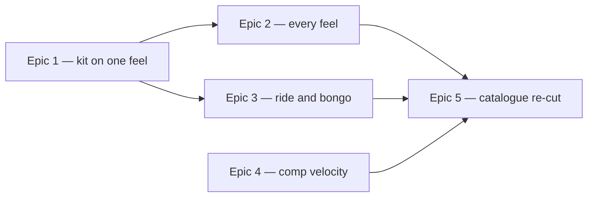

# Roadmap — Drum kit rewrite

Source: [briefing.md](briefing.md)

## Overview

The pack calls its lowest voice `kick` and plays a **cajon** into it. Everything
around that cajon is a VCSL drum kit — snare, hats, rim, two toms — so the
grooves are a kit with a hand drum where the bass drum should be, and a mix
levelled around that compromise. This feature swaps in a coherent CC0 kit, gives
it the ride cymbal it has never had, adds a bongo where a feel wants one,
re-levels every voice, rewrites the six templates onto the new set, and re-cuts
all thirty grooves. Separately and in parallel, the
comp — a sampled upright piano, the voice the briefing calls the rhodes — gets a
velocity curve, because its dynamics are currently a pure function of metric
position and it plays every chord the same way forever.

Value arrives kit-first: Epic 1 makes one feel audible on the new samples, which
is the earliest point at which anyone can say whether the kit was the right pick.
Epics 2 and 3 spread it across the other five feels and give the two new voices
parts of their own.
Epic 5 is the moment the app itself changes — until the catalogue is re-cut, the
browser still plays the committed cajon MP3s.

The five open questions are answered and folded in: the pack stays **CC0 only**,
the kit gains a **ride** on top of its seven voices, the bongo is **two voices**
(`bongoHigh` and `bongoLow`), the thirty grooves **keep their ids and uuids**,
and the comp **stays the upright piano** it is — only its evenness changes.

**The harmony does not move.** Every regenerated groove keeps its id, its uuid,
its bpm, its root, its flavour, its chord and its progression. The manifest's
harmonic fields are asserted byte-identical against the current ones; only the
audio changes.

## Implementation findings — 2026-09-01

Three of this roadmap's settled decisions did not survive contact with the
libraries, and were re-decided during implementation. Recorded here because the
epics below still read as they were planned.

- **The kit is not VCSL's.** VCSL is an orchestral library: its bass drums are
  concert bass drums that decay for over three seconds, its snare is a concert
  snare, and it has **no ride cymbal at all**. The cajon was not a whim — it was
  the closest thing VCSL had to a kick. The kit is now
  **MuldjordKit (FreePats edition)**, a close-miked Tama Superstar, 14 velocity
  bands x 4-5 round-robins on kick, snare and both hats.
- **The licence bar widened from CC0 to CC-BY.** No CC0 acoustic drum kit of the
  needed quality surfaced: DrumGizmo's four kits and Freepats' "Acoustic Drum
  Kit" (which *is* MuldjordKit) are all CC-BY 4.0. This is the outcome the
  Assumptions section below anticipated and asked to be reported rather than
  quietly widened. It carries an obligation CC0 did not — see below.
- **The ride is not in the feature.** It entered via this roadmap's Q2 and the
  briefing never asked for it. Dropped when VCSL turned out to have none,
  restored on MuldjordKit's, then removed for good after listening: MuldjordKit
  is a rock kit and its ride reads that way, where a *swing jazz* ride was
  wanted. That is a different cymbal from a library chosen for it, so it is
  recorded as a candidate feature rather than left half-built. `hatClosed` keeps
  the time on all six feels. Epic 3's bongo half stands.

**New obligation.** CC-BY 4.0 requires attribution in the medium, and
MuldjordKit names the text: *"Drum samples provided by DrumGizmo.org"*. A
rendered groove is a derivative work of the samples, so the obligation follows
the committed MP3s and the app that plays them. `provenance.json`,
`samples/README.md` and `LICENSE-MuldjordKit.txt` carry it on the generator side;
**a user-visible credit in the app is outstanding** and is not in any epic's
scope, since Epic 1 puts `src/` out of scope and Epic 5 asserts `src/` changes in
exactly one file.

## Epics

### Epic 1 — A real kit, on one feel

**Visible when done:** render `groove-01` and hear a bass drum instead of a
cajon — a kit that sounds like one room, with no voice jumping out of the
balance. `npm run grooves -- groove-01` produces it and the quality gate passes.
**Depends on:** none
**Parallel with:** Epic 4

**Scope**

- **Acquire the kit, the ride and the bongo in one pass.** All of it goes in
  here, so the pack is written once. **CC0 only** — the samples are committed to
  a public repo, and the current pack's guarantee is that redistributing them
  carries no attribution obligation and nothing to track. That rules out CC-BY
  and CC-BY-SA kits however good they sound, and it is the first filter to apply
  when shortlisting a library. The source library, its path per file and its
  licence text are recorded the way the current pack already records them.
- **Ten voices, not seven.** The kit keeps `kick`, `snare`, `hatClosed`,
  `hatOpen`, `rim`, `tomHigh`, `tomLow` and gains `ride`, `bongoHigh` and
  `bongoLow`. The ride closes a real gap — a backing-track kit that can only
  keep time on a hi-hat has one way of stating a pulse — and the bongo is two
  drums because that is what a bongo is: a single voice would be a hand drum,
  and the interplay between the high and the low is the sound.
- **Prepare the samples with the pack's existing recipe.** Mono downmix, capped
  per voice at that voice's decay, 80 ms fade at the cap, 44.1 kHz 16-bit FLAC,
  no front trim — the invocation is written out in
  `scripts/grooves/samples/README.md` and is the shape to copy. **Not
  normalised**: the level difference between velocity layers is the data.
- **Declare the pack.** `pack.json` gains the new voices as velocity layers with
  round-robin alternates. Where a layer's recorded level does not sit at its
  band's midpoint, declare `nominalVelocity` explicitly — that field exists for
  exactly this, and `gainFor` in `voices.ts` divides by it.
- **This is the levelling method, and it is written down.** Measure each
  prepared voice at a fixed velocity, pick a reference voice, and record the
  offsets. Levelling has two halves that must not be confused: the sample's own
  recorded loudness (pack, per layer) and the mix position (template `gain`, in
  dBFS). The method decides which half absorbs what, and Epic 2 applies it to
  five more templates without re-deriving it.
- **Rewrite `straight-funk.ts` onto the new kit** — its `voices`, `gain` and
  `pan` re-derived rather than carried over. Its `flavours`, `tempoRange`,
  `subdivision`, `swing` and `passes` are untouched.
- **Freeze the voice contract for the whole feature.** `VoiceName` in
  `types.ts` and the `voices` keys of `pack.json` reach their final shape here —
  all ten — so Epics 2 and 3 can build against them in parallel.
- **Licence and provenance.** `provenance.json` gains a row per file;
  `README.md`'s source table and voice-mapping table are rewritten; the licence
  text of any library that leaves the pack is removed and any new one added.

**Out of scope**

- The other five templates — Epic 2.
- What the ride and the bongo actually play — Epic 3. Epic 1 only stocks and
  declares them.
- The comp's velocity curve — Epic 4.
- Re-cutting the catalogue, the lock and the reference notes — Epic 5. Nothing
  the browser serves changes in this epic.

**Validation**

- `npm run grooves -- groove-01` renders and passes `gateCandidate` — peak,
  silence, seam, harmony, pitch and density.
- `scripts/grooves/pack.test.ts` and `samples/pack.test.ts` cover the new
  declaration: every declared file exists, every layer band is ordered and
  covers 0..1, every pitched note's sounding pitch is **measured, not read off
  its filename** (the pack's oldest rule — see the ⚠ section in the samples
  README).
- `templates/index.test.ts` still passes: the six flavour pairs stay disjoint
  and their union is still the twelve flavours.
- A listening sign-off on one rendered groove. The levelling has no test that
  can replace an ear; what the tests hold is that no voice clips and none is
  inaudible.

### Epic 2 — Every feel on the new kit

**Visible when done:** all six feels play the new kit, and moving between them
is a change of groove rather than a change of volume — no template is
noticeably louder than the others.
**Depends on:** Epic 1 (the pack, the frozen voice contract, the levelling
method)
**Parallel with:** Epic 3

**Scope**

- **Rewrite the five remaining templates** — `shuffle`, `bright-straight`,
  `half-time`, `open-ballad`, `swung-sixteenth` — applying Epic 1's method to
  each: `voices`, `gain`, `pan`, and `humanize.lean` where the new kit's
  attacks sit differently against the grid than the cajon's did.
- **Each template keeps its identity.** `flavours`, `tempoRange`,
  `subdivision`, `swing`, `passes` and `density` are not the subject of this
  feature. `open-ballad`'s deliberate inversion — the comp above the snare,
  because on a slow feel the third of the chord is the question being asked —
  survives the re-levelling rather than being flattened by it.
- **Decide per feel whether the ride and the bongo are in**, by listing them in
  that template's `voices`. This epic owns those calls and only those calls; the
  parts they play are Epic 3's. Neither is a default — a ride on all six feels
  and a bongo on all six are both failure modes.
- **Level across templates, not just within them.** A cross-template loudness
  check, so the catalogue does not step in volume from groove to groove. Where
  it lives — a gate check or a reported measurement — is a tech-spec call.
- **Drum patterns and placements** in `events.ts` that assume the cajon's
  envelope get revisited, but the pattern *pools* are shared across templates,
  so a change there is a change to every feel and belongs to whoever writes it
  down here.

**Out of scope**

- The ride's and the bongo's patterns — Epic 3.
- Regenerating anything — Epic 5.

**Validation**

- One groove per template renders and passes the gate; each stays inside its own
  declared `density` band.
- `templates/index.test.ts` — the flavour pairing invariant, unchanged.
- Cross-template loudness measured across one groove per feel and inside an
  agreed band.
- Listening sign-off across all six.

### Epic 3 — The ride and the bongo get parts

**Visible when done:** on the feels that want them, a ride is keeping time
instead of a hat, and a bongo is playing a part — neither one a tom in a
different costume, and neither on every beat of every feel.
**Depends on:** Epic 1 (both voices are stocked and their names frozen there)
**Parallel with:** Epic 2

One epic rather than two, because both voices are new arrivals needing patterns
in the same pools in `events.ts`. Splitting them would put two epics into that
file at once and buy no parallelism.

**Scope**

- **The ride's patterns, and its relationship to the hats.** A ride does not
  join a closed hat, it replaces it: two voices both marking every eighth is a
  busier bar, not a different feel. A feel that takes the ride hands it the
  timekeeping `hatClosed` was doing, and the hat drops to punctuation or drops
  out. Whether that is a rule in `events.ts` or a per-template choice is a
  tech-spec call; what is not open is the two of them holding the same time
  together.
- **The bongo's patterns** — its own pool, its own accent shape, its own entry
  in `VELOCITIES`, and the high and low drums played against each other rather
  than as one voice struck twice. A hand drum is not struck like a tom, and
  reading its dynamics off `velocityFor`'s metric shape alone would give it the
  flat, machine-like part that `HAT_ACCENTS` exists to keep the hats out of.
- **Where they sit against the kit** — pan and gain defaults, and how each
  behaves when the fill arrives. A ride rides through a fill; a bongo usually
  gets out of its way.
- **Validated on `straight-funk`**, which Epic 1 already rewrote, so this epic
  does not wait on Epic 2 and does not write to the five template files Epic 2
  owns.
- **"Where it makes sense" is a judgement, and it is allowed to come out as
  "on two of the six".**

**Out of scope**

- Which templates include them — Epic 2 makes that call by listing the voices.
- A crash, congas, shaker, tambourine, or any other voice the answers didn't add.

**Validation**

- A straight-funk render with each new voice in the template's list places its
  events; one with it absent places none, and every other voice is bit-identical
  between the two.
- A feel carrying the ride does not also have a closed hat marking the same
  subdivision — asserted on the rendered events, not left to the ear.
- Density stays inside the template's band with the new voices added. A new
  voice is the easiest way to push a groove into mush, and this epic adds three.
- Listening sign-off.

### Epic 4 — The comp stops being perfect

**Visible when done:** play any groove and the chords no longer land at the same
three velocities forever — the comp breathes across a bar and across a pass,
while still being the same upright-piano sound it is today.
**Depends on:** none
**Parallel with:** Epic 1

**Scope**

- **A velocity curve for the comp.** Today its dynamics are
  `accentedVelocity('comp', …)` — a pure function of metric position — times a
  fixed per-voice drop across the voicing, plus the template's ±9 % humanize
  noise. Every chord at a given step class is therefore the same velocity in
  every bar of every pass. The fix is the shape `HAT_ACCENTS` already applies to
  the hats: a cycle over the comp's own hits rather than over the grid, because
  indexing by step would re-partition the bar exactly as `velocityFor` already
  does and change nothing.
- **The instrument does not change.** The briefing is explicit — the sound is
  good, its evenness is the problem. No new comp samples, no new pack entry.
- **Check whether three dynamic layers can carry it.** The comp declares three
  velocity layers with a single alternate each, so a wider velocity spread may
  only be selecting between three recordings more often. If the curve outruns
  the samples, say so — adding layers or alternates is a pack change and would
  move into Epic 1's territory rather than being smuggled in here.
- **The twelve reference notes are the same voice.** `notes.ts` renders each
  root as a single `comp` event at a fixed velocity, so anything done to the
  comp's velocity response is heard when a player taps a root chip. Whatever
  changes here must leave that tap sounding like a clean, even reference note —
  it is an answer, not a performance.

**Out of scope**

- The bass, which is a separate pitched voice with its own layers.
- Swapping the comp for an actual Rhodes. The briefing calls it the rhodes and
  it is a VSCO 2 upright piano; the instrument stays exactly as it is.

**Validation**

- Rendered comp events across a multi-pass groove show a spread of velocities
  rather than the current three values; two passes of the same figure differ.
- The reference-note render is unchanged, or changed deliberately and asserted.
- `gateCandidate`'s peak and density checks still pass — a wider velocity range
  reaches for `MAX_LAYER_GAIN` more often.
- Listening sign-off: this is the one criterion that actually decides it.

### Epic 5 — The catalogue is re-cut

**Visible when done:** open the app and the day's groove is the new kit. All
thirty grooves and all twelve reference notes are re-rendered, the lock agrees
with them, and `npm run build` passes its `grooves:verify` prebuild step on a
machine with no ffmpeg and no samples.
**Depends on:** Epics 2, 3 and 4 — everything that changes what a render sounds
like has to land before the render that ships
**Parallel with:** none

**Scope**

- **Re-render all thirty grooves** with `npm run grooves` and all twelve
  reference notes with `npm run notes`. The notes are not optional collateral:
  the lock records `packSha256`, so a new pack invalidates every artifact
  rendered from the old one.
- **Rewrite `grooves.lock.json`** — `catalogueSha256`, `manifestSha256`, the
  thirty groove hashes, the twelve note hashes, `notesManifestSha256` and
  `packSha256`.
- **Assert the harmony did not move.** Diff the new manifest against the current
  one and require that `root`, `flavour`, `scale`, `chord`, `progression`, `bpm`,
  `bars` and `loopBars` are identical for all thirty. This is the briefing's
  load-bearing constraint and it deserves a test, not a spot check.
- **Ids and uuids are preserved**, so feature-12's share links keep resolving to
  the same puzzle. A link shared before the re-cut opens the same groove with the
  same answer, played by a different band — which is what keeping the harmony
  fixed buys.
- **The `grooves:verify` guard must still not render.** `lock.test.ts` asserts
  by reading the source that `lock.ts` imports nothing that renders, against an
  explicit allowlist. Nothing here may add to it.

**Out of scope**

- Any change to `src/` — the app reads the manifest and plays the files, and
  neither shape changes.

**Validation**

- `npm test`, `npm run lint`, `npm run build` — the build exercises
  `grooves:verify` through `prebuild`.
- `verifyLock` clean against the freshly committed artifacts.
- The harmony diff above, as a test.
- Play the app: today's groove, a shared link from feature-12, and a root chip.

## Dependency map

## Execution waves

- **Wave 1 (parallel):** Epic 1, Epic 4 — disjoint files. Epic 1 owns
  `samples/`, `pack.json`, `types.ts` and `straight-funk.ts`; Epic 4 owns the
  comp's velocity path in `events.ts`.
- **Wave 2 (parallel):** Epic 2, Epic 3 — both need Epic 1's pack and frozen
  voice contract, and they are kept apart by file: Epic 2 writes the five
  remaining template files, Epic 3 writes the new voices' patterns in
  `events.ts`.
- **Wave 3:** Epic 5 — the only epic that touches committed audio, and it runs
  once, at the end.

## Assumptions

- **"The rhodes" is the `comp` voice**, sampled from VSCO 2 CE's **upright
  piano** — feature-9 put it there in place of the FM clavisynth. The briefing's
  name for it and the repo's do not match; the instrument stays, confirmed, and
  only its evenness is in scope.
- **"Harmonically exactly the same" means the manifest's harmonic fields are
  byte-identical**, and that the theory layer, the voicing and bass-line logic
  and each template's `flavours`, `tempoRange`, `subdivision`, `swing` and
  `passes` are out of bounds. Drum patterns, voices, gain, pan and humanize are
  in bounds — those are the rewrite.
- **The samples stay committed to the repo**, prepared with the existing ffmpeg
  recipe and not normalised.
- **The reference notes are re-rendered** as a consequence of the pack change,
  not as a separate decision.
- **No `src/` change.** This is a generator-and-assets feature.
- **The catalogue stays at thirty grooves** across the same six templates. Epic
  5 re-cuts what is there; it does not mint more.
- **A ride and a closed hat never hold the same subdivision.** This follows from
  the ride being added at all rather than from anything the briefing said, and it
  is the one musical rule Epic 3 is asked to enforce rather than merely play. If
  it turns out wrong on a particular feel, that feel drops the ride — it does not
  get both.
- **A CC0 kit exists that is good enough.** The licence bar is narrow: it
  constrains the shortlist to libraries in VCSL's and VSCO
  2 CE's class. If nothing CC0 clears the listening bar, that is a finding for
  Epic 1 to report rather than a licence to quietly widen the bar.
