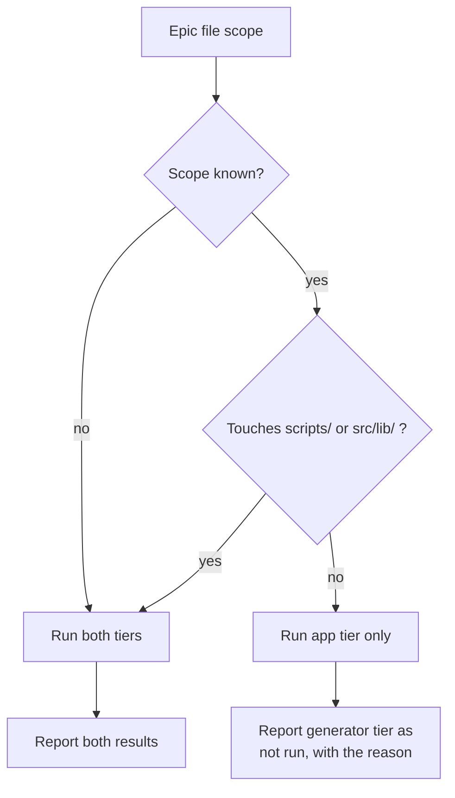

# PRD — Epic 1: The gate comes back in seconds

Feature: [briefing.md](../briefing.md) · [roadmap.md](../roadmap.md)

## Summary

Split the test suite into two tiers so an app-only change stops paying for the
groove generator's audio rendering, and teach the two skills that run tests to
pick the tier from what the epic actually touches. `npm test` goes from 78
seconds to about 13. Nothing is dropped — the generator tier is one command
away and runs automatically whenever the change could break it.

## Problem

`npm test` runs 2238 cases across 119 files in 78 seconds. The `generator`
project is 37 of those files and about 64 of those seconds; nine of its files
decode the committed FLAC pack and render audio, holding 324 cases and 218s of
the tier's 229s of summed file time. The `app` project — the half a feature
slice can break — is 82 files, 1469 cases, 13.5 seconds.

`/verify-epic` runs the whole suite, and `/implement-feature` §9 loops it until
clean, per epic. Features 10, 11 and 12 were app work and each paid the
generator bill on every gate, ten-plus times over, for code they never touched.
The cost is already being paid around rather than fixed: `vitest.config.ts`
carries an uncommitted `testTimeout: 30_000` because three render cases blew the
5s default at 5005–5045ms under core contention and passed in isolation.

## Scope

- two tiers as `package.json` scripts, split along the vitest projects that
  already exist
- tier selection in `/verify-epic` and in `/implement-feature`'s wave gate,
  driven by the epic's file scope
- removal of the `testTimeout` override

**Out of scope**
- a third tier separating fast generator logic from audio rendering. The 28
  non-render generator files hold 445 cases and 11.1s and could have stayed on
  the default gate for ~3s; decided against in favour of one line at the project
  boundary
- making the audio-render tests faster, or giving them a fixture pack instead of
  the committed one. They are slow because they do real work on real samples
- the jsdom-to-node environment split for the ~28 pure `.test.ts` files under
  `src/` — roughly 18s of CPU but only 2–3s of wall clock
- CI. No pipeline exists; that is its own candidate feature
- splitting `GroovePuzzle.test.tsx`, which is Epic 2's job and the largest single
  file in the app tier

## Requirements

- **R1** — `npm test` runs the fast tiers: every `*.{test,spec}.{ts,tsx}` under
  `src/`, plus the repo tooling's own tests at the root of `scripts/`. It
  completes in under 20 seconds on a developer machine.

  *Amended during implementation.* This first read "the app tier alone: every
  `*.{test,spec}.{ts,tsx}` under `src/`", written before the tier rule was
  extracted into a tested module. That module's tests live at `scripts/` root
  and belong on the default gate — they are milliseconds, and a tier rule nobody
  runs is worse than none. The implementation is three vitest *projects* serving
  two *tiers* of cost; "tier" here means cost, not project.
- **R2** — A separate named script runs the generator tier alone: every
  `*.{test,spec}.ts` under `scripts/`.
- **R3** — A third named script runs both tiers in one command.
- **R4** — The two tiers together run exactly the cases the single suite runs
  today. No test is excluded from every tier, and no test appears in both.
- **R5** — `/verify-epic` selects which tiers to run from the epic's file scope
  rather than always running everything. That scope comes from the tech spec's
  file-ownership lists, which `/verify-epic` §2 already treats as authoritative.
- **R6** — **The app tier runs alone only when every file in the epic's scope is
  under `src/` and none is under `src/lib/`. In every other case both tiers
  run.** That single rule covers the three cases below; it is stated positively
  because the narrow condition is the exception, not the default.
- **R6a** — `src/lib/` forces the generator tier because it is a leaf both halves
  of the system import: `scripts/grooves/rng.ts` imports `hashString` from
  `src/lib/hash.ts` by relative path, and `cli.ts`, `manifest.ts`, `notes.ts`,
  `pools.ts` and `types.ts` all import `src/lib/groove.ts`. A change there can
  leave the app tier green and the generator broken.
- **R6b** — An epic touching neither `src/` nor `scripts/` — a skills-only or
  docs-only epic, as this feature's own Epic 3 is — runs both tiers. A non-code
  epic is where scope reasoning is weakest, so it takes the safe default rather
  than a cheap smoke test.
- **R7** — When an epic has no tech spec, or its file scope cannot otherwise be
  determined, both tiers run. Guessing wrong in the direction of running less is
  a silent miss; guessing wrong in the direction of running more costs a minute.
- **R7a** — After the last epic of a feature passes its QA gate,
  `/implement-feature` runs the combined tier once. Per-epic selection means no
  moment in the run has executed the whole suite together; this restores that
  guarantee for one 78-second run per feature. A failure here is a feature-level
  failure and blocks ✅ Done.
- **R8** — A tier that was not run is reported as **not run**, naming why it was
  not selected. It is never reported as passing, and never omitted from the
  report's Checks table.
- **R9** — `/implement-feature`'s wave gate (§8) applies the same tier selection,
  scoped to the units in the wave that just ran.
- **R10** — ~~The `testTimeout: 30_000` override is removed from
  `vitest.config.ts`. Both tiers pass at vitest's default timeout.~~
  **Withdrawn during implementation: the premise was false.** R10 assumed the
  override papered over contention *between the app and generator projects*, so
  that separating the tiers would make it unnecessary. Measurement disproves it —
  with the app project not running at all, **25 of the generator's 811 cases
  exceed 2.5s**, half the default, the worst at 13.3s, and six full runs across a
  day produced three `Test timed out in 5000ms` failures. Worker count is not the
  lever: unbounded, 6, 3 and 2 workers all time out, and 2 is worse than 4.
  **R10 is replaced by R10a.**
- **R10a** — The generator project keeps a `testTimeout`, and carries the
  explanation the original lacked: what was measured, why the tier is uniformly
  expensive, and that the honest way to remove it is a cheaper render rather
  than a bigger number. No other project may carry one — a timeout on `app` or
  `tooling` would mean a fast tier had grown something slow enough to need it,
  which is the drift this epic exists to prevent.
- **R11** — `prebuild`'s `grooves:verify` step is unchanged. It is what keeps the
  committed audio artifacts guarded once the render tests leave the default gate.
- **R12** — Running a tier with no matching files is not an error. A tier that
  matches nothing reports zero tests and exits zero, so a scope-driven selection
  never fails for having selected an empty set.

## Behaviour details

Tier selection is a property of the *epic*, not of the working tree. Two epics in
the same wave can select differently, and the union of their selections is what
the wave gate runs.

The `src/lib/` arm is the one a reader would not predict, and it is the one that
matters: a change there can leave the app tier green and the generator broken.
`src/lib/hash.ts`'s own docstring says editing it re-renders every groove *and*
reassigns every past date's puzzle — "editing this function is not a refactor,
it is a re-release."

## Acceptance criteria

- **AC1** (R1) — Given a clean tree, when `npm test` is run, then the `app` and
  `tooling` projects execute, the `generator` project does not, and the command
  finishes in under 20 seconds.
- **AC2** (R2) — Given a clean tree, when the generator script is run, then only
  tests under `scripts/` execute, and they pass.
- **AC3** (R3) — Given a clean tree, when the combined script is run, then the
  case total equals the app tier's total plus the generator tier's total.
- **AC4** (R4) — Given the tier definitions, when the two tiers' file lists are
  compared against the full set of test files in the repo, then every test file
  appears in exactly one tier.
- **AC5** (R6) — Given an epic whose scope is `src/features/**` only, when
  `/verify-epic` runs it, then the app tier runs and the generator tier does not.
- **AC6** (R6a) — Given an epic whose scope includes a file under `src/lib/`, when
  `/verify-epic` runs it, then the generator tier runs.
- **AC7** (R6a) — Given a deliberate breaking edit to `src/lib/hash.ts`, when the
  gate runs for an epic scoped to `src/lib/`, then the generator tier runs and
  fails. This is the arm that would otherwise be silent, so it is proved by
  breaking it.
- **AC7a** (R6b) — Given an epic whose scope is entirely outside `src/` and
  `scripts/`, when `/verify-epic` runs it, then both tiers run.
- **AC8** (R7) — Given an epic with no tech spec, when `/verify-epic` runs it,
  then both tiers run, and the report says the scope could not be resolved.
- **AC8a** (R5) — Given an epic whose tech spec lists file ownership per track,
  when `/verify-epic` establishes scope, then the scope is the union of those
  lists.
- **AC8b** (R7a) — Given a feature whose last epic has just passed its QA gate,
  when `/implement-feature` finishes, then the combined tier has been run once
  and its result is in the run report.
- **AC8c** (R7a) — Given a combined run that fails after every epic passed
  individually, when the run reports, then the feature is not marked ✅ Done.
- **AC9** (R8) — Given a run where the generator tier was not selected, when the
  QA report is written, then its Checks table lists the generator tier as **not
  run** with the reason, and no acceptance criterion is graded on it.
- **AC10** (R9) — Given a wave whose units all own files under `src/features/`,
  when the wave gate runs, then the generator tier does not run.
- **AC11** (R10a) — Given `vitest.config.ts`, when the project blocks are read,
  then exactly one — `generator` — sets `testTimeout`, and its setting carries
  the measurements justifying it. Asserted by `scripts/tiers.test.ts` —
  "confines any timeout override to the slow tier".
- **AC11a** (R10a) — Given the tiers, when each is run three times
  consecutively, then all three runs pass.
- **AC12** (R11) — Given a build, when `npm run build` runs, then
  `grooves:verify` runs first and the build fails if it fails.
- **AC13** (R12) — Given a tier selection that matches no test files, when that
  tier is run, then it exits zero and reports zero tests rather than erroring.

## Dependencies

**Needs:** nothing. This epic can start immediately, with one caveat — feature-13
was mid-implementation when this was written and edits
`scripts/grooves/pack.test.ts`, `events.test.ts`, `types.ts` and the sample pack.
Starting before that run lands means conflicts in the files being re-tiered.

**Hands to Epic 3, frozen on day one:** the three script names and what each
covers. Epic 3's four agent definitions name these commands, so the names are
fixed before its work starts and the tier contents can follow.

**Shares files with Epic 3:** `.claude/skills/implement-feature/SKILL.md` and
`.claude/skills/verify-epic/SKILL.md`. This is why Epic 3 is in wave 2.

## Assumptions

- The script names are `npm test` (app tier), `npm run test:gen` (generator
  tier) and `npm run test:all` (both). Named here so Epic 3 has something
  concrete to reference; a better name is a cheap change while this epic is the
  only consumer. `test:all` is what R7a runs at the end of a feature.
- The vitest project names `app` and `generator` stay as they are. The tiers are
  the projects, so `vitest run --project <name>` is the mechanism.
- "Under 20 seconds" in R1 is a headroom figure over today's measured 13.5s, not
  a budget that gets asserted in a test. No timing assertion is added — Q4 of the
  roadmap decided against automated decay guards.
- The measured baseline (78s / 2238 cases / 119 files) was taken on 2026-09-01
  against `d060792`. Feature-13 rewrites the sample pack the slow tests read, so
  the numbers should be re-taken before this epic's own before/after comparison.

## Question log

Answered questions, kept for traceability. The requirements above are the source
of truth. Append-only.

### Cycle 1 — 2026-09-01

**Q1. Where does `/verify-epic` get the epic's file scope from?**
Answer: **A) The tech spec's file-ownership lists**, falling back to both tiers
when there is no spec — the lists are explicit, written per track, and §2 already
treats them as authoritative.
Applied to: R5, R7, AC8, AC8a

**Q2. Does the feature get one full-suite pass before it is called Done?**
Answer: **A) Yes, once, after the last epic's QA gate** — one 78-second run per
feature restores the "everything green together" guarantee that per-epic
selection gives up.
Applied to: R7a, AC8b, AC8c, Assumptions

**Q3. What happens for an epic that touches neither `src/` nor `scripts/`?**
Answer: **B) Run both tiers** — a non-code epic is where scope reasoning is
weakest, so it takes R7's safe default rather than a cheap app-tier smoke test.
Applied to: R6, R6b, AC7a

Folding these together let R5–R7 be restated as one positive rule (R6) with its
three consequences beneath it, rather than three separate selection conditions.
