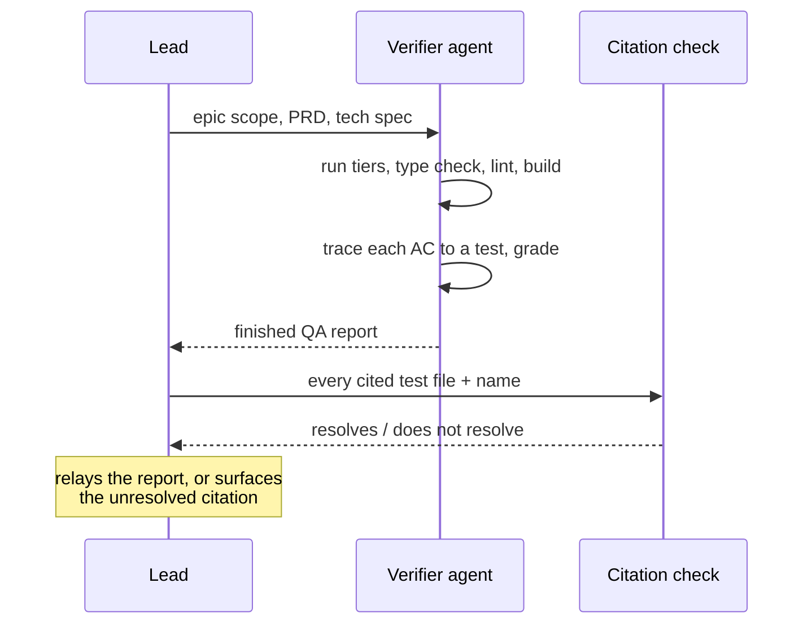

# PRD — Epic 3: Workers arrive knowing the rules

Feature: [briefing.md](../briefing.md) · [roadmap.md](../roadmap.md)

## Summary

Five agents carry the conventions their kind of work needs, so a dispatch stops
shipping a reading list. Four are engineering roles — test-writer, implementer,
architect and verifier. The fifth is a musician, which owns the decisions about
how a groove is generated. `/implement-feature` sends one agent per unit,
`/writespec` runs the architect, and `/verify-epic` hands the verifier a whole
epic and gets a finished QA report back. The wave arithmetic does not change.

## Problem

Every worker `/implement-feature` dispatches is told to read `AGENTS.md`,
`docs/architecture.md`, `docs/testing.md` and — reached through architecture.md
— `docs/coding-guidelines.md`. That is about 660 lines, of which
`coding-guidelines.md` alone is 527. Feature-12 dispatched seven workers across
four waves; each read the same 660 lines to orient itself, in parallel, before
writing anything. The cost is fixed per worker, paid per epic, every feature.

The generator is a second, unrelated version of the same problem. Musical
decisions are spread across `templates/*.ts` (tempo range, subdivision, swing,
which flavours suit a feel, per-voice humanize lean and drift), `voices.ts` (375
lines), `events.ts` (1295 lines), the four `theory/` modules, and the six checks
in `gate.ts`. A worker sent at a generator epic needs none of the React
placement rules and all of that instead — and features 3, 9 and 13 are almost
entirely this kind of work.

No agent definitions exist in this repo today — `.claude/` holds only `skills/`.

## Scope

- five agent definitions under `.claude/agents/`
- `/implement-feature` dispatching by role, and a shorter worker brief
- `/writespec` running the architect
- `/verify-epic` running the verifier, which grades as well as checks
- a mechanical check that a graded acceptance criterion cites a test that exists

**Out of scope**
- rewriting `docs/coding-guidelines.md`. It stays the single source of truth;
  this epic changes who has to read all of it, not what it says
- `/roadmap` and `/brainstorm` — conversational document-writing steps with no
  role among the four, run in the lead with the user answering in the loop
- `/create-feature` and `/create-feature-for-persona`, for the same reason
- changing how many workers a wave dispatches, or how waves are scheduled
- a shared rules document beside the definitions. The floor is repeated inside
  each definition instead
- teaching any agent to judge how a groove *sounds*. Nothing here can hear

## Requirements

- **R1** — Five agent definitions exist under `.claude/agents/`: test-writer,
  implementer, architect, verifier and musician.
- **R2** — Each definition carries the conventions its role needs, including the
  file-placement rules every role needs. There is no shared rules document
  beside `docs/coding-guidelines.md`.
- **R3** — The split is: `docs/testing.md` and the test-shape rules to the
  test-writer; the implementation rules from `coding-guidelines.md` to the
  implementer; `docs/architecture.md` and the dependency graph to the architect;
  the acceptance-criteria tracing method to the verifier; the generator's musical
  model to the musician.
- **R3a** — The musician owns the decisions about how a groove is generated: the
  feel templates' tempo range, subdivision, swing, flavour set, voice list,
  per-voice humanize lean and drift, and per-voice mix level; the harmonic rules
  in `theory/`; the patterns in `voices.ts` and `events.ts`; and what the
  thresholds in `gate.ts` mean musically.
- **R3b** — The musician's definition carries the generator's own boundary rules
  — `scripts/grooves/` reaches `src/lib/` by relative path and nothing else, per
  `boundary.test.ts` — and not the React and design-system placement rules, which
  no generator work needs.
- **R3c** — **`docs/music.md` is the musician's source of truth**, the way
  `coding-guidelines.md` is the implementer's. It already exists, is linked from
  `AGENTS.md`, and documents the model this role reasons over. The definition
  points at it and carries the decisions that need to be resident — the frozen
  invariants, and that the role cannot hear — rather than restating it.
- **R4** — `/implement-feature` dispatches **one agent per unit**, except for
  generator units (R4b). The agent runs the full five-step loop as today.
- **R4a** — **The role is declared per track in the tech spec**, written by the
  architect when the spec is produced. `/writespec` already decomposes an epic
  into tracks with file-ownership lists, so the role is one more field on a
  structure that exists, decided where the reasoning is. The lead reads it rather
  than inferring it.
- **R4b** — **A generator unit is one unit taking two turns: the musician
  decides, then an implementer edits.** The musician produces the parameters and
  the reasoning and writes no `scripts/grooves/**` file; the lead hands that
  output to an implementer, which makes the change. This is the one place the
  one-agent-per-unit rule does not hold.
- **R4c** — It stays **one unit**, with one set of acceptance criteria and **one
  status file**, written by the implementer and carrying the musician's reasoning
  as well as its own work. Modelling it as two units would let the wave gate
  schedule the implementer before the reasoning it depends on exists, because
  waves are ordered by file ownership and the musician owns no files.
- **R5** — **The unit count and the wave schedule are unchanged by this epic**,
  including for generator work. What changes is that a generator unit costs two
  dispatches instead of one, serialized inside the unit: the musician's output is
  the implementer's input, so the two cannot run concurrently.
- **R6** — `references/worker-brief.md` is rewritten to carry only what is
  per-unit: the spec path, the files owned, the contracts, the test command, and
  the status file to write.
- **R7** — The brief keeps the instructions that exist because a worker went
  wrong before: the file-ownership warning, "do not touch git", "do not run the
  full suite", and "report honestly". These are not documentation overhead.
- **R8** — A rule removed from the brief is present in the agent definition that
  needs it. No rule is dropped from both.
- **R9** — `/writespec` runs the architect agent.
- **R10** — `/verify-epic` runs the verifier agent, which executes the checks
  **and** grades the acceptance criteria, returning the finished report. The lead
  relays it.
- **R11** — The verifier cannot fix anything. Verification stays separate from
  repair, and repair stays in `/implement-feature` §9, exactly as today.
- **R12** — Every acceptance criterion the verifier grades as **done** cites a
  test file and a test name, and that citation is mechanically checkable: the
  file exists, and it contains a test with that name.
- **R13** — A report whose citation does not resolve is a failure of the report,
  not a passing grade. It is surfaced to the lead rather than relayed.
- **R14** — `/writespec` and `/verify-epic` produce the same documents in the
  same shape as today. Who does the work changes; what lands on disk does not.
- **R15** — The five definitions name the test commands Epic 1 defines, rather
  than a command of their own. The musician's default is the generator tier.
- **R16** — **The musician cannot hear, and its definition says so.** It decides
  from theory, from the template parameters, and from what `gate.ts` measures —
  loudness, true peak, silence, loop seam, off-scale pitches and density. It
  never reports that a groove sounds good, and never signs off on a change whose
  only test is how it sounds.
- **R17** — A musical change that needs an ear keeps a human listening sign-off.
  `straight-funk.ts` already names this: its swing and humanize numbers are "the
  tuning knobs the listening sign-off turns". The musician proposes values and
  says what it expects them to do; a person confirms.
- **R17a** — **A unit blocked on a listening sign-off completes rather than
  waiting.** It reports the change as awaiting one, and the acceptance criterion
  is graded **partly** until a person confirms. `/verify-epic` already defines
  Partly as "implemented and visibly working but untested", which is exactly this
  case. The run keeps moving and nothing claims to have been heard.
- **R18** — The verifier's citation check is **a script in the repo**, run by
  `/verify-epic` against the report it has just written, before the lead relays
  it. Prose telling the lead to check by hand would be the re-tracing this epic
  exists to avoid, and the verifier validating its own citations would close the
  seam R12 exists to open.
- **R19** — **A structural test reads the five agent definitions and fails when a
  shared placement rule is missing from one.** R2's duplicated floor is five
  places to update and a missed one is silent; the repo's own answer to a
  convention no linter can check is a test that reads the files from disk, which
  is what `structure.test.ts`, `route-boundary.test.ts` and `boundary.test.ts`
  already are.

## Behaviour details

**Why the roles are safe here.** `/verify-epic`'s trust rests on one separation:
*"a verifier that can also fix is a verifier that can talk itself into a green
report."* R10 does not touch that — the verifier still cannot fix. What R10
gives up is narrower: the lead relays a verdict it did not form. R12 and R13 are
what stand in for the lead's eyes.

The check catches the failure that matters — a grade resting on a test that was
never written, or one renamed since — without the lead re-tracing every AC by
hand. It does not catch a grade resting on a test that exists but asserts
something weaker; that remains a judgment the verifier owns.

## Acceptance criteria

- **AC1** (R1) — Given the repo, when `.claude/agents/` is listed, then five
  definitions exist, one per role, each with valid frontmatter.
- **AC2** (R2, R3) — Given each definition, when it is read, then it carries the
  placement floor plus its role's own rules, and no definition points at a shared
  rules file that this epic created.
- **AC2a** (R3a) — Given the musician's definition, when it is read, then it
  covers the feel templates' parameters, the `theory/` modules, `voices.ts`,
  `events.ts` and what each `gate.ts` threshold means musically.
- **AC2b** (R3b) — Given the musician's definition, when it is read, then it
  carries the generator's boundary rule and none of the React or design-system
  placement rules.
- **AC2c** (R3c) — Given the musician's definition, when it is read, then it
  points at `docs/music.md` and does not restate it, and every musical fact it
  does carry resident agrees with that document.
- **AC3** (R4, R4a) — Given a non-generator unit whose tech-spec track declares a
  role, when `/implement-feature` dispatches it, then exactly one agent is
  spawned, of that role.
- **AC3a** (R4b) — Given a unit owning files under `scripts/grooves/`, when it is
  dispatched, then a musician runs first and writes no file under
  `scripts/grooves/`, and an implementer makes the change from its reasoning.
- **AC3c** (R4c) — Given a completed generator unit, when
  `specs/<feature>/.implement/` is listed, then it holds one status file for that
  unit, and that file carries the musician's reasoning alongside the
  implementer's work.
- **AC3b** (R4a) — Given a tech spec produced by `/writespec`, when its tracks are
  read, then each declares a role.
- **AC4** (R5) — Given any epic, when it is run before and after this epic, then
  the unit count and the wave count are the same.
- **AC4a** (R5) — Given an epic with G generator units and N others, when it is
  run, then the unit count is N + G and the dispatch count is N + 2G.
- **AC5** (R6) — Given the rewritten brief, when it is compared against today's,
  then it is materially shorter and every remaining line is per-unit rather than
  general convention.
- **AC6** (R7) — Given the rewritten brief, when it is read, then the
  file-ownership warning, the git prohibition, the full-suite prohibition and the
  honesty instruction are all still present.
- **AC7** (R8) — Given every rule in today's brief, when it is traced, then each
  is either still in the brief or in the agent definition that needs it. A rule
  in neither is a defect.
- **AC8** (R9, R14) — Given a PRD, when `/writespec` runs, then the architect
  produces a tech spec in the same shape as the specs already in
  `specs/feature-*/tech-spec/`.
- **AC9** (R10, R14) — Given an epic, when `/verify-epic` runs, then the verifier
  returns a report matching `qa-report-template.md`, written to
  `specs/<feature>/.verify/<epic>.md`.
- **AC10** (R11) — Given a verifier run against an epic with a failing test, when
  it completes, then the failure is reported and no file was modified to make it
  pass.
- **AC11** (R12) — Given a report with every AC graded, when the citation check
  runs, then each cited test file exists and contains a test with the cited name.
- **AC12** (R13) — Given a report citing a test that does not exist, when the
  citation check runs, then it fails and names the offending AC. This is proved
  by pointing it at a deliberately bad citation — a guard that has never been
  seen to fail is not known to work.
- **AC13** (R15) — Given the five definitions, when their test commands are read,
  then they match the scripts Epic 1 defines, and the musician's is the generator
  tier.
- **AC13a** (R16) — Given the musician's definition, when it is read, then it
  states that it cannot hear and lists what it decides from instead.
- **AC13b** (R16) — Given a musician dispatched at a template change, when it
  reports, then its justification cites theory or a `gate.ts` measurement, and it
  makes no claim about how the result sounds.
- **AC13c** (R17) — Given a change to a template's swing or humanize values, when
  the unit finishes, then the report names the change as awaiting a listening
  sign-off rather than marking it verified.
- **AC13d** (R17a) — Given a unit blocked on a listening sign-off, when the epic
  is verified, then the unit is complete, the run has continued, and the
  acceptance criterion reads **partly** with the reason.
- **AC16** (R18) — Given a QA report, when `/verify-epic` finishes writing it,
  then the citation script has run against it and its result is part of the
  verdict.
- **AC17** (R19) — Given the five definitions with a shared placement rule
  deliberately deleted from one, when the structural test runs, then it fails and
  names the definition and the rule.
- **AC14** (R8, R2) — Given a dispatch under the new brief, when the unit
  finishes, then `structure.test.ts`, `route-boundary.test.ts`,
  `boundary.test.ts`, `src/components/structure.test.ts` and lint all pass. These
  exist to catch a worker that did not know a rule, so they are the negative test
  of whether the conventions survived the trim.
- **AC15** (R10) — Given one already-verified epic, when it is graded twice —
  once by the verifier agent and once by hand in the lead — then the two grades
  agree. Run once, at the end of this epic, as the check that a delegated grade
  is worth trusting at all.

## Dependencies

**Needs Epic 1**, for two reasons:

- **Shared files.** Both epics edit
  `.claude/skills/implement-feature/SKILL.md` and
  `.claude/skills/verify-epic/SKILL.md`. Two agents editing one file is a lost
  edit, and this feature is a poor place to prove that by ignoring it.
- **The frozen contract.** R15 names Epic 1's script names.

**Internal tracks.** `/writespec` and `/verify-epic` own different files and can
run in parallel inside this epic, once the four definitions exist.

## Assumptions

- Agent definitions are markdown with frontmatter under `.claude/agents/`,
  committed to the repo so the whole team gets them, in the same spirit as
  `.claude/skills/`.
- Role names are exactly `test-writer`, `implementer`, `architect`, `verifier`
  and `musician`.
- The definitions inherit the session's model rather than pinning one. Pinning is
  a separate decision from what an agent knows, and nothing here needs it.
- Repeating the placement floor across five definitions means a rule change is
  five edits. Accepted as the cost of not creating a document beside
  `coding-guidelines.md` that can drift from it, and R19's structural test is
  what stops a missed edit being silent. The musician is the
  partial exception: R3b gives it the generator's boundary rule instead of the
  React placement rules, so it repeats less of the floor than the other four.
- A generator unit takes two turns, so a wave containing one finishes a turn
  later than a wave of the same width without one. Wave *width* is unaffected —
  other units in the wave run alongside both turns.
- The musician is a domain specialization where the other four are steps of the
  worker loop. The axes are genuinely different, and mixing them is deliberate:
  the generator is the one part of this repo where the hard knowledge is musical
  rather than structural, and no step-shaped role would have carried it.
- `.verify/` is gitignored scratch, so the QA report is not a durable record. The
  citation check runs against the report in place, during the run.
- The saving is a shorter dispatch and a role that already knows its step. It is
  not the deletion of the shared rules, because every role still needs the
  placement floor.

## Question log

Answered questions and recorded decisions, kept for traceability. The
requirements above are the source of truth. Append-only.

### Cycle 1 — 2026-09-01

**A fifth agent: a musician, responsible for decisions about how the grooves are
generated.**
Raised by the user directly rather than as an option here. The generator holds a
body of musical knowledge — template parameters, the `theory/` modules,
`voices.ts`, `events.ts`, the `gate.ts` thresholds — that none of the four
engineering roles would have carried, and features 3, 9 and 13 are almost
entirely that kind of work.
Applied to: Summary, Problem, Scope, R1, R3, R3a, R3b, R15, R16, R17, AC1, AC2a,
AC2b, AC13, AC13a, AC13b, AC13c, Assumptions, and Q1's option B. Opened Q4 and
Q5.

**`docs/music.md` written up front, as the musician's basis.**
Asked for by the user during this cycle and written immediately rather than left
to implementation: the musical model was undocumented and spread across
`theory/`, `templates/`, `events.ts`, `humanize.ts`, `mix.ts` and `gate.ts`. It
is linked from `AGENTS.md` rather than `@`-imported, so it loads when the
generator is the subject instead of into every session.
Applied to: R3c, AC2c.

### Cycle 2 — 2026-09-01

**Q1. How does the lead pick a unit's role?**
Answer: **A) The tech spec declares the role per track**, written by the
architect — one more field on a structure `/writespec` already produces.
Applied to: R4a, AC3, AC3b

**Q2. Does anything check the duplicated placement floor stays in step?**
Answer: **A) Yes, a structural test** reading the definitions from disk — the
pattern `structure.test.ts`, `route-boundary.test.ts` and `boundary.test.ts`
already are.
Applied to: R19, AC17, Assumptions

**Q3. What runs the citation check, and when?**
Answer: **A) A script, run by `/verify-epic` against the report it just wrote**,
before the lead relays it — which makes R13 enforceable rather than
aspirational.
Applied to: R18, AC16

**Q4. Does the musician write the generator code, or decide and hand over?**
Answer: **B) Decide only** — the musician produces parameters and reasoning, an
implementer edits.
Applied to: R4, R4b, R5, AC3a, AC4, AC4a. **This contradicted R4 and R5 as
written** (one agent per unit; dispatch count unchanged). Both were amended
rather than reinterpreted: R4 now carries an explicit generator exception, and
R5 now promises an unchanged dispatch count only for non-generator units,
stating that a generator unit costs one extra serialized turn. Opened Q6.

**Q5. Who signs off on how a groove sounds?**
Answer: **A) The unit completes and the AC is graded partly** until a person
confirms — `/verify-epic` already defines Partly as implemented but untested.
Applied to: R17a, AC13d

### Cycle 3 — 2026-09-01

**Q6. Does a generator unit's two dispatches sit inside one unit, or two?**
Answer: **A) One unit, two turns, one status file** — the unit is one piece of
work with one set of acceptance criteria, and two units would let the wave gate
schedule the implementer before its reasoning exists, since waves are ordered by
file ownership and the musician owns no files.
Applied to: R4b, R4c, R5, AC3c, AC4, AC4a, Assumptions

Nothing high-impact remains open. The PRD is settled.
