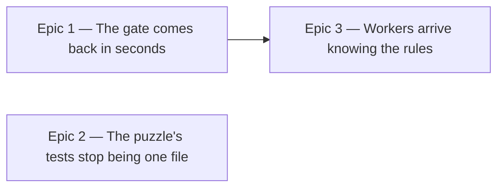

# Roadmap — Development speed

Source: [briefing.md](briefing.md)

## Overview

Three things make each feature cost more than the last, and this feature
removes them one each. The test suite runs its slowest half on every gate even
when the feature never touched it. One test file is edited by nearly every
feature, and because two agents cannot own one file, it collapses
`/implement-feature`'s parallel waves into a queue. And every worker reads the
same ~660 lines of conventions before it writes a line, once per worker, per
epic, per feature.

Each epic is independently useful: a faster gate, a wider wave, a shorter
brief. Nothing here changes what the app does — the app's behaviour is the
invariant every epic is judged against.

## Epics

### Epic 1 — The gate comes back in seconds

**Visible when done:** `npm test` returns in around 13 seconds instead of 78,
and a `/verify-epic` pass on an app-only epic no longer waits on the groove
generator. Nothing is skipped silently: the generator tier is one command away,
and runs automatically whenever an epic touches the code it covers.

**Depends on:** none
**Parallel with:** Epic 2

**Contract frozen here, for Epic 3 to build against**
- the tier commands and what each covers, as `package.json` scripts. Epic 3's
  agent definitions name these, so the names are fixed on day one and the
  content can follow.

**Scope**
- two tiers, split along the vitest projects that already exist. `npm test` runs
  the `app` project — 82 files, 1469 cases, 13.5s. The `generator` project — 37
  files, 769 cases, 64s of today's 78s — moves to its own command, and a third
  command runs both
- **the generator tier runs whenever an epic touches `scripts/` *or*
  `src/lib/`.** The second half is not optional: `scripts/grooves/rng.ts`
  imports `hashString` from `src/lib/hash.ts` by relative path, and
  `scripts/grooves/{cli,manifest,notes,pools,types}.ts` all import
  `src/lib/groove.ts`. A change under `src/lib/` can leave the app tier green
  and the generator broken — and `hash.ts`'s own docstring says editing it
  reassigns every past date's puzzle. `src/lib/` is a leaf shared by both halves
  of the system, so tier selection has to follow the import graph, not the
  folder name
- teach `/verify-epic` to select tiers from the epic's own file scope — it
  already establishes that scope in §2 for other reasons. A tier that was not
  run is reported as not run, which the skill's §3 already requires
- teach `/implement-feature`'s wave gate (§8) the same distinction
- drop the `testTimeout: 30_000` patch in `vitest.config.ts`. It exists only
  because both projects competed for the same cores; three render cases failed
  at 5005–5045ms under load and passed in isolation. Once the tiers stop running
  together the default timeout should hold — and if it doesn't, that is a real
  finding about those tests rather than something to paper over again
- keep `prebuild`'s `grooves:verify` as it is. It already guards the committed
  audio artifacts, which is why moving the render tests off the default gate
  does not leave the real output unchecked

**Out of scope**
- a third tier splitting fast generator logic from audio rendering. The nine
  render files hold 324 cases and 218s of the tier's 229s; the other 28 hold 445
  cases and 11.1s, and could have stayed on the default gate for ~3s. Decided
  against in favour of one clean line at the project boundary
- making the audio-render tests themselves faster, or replacing the committed
  pack with a fixture in them. They are slow because they do real work on real
  samples, and that is what makes them worth having. This epic changes when they
  run, not what they do
- the jsdom-vs-node environment split for the ~28 pure `.test.ts` files under
  `src/`. Measured at roughly 18s of CPU but only 2–3s of wall clock once
  parallelised — real, but an order of magnitude below the tier split
- CI. There is no pipeline yet; that is its own candidate feature

**Validation**
- the demo path: `npm test` on a clean tree finishes in seconds, `npm run` shows
  the generator tier as its own command, and running it passes
- `/verify-epic` on an app-only epic reports the generator tier as not run, with
  the reason; on an epic touching `scripts/` or `src/lib/` it runs it
- the `src/lib/` trigger is the one worth testing deliberately, because it is the
  one a reader would not predict: change `src/lib/hash.ts`, confirm the gate
  runs the generator tier and catches it
- the default timeout is back at vitest's own, and the suite is green on three
  consecutive runs — flakes that only appear under core contention need more
  than one run to disprove
- 2238 cases before, 2238 after, across the two commands. A tier split that
  quietly drops tests is the failure mode to guard against, so assert the total,
  not just green

### Epic 2 — The puzzle's tests stop being one file

**Visible when done:** `GroovePuzzle.test.tsx` is several files, each named for
the region it covers. Two tracks that both add tests to the puzzle can be
dispatched into the same wave instead of queued behind each other. The app
behaves identically, and `GroovePuzzle.tsx` itself is untouched.

**Depends on:** none
**Parallel with:** Epic 1

**Scope**
- split `GroovePuzzle.test.tsx` — 3111 lines, 119 cases, 10.2s, 44% of the app
  tier's runtime by itself. It already has the seams: `describe` blocks at lines
  1580, 1627, 2313, 2568 and 2714, one per feature that has passed through it
- the split must keep testing behaviour through the feature's public surface.
  `docs/testing.md` is explicit that a relocated assertion keeps its subject:
  moving a case to the file that owns it is a move, rewriting it as an isolated
  render with hand-made props is a different assertion wearing the old one's
  name. The existing `testing/renderFeature.tsx` helper is what makes the honest
  version of this cheap
- the shared setup at the top of the file — the hoisted `mockStore`, the
  persistence `vi.mock`, the fake audio context — is currently written once and
  used by all 119 cases. Splitting the file means it needs one home the new
  files share, and `testing/` is where the slice already keeps that kind of
  helper
- the reason to care is scheduling, so the test of success is scheduling: after
  the split, the regions a typical feature touches are separately ownable
- keep `structure.test.ts` honest — it asserts the slice's folder shape and will
  need to know about whatever the split creates

**Out of scope**
- **splitting `GroovePuzzle.tsx` itself.** Decided: it stays at 488 lines. This
  is the one briefing bullet this roadmap does not deliver, and it leaves a
  known residual — see the assumption below
- any change to what the puzzle does, renders, or persists. This epic is
  invisible to a player, and the existing 119 cases passing unchanged is the
  proof
- the other churn hotspots — `events.test.ts` (12 commits), `useProgress.ts`
  (8), `GuessCard.test.tsx` (8). Real, but each is a fraction of GroovePuzzle's
  13-of-14 and none of them blocked a wave yet
- any structural guard against the file growing back. Decided against; see
  Assumptions

**Validation**
- the demo path: play a full puzzle in the browser — first visit, a wrong guess,
  a solve, a give-up, a shared link — and see no difference
- all 119 cases still exist and pass, distributed across the new files. Count
  them before and after
- no new file imports past `index.ts` into another slice's internals, and
  `structure.test.ts`, `route-boundary.test.ts` and the design-system boundary
  tests stay green
- the honest check on the point of the epic: take the last three features'
  implement reports, and confirm the tracks that collided on the *test* file
  would now own disjoint files

### Epic 3 — Workers arrive knowing the rules

**Visible when done:** five agents exist — the engineering roles test-writer,
implementer, architect and verifier, plus a musician that owns how a groove is
generated — and the three skills that dispatch work use them.
`/implement-feature` sends one agent per unit, picked by what the unit is, so
the wave arithmetic is unchanged and the dispatch is a fraction of today's
length. `/writespec` runs the architect, and `/verify-epic` hands the verifier a
whole epic and gets a finished QA report back — with every acceptance criterion
citing a test that can be checked to exist.

**Depends on:** Epic 1 — they share two files. Both edit
`.claude/skills/implement-feature/SKILL.md`, and both edit
`.claude/skills/verify-epic/SKILL.md`; this epic's agent definitions also name
the test commands Epic 1 defines.

**Scope**
- add five agent definitions under `.claude/agents/`. None exist today. The
  fifth, the musician, is a domain specialization rather than a step of the
  worker loop: the generator holds the musical knowledge — template parameters,
  `theory/`, `voices.ts`, `events.ts`, the `gate.ts` thresholds — that no
  step-shaped role would carry, and it cannot hear, so a listening sign-off
  stays with a person
- **one agent per unit.** The role is chosen by what the unit is, not by which
  step of the loop is running — today's one-dispatch-per-unit shape and today's
  wave arithmetic stay exactly as they are. The agent still runs the full
  five-step loop; the role decides which conventions arrive with it
- **each definition inlines the rules its role needs**, including the shared
  placement floor every role needs. Four short definitions that each repeat the
  floor, rather than a fifth shared document — `docs/coding-guidelines.md` stays
  the single source of truth, and nothing new sits beside it that can drift
- the split by role: `docs/testing.md` and the test-shape rules to the
  test-writer; the implementation rules from `coding-guidelines.md` to the
  implementer; `docs/architecture.md` and the dependency graph to the architect;
  the AC-tracing method to the verifier
- the duplicated floor is the cost of this shape and it needs a way to stay
  true. Five definitions repeating the same placement rules is five places to
  update when a rule changes, and the repo's own answer to "a convention no
  linter can check" is a structural test that reads the files from disk
- rewrite `references/worker-brief.md` to lean on the agent's own knowledge. The
  brief keeps what is genuinely per-unit: the spec path, the files owned, the
  contracts, the test command, the status file it must write
- keep the parts of the brief that exist because a worker went wrong before —
  the file-ownership warning, "do not touch git", "do not run the full suite",
  "report honestly". Those are not documentation overhead, they are the scar
  tissue of previous runs
- update `/implement-feature` §5 to dispatch the right agent type per unit
- wire the architect into `/writespec` and the verifier into `/verify-epic`.
  These two skills run in the lead today, so this is not about removing
  per-worker duplication — it is about one definition per role instead of two
  descriptions of the same job drifting apart in two skill files
- **the verifier agent runs the checks *and* grades the acceptance criteria**,
  returning the finished report; the lead relays it. The separation the skill
  actually depends on is verification from *repair*, and that survives intact —
  the verifier still cannot fix, and repair still happens in
  `/implement-feature` §9. What is given up is the lead witnessing the grading
- so the grade needs to be checkable after the fact by something other than
  trust. The report template already forces it: every AC's Evidence cell names a
  test file and a test name. A mechanical check that every cited test actually
  exists and that its name matches turns the citation into a verifiable claim,
  and costs nothing per run. It catches the failure that matters — a grade
  resting on a test that was never written, or one renamed since — without the
  lead re-tracing every AC by hand

**Out of scope**
- rewriting `docs/coding-guidelines.md`. It is the human-facing rulebook and
  stays the source of truth; this epic changes who has to read all of it, not
  what it says
- `/roadmap` and `/brainstorm`. They are conversational document-writing steps
  with no role among the four, and they run in the lead with the user answering
  questions in the loop
- `/create-feature` and `/create-feature-for-persona`, for the same reason

**Validation**
- the demo path: run `/implement-feature` on a small epic and compare the
  dispatch a worker receives against today's — it should be shorter, and the
  worker should still place files, name tests and respect boundaries correctly
- the wave arithmetic is unchanged: the same unit count produces the same waves
  as it would today, since the role changes what a worker knows and not how many
  workers there are
- `/writespec` and `/verify-epic` still produce the documents they produce
  today, in the same shape — the role agent is a change of who does the work,
  not of what lands on disk
- the citation check earns its place by catching something: point it at a report
  whose Evidence cell names a test that does not exist, and it must fail. A
  guard that has never been seen to fail is not known to work
- grade the same epic twice — once through the verifier agent, once by hand in
  the lead — on an epic whose answer is already known, and compare. This is the
  one-off check that the delegated grade is worth trusting at all; it is worth
  doing once, at the end of this epic, and not on every run afterwards
- the real test is a negative one: the conventions must still hold. Run the
  structural tests and lint after a dispatch — `structure.test.ts`,
  `route-boundary.test.ts`, `boundary.test.ts` and the design-system tests exist
  precisely to catch a worker that did not know a rule
- an agent that has lost a rule is worse than a long brief, so a rule dropped
  from the brief must be demonstrably somewhere else, not merely absent

## Dependency map

## Execution waves

- **Wave 1 (parallel):** Epic 1, Epic 2 — genuinely disjoint. Epic 1 owns
  `vitest.config.ts`, `package.json` and the skill files; Epic 2 owns
  `src/features/daily-groove/components/` and `testing/`.
- **Wave 2:** Epic 3 — it edits `implement-feature/SKILL.md` *and*
  `verify-epic/SKILL.md`, both of which Epic 1 also edits, and it names Epic 1's
  test commands. The file collision is the harder constraint of the two: the
  same rule that makes Epic 2 worth doing applies here, and this feature is a
  poor place to prove it by ignoring it.
- Epic 3 is the largest of the three and could have been split — the four
  definitions, then the three skills that use them. It is kept whole because the
  split would put the `/writespec` and `/verify-epic` wiring in a third wave
  behind definitions it depends on entirely, and adding a wave to a feature
  about removing waves is the wrong trade. Its internal tracks are `/writespec`
  and `/verify-epic` separately, which own different files and can run in
  parallel inside the epic.

## Assumptions

- The app's behaviour is unchanged by all three epics. This is a feature about
  the cost of building features; a player should not be able to tell it shipped.
- **`GroovePuzzle.tsx` stays whole, and the residual is real.** Feature-12's run
  serialized because three tracks wanted the *component*, not only its test
  file. Epic 2 removes the test-file half of that collision and leaves the
  component half standing, so a future feature with two tracks both editing
  `GroovePuzzle.tsx` will still queue. This was a deliberate call for the
  cheaper half of the win; it means the briefing's "split the 488-line component
  itself too" is not delivered by this feature.
- **Nothing here is guarded against decay.** No file-size test, no time budget.
  The split test file can grow back and the fast tier can gain a slow test, and
  the only thing that will notice is someone measuring again. Feature-5
  dismantled a god component and this feature is splitting the tests of the one
  that grew in its place, so the recurrence interval looks like about a year.
- Two tiers, not three: 445 fast generator cases leave the default gate along
  with the 324 slow ones, in exchange for the split being one line at a project
  boundary rather than a per-file tagging scheme.
- **The four role definitions each repeat the shared placement rules, so a rule
  change is four edits.** Chosen over a shared digest because a fifth document
  beside `coding-guidelines.md` has nothing keeping it honest. The duplication
  has the same problem in a smaller form — four copies can drift from the
  rulebook as easily as one — which is why Epic 3 carries a bullet about keeping
  them true. This is the assumption most likely to need revisiting once the
  definitions exist and their real size is known.
- **The verifier grades out of the lead's sight, and a mechanical citation check
  is what stands in for the lead's eyes.** The separation `/verify-epic` is built
  on — verification apart from repair — is untouched: the verifier still cannot
  fix anything. What changes is that the lead relays a verdict it did not form.
  The Evidence column makes that verdict auditable rather than merely asserted,
  and the guard is cheap, but a wrong grade with a real-looking citation would
  still pass. `.verify/` is gitignored scratch, so the report is not a durable
  record either. Accepted for the saving; worth revisiting if a delegated grade
  is ever caught being generous.
- **Epic 3 now spans three skills**, not one. `/writespec` and `/verify-epic`
  gain agents for reasons of single-definition consistency rather than the
  per-worker duplication that motivates the change in `/implement-feature`. It
  is a different justification for the same shape, and it widens the epic.
- The measurements here were taken on 2026-09-01 against the tree at `d060792`,
  before feature-13's run began: `npm test` 78s wall / 2238 tests / 119 files;
  app tier 13.5s / 1469 tests; generator tier ~64s / 769 tests. They are the
  baseline each epic is judged against and should be re-taken once feature-13
  lands, since it rewrites the sample pack the slow tests read.
- Feature-13 is mid-implementation right now and is editing
  `scripts/grooves/pack.test.ts`, `events.test.ts`, `types.ts` and the sample
  pack — files Epic 1 re-tiers. Epic 1 should start after that run lands, or
  expect conflicts.
- No CI exists yet, so "runs in CI" in Epic 1 means the tier is ready for a
  pipeline to call, not that a pipeline is built here.
- Nothing here is a rewrite. Every epic is a rearrangement of code and config
  that already exists and already passes.
