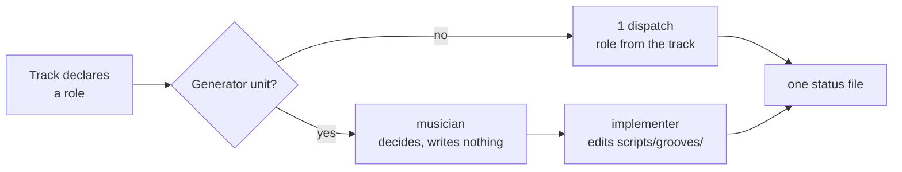

# Tech spec — Epic 3: Workers arrive knowing the rules

PRD: [../prd/epic-3-workers-arrive-knowing-the-rules.md](../prd/epic-3-workers-arrive-knowing-the-rules.md) ·
Roadmap: [../roadmap.md](../roadmap.md)

## Approach

Most of this epic is markdown — five agent definitions and four skill files — and
markdown cannot be red-green tested. So the two pieces that *can* carry tests do,
and they are the two the PRD already asked for as scripts: the citation check
(R18) and the placement-floor guard (R19). Those go first, in their own track,
because they are what makes the rest verifiable.

The definitions are then written against a floor that a test already enforces,
rather than a floor that five files are supposed to agree on by inspection. The
skill edits come last per skill, each one a named change with a stated
done-condition, and the epic's real proof is the negative one from the PRD: run a
dispatch under the new brief and confirm the structural tests and lint still
catch a worker that did not know a rule.

## Architecture

```
scripts/
├── agent-floor.ts          FLOOR_RULES + findMissingFloorRules()
├── agent-floor.test.ts     R19's guard — runs in the tooling tier
├── citations.ts            parseCitations() + checkCitations()
└── citations.test.ts       R18's check — runs in the tooling tier

.claude/agents/
├── test-writer.md   implementer.md   architect.md
├── verifier.md      musician.md

.claude/skills/
├── implement-feature/SKILL.md              §5 dispatch by role, §8 unchanged here
├── implement-feature/references/worker-brief.md   rewritten
├── writespec/SKILL.md                      architect; tracks declare a role
└── verify-epic/SKILL.md                    verifier grades; citation check runs
```

Both scripts live at `scripts/` root beside Epic 1's `tiers.ts`, and land in the
`tooling` vitest project Epic 1 adds — fast, default, and not the generator tier.

**How a unit is dispatched.** The tech spec's track declares a role (R4a).
Non-generator units are one dispatch. A generator unit is one unit taking two
turns (R4b, R4c): the musician runs, writes nothing under `scripts/grooves/`, and
its reasoning becomes the implementer's input. One status file, written by the
implementer, carries both.



## Contracts

Frozen before any track starts.

```ts
// scripts/agent-floor.ts

/** A rule every agent definition must carry, however it is worded. */
export type FloorRule = { id: string; mustMatch: RegExp; why: string }

/** The shared placement floor. R2 duplicates it across five definitions. */
export const FLOOR_RULES: FloorRule[]

/** Definitions missing a floor rule, as `${file}: ${ruleId}`. Empty is good. */
export function findMissingFloorRules(dir: string): string[]
```

```ts
// scripts/citations.ts

/** One AC row's evidence, as the QA report's table writes it. */
export type Citation = { ac: string; file: string; testName: string }

/** Every citation in a QA report's acceptance-criteria table. */
export function parseCitations(markdown: string): Citation[]

/** Citations whose file is missing or whose test name is not in it. */
export function checkCitations(
  citations: readonly Citation[],
  repoRoot: string,
): { citation: Citation; reason: 'no-file' | 'no-test' }[]
```

**The five role names**, referenced by `/writespec`'s track field and by
`/implement-feature`'s dispatch: `test-writer`, `implementer`, `architect`,
`verifier`, `musician`.

**Test commands** come from Epic 1: `npm test`, `npm run test:gen`,
`npm run test:all`. The musician's and any generator unit's default is
`npm run test:gen`.

## Tracks

### Track A — The two guards

- **Goal** — `agent-floor.ts` and `citations.ts` exist and are tested.
- **Role** — `implementer`
- **Owns** — `scripts/agent-floor.ts`, `scripts/agent-floor.test.ts`,
  `scripts/citations.ts`, `scripts/citations.test.ts`
- **Depends on** — Epic 1's `tooling` project, for these tests to run on the
  default gate. They pass without it; they just land in no project until it
  exists.
- **Parallel with** — Track B
- **Done when** — both test files are green, including the deliberately-bad
  fixtures.

### Track B — The five definitions

- **Goal** — five agent definitions, each carrying the floor plus its role.
- **Role** — `architect`
- **Owns** — `.claude/agents/**`
- **Depends on** — `FLOOR_RULES` as a contract. Track B writes against the list;
  Track A enforces it.
- **Parallel with** — Track A
- **Done when** — `agent-floor.test.ts` passes against the five real files.

### Track C — `/implement-feature`

- **Goal** — dispatch by role, the generator two-turn unit, and a rewritten brief.
- **Role** — `implementer`
- **Owns** — `.claude/skills/implement-feature/SKILL.md`,
  `.claude/skills/implement-feature/references/worker-brief.md`
- **Depends on** — Track B's definitions existing, and the role names
- **Parallel with** — Track D, Track E
- **Done when** — §5 names the roles, the two-turn rule and the single status
  file; the brief is materially shorter and R7's four instructions survive.

### Track D — `/writespec`

- **Goal** — the architect runs it, and every track it emits declares a role.
- **Role** — `implementer`
- **Owns** — `.claude/skills/writespec/SKILL.md`
- **Depends on** — the role names only
- **Parallel with** — Track C, Track E
- **Done when** — §4 requires a role per track and §8's template carries the
  field.

### Track E — `/verify-epic`

- **Goal** — the verifier grades, and the citation check runs before the lead
  relays.
- **Role** — `implementer`
- **Owns** — `.claude/skills/verify-epic/SKILL.md`,
  `.claude/skills/verify-epic/references/qa-report-template.md`
- **Depends on** — the `checkCitations` contract only
- **Parallel with** — Track C, Track D
- **Done when** — the skill names the verifier, the citation script, and what
  happens when a citation does not resolve.

> **Wave-2 collision with Epic 1.** Track C and Track E own the same two skill
> files Epic 1's Tracks C and B own. That is the whole reason this epic is in the
> feature's second wave. Within this epic there is no overlap.

## Execution waves

- **Wave 1 (parallel):** Track A, Track B
- **Wave 2 (parallel):** Track C, Track D, Track E
- **Wave 3:** Integration

## Implementation

### Track A — The two guards

#### Step A1 — A citation is parsed out of a report

Covers: R12, R18

- **Test first** — `scripts/citations.test.ts`: given a markdown fixture holding
  the AC table row
  `` | AC1 | done | `src/lib/hash.test.ts` — "hashes a known string" | ``,
  `parseCitations` returns one `Citation` with those three fields. Run it: fails
  with `Failed to load url ./citations.ts`.
- **Implement** — `scripts/citations.ts`: `parseCitations` matching table rows,
  taking the first backticked path and the first double-quoted string in the
  Evidence cell.
- **Green when** — that assertion passes.
- **Refactor** — none.

#### Step A2 — Only graded-done rows are cited

Covers: R12

- **Test first** — a fixture with a `partly` row whose Evidence is prose and a
  `not done` row with no citation: `parseCitations` returns only the `done` row.
  Run it: fails, all three come back.
- **Implement** — filter on the Status column being `done`.
- **Green when** — green. A `partly` row is exactly R17a's listening-sign-off
  case, and it has no test to cite by definition.
- **Refactor** — none.

#### Step A3 — A missing file is caught

Covers: R13, AC12

- **Test first** — `checkCitations([{ac:'AC1', file:'src/lib/nope.test.ts',
  testName:'x'}], repoRoot)` returns one result with `reason: 'no-file'`. Run it:
  fails, `checkCitations` is not a function.
- **Implement** — `existsSync` against `repoRoot`.
- **Green when** — green.
- **Refactor** — none.

#### Step A4 — A renamed test is caught

Covers: R13, AC12

- **Test first** — cite a real file — `src/lib/hash.test.ts` — with a test name
  that is not in it. Expect `reason: 'no-test'`. Then cite a name that *is* in
  it and expect no result. Run it: fails, only `no-file` is implemented.
- **Implement** — read the file and check the name appears inside an `it(` or
  `test(` call.
- **Green when** — both pass. This is the failure that matters: a citation that
  was true when written and is not now.
- **Refactor** — none.

#### Step A5 — A clean report passes

Covers: R12

- **Test first** — a fixture whose citations all resolve: `checkCitations`
  returns `[]`.
- **Implement** — nothing, if A3 and A4 are right.
- **Green when** — green. A guard that only ever fails is as useless as one that
  never does.
- **Refactor** — none.

#### Step A6 — The floor rules are declared

Covers: R2, R19

- **Test first** — `scripts/agent-floor.test.ts`: `FLOOR_RULES` is non-empty and
  every entry has an `id`, a `mustMatch` and a `why`. Run it: fails, no module.
- **Implement** — `scripts/agent-floor.ts` with `FLOOR_RULES`. Start from the
  rules a worker actually needs regardless of role: where a feature's files live,
  that `index.ts` is a slice's only public surface, that features do not import
  each other, that tests are colocated, and that `src/lib/` imports nothing.
  Each `why` names the doc section it comes from.
- **Green when** — green.
- **Refactor** — none.

#### Step A7 — A definition missing a floor rule is named

Covers: R19, AC17

- **Test first** — point `findMissingFloorRules` at a fixture directory holding
  two definitions, one complete and one with a floor rule deleted. Expect exactly
  one entry, naming that file and that rule id. Run it: fails, not a function.
- **Implement** — read every `.md` in the directory, test each rule's
  `mustMatch`, return `${basename}: ${rule.id}` for each miss.
- **Green when** — green.
- **Refactor** — none.

#### Step A8 — The real definitions satisfy the floor

Covers: R2, R19, AC2, AC17

- **Test first** — `expect(findMissingFloorRules('.claude/agents')).toEqual([])`.
  Run it before Track B: fails, listing every rule for every missing file — which
  is the checklist Track B works through.
- **Implement** — nothing here; Track B makes it pass.
- **Green when** — green once B5 lands.
- **Refactor** — none.

### Track B — The five definitions

Each definition is markdown with frontmatter. There is no red-green turn; A8 is
the test, and it goes from red to green across these five steps.

#### Step B1 — The implementer

Covers: R1, R2, R3

- **Write** — `.claude/agents/implementer.md`: frontmatter (`name`,
  `description`), the floor from `FLOOR_RULES`, and the implementation rules from
  `docs/coding-guidelines.md` — the five lint zones, the design-system
  constraints, and what makes a primitive stop being one. Test command
  `npm test`.
- **Done when** — `findMissingFloorRules` no longer names this file.

#### Step B2 — The test-writer

Covers: R1, R2, R3

- **Write** — `test-writer.md`: the floor, plus `docs/testing.md` in full — it is
  38 lines — and the test-shape rules from the guidelines: through the public
  surface, no `vi.mock` of an internal path, rendered behaviour over
  implementation detail, a relocated assertion keeps its subject.
- **Done when** — as B1.

#### Step B3 — The architect

Covers: R1, R2, R3, R9

- **Write** — `architect.md`: the floor, `docs/architecture.md`'s dependency
  graph and the removability standard, and the decomposition method — freeze
  contracts, split by file ownership, order into waves.
- **Done when** — as B1.

#### Step B4 — The verifier

Covers: R1, R2, R3, R10, R11

- **Write** — `verifier.md`: the floor, the AC-tracing method from
  `/verify-epic` §5, the tier commands from Epic 1, and two prohibitions stated
  plainly — **it cannot fix anything** (R11), and it must not grade **done**
  without a citation that resolves (R12).
- **Done when** — as B1.

#### Step B5 — The musician

Covers: R1, R3a, R3b, R3c, R16, AC2a, AC2b, AC2c

- **Write** — `musician.md`. It points at `docs/music.md` as its source of truth
  and does not restate it (R3c). What it carries resident is only what must never
  be looked up:
  - **it cannot hear** (R16) — it decides from theory, template parameters, and
    what `gate.ts` measures, and never reports that a groove sounds good;
  - the frozen invariants — `src/lib/hash.ts`, `MUSIC_LABEL` and its draw order,
    the order of `FLAVOURS`, a groove's `uuid`;
  - the generator's boundary rule, `scripts/grooves/` reaching `src/lib/` by
    relative path and nothing else (R3b);
  - that it writes no file under `scripts/grooves/` (R4b);
  - test command `npm run test:gen`.
  It carries the generator boundary *instead of* the React and design-system
  placement rules, which is why `FLOOR_RULES` must be the rules that are genuinely
  universal — if a React-specific rule is in the floor, A8 will fail on this file
  and the floor is what is wrong.
- **Done when** — `findMissingFloorRules('.claude/agents')` returns `[]`, and
  every musical fact in the file agrees with `docs/music.md`.

### Track C — `/implement-feature`

#### Step C1 — Dispatch by the role the spec declares

Covers: R4, R4a, AC3

- **Change** — §5: read each unit's role from its tech-spec track and dispatch
  that agent type. Do not infer it from the files owned.
- **Done when** — §5 names the five roles and the spec field.

#### Step C2 — A generator unit takes two turns

Covers: R4b, R4c, R5, AC3a, AC3c, AC4, AC4a

- **Change** — §5: a unit owning files under `scripts/grooves/` runs the musician
  first, which writes no file there; the lead passes its reasoning to an
  implementer, which makes the change. It stays **one unit** with **one status
  file**, written by the implementer and carrying the musician's reasoning.
  Add to §4's scheduling rule that this does not change the unit count or the
  wave schedule — only that such a unit occupies two turns.
- **Done when** — §5 carries the two-turn rule and §4 the scheduling note.

#### Step C3 — A listening sign-off does not stall the run

Covers: R17, R17a, AC13c, AC13d

- **Change** — §5 and §9: a unit whose change needs an ear completes and reports
  the change as awaiting a listening sign-off; its acceptance criterion is graded
  **partly**, which §9's step 3 already defines as implemented-but-untested. The
  run does not wait for a person.
- **Done when** — both sections name the case and the Partly grade.

#### Step C4 — The brief sheds what the agents now carry

Covers: R6, R7, R8, AC5, AC6, AC7

- **Change** — rewrite `references/worker-brief.md`. Remove the "Read first"
  reading list of `AGENTS.md`, `docs/architecture.md` and `docs/testing.md` — the
  definitions carry those. Keep, verbatim in substance: the file-ownership
  warning, the git prohibition, the full-suite prohibition, the honest-reporting
  paragraph, and the status-file template. Keep every per-unit placeholder: spec
  path, PRD path, files owned, contracts, test command, unit name.
- **Done when** — the brief is materially shorter, and a line-by-line trace of
  today's brief shows every rule either still present or in a definition (AC7).
  A rule in neither is a defect, not a saving.

### Track D — `/writespec`

#### Step D1 — Every track declares a role

Covers: R4a, R9, R14, AC3b, AC8

- **Change** — `writespec/SKILL.md` §4: a track's definition gains a **Role**
  field, one of the five, chosen by what the track's work is. §8's template gains
  the field beside **Owns** and **Depends on**.
- **Done when** — §4 requires it, the template shows it, and the guidance says a
  track owning `scripts/grooves/**` takes the musician.

#### Step D2 — The architect runs the skill

Covers: R9, R14, AC8

- **Change** — a short section naming the architect agent as who produces the
  spec, and stating that the output shape is unchanged: same template, same
  path, same `specs/<feature>/tech-spec/` destination.
- **Done when** — the section exists and says the shape is unchanged.

### Track E — `/verify-epic`

#### Step E1 — The verifier runs the checks and grades

Covers: R10, R11, R14, AC9, AC10

- **Change** — `verify-epic/SKILL.md`: name the verifier agent as who runs §4's
  checks and §5's AC tracing and returns the finished report; the lead relays it.
  Keep §6's destination and template unchanged. Restate that the verifier cannot
  fix — it is the skill's load-bearing property and the one most worth repeating
  where the work now happens elsewhere.
- **Done when** — the skill names the agent and keeps the no-fix rule.

#### Step E2 — The citation check runs before the lead relays

Covers: R12, R13, R18, AC11, AC16

- **Change** — §6: after the report is written and before it is relayed, run the
  citation script over it. A citation that does not resolve makes the report a
  failure of the report — surface it, name the AC, and do not relay a verdict
  resting on it.
- **Done when** — §6 names the script and the not-relayed rule.

## Integration and verification

#### Step I1 — The guards fail when they should

Covers: R13, R19, AC12, AC17

- Point the citation script at a report citing a test that does not exist: it
  fails and names the AC.
- Delete a floor rule from one definition: `agent-floor.test.ts` fails and names
  the file and the rule. Restore.
- Neither guard has value until it has been seen to fail.

#### Step I2 — A dispatch under the new brief

Covers: R6, R8, AC5, AC14

- Run `/implement-feature` on a small epic. Compare the brief a worker receives
  against today's: materially shorter.
- After it finishes, run `structure.test.ts`, `route-boundary.test.ts`,
  `boundary.test.ts`, `src/components/structure.test.ts` and lint. All pass.
  These exist to catch a worker that did not know a rule, so they are the
  negative test of whether the trim cost anything.

#### Step I3 — The arithmetic holds

Covers: R5, AC4, AC4a

- Take an epic with G generator units and N others. Confirm the unit count is
  N + G, the wave count is what it would have been, and the dispatch count is
  N + 2G.

#### Step I4 — The delegated grade is worth trusting

Covers: R10, AC15

- Grade one already-verified epic twice: once through the verifier agent, once by
  hand in the lead. Compare. They must agree.
- Run once, at the end of this epic, and not on every run afterwards. This is the
  check that R10's trade — the lead relaying a verdict it did not form — was
  sound.

#### Step I5 — The musician stays inside what it can know

Covers: R16, R17, AC13a, AC13b, AC13c

- Dispatch the musician at a template change. Its justification cites theory or a
  `gate.ts` measurement and makes no claim about how the result sounds.
- A change to a template's swing or humanize values is reported as awaiting a
  listening sign-off, not as verified.

## Requirement coverage

| Requirement | Steps |
| :-- | :-- |
| R1 | B1–B5 |
| R2 | A6, A8, B1–B5 |
| R3 | B1–B5 |
| R3a, R3b, R3c | B5 |
| R4 | C1 |
| R4a | C1, D1 |
| R4b, R4c | C2 |
| R5 | C2, I3 |
| R6 | C4, I2 |
| R7 | C4 |
| R8 | C4, I2 |
| R9 | B3, D1, D2 |
| R10 | E1, I4 |
| R11 | B4, E1 |
| R12 | A1, A2, A5, E2 |
| R13 | A3, A4, E2, I1 |
| R14 | D1, D2, E1 |
| R15 | B1–B5 |
| R16 | B5, I5 |
| R17 | C3, I5 |
| R17a | C3 |
| R18 | A1, E2 |
| R19 | A6, A7, A8, I1 |
| AC1 | B1–B5 |
| AC2 | A8, B1–B5 |
| AC2a, AC2b, AC2c | B5 |
| AC3 | C1 |
| AC3a | C2 |
| AC3b | D1 |
| AC3c | C2 |
| AC4, AC4a | I3 |
| AC5 | C4, I2 |
| AC6 | C4 |
| AC7 | C4 |
| AC8 | D1, D2 |
| AC9 | E1 |
| AC10 | E1 |
| AC11 | A3, A4, E2 |
| AC12 | A3, A4, I1 |
| AC13 | B1–B5 |
| AC13a, AC13b | B5, I5 |
| AC13c | C3, I5 |
| AC13d | C3 |
| AC14 | I2 |
| AC15 | I4 |
| AC16 | E2 |
| AC17 | A7, A8, I1 |

## Assumptions

- Agent definitions are markdown with `name` and `description` frontmatter, no
  `model` pinned — the PRD assumes they inherit the session's model.
- `FLOOR_RULES` matches on regexes rather than exact strings, so a definition can
  word a rule in its own voice. The guard checks that the rule is present, not
  that it is copy-pasted.
- The floor is the rules that are genuinely universal across all five roles. The
  musician is the test of that: if a rule cannot be stated for a generator agent,
  it belongs in a role's own section, not the floor.
- Both scripts run under `node --experimental-strip-types`, as
  `scripts/grooves/*` already do via the `npm run grooves*` scripts.
- The skill-file tracks have no automated test. Their verification is I2 and I4,
  which is why both are in the integration section rather than left implicit.

## Decision log

### Cycle 1 — 2026-09-01

**The two guards are built before the definitions.**
Decided while writing. The floor guard is the checklist Track B works through —
A8 goes red with a list of every missing rule in every missing file — so building
it first turns five markdown files from a review problem into a red-green loop.
Changed: Track A is wave 1 alongside Track B, and Step A8 is written as
red-until-B5.

**The musician is the test of what belongs in the floor.**
It carries the generator boundary rule instead of the React placement rules, so
any React-specific rule in `FLOOR_RULES` makes A8 fail on `musician.md`.
Changed: Step B5 says so explicitly, and the Assumptions record that a floor rule
that cannot be stated for the musician is misfiled.
