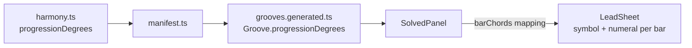

# PRD — Epic 3: The changes read as degrees of the key

Feature: [briefing.md](../briefing.md) · [roadmap.md](../roadmap.md)

## Summary

The four-bar lead sheet in the box gains a Roman numeral under each bar —
`I · IV · I · V` under `E♭7 · A♭7 · E♭7 · B♭7` — so a progression Sam has played
a thousand times without knowing its name is recognisable as the shape it is.
The degree comes from the generator, which already computes it, carried outward
in the manifest.

## Problem

`E♭7–A♭7–E♭7–B♭7` is four chords to memorise in one key. `I–IV–I–V` is a thing
Sam has played since the first week of owning a guitar, and has never had a name
for. The lead sheet shows the first and not the second, so the payoff names four
facts where it could name one pattern — and the pattern is the half that
transfers to every other song Sam knows.

## Scope

- A Roman numeral under each of the lead sheet's four bars.
- `progressionDegrees` carried from the generator into `grooves.generated.ts`.

**Out of scope**
- **Functional names** — tonic, subdominant, dominant. Numerals only.
- **The chord symbols over the progress track** (feature-11 Epic 3). Those stay
  symbols; the numerals live in the box.
- **Any change to what the grooves sound like.** The regeneration is derived from
  the same seeds and every audio file is untouched.
- **Scale degrees under the staff** — Epic 2, and a different notation.
- **Reharmonisation, secondary dominants, modulation.** The generator writes one
  key per groove and the sheet reads it.

## Requirements

- **R1** — Each of the lead sheet's four bars carries a Roman numeral below its
  chord symbol.
- **R2** — The numeral is derived through `barChords`, not through a second
  mapping. A three-chord progression plays `1 2 3 1` — the generator comps
  `progressionMidi[bar % length]` — so bar four is a return and takes bar one's
  numeral.
- **R2a** — Every bar carries a numeral, repeats included. A bar that repeats bar
  one is still a bar of harmony, and a blank fourth bar reads as missing data
  rather than as a return. No bar is ever left without one where the degrees are
  known.
- **R2b** — The numerals are counted from the day's root, so the tonic is always
  `I`. `Em7–Bm7–C♯m7♭5` on an E dorian day reads `I · V · VI`, never `ii · vi ·
  vii`: the answer Sam just gave was "E Dorian", and a sheet that opens on `ii`
  is answering a question about D major that nobody asked. The parent major scale
  is never named or implied anywhere in the box.
- **R3** — The numerals are plain: they name the degree and say nothing about the
  chord's quality. Upper case throughout, no lower case for minor and no `ø` for
  half-diminished. The quality is already written above, on the symbol.
  `C♯m7♭5` in E dorian reads `VI`, with its own symbol carrying the rest.
- **R3a** — The numeral does carry the degree's accidental, because that is which
  degree it is and not what quality it has. A chord on the blues scale's fourth
  degree reads `♭V`: the scale is `1 ♭3 4 ♭5 5 ♭7`, and a numeral that drops the
  flat names a degree the groove never plays.
- **R4** — `Groove` gains an optional `progressionDegrees`, written by
  `scripts/grooves/manifest.ts` from what
  `scripts/grooves/theory/harmony.ts` already computes. The app does not parse
  chord symbols back into degrees: the generator knows the answer, and a parser
  would be a second source of truth waiting to disagree with it.
- **R4a** — The field is optional, as `loopBars` is, so a manifest written before
  it existed still type-checks. Where the degrees are missing the numerals are
  missing and the bars are not — `changes.ts`'s rule holds: a data gap must not
  crash the day's payoff.
- **R4b** — Regenerating the manifest changes no audio. A render is a function of
  its seed, the catalogue holds nothing but seeds, and the seeds are untouched.
  This is the one thing that must be verified before the epic is called done,
  because it is the thing that cannot be undone: `docs/music.md` names what
  re-renders the catalogue and reassigns every past puzzle.
- **R5** — The numerals are lettering on a Real Book page: the `font-jazz` hand
  at a small size, ink from `currentColor` so they read on the inverted surface
  in both palettes. Not a table under a chart.
- **R6** — The numerals appear only in the box on a finished day, because that is
  the only place the lead sheet appears.
- **R7** — At a 360px viewport the numerals hold their bars' geometry. The sheet
  is a grid that breaks 2 × 2 on a phone and 1 × 4 above `sm`, deliberately —
  feature-11 chose a grid over a wrapping flex row precisely so four bars can
  never fall 3 + 1 — and a numeral belongs to its bar in either layout.
- **R8** — A progression the sheet cannot read produces bars without numerals,
  never an exception. Four blank bars beat a crash, and a numeral is less
  load-bearing than a bar.

## Behaviour details

`barChords(progression)` maps the `–`-joined symbols onto four bars with the
generator's own arithmetic. The degrees arrive as the same kind of list and are
mapped the same way, so symbol and numeral in a bar always describe the same
chord.

Each bar is already a box with a rule down its left side and `pb-9` of air below
the symbol. That air is where the numeral goes; no geometry changes.

## Acceptance criteria

- **AC1** (R1) — Given a solved day, when the box renders, then each of the four
  bars shows a numeral under its chord symbol.
- **AC2** (R2) — Given a three-chord progression, when the sheet renders, then
  bar four's numeral equals bar one's.
- **AC3** (R3) — Given `C♯m7♭5` as a bar's chord in E dorian, then its numeral is
  upper case and carries no quality marking.
- **AC4** (R3a) — Given a chord on the blues scale's ♭5 degree, then its numeral
  reads `♭V`.
- **AC5** (R4) — Given the shipped manifest, then every groove carries
  `progressionDegrees`, and the app contains no chord-symbol parser.
- **AC6** (R4b) — Given the catalogue before and after
  `npm run grooves -- --manifest-only`, then
  every mp3 and every `headDelaySeconds` is byte-identical, and the existing
  generator boundary and lock tests still pass.
- **AC7** (R4a, R8) — Given a groove with no `progressionDegrees`, when the box
  renders, then the four bars render with their symbols and no numerals, and
  nothing throws.
- **AC8** (R2) — Given every progression in the shipped manifest, then a numeral
  is produced for all four bars, for every chord quality the catalogue writes.
- **AC9** (R7) — Given a 360px viewport, when the sheet breaks 2 × 2, then each
  numeral stays in its own bar.
- **AC10** (R2b) — Given any day, when the sheet renders, then bar one's numeral
  is `I`, and no numeral anywhere in the box is counted from a parent major
  scale.
- **AC11** (R2a) — Given every progression in the shipped manifest, then no bar
  renders with a symbol and no numeral.

## Dependencies

Needs nothing from the other epics. `FLAVOUR_INTERVALS` already ships, which is
what keeps this independent and lets it run in Wave 1 beside Epic 1.

Where Epic 1's degree namer lands first, the numeral is that label with the
arabic number Romanised, so the sheet and the staff cannot disagree about which
degrees the scale has.

## Assumptions

- The field is named `progressionDegrees`, matching the generator's own name for
  it, and holds scale-degree indices in the same order as the chord symbols.
- The numeral sits inside its bar rather than in a row under the whole sheet, in
  the air the bar already reserves.
- The manifest's own generator test is the right place to assert the new field,
  beside the fields it already checks.
- No `grooves:add` behaviour changes. Adding a groove later writes the field
  because the manifest writes every field.

## Question log

Answered questions, kept for traceability. The requirements above are the source
of truth — this records how they got there. Append-only: never rewrite or prune a
past cycle, or the record stops being trustworthy.

### Cycle 1 — 2026-09-01

**Q1. Which key are the numerals counted from?**
Answer: **A) From the day's root, so the tonic is always `I`** — the answer Sam
just gave names that root, and numbering from the parent major would answer a
question about a different key. It also keeps the sheet consistent with Epic 2's
degrees, which are root-relative by construction.
Applied to: R2b, AC10

**Q2. Does the numeral appear under a bar whose chord is a return rather than a
change?**
Answer: **A) Yes — every bar gets its numeral, repeats included** — the mapping
is the one the generator comps, and a blank bar reads as missing data.
Applied to: R2a, AC11
