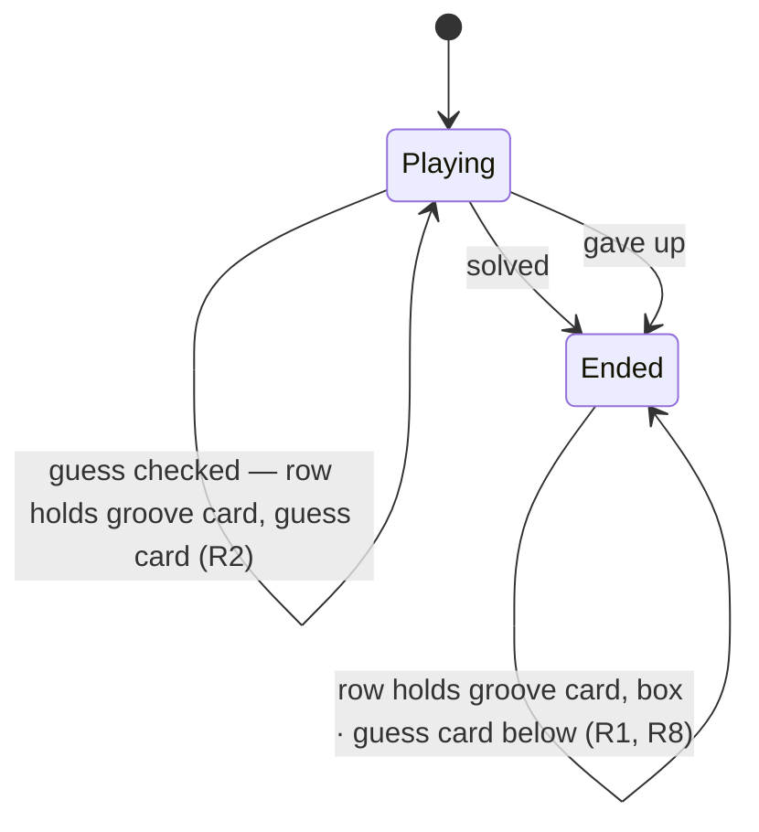

# PRD — Epic 5: The lesson within reach of the loop

Feature: [briefing.md](../briefing.md) · [roadmap.md](../roadmap.md)

## Summary

When the day ends, the box takes the guess card's place beside the groove card,
and the finished "What is it?" card moves below them both. The lesson is then
level with the transport Sam is playing along to, instead of two cards below it.
Nothing about either card changes but its position.

## Problem

Sam solves the day, presses play, and picks up the guitar. The notes and the
changes are below both cards, off the top of a phone screen. The app already
knows this is a problem — `GrooveCard`'s own comment says the panel is "below
both cards and out of view while you are playing along", which is why feature-12
pushed the answer onto the card's meta line. The key made it up there; the notes
and the changes never did, and they are the two things you cannot jam over a
loop without.

The persona line this serves is the last one in the list: "to pick up the
instrument afterwards, if the groove is a good one". A lesson you have to scroll
away from the transport to read is a lesson read once.

## Scope

- The order of two siblings in `GroovePuzzle`, once the day has ended.

**Out of scope**
- **Jam mode, tempo control, transpose, count-in.** All separate candidates in
  `specs/features.md`, and none needed to read a line while a loop plays.
- **Any change to the transport, the progress track or the play control.**
- **Sticky, collapsible or floating treatments.** The order changes; no component
  learns new behaviour.
- **Any change to the box's content** — Epics 1–4.
- **Any trimming of the groove card to make vertical room.** Its meta line, its
  spacing and its transport are untouched; R6 is a target and is not paid for out
  of another component.
- **Rebuilding either card.** Only their positions change.

## Requirements

- **R1** — Once the day has ended, the box occupies the second column of the
  two-column row, beside the groove card, and the guess card moves below the row.
  At the widths where the row collapses to one column the resulting order is
  groove card, box, guess card.
- **R1a** — The box's first line therefore sits level with the play control
  rather than below the whole groove card: the lesson and the transport are read
  together, which is the entire point of the epic.
- **R1c** — Two boxes side by side are the same height. Above the collapse point
  the row's columns stretch to the taller of the two and the card or panel
  inside each fills its column, so neither box ends short of its neighbour. Two
  boxes of different heights read as one unfinished, and this holds in both
  states — the groove card beside the guess card, and the groove card beside the
  box.
- **R1b** — The groove card does not move. It is the row's first child before and
  after, so the loop Sam is playing along to is never interrupted by the
  placement change.
- **R2** — Until the day has ended, nothing moves. There is no box to place while
  the puzzle is unsolved, so mid-puzzle order is untouched and no state is
  introduced to describe it.
- **R3** — The guess card changes position and nothing else: not hidden, not
  collapsed, not summarised, not stripped of its chips, and not reordered at one
  width only. It is the record of how the day was played — feature-11 Epic 4
  keeps its switch visible for that reason — and it is the evidence for the guess
  Epic 4's line is discussing.
- **R3a** — Moving the guess card out of the row re-parents it, so its subtree is
  re-created at the moment the day ends. That is acceptable, and it is acceptable
  because of R1b: what must not be re-created is the groove card, whose transport
  is sounding. The guess card holds no state of its own — its selection, its dots
  and its feedback are all props from the session — so it re-renders identically.
- **R4** — The box keeps `role="status"` and is announced once. Solving is a
  result to announce, not an interruption to acknowledge, so the move must not
  turn it into a dialog and must not produce a second live region.
- **R5** — The move takes no focus away that the day's ending had not already
  taken. The check button disables the instant the day is solved and the give-up
  button unmounts on a reveal, so the element that ended the day stops being
  focusable either way — this epic must not add a second loss on top of that, and
  must not move the viewport out from under the finger that pressed it.
- **R5a** — The page does not scroll when the day ends. The box appears above and
  Sam scrolls up to it, or does not. A page that jumps under the finger that just
  pressed a button is exactly the interruption R4 exists to avoid, the answer is
  already announced through the live region, and "a win in two minutes, on the
  phone" does not survive the app moving the viewport on its own.
- **R5b** — Nothing else is added to make the box's arrival visible from where
  Sam is looking: no marker on the guess card, no pointer, no toast. The
  announcement and the reorder are the whole change.
- **R6** — Having the play control and the box's first line on screen together at
  360px is the point of the reorder and the target to design to — Sam plays on a
  phone in twenty minutes before dinner — but it is a target, not a pass/fail
  criterion. Where the groove card's own height makes both impossible, the phone
  gets whatever fits and the epic is still done. Nothing is cut from another card
  to buy the room.
- **R6a** — In particular the groove card keeps the answer feature-12 added to
  its meta line. It is a few pixels of duplication with the box below it, and it
  is what a player reads while jamming with the box scrolled away.
- **R7** — Document order is the visual order. The box is moved in the markup,
  not positioned over the page with CSS, so a screen reader and a sighted reader
  meet the day's payoff at the same point.
- **R8** — Both terminal states place the box identically. A day given up on is a
  day ended.

## Behaviour details

`GroovePuzzle` renders a two-column row — the groove card and the guess card —
and then the box after it, behind `solved || revealed`. This epic changes what
the row's second column holds and where the guess card lives. One condition, two
layouts, no animation and no third state.

```
Playing (≥ md)                        Ended (≥ md)
┌──────────────┬──────────────┐       ┌──────────────┬──────────────┐
│ GrooveCard   │ What is it?  │       │ GrooveCard   │ SolvedPanel  │
│  (transport) │              │       │  (transport) │              │
└──────────────┴──────────────┘       └──────────────┴──────────────┘
                                      ┌─────────────────────────────┐
                                      │ What is it?                 │
                                      └─────────────────────────────┘
```

Below the row's collapse width both layouts are a single column, and the ended
one reads groove card, box, guess card — the same order a screen reader meets,
because it is document order either way (R7).



## Acceptance criteria

- **AC1** (R1) — Given a solved day, when the page renders, then the row's two
  children are the groove card and the box, in that order, and the guess card is
  a sibling after the row — so document order is groove card, box, guess card.
- **AC1a** (R1a, R1c) — Given a solved day, then the box is the row's second
  column and the row overrides none of flexbox's own alignment, so the two
  columns share both edges: the box's first line and the play control sit in one
  horizontal band, and the two boxes are the same height.
- **AC1c** (R1c) — Given either state, then each column is a one-cell grid, so
  the card or panel inside it fills the height the column was stretched to
  rather than sitting content-height within it.
- **AC1b** (R1b) — Given the transition from unsolved to solved, then the groove
  card's DOM node is the same node before and after, and the audio element it
  contains is not re-created.
- **AC2** (R8) — Given a day given up on, then the order is the same as a solved
  day's.
- **AC3** (R2) — Given an unsolved day with two guesses spent, then the groove
  card and guess card are in the order they are today and no box is present.
- **AC4** (R3) — Given a finished day, then the guess card is still rendered
  below the row with its chips, its dots, its feedback line and its mode switch,
  and with the same props it had inside the row.
- **AC5** (R4) — Given a finished day, when the page is inspected, then the box
  is a single `role="status"` region with no nested one inside it, and no
  `dialog`, `aria-modal` or `alert` role appears anywhere. The page as a whole
  carries two status regions once the day ends, not one: `FeedbackLine` inside
  the guess card has been `role="status" aria-live="polite"` since feature-3, and
  this epic neither adds nor removes one.
- **AC6** (R5) — Given focus on the check button, when the guess is correct, then
  the check button is disabled — which is feature-11's behaviour, not this
  epic's — and no other element is focused by the move. The guess card is
  re-created by its re-parenting (R3a) and nothing steals focus in the process.
- **AC7** (R6) — Given a 360px viewport, when the day is solved, then the box
  renders between the groove card and the guess card with no element of its own
  overflowing the viewport horizontally. Whether its first line and the play
  control fit vertically together is measured at review, not asserted.
- **AC7a** (R1, R3) — Given a finished day at a width above the row's collapse
  point, then the box and the groove card each occupy one column of the row, and
  the guess card below occupies **one column's width, not the page's**. Below
  the collapse point it is full width, as it is inside the row.
- **AC7b** (R3) — Given a finished day, then the width below the row is derived
  from the same `gap` and the same collapse point as the row itself, not from a
  second number that could drift from it.
- **AC9** (R5a) — Given focus on the check button, when the guess is correct,
  then no programmatic scroll is performed.
- **AC10** (R6a) — Given a finished day, then the groove card's meta line still
  names the answer.
- **AC8** (R7) — Given the rendered markup, then no absolute or fixed positioning
  and no CSS `order` is used to achieve the placement.

## Dependencies

**Needs Epic 1**, and only because there is no point moving the box before the
line worth reading is in it. The dependency is on Epic 1 being shipped, not on
any contract, so this epic waits rather than running against a signature.

Hands nothing forward. It is the last epic.

## Assumptions

- `GroovePuzzle`'s existing `solved || revealed` condition is reused. No new
  state, no new prop, no derived flag.
- The shared-groove page reorders the same way. It renders the same components
  and Sam meets the same problem there.
- No animation or transition on the move. The box appears where it appears; a
  card sliding past the transport is motion for its own sake.


## Question log

Answered questions, kept for traceability. The requirements above are the source
of truth — this records how they got there. Append-only: never rewrite or prune a
past cycle, or the record stops being trustworthy.

### Cycle 1 — 2026-09-01

**Q1. When the day ends, does the page scroll to the box?**
Answer: **A) No scrolling; the box appears and Sam scrolls up if they want it** —
a page that jumps under the finger that pressed the button is the interruption
the live region exists to avoid, and the result is already announced.
Applied to: R5a, R5b, AC9

**Q2. What happens on the narrowest phones if the play control and the box's
first line cannot both fit?**
Answer: **D) Accept it — R6 becomes a target rather than a criterion** — the
phone gets whatever fits, and no other card is trimmed to buy the room. This
replaces R6 as originally written, which made the fit a pass/fail condition, and
keeps feature-12's answer on the groove card's meta line.
Applied to: R6, R6a, AC7, AC10, Out of scope

### Cycle 4 — 2026-09-01

**Change of layout: the box takes the guess card's column, and the guess card
moves below the row.**
Answer: **the box is the row's second child beside the groove card; "What is it?"
drops below both** — asked for directly, after seeing what the first shape
actually produced.
Supersedes: R1 as originally written ("above the guess card and below the groove
card"), which put the box *inside the first column under the groove card* and so
left the lesson below the whole transport at desktop width — the opposite of what
the epic is for. Below the row's collapse width the two shapes are identical; they
differed only at desktop.
Cost accepted: re-parenting the guess card re-creates its subtree when the day
ends. It holds no state of its own, and the groove card — the one whose transport
is sounding — does not move, which is why the cost is acceptable rather than
merely small. R5 and AC6 were reworded because "focus is unchanged" was already
untrue of the day's ending: the check button disables itself the moment the day is
solved.
Applied to: R1, R1a, R1b, R3, R3a, R5, Summary, Behaviour details, AC1, AC1a,
AC1b, AC4, AC6, AC7a, Out of scope

### Cycle 5 — 2026-09-01

**Two changes asked for after the epic was built, both from looking at it.**

**The guess card keeps one column's width below the row.** Asked for directly:
"when the 'What is it?' box moves to the bottom. Can it please only span half the
screen for bigger screens? It is because when it is next to the GrooveBox, it
also only spans half the screen. On smaller screens, it looks perfect."
Supersedes AC7a's original clause, "the guess card occupies the full width below
it". A record that doubles in size on the way down reads as a promotion, which is
the opposite of what moving it below is for.
Applied to: R3, AC7a, AC7b

**Boxes side by side are the same height.** Asked for directly: "boxes next to
each other should always have the same height." The row was top-aligned
(`align="start"`), which aligns the tops and leaves the shorter column short;
removing the override restores flexbox's own stretch, which aligns both edges.
R1a's "the row is top-aligned" was the *mechanism* named as the requirement, and
the requirement was only ever that the first line and the play control are read
together — stretching keeps that and adds equal height, so R1a keeps its
substance and loses a sentence about how.
One correction to the question as asked: the row is flexbox, not the grid. The
grid is `LeadSheet`'s. Equal height is flexbox's default, switched off by that
one class; the columns are now one-cell grids so the card inside fills the
stretched column, which is the half a bare `items-stretch` would not do.
Applied to: R1a, R1c, AC1a, AC1c
