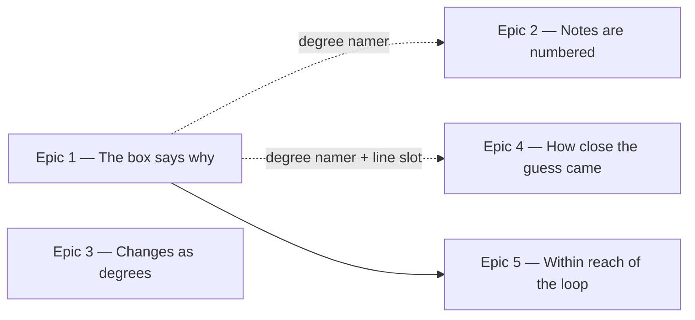

# Roadmap — Explain the Answer

Source: [briefing.md](briefing.md)

## Overview

The box at the end of a finished day names the answer and draws its notes. It
never says what made the groove sound that way, so Sam closes the day knowing
only whether the guess was right — and the one line of prose in the box is spent
on the score, which the header pill and the dot row already carry. This feature
turns it into the day's lesson: one line saying why it is that mode, the notes
numbered as degrees, the changes read as degrees of the key, and a line saying
how near the guess actually came.

**It stays one screen, read in twenty seconds.** Sam has "twenty minutes before
dinner" and abandoned three theory courses "because a course is homework"; every
epic below adds at most a line or a row of numbers to a drawing that already
exists. Nothing here makes a sound — hearing a mode is
[feature-c](../feature-16/briefing.md)'s job, and that briefing excludes theory
text for the same reason this one excludes audio. They are two halves of one
payoff and neither blocks the other.

Every question this roadmap raised is settled and written in as fact: Epic 3
takes each chord's degree from the generator through the manifest and prints it
as a plain Roman numeral, the near-miss line stays out of simple mode, Epic 5
moves the box above the finished guess card and leaves that card otherwise
untouched, the tries wording is dropped rather than rehoused, and the track
references do not ship — that sixth epic is gone from this roadmap and back in
`specs/features.md` as a candidate.

Epic 1 is the thinnest version of the whole idea — the box says why — and it
pins the one thing the later epics read: a degree-naming function. Epic 3
depends on nothing and can go first if it is easier to schedule.

## Epics

### Epic 1 — The box says why it is that mode

**Visible when done:** Sam solves the day. Where the box read `E♭ Blues` and
`solved in one try · streak now 4`, it now reads `E♭ Blues` and the thing that
was missing: *the ♭5 sitting between the 4 and the 5 — that's the blue note*.
The score is gone from the box; the streak pill and the dot row still carry it.
**Depends on:** none
**Parallel with:** Epic 3

**Scope**
- **A per-mode character table, in the feature's `lib/theory/`.** For each mode,
  the degree or degrees that characterise it and one line of plain language
  reading it out. Mixolydian is major with a ♭7; Dorian is minor with a natural
  6. This is the feature's one new body of written content and its quality *is*
  the feature.
- **Written for someone who plays and does not read.** Sam is lost by "naked
  theory vocabulary": the line says "major with a ♭7", never "the
  characteristic pitch of the Mixolydian mode". No word that needs a glossary,
  or the line has re-created the gap it exists to close.
- **Total over every mode the rotation can play, enforced by a test that reads
  the shipped manifest.** `lib/theory/families.ts` has exactly this problem and
  its test solves it this way, because a hardcoded mode list passes on precisely
  the day a thirteenth mode is minted. A mode with no line is a blank payoff on
  that mode's day.
- **A degree-naming function, beside `notes.ts`.** `FLAVOUR_INTERVALS` already
  holds the semitones, so the labels fall out of it: Mixolydian → `1 2 3 4 5 6
  ♭7`, blues → `1 ♭3 4 ♭5 5 ♭7`. **This signature is the contract Epics 2 and 4
  build against — pin it here and both can run in parallel.** The blues scale is
  the exception that shapes it: six degrees, and its ♭5 and 5 share a letter,
  which is why `notes.ts` already carries `FLAVOUR_LETTER_STEPS`.
- **The score leaves the box and does not reappear.** The subline is where the
  lesson goes, so the tries-and-streak sentence cannot stay in it. The streak
  needs no new home — `StreakBadge` is in the page header. The tries count needs
  none either: the dot row's label already reads `Solved`, and Sam wants "one
  thing per day, not a streak of guilt", so a count restated in prose is exactly
  the scorekeeping the box is being cleared of.
- **The give-up path gets the same line.** A revealed day already shows the same
  solution with the win claim dropped (feature-7 R10, R10a); with the score gone
  the two paths nearly converge, so check whether the `revealed` branch still
  needs to exist at all.

**Out of scope**
- Degrees under the staff — Epic 2, against this epic's function.
- Numerals under the lead sheet — Epic 3. Comparing against the guess — Epic 4.
  Where the box sits — Epic 5.
- Any sound, and any translation. The lines are English strings like every
  other; feature-b will collect them with the rest.

**Validation**
- Demo: solve a Mixolydian day and read the line; give up on a blues day and
  read the same line with no streak claim.
- Unit tests for the degree namer over every flavour in `FLAVOUR_INTERVALS`,
  blues included.
- A manifest-derived test that every playable mode has a line — the
  `families.test.ts` pattern, not a hardcoded list.
- `SolvedPanel.test.tsx`: the line present, "tries" and "streak" absent, and the
  tests that asserted the old subline rewritten rather than deleted.

### Epic 2 — The notes are numbered

**Visible when done:** under the staff, each note carries its degree — `1 2 3 4
5 6 ♭7` — so Sam, who learned by tab and by shapes, reads a pattern that moves
to the neck in any key instead of seven facts about one.
**Depends on:** Epic 1, for the degree-naming function only. Once that signature
is pinned this can be built against it.
**Parallel with:** Epic 4

**Scope**
- **A degree label under each notehead in `ScaleStaff`,** aligned to the
  notehead's own x, computed from the geometry the noteheads already use — so a
  number cannot drift out of step with its note.
- **The blues scale is the whole test of the epic.** `C blues` is `C E♭ F G♭ G
  B♭`: six notes, two of them on the same step, and the drawing already gives
  the second extra advance for its accidental. The row is whatever the degree
  namer returns, never `1..7` counted out.
- **`ScaleStaff` derives nothing.** It takes the labels as a prop, in note
  order, and draws them. It never sees the answer or the interval table.
- **The accessible label names degree and note together.** Worth knowing: the
  note names are not on screen today at all — `ScaleStaff` spends them on
  `aria-label`, so a sighted player reads noteheads and nothing else. The
  numbers must not become a second sighted-only layer.
- **Legible on the inverted surface, in both palettes, at 360px.** Ink from
  `currentColor` like the rest of the drawing; a caption to the notes, not a
  second voice competing with them.

**Out of scope**
- Any change to noteheads, clef, ledger lines, accidentals or spacing.
  Feature-11 finished that drawing; this adds a row under it.
- Rhythm, stems, beams, key or time signature. Still a picture of a scale.
- The lead sheet's numerals — Epic 3, and a different notation: scale degrees
  are arabic, the changes are not.
- Interval names — "minor seventh", "tritone". Numbers only.

**Validation**
- Demo: solve a seven-note day and a blues day; the numbers line up under the
  notes and the count matches.
- `ScaleStaff` component tests against the new prop, including the six-degree
  case and the two notes sharing a step.
- A test that the accessible name pairs each degree with its note.

### Epic 3 — The changes read as degrees of the key

**Visible when done:** the lead sheet carries a Roman numeral under each bar —
`I · IV · I · V` under `E♭7 · A♭7 · E♭7 · B♭7` — so the progression Sam has
played a thousand times without knowing its name is recognisable as the shape it
is.
**Depends on:** none
**Parallel with:** Epic 1

**Scope**
- **A numeral per bar, under the `LeadSheet`'s existing four bars.** `barChords`
  already maps the progression onto the figure with the generator's own
  arithmetic — a three-chord progression plays `1 2 3 1`, so bar four is a return
  and takes bar one's numeral. Reuse that function; do not re-derive it. The
  bars already carry air below the symbol (`pb-9`), which is where the numeral
  goes.
- **The degree comes from the generator, carried outward in the manifest.**
  `scripts/grooves/theory/harmony.ts` already computes `progressionDegrees` when
  it builds the progression. `Groove` in `src/lib/groove.ts` gains the field,
  `scripts/grooves/manifest.ts` writes it, and `npm run grooves` re-derives
  `grooves.generated.ts`. **No audio changes:** a render is a function of its
  seed, the catalogue holds nothing but seeds, and the seeds are untouched. The
  app does not parse chord symbols back into degrees — the generator knows the
  answer, and a parser would be a second source of truth waiting to disagree.
- **The field is optional on `Groove`, as `loopBars` is.** The manifest omits a
  field an entry does not carry, so a manifest written before this existed still
  type-checks; where the degrees are missing the numerals are missing and the
  bars are not.
- **The numerals are plain: the degree, and nothing about the chord's quality.**
  Upper case throughout, no lower case for minor and no `ø` for
  half-diminished. The quality is already written above the numeral — the
  catalogue spells `maj7`, `m7`, `7`, `m7♭5` and `maj7♯5` on the symbol — so the
  numeral answers the one question the symbol cannot: which degree of the key
  this is. `C♯m7♭5` in E dorian reads `VI` with its own symbol above it.
- **The numeral does carry the degree's accidental, because that is which degree
  it is and not what quality it has.** A chord on the blues scale's fourth
  degree is `♭V`, not `IV`: the scale is `1 ♭3 4 ♭5 5 ♭7`, and a numeral that
  loses the flat names a degree the groove never plays. The accidental comes
  from `FLAVOUR_INTERVALS`, which already ships — so this epic still depends on
  nothing. Where Epic 1's degree namer lands first, the numeral is its label with
  the arabic number Romanised, so the sheet and the staff can never disagree.
- **Same hand as the sheet.** Lettering on a Real Book page — `font-jazz` at a
  small size, legible on the inverted surface in both palettes — not a table
  under a chart.

**Out of scope**
- Functional names — tonic, subdominant, dominant. Numerals only.
- The chord symbols over the progress track (feature-11 Epic 3). Those stay
  symbols; this lives in the box.
- Any change to what the grooves sound like. The regeneration is derived from
  the same seeds and every audio file is untouched.

**Validation**
- Demo: solve a day with a three-chord progression and read bar four's numeral
  against bar one's.
- Unit tests over every progression in the shipped manifest — not a sample —
  asserting a numeral for every bar and no crash on any quality the catalogue
  writes.
- The generator's manifest test extended to the new field; `LeadSheet` component
  tests against the new prop.

### Epic 4 — How close the guess actually came

**Visible when done:** guess Dorian on a Mixolydian day and the box says *you
said Dorian — one note apart: its 3rd is flat, this one's natural*. A near miss
and a wild stab stop looking identical, which is the correction Sam can actually
carry to tomorrow.
**Depends on:** Epic 1, for the degree namer and the box's line slot.
**Parallel with:** Epic 2

**Scope**
- **Compare the two interval sets and name the difference.** Both modes are in
  `FLAVOUR_INTERVALS`; the difference is a set operation over degrees and the
  wording is about which degrees moved. Plain functions in `lib/theory/`, tested
  directly.
- **The comparison is against the last incorrect attempt** — the guess still on
  screen, and the one Sam last believed.
- **The root is a separate axis and must not be conflated.** `Attempt` already
  stores `rootMatched` and `flavourMatched` separately: right mode, wrong root
  deserves a different sentence from one note off in the mode.
- **A day played in simple mode gets no near-miss line.** A simple-mode guess is
  scored against `familyOf(answer)`, so the stored `flavour` is `Major` or
  `Minor` — a family with no intervals to compare. The game asked a different
  question there, and answering it with mode distance answers something Sam
  never guessed. It is also the safe path: `FLAVOUR_INTERVALS` is never reached
  with a family, so `UnknownFlavourError` cannot fire on the payoff panel.
- **Nothing to say is a valid outcome.** A first-guess solve has no wrong
  attempt; a day given up on without guessing has none either. The line is
  absent, not empty.
- **A distant miss needs different words from a near one.** "Four notes apart"
  is not a lesson. Where the two modes barely overlap the line says so plainly
  rather than listing degrees.

**Out of scope**
- Any change to scoring, to the dot row, or to the mid-puzzle feedback line.
  This reads attempts after the day has ended.
- Statistics across days — which modes are habitually missed is a different
  feature and needs storage this one does not touch.

**Validation**
- Demo: miss with a one-note-away mode, then with a distant one, then with the
  right mode and the wrong root — three different sentences.
- Unit tests for the comparison over every pair of modes the catalogue can play,
  including the blues scale against a seven-note mode.
- A test that a simple-mode attempt never reaches the interval tables.
- `SolvedPanel.test.tsx`: no line on a first-guess solve.

### Epic 5 — The lesson within reach of the loop

**Visible when done:** the day ends and the box takes the guess card's place
beside the groove card, with the finished "What is it?" card dropping below them
both — so the lesson sits level with the transport Sam is playing along to,
instead of two cards below it.
**Depends on:** Epic 1 — there is no point moving the box before the line worth
reading is in it.
**Parallel with:** nothing; it is the last epic and it wants the box's content
settled.

**Scope**
- **The box becomes the second column of the two-column row, and the guess card
  moves below the row.** Mid-puzzle nothing changes: there is no box to place
  until the day is over, and the row still holds the groove card and the guess
  card. At the widths where the row collapses to one column the order reads
  groove card, box, guess card.
- **The box's first line ends up level with the play control**, because the row
  is top-aligned. That is the whole point: putting the box merely *under* the
  groove card would leave the lesson below the transport, the caption and the
  play control at desktop width — which is the problem restated, not solved.
- **The groove card does not move.** It is the row's first child before and
  after, so the loop being played along to is never re-created.
- **The friction is real and already documented in the code.** `GrooveCard`'s
  comment says the panel is "below both cards and out of view while you are
  playing along" — feature-12 pushed the answer onto the card's meta line for
  exactly this reason. The key made it up there; the notes and the changes never
  did.
- **The guess card changes position and nothing else.** It is the record of how
  the day was played, and feature-11 Epic 4 deliberately keeps its switch visible
  for that reason — hiding it would remove the evidence for the guess Epic 4's
  line is discussing. Not collapsed, not summarised, not stripped of its chips,
  and not reordered at one width only. Leaving the row does re-create its
  subtree; it holds no state of its own, so that costs nothing a player can see.
- **The box keeps `role="status"` and is announced once.** Solving is a result to
  announce, not an interruption to acknowledge. Reordering must not turn it into
  a dialog or produce a second live region.
- **Phone first.** Sam plays on a phone. A layout that reads well at desktop
  width and pushes the play button off a 360px screen has failed.
- **The box is one column wide at desktop.** That is a real consequence and the
  epic owns checking it: the staff is natural-width and the lead sheet is a four
  across a column, so both have to still read at half the container.

**Out of scope**
- Jam mode, tempo control, transpose, count-in — all separate candidates in
  `specs/features.md`, and none needed to read a line while a loop plays.
- Any change to the transport, the progress track or the play control.
- Sticky, collapsible or floating treatments. The order changes; the components
  do not learn new behaviour.

**Validation**
- Demo: at 360px, end the day, press play, and read the lesson without losing
  the transport. Then at desktop width, check the box reads at one column.
- A `GroovePuzzle` test for the order in both terminal states and for the
  unchanged mid-puzzle order.
- A test that the groove card's DOM node survives the transition, so the
  transport is provably not re-created.
- A test that the box is one `role="status"` region containing no other. The page
  carries two once the day ends — `FeedbackLine` has been one since feature-3 —
  and this epic changes neither.

## Dependency map

## Execution waves

- **Wave 0:** the box and its two drawings move into their own component region,
  `components/solved/`. It is one mechanical step — Epic 1's Step A0 — and it
  runs alone, because Epic 3 edits `LeadSheet.tsx` and cannot have the file move
  underneath it.
- **Wave 1 (parallel):** Epic 1, Epic 3 — in their `lib/`, generator and drawing
  tracks. Epic 3 needs nothing from Epic 1: it derives its degrees from
  `FLAVOUR_INTERVALS` and `FLAVOUR_LETTER_STEPS`, which already ship.
- **Wave 2 (parallel):** Epic 2, Epic 4 — both against Epic 1's degree-naming
  signature, in their own `lib/` and component files.
- **Wave 3:** Epic 5 — the box's content is settled by then, which is what a
  reorder wants.

**The one place the waves are not file-disjoint, and dispatch must respect it.**
Epics 1, 2, 3 and 4 all end by composing something into
`components/solved/SolvedPanel.tsx`: the character line, the staff's degrees, the
sheet's numerals, the near-miss line. There is no way around it — the panel is
what renders all four, and pushing the derivation down into `LeadSheet` or
`ScaleStaff` would break the "derives nothing" contract that makes those two
drawings reusable. So the parallelism is real at the level of **tracks, not
epics**: every `lib/` and generator track runs concurrently, and the four
panel-composition steps are sequenced one after another in epic order. A lead
that dispatches whole epics in parallel will collide on that one file; a lead
that dispatches tracks will not. Epic 5 touches `GroovePuzzle.tsx` and not the
panel, which is a second reason it sits last.

## Assumptions

- **No audio, and no sound changes.** The briefing says so, and it is what keeps
  this feature independent of feature-c. Epic 3's regeneration is derived from
  the same seeds: no groove is re-rendered.
- **Note names and degrees, not degrees instead of names.** The briefing settles
  it; the panel already spells the notes correctly and that work stands.
- **The box shows the same lesson on a give-up.** Feature-7 established that the
  solution is what the player asked for and only the win claim is dropped.
- **Every playable mode must be covered, enforced by a manifest-derived test.**
  Epic 1's table inherits `families.ts`'s hard-won lesson: a hardcoded mode list
  fails on the day a thirteenth mode is minted, in production, on the payoff
  panel.
- **The box stays one `role="status"` region and one screen.** No tabs, no
  accordion of theory, no "learn more".
- **No new runtime dependency.** The app runs on four packages and stays there.
- **A Roman numeral is written from the degree's own accidental**, so a mode's
  altered degrees read `♭III`, `♭V`, `♭VII`. The alternative — numbering every
  chord against the plain major scale — would print numerals for degrees the
  day's scale does not contain.

