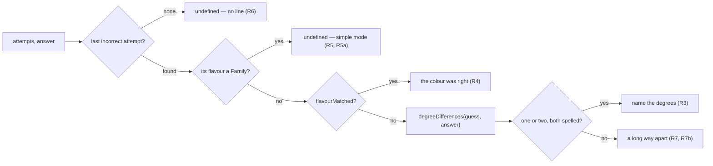

# Tech spec — Epic 4: How close the guess actually came

PRD: [../prd/epic-4-how-close-the-guess-came.md](../prd/epic-4-how-close-the-guess-came.md) ·
Roadmap: [../roadmap.md](../roadmap.md)

## Approach

Three modules in a line: a comparison, a sentence, and a second paragraph in the
box. `degreeDifferences` in `lib/theory/` is set arithmetic over the degree
labels Epic 1's `scaleDegrees` already produces — it takes two flavours, returns
the degree numbers they disagree at, and knows nothing about attempts, panels or
prose. `selectNearMiss` in `lib/presentation/` reads the day's attempts, finds
the last incorrect one, decides which of four sentences the day gets, and returns
a string or `undefined`; it is the direct sibling of `selectFeedback`, which has
been choosing a message from attempts by pure function since feature-3.
`SolvedPanel` gains one prop — the day's attempts — calls that function, and
renders the result as a second line under Epic 1's character line, inside the
same `role="status"`.

The split is where the two guards live, and that is the point of it. The
comparison **throws** on a flavour the interval table does not hold, exactly as
`scaleNotes` does. The sentence **refuses to ask** — it returns `undefined` for a
simple-mode guess before the table is touched. R5a is that arrangement written
down: the payoff panel cannot raise `UnknownFlavourError` on a simple-mode day
because the family never reaches the arithmetic that would throw.

## Architecture

This epic runs in the feature's **Wave 2**, after Epic 1. Every path below is a
post-`Step A0` path: `SolvedPanel.tsx` lives in
`src/features/daily-groove/components/solved/`, and the props this epic extends
are the ones Epic 1's Track D leaves behind — `answer`, `progression`,
`revealed`, with `tries` and `streak` already gone. Track C edits the same file
and the same JSX block as Epic 1's Step D2, so the two are sequential by the
roadmap's own waves; nothing here is parallel with Epic 1.

Both new modules go in folders that already exist. `lib/` still holds exactly
six concern folders and `structure.test.ts` is untouched: the theory of which
degrees separate two scales is `theory/`, and the choice of words for it is
`presentation/`, beside `date.ts` and `feedback.ts`. No component is added, so
the region lists are untouched too, and the feature's `index.ts` gains nothing —
the line is internal to the box, and the slice stays as removable as it was.



Two decisions worth disagreeing with before reading the steps.

**The comparison is keyed by degree number, not by a flat set of labels.** A
symmetric difference over label sets would report Dorian against Mixolydian as
`['♭3','3']` — two elements for what is one differing degree, and R7's threshold
would then count wrong on the epic's headline case. Grouping by degree number
also gives the blues scale somewhere to put both of its fifths: at degree 5 it
spells `['♭5','5']` where a seven-note mode spells `['5']`, so the disagreement
is visible rather than averaged away.

**The panel takes `attempts`, not a finished string.** Feature-12 pushed
`metaLine` out to the view because `GrooveCard` was branching on a mode; this
panel is the opposite case. It already derives its whole content from `answer` —
`scaleNotes`, `barChords`, `staffNotes`, and Epic 1's `characterOf` — so the
attempts are simply the second thing it derives from, and Epic 1's Step D1 set
that precedent one line above. Handing it a prepared sentence would put a
presentation call in `GroovePuzzle.tsx`, whose import list is already the file's
documented smell.

Over the twelve modes the manifest plays there are 132 ordered pairs, and they
fall 28 / 38 / 66: twenty-eight differ at one degree, thirty-eight at two, and
sixty-six at three or more. Half of all misses therefore get the plain wording,
which is R7b's point — it is the ordinary sentence, not the fallback — and the
other half get a degree named, which is the epic.

**The degree number is read back off Epic 1's label, not re-derived.** A label
is an accidental followed by a number, by `scaleDegrees`' frozen contract, so
`'♭3'` yields `3` with one regex. Re-deriving the number from
`FLAVOUR_INTERVALS` would put a second copy of Epic 1's Step B2 arithmetic — the
part that makes the blues fourth read `♭5` and not `♭4` — in a second file, and
the two would disagree the first time either was corrected.

## Contracts

Frozen. Track B builds against the first while Track A implements it.

```ts
// src/features/daily-groove/lib/theory/difference.ts
import type { Flavour } from '../../types'

/** One degree number the two scales disagree at. */
export type DegreeDifference = {
  /** The degree number, 1–7. */
  number: number
  /**
   * How the guessed scale spells that degree, in scale order: `['♭3']`,
   * `['♭5','5']` on the blues fifth, `[]` where it has no note there at all.
   */
  guess: string[]
  /** How the answer spells it, same convention. */
  answer: string[]
}

/**
 * Every degree number at which two scales disagree, ascending. `[]` when they
 * are the same scale. Takes flavours and no root, because a degree difference
 * is the same difference in every key (R7a).
 *
 * Throws `UnknownFlavourError` — the class `notes.ts` already exports — when
 * either flavour has no entry in `FLAVOUR_INTERVALS`. That throw is what
 * `selectNearMiss`' guard exists to keep off the panel.
 */
export function degreeDifferences(guess: Flavour, answer: Flavour): DegreeDifference[]
```

```ts
// src/features/daily-groove/lib/presentation/nearMiss.ts
import type { Answer, Attempt } from '../../types'

/**
 * The near-miss line for a finished day, or `undefined` where there is nothing
 * to say — no incorrect attempt, or one made in simple mode.
 *
 * Reads the last incorrect attempt and the answer, and nothing about how the
 * day ended: a solved day and a given-up day get the same sentence (R11).
 */
export function selectNearMiss(attempts: Attempt[], answer: Answer): string | undefined
```

```ts
// src/features/daily-groove/components/solved/SolvedPanel.tsx
type SolvedPanelProps = {
  answer: Answer
  progression: string
  revealed: boolean
  /**
   * The day's attempts, in the order they were checked. The panel reads only
   * the last incorrect one, and reads it through `selectNearMiss`.
   */
  attempts: Attempt[]
}
```

Consumed from Epic 1, unchanged:

```ts
// src/features/daily-groove/lib/theory/degrees.ts
export function scaleDegrees(answer: Answer): string[]   // ['1','2','♭3',…]
```

### The four sentences

The wording is frozen with the contracts, because Track C asserts the rendered
string and every branch has to fit R8's ceiling with the longest mode name the
manifest carries (`Phrygian dominant`, seventeen characters).

| the last incorrect guess | the line |
| :-- | :-- |
| one differing degree | `You said Dorian — one note apart: ♭3, not 3.` |
| two differing degrees | `You said Lydian — two notes apart: ♯4 and 7, not 4 and ♭7.` |
| three or more, or a length mismatch | `You said Blues — a long way from this one, not a near miss.` |
| right colour, wrong root | `You said Dorian — the colour was right, not the home note.` |
| no incorrect guess, or a simple-mode one | *(no line at all)* |

Every line opens `You said ` — including the right-colour one, which is why
Track C can assert presence and absence with one stable pattern rather than four.
"Colour" rather than "mode" is `feedback.ts`' existing word for the flavour half
of a guess, and it is the one that stays honest when the guess is `Blues`, which
Epic 1's Step C4 forbids calling a mode.

## Tracks

### Track A — Where the two scales disagree

- **Goal** — `degreeDifferences` returns the differing degree numbers for every
  pair of scales the catalogue can play, blues included, and throws for anything
  the interval table does not hold.
- **Owns** — `src/features/daily-groove/lib/theory/difference.ts`,
  `src/features/daily-groove/lib/theory/difference.test.ts`
- **Role** — `implementer`
- **Depends on** — Epic 1's `scaleDegrees` (landed) and the `DegreeDifference`
  contract
- **Parallel with** — Track B
- **Done when** — its own tests pass; nothing else needs to exist.

A new file rather than an addition to `degrees.ts`: Epic 1 owns that file, and
Epic 4's comparison is a consumer of its output, not a second export of it.

### Track B — What the line says

- **Goal** — `selectNearMiss` picks one of four sentences or none, from the
  attempts alone, and never reaches the interval table with a family.
- **Owns** — `src/features/daily-groove/lib/presentation/nearMiss.ts`,
  `src/features/daily-groove/lib/presentation/nearMiss.test.ts`
- **Role** — `implementer`
- **Depends on** — the `degreeDifferences` contract. Steps B1–B4 and B9 go green
  with no theory module present at all; B5–B8 go green as soon as Track A lands.
- **Parallel with** — Track A
- **Done when** — all its own tests pass with Track A's real function — no stub,
  and no `vi.mock` of `../theory/difference`, which would be a mocked internal
  path.

### Track C — The box carries the second line

- **Goal** — the panel renders the near-miss line under the character line, in
  the one status region, absent where there is nothing to say, identical on a
  day given up on; and `GroovePuzzle` hands over the attempts it already holds.
- **Owns** — `src/features/daily-groove/components/solved/SolvedPanel.tsx` and
  its test, `src/features/daily-groove/components/GroovePuzzle.tsx` (the panel's
  props only), `src/features/daily-groove/components/GroovePuzzle.page.test.tsx`
- **Role** — `implementer`
- **Depends on** — `selectNearMiss` **real**. It cannot start against the
  contract: its assertions are the rendered sentence, and the only way to render
  one without the module is to mock it, which `docs/testing.md` rules out.
- **Parallel with** — nothing in this epic.
- **Done when** — the panel's tests and the composed page test pass, and
  `npm test` is green.

## Execution waves

- **Wave 1 (parallel):** Track A, Track B
- **Wave 2:** Track C — needs `selectNearMiss` to exist for real
- **Wave 3:** Integration

**Two scheduling facts the lead needs.**

1. **This epic starts after Epic 1 has landed in full**, not just after its
   contracts are pinned. Track C edits the JSX block Epic 1's Step D2 rewrites,
   and Track A calls a function Epic 1's Track B writes. The roadmap already puts
   Epic 1 in Wave 1 and Epic 4 in Wave 2; this is that ordering, stated so nobody
   reads "parallel with Epic 2" as "parallel with Epic 1".
2. **Track C must not run concurrently with Epic 2's panel work.** Epic 2 puts
   degree labels under the staff, and `SolvedPanel.tsx` is where `ScaleStaff` is
   rendered, so Epic 2 has to pass a new prop from the same file Track C is
   editing. Epics 2 and 4 are parallel in their `lib/` tracks; their panel edits
   are not. Whichever lands second rebases onto the other — the two changes are
   in different parts of the component and do not conflict in substance.

## Implementation

### Track A — Where the two scales disagree

#### Step A1 — Two seven-note modes disagree at the degree that separates them

Covers: R3, R3a, AC1

- **Test first** — `src/features/daily-groove/lib/theory/difference.test.ts`:
  assert `degreeDifferences('Dorian', 'Mixolydian')` equals
  `[{ number: 3, guess: ['♭3'], answer: ['3'] }]` — one entry, because the two
  scales differ at one degree even though two labels are involved. Run it: fails
  with "degreeDifferences is not a function".
- **Implement** — `lib/theory/difference.ts`: for each flavour, take
  `scaleDegrees({ root: 'C', flavour })`, read each label's degree number with
  `Number(label.replace(/\D/g, ''))`, and group the labels into a
  `Map<number, string[]>` in scale order. Walk the union of both maps' keys
  ascending and emit an entry wherever the two arrays are not equal element for
  element. `'C'` is a placeholder root and the contract says why: degrees do not
  depend on it.
- **Green when** — the assertion passes.
- **Refactor** — none.

#### Step A2 — Two differing degrees are both reported, ascending

Covers: R3, R7, AC7a

- **Test first** — same file: assert `degreeDifferences('Lydian', 'Mixolydian')`
  equals
  `[{ number: 4, guess: ['♯4'], answer: ['4'] }, { number: 7, guess: ['7'], answer: ['♭7'] }]`
  — in that order. Assert `degreeDifferences('Phrygian', 'Lydian')` has length
  `5`: the tables disagree at degrees 2, 3, 4, 6 and 7. (The PRD's Behaviour
  details illustrates this pair as four; `[0,1,3,5,7,8,10]` against
  `[0,2,4,6,7,9,11]` is five. Either count is R7's three-or-more branch, so no
  requirement moves — but the test asserts the tables, not the prose.) Assert
  `degreeDifferences('Dorian', 'Dorian')` is `[]`. Run it: fails if the walk
  emits in map-insertion order rather than ascending degree order.
- **Implement** — sort the union of degree numbers numerically before walking it.
- **Green when** — all three assertions pass and A1 stays green.
- **Refactor** — none.

#### Step A3 — The blues fifth carries two spellings, and a missing degree is a disagreement

Covers: R3a, R7b, AC8, AC12

- **Test first** — same file: assert `degreeDifferences('Blues', 'Dorian')`
  equals
  `[{ number: 2, guess: [], answer: ['2'] }, { number: 5, guess: ['♭5','5'], answer: ['5'] }, { number: 6, guess: [], answer: ['6'] }]`,
  and that `degreeDifferences('Dorian', 'Blues')` is the same three degree
  numbers with `guess` and `answer` swapped. Run it: fails at degree 5 — a map
  holding one label per degree number keeps only the `5` and reads the two scales
  as agreeing there.
- **Implement** — the grouping is already `Map<number, string[]>`; make the
  comparison an array comparison rather than a scalar one, and treat a degree
  number present in one map and absent from the other as `[]` on the missing
  side.
- **Green when** — both directions pass, and the three degrees are the ones the
  PRD names.
- **Refactor** — none. Do not collapse `string[]` to `string`; the blues fifth is
  the reason it is an array.

#### Step A4 — A scale the table does not hold throws rather than comparing nothing

Covers: R3a, R5a

- **Test first** — same file: assert `degreeDifferences('Major', 'Dorian')`
  throws `UnknownFlavourError`, that `degreeDifferences('Dorian', 'Minor')`
  throws it too, and that `degreeDifferences('Dorian', 'Klingon')` throws. Assert
  the message names the offending flavour, as `families.test.ts` does for
  `familyOf`. Run it: fails — `scaleDegrees` is reached with the family and the
  error class is whatever it happens to raise, or the lookup silently returns an
  empty array.
- **Implement** — guard both flavours against `FLAVOUR_INTERVALS` before
  comparing and throw `UnknownFlavourError`, importing the class from
  `./notes` rather than declaring a second one. Let `scaleDegrees`' own throw
  stand behind it.
- **Green when** — all four assertions pass.
- **Refactor** — none. This throw is deliberate: it is the failure Track B's
  Step B2 proves is never reached, and a function that returned `[]` for a family
  would make that proof impossible.

#### Step A5 — Every pair the catalogue can play compares, and none of them throws

Covers: R3a, R7a, AC8

- **Test first** — same file: derive the mode list from the shipped manifest the
  way `lib/theory/families.test.ts` does —
  `const MODES = [...new Set(GROOVES.map((g) => g.flavour))]`, imported from
  `../../data/grooves.generated` — assert `MODES.length` is greater than zero,
  and for every ordered pair with `guess !== answer` assert: it does not throw;
  the result is non-empty; every `number` is an integer 1–7; the numbers are
  strictly ascending; and at least one side of every entry has a label. Add a
  failure message naming the pair, as `families.test.ts` names the mode. Then
  assert separately that `'Blues'` against each seven-note mode, in both
  directions, has length 3 or more. Run it: passes or fails per pair; a failure
  names the pair.
- **Implement** — fix whatever the failure names. Do not replace the
  manifest-derived list with a hardcoded one; that is the failure mode this test
  exists to prevent, and `families.ts` paid for the lesson.
- **Green when** — all 132 ordered pairs pass, and the blues assertion holds for
  every seven-note mode — which is why the plain wording is the normal outcome
  on a blues day rather than a fallback (R7b).
- **Refactor** — none.

#### Step A6 — Where one or two degrees differ, both sides always spell them

Covers: R3, R7, R7b, AC8

- **Test first** — same file: over the same ordered pairs, assert that whenever
  the result's length is 1 or 2, every entry has exactly one label on each side.
  Run it: passes today, and the run is the point — it is the assertion that makes
  Track B's degree-naming prose total, since a sentence saying "`♭3`, not
  *nothing*" is never produced.
- **Implement** — nothing expected. If a pair fails, it is a real length mismatch
  inside the threshold and Track B's Step B6 branch covers it; record which pair
  and leave the assertion in place as a `1` or `2` exception rather than deleting
  it.
- **Green when** — the assertion passes over every pair.
- **Refactor** — none.

### Track B — What the line says

Shared fixture for the file: a `mixolydianDay` answer of
`{ root: 'G', flavour: 'Mixolydian' }`, and a `wrong(flavour, root)` helper
building an `Attempt` with `correct: false` and the two matched flags computed
against that answer — so no test hand-writes an inconsistent attempt.

#### Step B1 — Nothing wrong was guessed, so there is no line

Covers: R6, AC5, AC6

- **Test first** — `src/features/daily-groove/lib/presentation/nearMiss.test.ts`:
  assert `selectNearMiss([], mixolydianDay)` is `undefined` — the day given up on
  with no guesses spent — and that a single correct attempt (a first-guess solve)
  is `undefined` too. Run it: fails with "selectNearMiss is not a function".
- **Implement** — `lib/presentation/nearMiss.ts`: scan `attempts` from the end
  for the first `!correct`; return `undefined` when there is none.
- **Green when** — both assertions pass.
- **Refactor** — none.

#### Step B2 — A simple-mode guess gets no line, and the interval table is never asked

Covers: R5, R5a, AC4

- **Test first** — same file: for every mode in the manifest as the answer, and
  for each of `FAMILIES` as the guessed flavour, assert `selectNearMiss` returns
  `undefined` **and** does not throw. Then assert, in the same test, that
  `degreeDifferences(family, answerFlavour)` *does* throw
  `UnknownFlavourError` — so the pair of assertions together prove the call was
  never made, with no spy and no mock of an internal path. Run it: fails by
  throwing `UnknownFlavourError` out of `selectNearMiss`.
- **Implement** — after finding the last incorrect attempt, return `undefined`
  when `FAMILIES.includes(attempt.flavour)` — imported from
  `../theory/families`. Place the guard **before** any comparison. A membership
  test, not a heuristic: the families are a declared list and simple mode's
  stored flavour is one of them by construction, because `familyMatch` in
  `lib/puzzle/scoring.ts` scores the guess against `familyOf(answer)`.
- **Green when** — every mode × family pair returns `undefined` without throwing,
  and the companion assertion shows the arithmetic would have thrown.
- **Refactor** — none. This guard is R5 — the game asked a different question —
  and Step B9's guard is R5a's safety net. They overlap deliberately; neither is
  the other's leftover.

#### Step B3 — Right colour, wrong root gets its own sentence and no degrees

Covers: R4, AC3

- **Test first** — same file: assert `selectNearMiss` for a wrong attempt with
  `flavourMatched: true, rootMatched: false` on the Mixolydian day is exactly
  `'You said Mixolydian — the colour was right, not the home note.'`; assert the
  returned string contains no digit and no `♭` or `♯`. Run it: fails — the
  function returns `undefined` from B1's fall-through.
- **Implement** — where `flavourMatched` is true, return the colour sentence,
  interpolating `attempt.flavour` verbatim. No degree work on this path: the two
  axes are separate and `Attempt` keeps them separate.
- **Green when** — the exact string matches and the no-degrees assertion passes.
- **Refactor** — none.

#### Step B4 — Both halves wrong still reads as a wrong colour, not a wrong root

Covers: R4, AC1

- **Test first** — same file: assert a wrong attempt with both flags false —
  `wrong('Dorian', 'C')` on the G Mixolydian day — produces the same sentence as
  one with `rootMatched: true`, i.e. the root plays no part in which branch is
  taken. Run it: fails if the implementation branches on `rootMatched` at all.
- **Implement** — nothing, if B3 branched only on `flavourMatched`. The PRD's
  first assumption is the rule: a guess that missed both is a wrong-colour guess,
  because the mode difference is the transferable half and the nudge already
  handed over the root.
- **Green when** — both attempts produce the identical string.
- **Refactor** — none.

#### Step B5 — One differing degree is named

Covers: R1, R3, R7, AC1

- **Test first** — same file: assert `selectNearMiss([wrong('Dorian','G')], mixolydianDay)`
  is exactly `'You said Dorian — one note apart: ♭3, not 3.'` Run it: fails —
  the function returns the colour sentence or `undefined`, because no branch
  calls the comparison yet.
- **Implement** — call `degreeDifferences(attempt.flavour, answer.flavour)`.
  Where the result has one or two entries and every entry has exactly one label
  on each side, build the sentence: the count as a word from a two-entry map
  (`1 → 'one note'`, `2 → 'two notes'`), the guess's labels joined with `' and '`,
  then `', not '`, then the answer's labels joined the same way.
- **Green when** — the exact string matches, character for character, including
  the em dash and the `♭`.
- **Refactor** — none.

#### Step B6 — Two differing degrees are both named, in degree order

Covers: R3, R7, AC7a

- **Test first** — same file: assert `selectNearMiss([wrong('Lydian','G')], mixolydianDay)`
  is exactly `'You said Lydian — two notes apart: ♯4 and 7, not 4 and ♭7.'` Run
  it: fails on the singular wording or on a reversed pairing if the labels were
  joined per-entry rather than per-side.
- **Implement** — join across entries per side, so the guess's labels read in
  degree order and the answer's read in the same order beneath them.
- **Green when** — the exact string matches and B5 stays green.
- **Refactor** — none.

#### Step B7 — Three or more, and the line says so plainly instead of listing

Covers: R7, R7a, R7b, AC7, AC12

- **Test first** — same file: assert `selectNearMiss([wrong('Phrygian','G')], mixolydianDay)`
  contains no digit and is exactly
  `'You said Phrygian — a long way from this one, not a near miss.'`; assert the
  same wording for a blues day whose last wrong guess was `'Dorian'`
  (`{ root: 'C', flavour: 'Blues' }` as the answer), and for a Dorian day whose
  last wrong guess was `'Blues'` — the two directions of AC12. Run it: fails —
  the naming branch produces a three-degree list.
- **Implement** — where the result has three or more entries, **or** any entry
  lacks a label on either side, return the plain sentence. The length mismatch
  folds into the same branch rather than getting prose of its own: a scale with a
  different number of notes is the definition of a long way from this one, and
  Step A6 shows no catalogue pair reaches that door from inside the threshold.
- **Green when** — all three assertions pass.
- **Refactor** — none.

#### Step B8 — The line is about the last incorrect guess

Covers: R2, AC2

- **Test first** — same file: with `[wrong('Ionian','C'), wrong('Lydian','A'), wrong('Dorian','G')]`
  on the Mixolydian day, assert the sentence names `Dorian` and contains neither
  `Ionian` nor `Lydian`. Then append a correct attempt to the same array — a day
  solved on the fourth guess — and assert the sentence is unchanged. Run it:
  fails if the scan takes `attempts[attempts.length - 1]` the way
  `selectFeedback` does, because the last attempt on a solved day is the right
  one.
- **Implement** — the backwards scan for the last `!correct`, if B1 did not
  already write it that way.
- **Green when** — both assertions pass.
- **Refactor** — none. `selectFeedback` keeps its own "last attempt" reading:
  it runs mid-puzzle, where the last attempt is always the last miss.

#### Step B9 — A stored guess the table cannot read gets no line, not a crash

Covers: R5a, R6

- **Test first** — same file: assert `selectNearMiss` returns `undefined` — and
  does not throw — for a wrong attempt whose flavour is `'Klingon'`, and for one
  whose flavour is `'dorian'` on a Dorian day (equal scale, unequal string, so
  the comparison is empty and there is nothing to name). Assert it also returns
  `undefined` rather than throwing when the *answer's* flavour has no interval
  entry. Run it: fails with `UnknownFlavourError: No interval entry for flavour
  "Klingon"`.
- **Implement** — before comparing, check both flavours against
  `FLAVOUR_INTERVALS` and return `undefined` if either is missing; and return
  `undefined` when the comparison comes back empty. Epic 1's Step D4 set the
  precedent — a gap in a table is a missing line, not a broken payoff panel — and
  this is the same rule one module further out.
- **Green when** — all three assertions pass and nothing throws.
- **Refactor** — none.

#### Step B10 — Every line it can produce fits the box and keeps its manners

Covers: R7a, R8, R10, AC10

- **Test first** — same file: build the full set of lines the function can
  produce — for every ordered pair of manifest modes, a wrong attempt with
  `flavourMatched: false`, plus one per mode with `flavourMatched: true` — and
  for each defined result assert: it starts with `'You said '`; it is at most 72
  characters; it does not match `/[.!?]\s/`, so it is one sentence; and it
  matches none of `/wrong|should|failed|too far|bad\b/i` and does not end in
  `!`. Then assert key-independence: the same mode pair produces the identical
  string whatever roots the attempt and the answer carry — compare
  `selectNearMiss([wrong('Dorian','C')], { root: 'F♯', flavour: 'Mixolydian' })`
  with the `G`-rooted pair from B5. Run it: fails on whichever branch or mode
  name breaks a rule; `Phrygian dominant` is the one that tests the ceiling.
- **Implement** — shorten whatever the failure names. 72 characters is Epic 1's
  ceiling, chosen there as the proxy for two visual lines at 360px, and the two
  lines in the box are held to the same one.
- **Green when** — every producible line passes all five assertions.
- **Refactor** — none. Keep the constructed set derived from the manifest rather
  than a written list of sentences; a list would stop covering the day a
  thirteenth mode is minted.

### Track C — The box carries the second line

#### Step C1 — The panel takes the day's attempts and shows the line

Covers: R1, R3, R9, AC1

- **Test first** — `src/features/daily-groove/components/solved/SolvedPanel.test.tsx`:
  add `attempts` to the file's existing `renderPanel` helper, defaulting to one
  wrong `Dorian` attempt against a `G Mixolydian` answer, and assert the panel
  renders text matching `/^You said Dorian — one note apart/`. Assert the
  paragraph carrying it comes **after** the paragraph carrying Epic 1's character
  line, in document order. Run it: fails — TypeScript rejects the unknown prop
  `attempts`, and no such text renders.
- **Implement** — `SolvedPanel.tsx`: add `attempts: Attempt[]` to
  `SolvedPanelProps`, call `selectNearMiss(attempts, answer)`, and inside the
  existing `mb-7` block wrap the heading `Row` and a new
  `<Text size="sm" tone="inverted-muted">` in `<Stack gap="sm">`. The `Row` and
  its two children are untouched — Epic 1's Step D2 left them and this adds a
  sibling below.
- **Green when** — both assertions pass.
- **Refactor** — none. No new typography prop and no new spacing className: the
  gap is a `Space` token, as `Stack` requires.

#### Step C2 — Nothing to say means no paragraph, not an empty one

Covers: R6, AC5, AC6

- **Test first** — same file: render with `attempts: []` and assert
  `screen.queryByText(/you said/i)` is `null`; render with a single correct
  attempt and assert the same. In both renders assert that every `<p>` inside the
  `role="status"` region has non-empty text content — the difference between
  absent and empty, which is what R6 asks for. Run it: fails if the line was
  rendered unconditionally, leaving an empty paragraph and a stray gap.
- **Implement** — render the `Text` only when `selectNearMiss` returned a string.
- **Green when** — both renders show no line and no empty paragraph.
- **Refactor** — none.

#### Step C3 — A day given up on reads the same line

Covers: R11, AC11

- **Test first** — same file: render three wrong attempts with `revealed: false`,
  capture the near-miss paragraph's text, render the identical attempts with
  `revealed: true`, and assert the text is character-for-character the same.
  Assert the near-miss paragraph itself contains no `/given up/i` — Epic 1's
  Step D3 owns that phrase, and this line adds no second mention of it. Run it:
  passes if C1 rendered the line unconditionally, which is what the assertion
  pins against a later branch.
- **Implement** — nothing. If a `revealed` branch crept in, remove it;
  `selectNearMiss` has no such parameter, so there is nothing to branch on.
- **Green when** — the two strings are equal and neither mentions giving up.
- **Refactor** — none.

#### Step C4 — Two lines, one live region

Covers: R9, AC9

- **Test first** — same file: assert the panel renders exactly one element with
  `role="status"`, and that both the character line and the near-miss line are
  inside it, via `within(screen.getByRole('status'))`. Run it: the count passes;
  the containment fails if the line was rendered outside the `status` div or a
  second `role`/`aria-live` was added for it.
- **Implement** — nothing expected; the `Stack` sits inside the existing
  `<div role="status">`.
- **Green when** — one region, both lines inside it.
- **Refactor** — none.

#### Step C5 — The page hands over the attempts it already holds

Covers: R1, R2, AC1, AC2

- **Test first** — `src/features/daily-groove/components/GroovePuzzle.page.test.tsx`:
  play a day to solved through one wrong guess and one right one, and assert the
  panel shows a line naming the wrong mode. In a second case, spend three wrong
  guesses and give up, and assert the line names the third. Run it: fails —
  TypeScript reports the missing `attempts` prop at the call site, and no line
  renders.
- **Implement** — `GroovePuzzle.tsx`: add `attempts={attempts}` to the
  `<SolvedPanel …>` block. `attempts` is already destructured from
  `usePuzzleSession` and already feeds `selectFeedback` and `dotStates`; nothing
  new is computed in the component, and no `lib/presentation/` call is added to
  it.
- **Green when** — both cases show the right line, and every other case in the
  five composed page tests stays green.
- **Refactor** — none.

#### Step C6 — Simple mode's box carries no near-miss line, through the real page

Covers: R5, R5a, AC4

- **Test first** — same file: turn simple mode on, spend a wrong guess, give up,
  and assert the panel renders the answer and Epic 1's character line but no
  `/you said/i` text, and that nothing threw during the render. Run it: passes if
  Step B2's guard is in place — and this is the case it exists for, asserted
  where the real stored attempt shape reaches the real panel rather than only in
  the lib test.
- **Implement** — nothing expected. If it throws, the guard in `nearMiss.ts` is
  in the wrong order.
- **Green when** — the panel renders, with the character line and without the
  near-miss line.
- **Refactor** — none.

## Integration and verification

- **Step I1 — the whole suite.** `npm test`, `npx tsc --noEmit`,
  `npm run lint`, `npm run build`, all green. `npm run test:gen` is not this
  epic's tier: nothing here touches `scripts/`.
- **Step I2 — the structural tests stay untouched.** Confirm
  `src/features/daily-groove/structure.test.ts` needed no edit: two new modules
  in two existing concern folders, no seventh folder, no new component, no change
  to any region list. If that test failed, a file went in the wrong place.
- **Step I3 — the demo path from the PRD.** `npm run dev`, full mode. Miss with a
  mode one degree away and read the named degree; miss again with a distant mode
  and read the plain wording; miss with the right mode and the wrong root and
  read the third sentence — three different lines, from the same box. Then a
  blues day: the plain wording, reading as a sentence rather than a fallback.
  Then give up on a day after three wrong guesses and confirm the line is there
  and worded as on a solved day. Then simple mode: guess wrong, give up, and
  confirm the box carries the character line and no near-miss line at all.
- **Step I4 — the 360px check (AC10, R8).** At 360px, on the day whose line is
  longest — a `Phrygian dominant` guess is the worst case the manifest can
  produce — confirm by eye that the near-miss line wraps to at most two visual
  lines and that the box is still one screen with Epic 1's line above it. jsdom
  cannot measure a wrap, so Step B10's 72-character ceiling is the automated
  proxy and this is the actual criterion.
- **Step I5 — removability.** `rm -rf src/features/daily-groove` still leaves a
  buildable app: nothing new was exported from `index.ts` and no route or shared
  component learned about the line.

## Requirement coverage

| Requirement | Steps |
| :-- | :-- |
| R1 | B5, C1, C5 |
| R2 | B8, C5 |
| R3 | A1, A2, A3, B5, B6, C1 |
| R3a | A1, A4, A5, A6 |
| R4 | B3, B4 |
| R5 | B2, C6 |
| R5a | A4, B2, B9, C6 |
| R6 | B1, B9, C2 |
| R7 | A2, A6, B5, B6, B7 |
| R7a | A5, B7, B10 |
| R7b | A3, A5, A6, B7 |
| R8 | B10, I4 |
| R9 | C1, C4 |
| R10 | B10 |
| R11 | C3 |
| AC1 | A1, B4, B5, C1, C5 |
| AC2 | B8, C5 |
| AC3 | B3 |
| AC4 | B2, C6 |
| AC5 | B1, C2 |
| AC6 | B1, C2 |
| AC7 | B7 |
| AC7a | A2, B6 |
| AC8 | A3, A5, A6 |
| AC9 | C4 |
| AC10 | B10, I4 |
| AC11 | C3 |
| AC12 | A3, A5, B7 |

## Assumptions

- **The wording uses Epic 1's degree labels, not the PRD summary's paraphrase.**
  The PRD illustrates the line as *"its 3rd is flat, this one's natural"*, but R3
  says the line names the degrees "using Epic 1's degree names", and those names
  are `♭3` and `3`. The labels are also what Epics 1 and 2 put on screen in the
  same box, so the line and the staff read as one vocabulary. The prose form
  cannot fit two degrees inside R8's ceiling with a seventeen-character mode
  name; the labels can. A copy pass can still rewrite the four sentences — they
  are four string templates in one module, and every test asserts a whole
  sentence, so a rewrite is a visible, contained change.
- **`degreeDifferences` takes flavours, not `Answer`s.** The root plays no part
  in a degree difference, and a signature that accepted one would invite a
  root-dependent comparison later. `scaleDegrees` is called internally with a
  placeholder `'C'`.
- **The threshold lives in the presentation module, not the theory one.** Two is
  a decision about how much a sentence can carry, not a fact about scales.
- **`selectNearMiss` returns `string | undefined`, not a `{ message, tone }`
  record.** `Feedback` carries a tone because the mid-puzzle line is coloured;
  this line has one voice, and R10 forbids grading, so a tone would be a
  parameter with one legal value.
- **Two guards, deliberately overlapping.** The family check is R5 — the game
  asked a different question — and the interval-table check is R5a's safety net
  for a stored flavour from any other cause. Either alone would satisfy the
  panel; both are cheap, and each names a different requirement in the code.
- **The near-miss line reuses `Text size="sm" tone="inverted-muted"`,** Epic 1's
  tone for the character line. Two lines in the same voice, and no new
  design-system prop.
- **A `Stack gap="sm"` wraps the heading row and the new line.** The `Row` keeps
  `collapseBelow="sm"`, so on a phone the order reads heading, character line,
  near-miss line, which is R9's order.
- **Track A depends on `scaleDegrees`' frozen *output*, not on the rule Epic 1's
  Step B2 describes for computing it.** The contract pins the labels —
  Mixolydian `['1','2','3','4','5','6','♭7']`, blues
  `['1','♭3','4','♭5','5','♭7']` — and every path in this epic reads only those.
  Worth knowing before Track A starts: Epic 1's B2 prose ("the nearest
  major-scale degree at or below the interval") does not reproduce its own
  contract for a seven-note mode, and the rule that does is
  `(FLAVOUR_LETTER_STEPS[flavour]?.[i] ?? i) + 1` for the degree number with the
  accidental as the signed distance from `[0,2,4,5,7,9,11]`. If Epic 1 shipped
  the prose rather than the contract, Track A's Step A1 fails on the very first
  assertion, and the fix belongs in `degrees.ts`, not here.
- **`FLAVOUR_INTERVALS` holds thirteen entries today and the manifest plays
  twelve modes** (Locrian ships in the table but not in the catalogue). No test
  in this epic asserts either number: Track A's totality comes from
  `Object.keys(FLAVOUR_INTERVALS)` and the manifest, never from a count.

The spec is ready to implement: no architectural fork here is expensive enough
to reverse to be worth a question. The one call a reviewer might want to
overturn — the exact wording of the four sentences — is four template strings in
one module, and reversing it costs a copy edit and four assertions.
