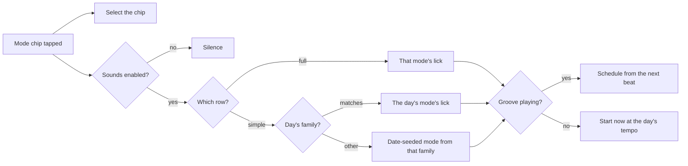

# PRD — Epic 1: Tap a mode, hear a lick in it

Feature: [briefing.md](../briefing.md) · [roadmap.md](../roadmap.md)

## Summary

Tapping a chip in the mode row plays a short lick in that mode, from the day's
root, on the band's own keyboard, and still selects the chip. The phrase is
sequenced in the browser from a widened set of reference notes and scheduled
against the groove's beat, so it is in time at every tempo in the catalogue.
Simple mode's two chips sound too. Nothing new appears on the page: hearing a
mode is the gesture the player was already making.

## Problem

By the third attempt the nudge has handed the root over, and what is left of the
puzzle is four words — *Dorian, Lydian dominant, Phrygian, Harmonic major* — with
no way to hear them apart. Sam learned by ear and by tab and could not name the
mode if asked; that is the gap the app exists to close, and right now it closes
it by asking them to read. The root row has had a voice since feature-10. The
row that actually decides the day has none.

## Scope

- Widening the offline reference-note render to two octaves.
- Twelve licks, one per mode in the catalogue, declared as degrees and beat
  positions rather than as audio.
- A lick voice that sequences a phrase over the running groove.
- The tap wiring: the existing mode chips sound, and still select.
- The `♪` on the mode row, and the caption that says what the rows do.
- Extending the lock and `grooves:verify` to cover the new generated output.

**Out of scope**
- **The beat grid and the reference level** — Epic 3 owns both, and this epic
  consumes them. Epic 3 also owns `lib/audio/reference.ts` outright.
- **Turning the sounds off** — Epic 2 owns the preference, the switch and the
  gate the handlers pass through. This epic's mode handler goes through that
  same gate rather than building a second flag, and the `♪` it adds obeys the
  same condition.
- **The size of the *Check* button** — Epic 2.
- **Hearing a mode after the day has ended.** The mode chips stay disabled and
  silent when the day is solved or given up, exactly as they are today, and so
  does the root row.
- **Any theory text.** No scale degrees on screen, no interval names, no
  explanation of why it is that mode. It stays a sound. What the mode *is* is
  feature-15's solved panel.
- **Changing what the grooves themselves play.** Nothing that renders a groove
  moves: no feel, no pool, no voicing, no chord.
- **A tuner, a keyboard, a fretboard, tempo control, transposition.** The
  on-screen instrument is the *Jam mode* candidate.

## Requirements

### What sounds

- **R1** — Tapping a chip in the mode row plays a short lick in that mode,
  rooted on the day's root. This holds whether or not the chip is already
  selected, and whether or not the groove is playing.
- **R2** — The same tap also selects the chip. Selection behaves exactly as it
  does today, and no new control is added to the card.
- **R3** — Tapping a mode is never a guess. No attempt is spent, no dot is
  filled, nothing is scored, and the feedback line does not change.
- **R4** — Every mode the row can offer has a lick: all twelve flavours the
  catalogue carries — Ionian, Dorian, Phrygian, Lydian, Mixolydian, Aeolian,
  Blues, Harmonic minor, Melodic minor, Harmonic major, Lydian dominant,
  Phrygian dominant.
- **R5** — A lick is a short phrase, on the order of one bar, that leans on the
  interval distinguishing its mode from its neighbours. It is not the mode's
  scale played in order.
- **R5a** — Each mode's phrase has its own rhythm, chosen to suit that mode. The
  twelve are not one figure with the pitches swapped.
- **R5b** — The pitches alone still distinguish the modes. Any two licks remain
  tellable apart when their rhythms are disregarded, so a player who learns to
  separate them has learned the mode and not the pattern.
- **R6** — Any two licks played from the same root are audibly different from
  each other. In particular Ionian against Lydian, Aeolian against Dorian, and
  Aeolian against Phrygian are each distinguishable by ear without being named.
- **R7** — Every lick is the same instrument and the same nominal loudness, so
  no mode reads as louder or duller than its neighbour.
- **R8** — At most one reference sound plays at a time, across both chip rows.
  A tap while a lick is playing takes the voice over, including cancelling notes
  that were scheduled but have not yet sounded, so running a finger down the row
  does not layer four phrases.
- **R8a** — Tapping a mode silences a root note that is still ringing, and
  tapping a root silences a lick that is still playing. The two rows are one
  instrument to the ear, and a root droning under a lick muddies the interval
  the lick exists to expose.
- **R9** — The lick sounds *over* the groove. The groove is not stopped, paused,
  ducked or restarted, and its position, loop and progress bar are unaffected.
- **R10** — Stopping the groove does not cut a lick that is already sounding,
  and a sounding lick never prevents the groove from starting or stopping.

### Being in time

- **R11** — While the groove is playing, a lick starts on the next beat of the
  groove rather than at the instant of the tap.
- **R12** — While the groove is not playing, a lick starts immediately, at the
  day's stated tempo.
- **R13** — The phrase's own rhythm is derived from the day's tempo, so the lick
  is in time with the groove at every tempo in the catalogue — 67 bpm to
  130 bpm — not only at one.
- **R14** — Reading the groove's clock is one-way. Nothing the lick voice does
  writes to the transport, and the transport does not know the lick voice
  exists.

### Simple mode

- **R15** — In simple mode, the `Major` or `Minor` chip whose family matches the
  day's mode plays the day's actual mode's lick.
- **R16** — The other chip plays a different real mode from its own family,
  chosen for the day. It is never the day's mode.
- **R17** — Both simple-mode licks are stable for the whole day and identical
  for every player, derived from the date the way the option rows already are.
  They change tomorrow.
- **R18** — Neither chip is labelled with the mode it plays, and nothing on the
  card names it. Simple mode's row says `Major` and `Minor` and nothing else.

### When it does not sound

- **R19** — A tap always selects, whether or not a lick sounds. No audio failure
  blocks, delays or undoes selection.
- **R20** — A lick that cannot sound fails silently: no error banner, no retry
  control, no message, no console-visible break. This covers a browser with no
  Web Audio, a context that will not resume, and a note file that is missing or
  will not decode.
- **R21** — The groove's own error banner and retry are unchanged, and are never
  raised by a lick.
- **R22** — On a day that has ended — solved or revealed — the mode chips are
  disabled and silent, as they are today.

### Saying the row is audible

- **R23** — Each chip in the mode row carries the same small mark the root chips
  carry, so a player can tell the row will sound before tapping it.
- **R24** — The mark is decoration. A chip's accessible name stays its label.
- **R25** — While the tap sounds are on, the caption under the play control says
  that both rows sound, in one line. It does not become a paragraph, and it does
  not name a mode. What the caption says while the sounds are off is Epic 2's.

### The render and the build guard

- **R26** — The reference notes cover two octaves, C4–B5, one file per
  chromatic pitch, produced by the existing command in `scripts/grooves/` from
  the sample pack. Nothing is synthesised in the browser.
- **R27** — The twelve notes that exist today are unchanged: same pitch, same
  register, same length, same bytes. Widening the render does not re-render
  them.
- **R28** — Running the command twice against the same pack produces
  byte-identical files.
- **R29** — The command writes the widened manifest under the feature's `data/`
  folder. It is generated output and is never hand-edited.
- **R30** — The new files and the widened manifest are recorded in
  `grooves.lock.json` and checked by `npm run grooves:verify`, which `prebuild`
  runs. There is one lock and one verify command, not two.
- **R31** — `grooves:verify` fails when a note file is missing or altered and
  when the manifest is hand-edited. It still renders nothing and still needs no
  ffmpeg and no sample pack.

### Fetching

- **R32** — A pitch's audio is fetched and decoded at most once per session and
  reused by every later lick that needs it.
- **R33** — A tap that arrives before a pitch has been fetched fetches it on
  demand. Warming is an optimisation, never a precondition for a lick to sound.
- **R34** — Background fetching never delays or contends with the groove's own
  fetch and decode. The groove is what the player pressed.

## Behaviour details

**A lick is data, not audio.** Each mode declares a phrase as scale degrees
against beat positions. At play time the degrees are resolved to pitches through
the day's root and the mode's interval table, and the beat positions to times
through the day's tempo. That is what makes twelve modes twelve small entries
rather than 144 rendered files, and a phrase that sounds wrong a one-line fix.

**What the other simple-mode chip plays.** Every mode belongs to exactly one
family, so a pick from the family that is *not* the day's can never collide with
the day's mode — the guard is the families table, not a filter. Both families
have six members in the catalogue, so there is always something to pick. The
pool is the catalogue's own flavours filtered by family, so a thirteenth mode
widens it with no other edit.

## Acceptance criteria

- **AC1** (R1, R2) — Given the puzzle is open, when a mode chip is tapped, then
  a lick sounds and the chip becomes the selected mode.
- **AC2** (R1) — Given a mode chip is already selected, when it is tapped again,
  then the lick sounds again.
- **AC3** (R3) — Given any number of attempts remain, when mode chips are tapped
  repeatedly, then the attempt dots, the feedback line and the check control are
  unchanged.
- **AC4** (R4) — Given each of the twelve catalogue flavours in turn, when its
  chip is tapped, then a lick sounds for it.
- **AC5** (R6) — Given one root, when the twelve licks are played in sequence,
  then no two produce the same sequence of pitches.
- **AC6** (R8) — Given a lick is sounding, when another mode chip is tapped,
  then the first is silenced, its unsounded notes are cancelled, and only the
  second is heard.
- **AC6a** (R8a) — Given a root note is ringing, when a mode chip is tapped,
  then the root note stops and only the lick is heard.
- **AC6b** (R8a) — Given a lick is playing, when a root chip is tapped, then the
  lick stops, its unsounded notes are cancelled, and only the root note is
  heard.
- **AC6c** (R5a, R5b) — Given the twelve licks from one root, when their note
  timings are compared, then no two share a rhythm; and when their pitch
  sequences are compared with timing disregarded, then no two are the same.
- **AC7** (R9) — Given the groove is playing, when a mode chip is tapped, then
  the groove's playing state and loop position are unaffected.
- **AC8** (R11) — Given the groove is playing, when a mode chip is tapped
  between beats, then the lick's first note is scheduled for the next beat
  boundary rather than for the moment of the tap.
- **AC9** (R12) — Given the groove is not playing, when a mode chip is tapped,
  then the lick starts without waiting.
- **AC10** (R13) — Given two grooves at different tempos, when the same mode is
  tapped in each, then the interval between the lick's notes differs in
  proportion to the tempo.
- **AC11** (R15, R16) — Given simple mode and a day whose mode is in the Major
  family, when each chip is tapped, then `Major` plays the day's mode's lick and
  `Minor` plays a Minor-family mode that is not the day's.
- **AC12** (R17) — Given the same date, when the page is reloaded, then both
  simple-mode chips play the same modes as before.
- **AC13** (R18) — Given simple mode, when the card is read in full, then no
  mode name appears anywhere on it.
- **AC14** (R19, R20) — Given Web Audio is unavailable, when a mode chip is
  tapped, then the chip selects, nothing sounds, and no error is shown.
- **AC15** (R22) — Given the day is solved or revealed, when a mode chip is
  tapped, then nothing sounds and no selection changes.
- **AC16** (R23, R24) — Given the puzzle is open, when the mode row is
  inspected, then every chip renders the mark and every chip's accessible name
  is its label alone.
- **AC17** (R26, R27) — Given the render command is run, then the manifest lists
  every pitch from C4 to B5, and the twelve files that existed before are
  byte-identical.
- **AC18** (R28) — Given the command is run twice against the same pack, then
  the outputs are byte-identical.
- **AC19** (R30, R31) — Given a note file is deleted or the manifest is edited
  by hand, when `grooves:verify` runs, then it fails.
- **AC20** (R33) — Given no note has been fetched yet, when a mode chip is
  tapped, then the lick still sounds.

## Dependencies

**Needs, as contracts, from Epic 3:**
- *When is the next beat* — a function of the transport's elapsed seconds and
  the groove's tempo, returning the time to schedule against, or nothing when
  the groove is not playing.
- *How loud* — one declared reference level, applied by both voices.

**Shares, with Epic 3:** *one reference sound at a time* — a single owner both
voices release to, so a tap on either row silences whatever the other is doing.
Epic 3 owns it, alongside the beat grid and the level; this epic's voice takes
it and gives it back.

**Needs, as a contract, from Epic 2:**
- *Whether the tap sounds are enabled* — one flag, applied where the handlers
  are built. This epic's mode handler passes through it, and the `♪` renders
  only when it is on. Whichever epic lands second wires the one line.

**Hands to nobody.** No later epic depends on this one.

**Musical work.** The twelve phrases are a musical decision, not an
implementation detail: which degrees, in what order, over what rhythm, in which
register.

## Assumptions

- **Roughly a bar each, however many notes that mode's figure wants.** The
  phrases share a length so the row stays comparable, and vary in note count
  because their rhythms do. Short enough that tapping four modes in a row is a
  comparison rather than a wait.
- **The lick sits above the comp.** C4–B4 is where the keyboard already plays,
  which is why the render buys the octave above rather than the one below: a
  phrase up there reads as a line over the band, and stays clear of the bass.
- **The lick is the same voice as the reference note** — the band's keyboard,
  not a synthesised tone — so the two rows are comparable.
- **A fixed shape transposed to the root,** rather than a phrase that follows
  the day's changes. Every chord in the progression comes from the day's scale,
  so a tonic-mode phrase fits; where it does not, the fix is to shorten or
  re-place the phrase, not to track the chords.
- **Neither simple-mode chip is a fixed reference.** Both sides of the row move
  daily, so the player compares two sounds against the loop rather than learning
  what "minor" sounds like in general. The transferable lesson is left to the
  full mode row, where each chip always means the same thing.
- **Per-note envelopes.** The reference note files ring for about two seconds; a
  phrase at eighth-note spacing needs each note shaped down so the line does not
  become a cluster.
- **The twelve phrases live beside the theory the app already has,** as data the
  app reads, not as anything the generator writes.

## Question log

Answered questions, kept for traceability. The requirements above are the source
of truth — this records how they got there.

### Cycle 1 — 2026-09-02

**Q1. Do all twelve licks share one rhythm, or does each get its own?**
Answer: **B) A rhythm per mode, chosen to suit it** — each lick is more
memorable and more like music. The cost the option named — that two modes then
differ in two ways at once — is held off by requiring the pitches to
distinguish them on their own.
Applied to: R5a, R5b, AC6c, Assumptions

**Q2. Does tapping a mode cut a root note that is still ringing?**
Answer: **A) One reference sound at a time across both rows** — the two rows
are one instrument to the ear, and a root droning under a lick muddies exactly
the interval the lick exists to expose.
Applied to: R8 (widened from one lick to one sound), R8a, AC6a, AC6b,
Dependencies
