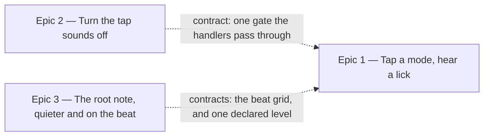

# Roadmap — Hear the Mode

Source: [briefing.md](briefing.md)

## Overview

Feature-10 gave the root row a voice; feature-7's nudge now hands the root over
outright. What is left of the puzzle by attempt three is four unfamiliar
words — *Dorian, Lydian dominant, Phrygian, Harmonic major* — and no way to hear
them apart. An ear game answered by reading.

This feature gives the mode row a voice too. Tapping a mode chip plays a short
lick in that mode, from the day's root, sequenced in the browser against the
groove's own clock so it lands in time at any tempo (**Q1 → A**), starting on
the next beat while the loop runs and immediately when it does not (**Q3 → A**,
**Q4 → A**). Tapping is never a guess: nothing is scored and no attempt is
spent. Simple mode's Major / Minor row sounds too. Alongside it, two things the
row needs to be livable with. The root row gets the same treatment on the way
past: it comes down in level — today's tap is louder than the band it is meant
to sit inside — and it starts on the next beat too, so both rows answer to the
groove the same way. A switch under the simple-mode toggle turns the tap sounds
off entirely, remembered the same way simple mode is, and *Check* grows to the
size of *Play*.

Three epics, all in one wave. Epic 1 is the mechanism end to end, with the mark
that says the row has a voice; Epic 2 is the card's controls — the off switch
and the resized *Check*; Epic 3 is the root note, quieter and on the beat, which
is also where the beat grid both voices share is built. Both of the small ones
ship without the big one, against the app as it stands today.

## Epics

### Epic 1 — Tap a mode, hear a lick in it

**Visible when done:** press play, then tap `Lydian`. A short phrase in Lydian
sounds from the day's root, over the running loop, landing on the next beat
rather than wherever your thumb fell. Tap `Phrygian` and hear a different colour
from the same home note. Tap one before pressing play and it still sounds. The
chips carry the same `♪` the roots do, so you knew that before you tapped.
Nothing is selected against you, and no dot is spent. In simple mode the two
chips do the same thing.
**Depends on:** none
**Parallel with:** Epic 2, Epic 3 (seams named in *Out of scope*)

**Scope**
- **Two octaves of pitch material (Q2 → A).** The reference notes are one
  octave, C4–B4 (`data/notes.generated.ts`, midi 60–71), and a lick that has to
  say "Lydian" in a second needs more room. Widen the offline render in
  `scripts/grooves/notes.ts` and `notes-cli.ts` to C4–B5 — 24 files, every pitch
  a real sampled note through the pack's own transpose/resample, no runtime
  octave shifting. The existing twelve keep their pitch, register and length
  exactly, so feature-10's row is untouched by the widening.
- **One lock, one verify.** The new files and the widened manifest join
  `grooves.lock.json` and the `grooves:verify` that `prebuild` runs, exactly as
  feature-10 put the first twelve there. No second copy of the machinery, and
  `lock.ts` keeps importing nothing but `fs`, `crypto` and `path` —
  `lock.test.ts` reads the source to assert it.
- **A lick per mode, declared as music, not as audio.** Twelve modes ship in the
  catalogue (Ionian, Dorian, Phrygian, Lydian, Mixolydian, Aeolian, Blues,
  Harmonic minor, Melodic minor, Harmonic major, Lydian dominant, Phrygian
  dominant). Each gets one short phrase written as scale degrees and beat
  positions, transposed to the day's root at play time — twelve small data
  entries rather than 144 rendered files, so a mode that sounds wrong is a
  one-line fix and not a re-render. This is a musical decision: the phrase must
  land on the interval that distinguishes its mode from its neighbours (the ♯4
  that separates Lydian from Ionian, the ♭2 that separates Phrygian from
  Aeolian), inside about a bar.
- **Simple mode sounds the day's own mode (Q5 → C).** The family chip that
  matches the day plays the day's actual mode's lick, filed under `Major` or
  `Minor` by `lib/theory/families.ts`.
- **The other family chip plays a real mode from that family, picked by the day
  (N1 → C).** Not a fixed representative: one of that family's six, chosen by
  the same ISO-date seeding `lib/theory/options.ts` already uses for the option
  rows — so every player hears the same pair, all day, and it changes tomorrow.
  Two properties fall out of the families table and should be asserted rather
  than assumed: each mode belongs to exactly one family, so the pick can never
  collide with the day's own mode; and both families have six members in the
  catalogue, so there is always something to pick. The pool is the catalogue's
  own flavours filtered by family, as `flavourPool` already derives it — a
  thirteenth mode should widen this with no other edit.
- **A lick voice in `lib/audio/`,** beside `reference.ts`. It schedules the
  phrase's notes on the shared `AudioContext` with per-note gain envelopes, so
  eight notes at an eighth-note spacing read as a line rather than piling two
  seconds of tail each into a cluster.
- **In time with the groove (Q1 → A, Q3 → A).** The phrase's notes are
  scheduled with `start(when)` from the next beat boundary, at the day's stated
  `bpm`. **The beat grid itself is Epic 3's** — the same module the root note
  now uses — so this epic consumes it rather than building a second one, and
  the contract is all it needs to start. Keep the coupling to the transport
  one-way and read-only: nothing the lick voice does may stop, restart, duck or
  reschedule the groove.
- **A stopped page still sounds (Q4 → A).** With the loop not running there is
  no beat to wait for, so the phrase starts immediately, at the day's stated
  `bpm`, on the voice's own clock. Same rule as the root note, one scheduler
  with two entry points — the only difference is what supplies the start time.
- **Retrigger, don't stack.** A second tap takes the voice over, as the root
  voice already does — including cancelling notes already scheduled but not yet
  sounded. Running a finger down the mode row must not layer four phrases.
- **Best effort, never blocking.** No Web Audio, a refused context, a missing
  file: silence, no banner, no retry, and the chip behaves exactly as it did.
  The groove's own error surface stays the groove's.
- **Tapping is never a guess.** Selecting a mode already costs nothing —
  attempts are spent by *Check* — and this epic must not change that in either
  direction. The regression to watch for is the opposite one: a tap that sounds
  but no longer selects.
- **The `♪` on the mode row.** `ChipGroup` already carries a row-wide
  `adornment` and `Chip` already renders it as decoration hidden from assistive
  technology, so this is passing a prop, not building a component — and the
  caption under the play control, which feature-10 made say what the root row
  does, has to become true of two rows without turning into a paragraph.
- **`structure.test.ts` asserts the concern folders exactly.** This adds modules
  to `audio/`, `data/` and `theory/`, and no new folder.
- Tests: the widened render under `scripts/grooves/`, per its own boundary test;
  the phrase-to-schedule arithmetic as plain functions in `lib/theory/`; the
  voice against `testing/fakeAudioContext.ts` with a fake clock, asserting note
  onsets against the beat grid in both the running and stopped cases; and the
  tap as a feature test through `index.ts` via `testing/renderFeature.tsx`,
  never reaching past it.

**Out of scope**
- **Turning the sounds off, and the size of the *Check* button.** Epic 2 owns
  the card's controls: the preference, the switch, the gate the handlers pass
  through, and the button's size. This epic's mode handler goes through that
  same gate — whichever of the two lands second wires the one line, and neither
  builds a second flag. The two epics touch `GuessCard` in different places:
  Epic 1 has the chip rows, Epic 2 has the switch stack above them and the
  control below.
- **How loud any of it is, and where the next beat falls.** Epic 3 owns both —
  one declared level and one beat-grid module, for the root voice and this one
  alike — behind the two contracts named there. Epic 3 also owns
  `lib/audio/reference.ts` outright; this epic adds a voice beside it and edits
  nothing inside it.
- **The mode row after the day ends (Q6 → D).** The chips stay `disabled` when
  the day is solved or given up, exactly as they are today, and so does the root
  row. This drops the briefing's sixth bullet — see *Assumptions*.
- **Any theory text.** A briefing non-goal, and emphatically so: no scale
  degrees, no interval names, no "Lydian has a raised fourth" — it stays a
  sound. What the mode *is* was feature-15's job, and the solved panel already
  does it.
- **Changing what the grooves themselves play.** Nothing under
  `scripts/grooves/` that renders a groove moves. The lick borrows the note
  render and touches no feel, no pool and no voicing.
- **Reworking the how-to-play box.** Feature-8 fixed those four lines and its
  tests assert them, and feature-10 already declined to touch them for the same
  reason.
- **A tuner, a keyboard, a fretboard, a jam mode.** Still the *Jam mode*
  candidate.

**Validation**
- Demo: press play; tap along the full mode row and hear four distinct colours
  over the same loop; check the attempt dots are untouched; switch to simple
  mode and hear two different things from the two chips; reload and tap a mode
  before pressing play at all.
- Demo the day's stability: reload twice and confirm the non-matching family
  chip sounds the same mode every time, and that it is not the day's own mode.
- Demo the failure: with Web Audio unavailable, tapping a mode still selects it
  and the page shows no error.
- **Listen for time.** Tap a mode on the slowest groove in the catalogue
  (67 bpm) and the fastest (130 bpm). The phrase must sit in the groove's pulse
  in both, not merely start near a beat and drift. Then tap repeatedly, fast,
  and confirm the phrases replace rather than stack.
- **Listen for the mode.** Play the twelve licks back to back from one root. A
  listener who cannot name them should still hear twelve different things —
  and Ionian against Lydian, Aeolian against Dorian, and Aeolian against
  Phrygian should each be audibly different pairs. If two are
  indistinguishable the phrase is wrong, not the player.
- Load cold and, without tapping anything, point at what says the mode chips are
  audible.
- `npm run grooves:verify` passes on the committed notes and fails when one is
  deleted or the manifest is hand-edited.
- `npm test` across `src/` and `scripts/grooves/`, `structure.test.ts` and
  `boundary.test.ts` still green.

### Epic 2 — The card's controls: an off switch, and a *Check* as big as *Play*

**Visible when done:** two things, both on the guess card and both true of the
app as it stands today. A second switch sits under *Simple mode*, and flipping
it stops the chips making any sound — Sam can play the groove on the bus with
the chips silent, and it is still silent tomorrow; flipping it back brings the
sounds straight back, mid-day, with no attempt spent either way, and the groove
itself is untouched. And *Check* is now the same size as *Play*: the two moves
the card asks for read as equals instead of the answer being the smaller one.
**Depends on:** none. Everything it needs to be built and demoed exists today:
the root row already sounds, and this is what switches it off.
**Parallel with:** Epic 1, Epic 3

**Scope**
- **A second preference, stored the way the first one is.** `Preferences` is a
  one-field type today (`simpleMode`) written whole through
  `PreferenceStore.set`, so adding a field is not just widening the type: every
  existing write passes a complete object and would clobber the new field. Both
  writers must round-trip what they did not change. Two things must keep
  holding: a stored blob written before this field exists still loads, with the
  new preference at its default rather than resetting simple mode; and a store
  that throws — quota, disabled storage, private mode — still leaves the switch
  where the player put it for the session.
- **A hook beside `useSimpleMode`,** with the same `store` injection seam, so a
  test hands in a stand-in rather than mocking the module path. Same optimistic
  update, same swallowed write failure, same reasons.
- **One gate, both rows.** The flag is applied where the handlers are built, not
  inside the voices: an off switch that still fetches and decodes is a mute
  pretending to be a setting. Epic 1's mode handler passes through this same
  gate.
- **A switch under the simple-mode toggle.** Same shape and same affordances as
  `ModeToggle` — a `role="switch"` button, in the tab order, answering to space
  and enter. Two feature components with one visual treatment is the seam to
  watch: if the second one is a copy of the first, the shared part belongs in
  `src/components/controls/` as a primitive that knows nothing about grooves or
  sound, and the two feature components become thin callers of it. That is a
  design-system change and this epic owns it.
- **The mark disappears while the sounds are off (N2 → A).** Both rows: an
  adornment promising a sound the player has switched off is the row lying, and
  the mark coming back is the confirmation the switch worked. The caption under
  the play control follows the same rule for the same reason — it is the other
  place the page says the chips sound. Epic 1 passes the mode row's `♪` through
  this same condition; the condition itself is declared here.
- ***Check* takes the larger size.** `Button` already declares `md` and `lg`
  and `PlayControl` already asks for `lg`; the call to action in `GuessCard`
  takes the default. So this is one prop, and the work is what follows it:
  the card's rhythm with two full-height controls in it, the label at the
  larger type size (`Check Lydian dominant` is the longest thing it says, and
  it must not wrap on a narrow phone), and the `idle`, `ready` and `solved`
  tones all still reading right at that size.
- Tests: the widened preference round-trip and its backwards compatibility, as
  plain functions; the hook against an injected store, including the throwing
  one; the toggle (or the extracted primitive) against its own contract — props,
  states, accessibility — independently of the feature; and a feature test
  through `index.ts` that a root tap is silent with the switch off, sounds with
  it on, and that flipping it spends no attempt.

**Out of scope**
- **Muting the groove.** The briefing says the sounds *when tapping a root or
  mode*. The play control is how the band is silenced, and it already is.
- **A volume slider, or per-row switches.** One binary preference, matching what
  was asked for. The level itself is Epic 3.
- **The licks.** Epic 1 owns what a mode chip sounds; this epic owns whether it
  sounds at all, and can be built and demoed against the root row alone.
- **Anything else moving into settings.** There is no settings panel and this
  does not start one; it is a second switch under the first.
- **Shrinking *Play*, or any other change to the page's hierarchy.** *Check*
  comes up to *Play*'s size; nothing comes down. A third size is not added.

**Validation**
- Demo: flip the switch off, tap roots along the row, hear nothing, and confirm
  the groove keeps playing untouched. Reload — still off. Flip it back mid-day
  and the row sounds again, with the attempt dots unchanged throughout.
- Demo the durability: turn it off, close the tab, come back tomorrow, still
  off. Then in a private window, where storage may refuse: the switch still
  works for the session.
- Demo the button: on a narrow phone, with the longest root-and-mode pair
  selected, the label fits on one line and the two controls read as a pair.
  Check the idle, ready and solved states at the new size.
- Keyboard and screen-reader pass on both switches: tab to each, toggle with
  space and enter, and hear the state announced.
- `npm test` green, including `useSimpleMode`'s existing tests — the preference
  widening must not have changed what simple mode does.

### Epic 3 — The root note, quieter and on the beat

**Visible when done:** tap a root while the groove plays. The note lands on the
next beat instead of wherever your thumb fell, and it sits inside the band
instead of jumping out in front of it — clearly audible against the bass, and no
longer something that makes you reach for the volume. Tap one with the loop
stopped and it still sounds straight away. All of that is true of the app as it
stands today, before a single lick exists.
**Depends on:** none
**Parallel with:** Epic 1, Epic 2

**Scope**
- **A gain stage in the reference voice.** `reference.ts` connects its buffer
  source straight to `ctx.destination` today, so there is no level to set. Add
  the node, and with it the fade that stops a retrigger clicking.
- **One declared level for both voices,** owned here and consumed by Epic 1's
  lick voice. Whether the lick wants the identical number or a related one is
  Epic 1's musical call; where the number lives is this epic's.
- **Choose it by ear against the loudest groove in the catalogue,** not by
  picking a round number. The grooves are peak-normalised at mint time, so one
  level holds across all thirty.
- **The beat grid, and the root note on it.** Feature-10's rule was that the
  reference voice never reads the transport, and it sounds the instant it is
  tapped; both change here. The same module also owns which voice holds the
  output, so a tap on either row silences whatever the other is doing. A small module answers *when is the next beat* from
  the transport's elapsed seconds and the groove's `bpm` — plain arithmetic,
  testable with no context and no clock — and `play` schedules against it with
  `start(when)` instead of starting now. **This is the shared groundwork, and it
  lives here because this is the epic that ships first.** Epic 1's lick voice
  takes the same module for the same purpose.
- **Stopped means immediately (Q4 → A).** With the loop not running there is no
  beat to wait for and the note sounds at once, exactly as it does today. One
  rule for both voices: quantised while the groove runs, immediate when it does
  not.
- **The coupling stays one-way and read-only.** Nothing in either voice may
  stop, restart, duck or reschedule the groove. Feature-10's separation of the
  two voices is being narrowed deliberately, in one direction, and not dropped.
- **A tap while a note is pending must still replace it.** Retrigger now means
  cancelling a scheduled note as well as stopping a sounding one, which
  feature-10 never had to do.
- Tests: the beat arithmetic as plain functions; the gain node's presence and
  value, and the scheduled start time, against `testing/fakeAudioContext.ts`
  with a fake clock; feature-10's existing reference tests updated where they
  asserted an immediate start — a moved assertion keeps its subject.

**Out of scope**
- **A volume control, a mute, or a setting.** The device's volume is the
  control, and the on/off switch is Epic 2's. This is a fix to a wrong default,
  not the start of a mixer.
- The groove's own level, and anything under `scripts/grooves/`. Feature-13
  settled the balance between the kit and the keys; this touches only what the
  browser plays over the top.
- **Which notes the lick plays, and when.** Epic 1 — it consumes this epic's
  beat grid and its level, and owns everything above them.
- **Quantising to anything but a beat.** Not the bar, not a subdivision. Q3 → A
  chose the beat and the same choice governs both rows.

**Validation**
- Demo the timing: play the slowest groove in the catalogue (67 bpm), tap roots
  deliberately off the beat, and hear each one arrive on the next one. Then the
  fastest (130 bpm), where the wait should be barely perceptible. Then stop the
  loop and confirm taps are instant again.
- Demo the level: play the loudest groove in the catalogue, tap roots along the
  row, and confirm the note reads as a reference *inside* the music rather than
  over it — audible against the bass, never the loudest thing in the mix.
- Confirm on phone speakers as well as headphones. The persona is on a phone
  before dinner, and a level judged only on headphones will be inaudible there.
- Run a finger down the row fast: notes replace each other and nothing queues up
  to fire later.
- `npm test` green, with feature-10's reference tests updated rather than
  deleted.

## Dependency map

## Execution waves

- **Wave 1 (parallel):** Epic 1, Epic 2, Epic 3. Disjoint file sets across two
  named seams. Epic 1 has `scripts/grooves/`, `data/`, the new `lib/audio/` and
  `lib/theory/` modules and the mode row's props; Epic 2 has
  `lib/persistence/preferences.ts`, its hook, the switch, and the gate the
  handlers are built through and the control below them; Epic 3 has
  `lib/audio/reference.ts`, the level module and the beat-grid module.
- Epic 1 is the long pole — a widened render, twelve phrases to write and a
  listen at the end of each. Epics 2 and 3 both stand on their own against the
  root row that already sounds; if Epic 1 slips, neither should wait for it.
- **The page wiring serialises, even though the epics do not.** Each epic ends
  with a track that edits `components/GroovePuzzle.tsx` and its sounding test,
  and two of them touch `testing/puzzleHarness.tsx`. Everything before those
  tracks runs in parallel; the wiring itself goes in one order — Epic 3 first
  (it puts the clock on the transport and the reference hook), then Epic 1 (it
  consumes the clock and adds the mode handler), then Epic 2 (it adds the gate
  that handler passes through). That is a scheduling constraint on three tracks,
  not a dependency between the epics.
- **Epic 3 holds the groundwork on purpose.** The beat grid is needed by both
  voices, and it goes in the epic that ships first rather than into a
  prerequisite of its own. Two small contracts — *when is the next beat* and
  *how loud* — are what Epic 1 needs to start, and they can be pinned on day
  one; the code behind them lands well before Epic 1 needs to run.

## Assumptions

- **The root note is no longer instant, and that is a change to feature-10.**
  Its reference voice sounds the moment the chip is tapped and reads no clock;
  from here it waits for the next beat while the loop runs — up to 0.9s at the
  catalogue's slowest groove, under 0.5s at its fastest. Worth watching at the
  slow end: if the wait reads as a broken chip rather than as timing, the fix is
  a shorter quantisation, not abandoning it.
- ***Check* as big as *Play* evens a hierarchy the persona document sets.**
  `docs/persona.md` says *"The play button is the biggest thing on the page, and
  hitting it costs nothing"*, and feature-4's clarity pass is what made it so.
  The briefing asks for the two to match, which relaxes that to *the two moves
  are equals* — reasonable now that feature-8's how-to-play tells a first-time
  player to press play, so the size is no longer the only thing saying it.
  Recorded because it is a deliberate reversal, not an oversight.
- **The switch defaults to sounds on.** A player who never touches it gets the
  app feature-10 and Epic 1 built. Off-by-default would ship a feature nobody
  hears — and it matches `simpleMode`, which is off unless asked for.
- **The switch stays live when the day ends.** Unlike the simple-mode toggle it
  is not a record of how the day was played, and the guess card is the only
  place it can be changed — so it does not settle with the rest of the card.
  Settled in Epic 2's PRD, which reversed the opposite assumption recorded here.
- **The briefing's post-game bullet is dropped (Q6 → D).** *"Keep the mode chips
  audible once the day has ended, so the answer can be heard against what was
  guessed"* is a briefing line, and D declines it for both rows. Recorded here
  rather than quietly omitted: the answer is heard during play or not at all,
  and re-opening it later is a small change to `Chip` plus one prop.
  Feature-15's solved panel remains the whole of the post-game payoff.
- **The affordance is not its own epic.** Q6 → D removed the design-system half
  of what was a third epic — no locked-but-tappable chip state is needed —
  leaving one prop and one caption line, which is a task. It sits in Epic 1,
  whose sound it advertises.
- **A lick is a phrase, not a scale run.** Playing the mode's seven notes
  upwards is a lesson; a short rhythmic figure that leans on the note that makes
  the mode is a sound. The second is what the briefing asks for and what the
  persona came for.
- **Roughly a bar, roughly eight notes.** Long enough to establish a colour,
  short enough that tapping four modes in a row is a comparison rather than a
  wait. The exact figure is a musical call inside Epic 1.
- **The lick sits above the comp, not in it.** C4–B4 is where the keyboard
  already is, which is why Q2 → A buys the octave above rather than the one
  below: a phrase up there reads as a line over the band instead of arguing with
  it, and it stays clear of the bass.
- **The lick is the same voice as the reference note** — the band's keyboard,
  not a synthesised tone. Feature-10 settled that for the root, and one voice
  for both rows is what keeps the two comparable.
- **The phrase is transposed at play time, not rendered per root.** Twelve
  phrases × twelve roots is 144 renders and a re-render every time a phrase is
  wrong; scheduling from a note-per-pitch set is one data change.
- **Simple mode's licks are consonant with the groove, and that is the game.**
  Q5 → C means the matching family chip sounds the day's actual mode, so it will
  fit the loop and the other will not. That is the same property feature-10 gave
  the root row — the right chip sounds like home — and simple mode exists for
  the ear that is still arriving.
- **Neither simple-mode chip is a fixed reference.** N1 → C makes both sides of
  the row move daily, so the player is comparing two sounds against the loop
  rather than learning what "minor" sounds like in general. That is the trade
  the option buys: the pairing stays fresh, and the transferable lesson is left
  to the full mode row, where each chip always means the same thing.
- **The caption follows the mark.** N2 → A hides the `♪` while the sounds are
  off; the line under the play control that says the rows sound has to go quiet
  with it, or the page is lying in a second place.
- **Tonic-mode against a moving progression.** The licks are built on the day's
  root in the day's mode; the groove's changes move under them. Mostly this is
  fine — every chord in the progression comes from that scale — but starting on
  the next beat rather than the next bar (Q3 → A) means a phrase can begin over
  chord IV, where a ♭2 can read as a wrong note rather than as a colour. Epic 1's
  listen is where that gets caught, and shortening or re-placing the phrase is
  the fix, not chord-tracking.
- **No new failure surface.** Every audio failure is silence, as feature-10
  established. The build guard is where a missing file is caught.
- **One level for the whole catalogue.** Grooves are peak-normalised at mint
  time, so the reference level does not have to be per-groove.
