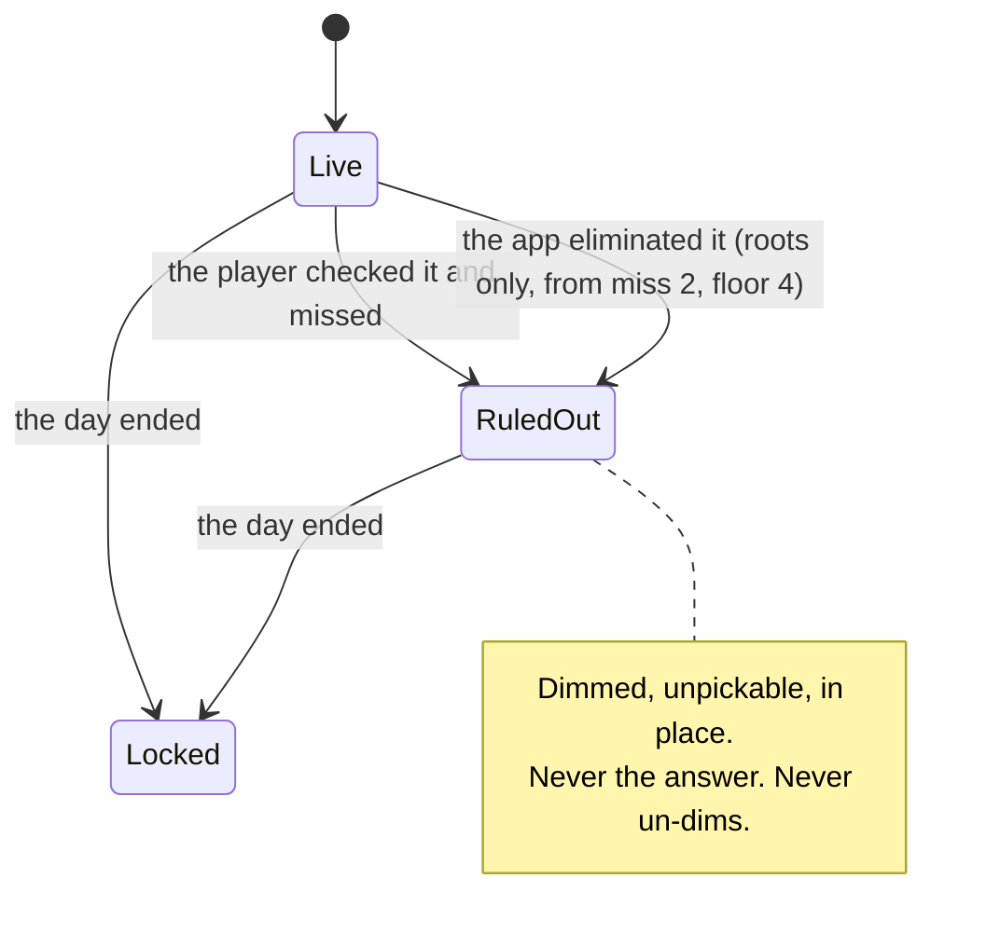

# PRD — Epic 1: The row shows what is ruled out

Feature: [briefing.md](../briefing.md) · [roadmap.md](../roadmap.md)

## Summary

The nudge stops naming the day's root and starts narrowing the root row instead.
A root the player checked and missed, and a root the app has eliminated for
them, read identically: dimmed, unpickable, still in place. The narrowing stops
at four live roots, so the app never eliminates its way to the answer — past
that point the row only shrinks by the player's own guessing.

## Problem

By the third attempt the nudge has printed the day's root on the card, which
answers by reading the half of the puzzle Sam came to learn by ear. Feature-10
and feature-16 made both chip rows audible precisely so the root could be
*found*; handing it over two misses in makes that work pointless, and turns the
rest of the day into a vocabulary quiz over four unfamiliar words. Meanwhile the
card remembers nothing: on the fourth attempt nothing on screen says which of
the twelve roots have already been tried and failed, so the same pair gets
guessed twice.

## Scope

- Removing the root reveal from the nudge.
- One dim treatment for a ruled-out chip, from either source.
- Per-option state in `ChipGroup`, which today only locks a whole row.
- The narrowing rule: when it starts, how much it takes, and where it stops.
- The nudge box saying what it did instead of what the answer is.

**Out of scope**
- **The check mark on a confirmed root or mode** — Epic 2. This epic owns
  elimination; that one owns confirmation.
- **The caption and the feedback line's wording** — Epic 2.
- **Narrowing the mode row.** Four modes is already a shortlist. A mode the
  player checked and missed still dims — that is the elimination rule, not
  narrowing, and the app never eliminates a mode on the player's behalf.
- **The give-up flow, the attempt budget and the dots.** Unchanged. The dots
  mark par, not lives, so no guess budget runs out and nothing here makes a day
  harder to finish — only harder to be told.
- **The solved box, the lead sheet and the mode-character copy** — Epic 3.
- **Any change to what a groove sounds like.**

## Requirements

### What the nudge no longer does

- **R1** — The day's root is never named on the guess card while the day is
  playable. No text anywhere on it spells out the answer's root.
- **R2** — The root is still named in exactly two places, both unchanged: the
  solved box on a solved day, and the same box after giving up.
- **R3** — The feedback line's diagnosis of the player's own guess is unchanged.
  "The mode is right. But the tonic is somewhere else." confirms what they
  guessed and stays; what goes is the unprompted handout.

### What a ruled-out chip looks like

- **R4** — A chip the player has checked and missed is dimmed and cannot be
  selected. This holds for roots and for modes.
- **R4a** — A ruled-out chip can still be tapped to hear it, for as long as the
  day is playable. Eliminating a root is a conclusion about the puzzle, not
  about the note: playing the ones that are out against the one still suspected
  is the ear work this app exists for, and taking it away at the moment the
  player has most reason to want it would be the wrong trade.
- **R4b** — There are therefore two locks on a chip, and they are not the same.
  *Ruled out* means unpickable and still audible. *The day has ended* means
  unpickable and silent, which is what feature-16 settled and this epic does not
  reopen. Nothing may collapse them into one state.
- **R4c** — A ruled-out chip keeps feature-16's `♪` while the tap sounds are on.
  The mark is a promise about what a tap does, a ruled-out chip still does it,
  and removing the mark would make the row untrue exactly where the player is
  most likely to test it. So the `♪` stays row-wide, as feature-16 left it, and
  no per-chip rule is needed for it.
- **R5** — A root the app has eliminated is dimmed and cannot be selected, in
  exactly the same treatment as R4 and R4a. A player cannot tell from the row
  which of the two ruled a chip out.
- **R6** — A ruled-out chip keeps its position in the row. The row never
  changes length or reflows mid-day, so a chip the player has located stays
  where they found it.
- **R7** — A ruled-out chip is never the day's answer.
- **R8** — Once a chip is ruled out it stays ruled out for the rest of the day.
  Nothing un-dims.
- **R9** — Ruling out is derived from the day's attempts, not stored separately,
  so it survives a reload exactly as the attempts do.

### The narrowing rule

- **R10** — The app eliminates no roots until the second missed guess.
- **R11** — From the second missed guess on, each miss eliminates two roots that
  were still live.
- **R12** — Elimination never takes the live count below four. When two more
  would breach that, none are eliminated.
- **R13** — The floor bounds the app's elimination only. A root the player then
  checks and misses still dims, so the row can reach a single live root by their
  own guessing — which is a deduction they made, not an answer they were given.
- **R14** — Which roots the app eliminates is the same for every player on the
  same day, and stable across reloads and re-renders.
- **R15** — Eliminations accumulate. A root eliminated at one miss is still
  eliminated at the next.
- **R16** — In simple mode the app eliminates nothing, because six roots minus
  the player's own two checked roots already sits at the floor by the second
  miss. Simple mode's narrowing is its six roots; this epic adds none.

### The box that says so

The box is now the card's one status area: the feedback message sits at the top
of it, and the nudge sentence below. R17 onwards govern the sentence; R17c and
R19 govern the box itself.

- **R17** — When the app has eliminated roots, the card says so in one line, in
  the slot the nudge occupies today, beside the feedback line. It names what
  happened and that the row is still narrowing — the count the app has ruled out
  so far, cumulatively, and nothing else.
- **R17a** — It does not name how many roots are still live. A count of what is
  left invites counting the row instead of listening to it, which is the wrong
  game for a player who came to get better at hearing.
- **R17b** — Once the floor is reached the count stops moving, and the line
  keeps reading the same while the player goes on missing. That is honest: the
  app has stopped helping, and saying otherwise would claim work it is not
  doing.
- **R18** — That line names no root — neither the answer nor the ones removed.
- **R17c** — The feedback message renders inside the box, above the nudge
  sentence. The box carries one eyebrow label, reading `Hint`, which is also its
  accessible name — so it stays a named landmark.
- **R17d** — Exactly one live region. The box no longer announces as a whole;
  the feedback paragraph keeps `role="status"`, because it is the part that
  changes on every guess, and nesting two live regions would announce twice.
- **R17e** — On a solved or revealed day the box is not rendered at all. It is a
  playable-day thing: once the day has ended the solved panel is what says what
  happened, and a box still labelled `Hint` offering a narrowing count or "that's
  it" alongside it is confusing. Because the box is the only place the feedback
  message renders, that message ends with it.
- **R18a** — While the day is playable, the box renders only when it has content — a feedback message, a
  nudge sentence, or both. An empty box is unrepresentable rather than merely
  unlikely. In practice a feedback message is always present, so the box is
  visible from the first render.
- **R19** — In a mode where the app eliminates nothing, **the nudge sentence** is
  absent rather than saying that nothing happened. The box itself may still be
  present, carrying the feedback message alone — which is every simple-mode day.

### What happens to the selection

- **R19a** — When a checked guess is missed, the half of the selection that was
  just ruled out is deselected. The half that was not stays selected.
- **R19b** — So a guess with the right root and the wrong mode leaves the root
  selected and the mode row empty, and a guess with both halves wrong leaves
  nothing selected. The card ends up holding what survived the check.
- **R19c** — The call to action asks for the half that is missing rather than
  for both again. With one half selected it names the one still needed.

### Terminal states and failure

- **R20** — On a solved or revealed day the whole card locks as it does today.
  The ruled-out treatment is still legible underneath that lock, because the
  finished row is a record of how the day was played.
- **R21** — The narrowing is arithmetic over the attempt list and cannot fail at
  runtime. A day with no attempts offers every root; a day whose attempts cannot
  be read offers every root, which is the safe direction.

## Behaviour details

**Where the live count lands.** Counting both sources — one for the player's own
checked root, two for the app's elimination from the second miss on, floored at
four:

| | miss 1 | 2 | 3 | 4 | 5 | 6 |
| :-- | :-- | :-- | :-- | :-- | :-- | :-- |
| twelve roots, live | 11 | 8 | 5 | 4 | 3 | 2 |
| of which the app eliminated | 0 | 2 | 4 | 4 | 4 | 4 |
| simple mode's six, live | 5 | 4 | 3 | 2 | 1 | 1 |

The floor first bites at the fourth miss in the full row. After that the row
only shrinks by one a miss, because that is the player's own doing. In simple
mode the app's column never leaves zero.

**Modes narrow by elimination too, and that is accepted.** With four modes and
a wrong-check dimming each one, a player who checks three wrong modes has the
fourth by elimination. That is the same bargain R13 strikes for roots: it is a
deduction, and the feedback line already permitted it before this epic existed.
The app never does it for them.

## Acceptance criteria

- **AC1** (R1) — Given a playable day with any number of misses, when the card
  is read in full, then the answer's root appears nowhere on it.
- **AC2** (R2) — Given a day that is solved, and separately one given up on,
  when the solved box is read, then it names the root.
- **AC3** (R3) — Given a guess whose mode was right and root wrong, when it is
  checked, then the feedback line still says so.
- **AC4** (R4) — Given a checked and missed root, when the row is inspected,
  then that chip is dimmed and selecting it does nothing.
- **AC5** (R4) — Given a checked and missed mode, then that chip is dimmed and
  cannot be selected.
- **AC5a** (R4a) — Given a ruled-out root on a playable day, when it is tapped,
  then it sounds and no selection changes.
- **AC5b** (R4b) — Given a day that has ended, when a ruled-out chip is tapped,
  then nothing sounds.
- **AC5c** (R4c) — Given a ruled-out chip on a playable day with the tap sounds
  on, then it still carries the `♪`; and with the sounds off, then no chip in
  either row does.
- **AC6** (R5) — Given two misses, when the row is inspected, then two roots the
  player never chose are also dimmed, in the same treatment as the ones they
  did.
- **AC7** (R6) — Given any number of misses, when the row is inspected, then it
  still renders twelve chips in the same order as before.
- **AC8** (R7) — Given every root in the catalogue in turn as the day's answer,
  when the day is played to the floor in both modes, then the answer's chip is
  never dimmed.
- **AC9** (R8) — Given a dimmed chip, when further guesses are checked, then it
  is still dimmed.
- **AC10** (R9) — Given a day with misses, when the page is reloaded, then the
  same chips are dimmed.
- **AC11** (R10) — Given exactly one miss, when the row is inspected, then only
  the root the player checked is dimmed.
- **AC12** (R11) — Given a second miss, then the live count falls by three: the
  player's root and two more.
- **AC13** (R12) — Given four misses in the full row, then four roots are live;
  and given a fifth, then three are, because the app eliminated none of them.
- **AC14** (R14) — Given the same date and the same attempts, when the card is
  rendered twice, then the same roots are eliminated.
- **AC15** (R15) — Given a root eliminated at the second miss, then it is still
  eliminated at the third.
- **AC16** (R16) — Given simple mode and any number of misses, then no root is
  dimmed except the ones the player checked.
- **AC17** (R17, R18) — Given two misses in the full row, when the nudge slot is
  read, then it names how many roots the app has ruled out, names no root, and
  says the row is still narrowing.
- **AC17a** (R17a) — Given any number of misses, then that line never states how
  many roots remain live.
- **AC17b** (R17b) — Given four misses and then a fifth, then the line reads the
  same both times.
- **AC17c** (R17c) — Given two misses in the full row, when the box is read,
  then it is labelled `Hint` and the feedback message appears above the nudge
  sentence.
- **AC17d** (R17d) — Given the box with both lines in it, when the page is
  inspected, then exactly one live region exists within it.
- **AC18** (R19) — Given simple mode with any number of misses, then no nudge
  sentence is rendered, though the box is still present with the feedback in it.
- **AC17e** (R17e) — Given a day that is solved, and separately one given up on,
  when the card is read, then no box is present and no feedback message is on
  the card.
- **AC18a** (R18a) — Given a playable day with no attempts, then the box is
  present with the opening message and no nudge sentence; and the box is never
  rendered empty.
- **AC19** (R20) — Given a revealed day, when the row is inspected, then the
  chips ruled out during play are still distinguishable from those that were not.
- **AC19a** (R19a, R19b) — Given a selected root and mode checked and missed on
  the mode only, then the root stays selected and the mode row has no selection;
  and given both halves wrong, then neither row has a selection.
- **AC19b** (R19c) — Given one half selected after a miss, when the call to
  action is read, then it asks for the missing half rather than for both.
- **AC20** (R21) — Given a day with no attempts, then every root is live.

## Dependencies

**Needs nothing.** `Attempt` already carries `rootMatched` and `flavourMatched`
per checked pair, which is the whole input the dim derivation needs;
`lib/theory/music.ts`'s `simpleRootOptions` is the shape the elimination follows.

**Hands to Epic 2, as a contract:** *per-option state on `ChipGroup`* — the
ability to vary a chip's state and its mark within a row, where today `disabled`
and `adornment` are both row-wide. Epic 2's check mark is the second consumer;
this epic ships it because it ships first.

## Assumptions

- **The elimination order is date-seeded over the wrong roots**, the way the
  option rows already derive theirs, so "the same for every player" and "stable
  for the day" come from the same mechanism rather than a second one.
- **A dimmed chip is decoration plus a lock, not a new control.** The primitive
  learns that state can vary per option; it learns nothing about roots, modes,
  or why one is out.
- **The ruled-out lock cannot be the native `disabled` attribute.** A disabled
  button takes no clicks at all, and R4a needs the tap to still reach the hear
  handler while the selection is declined — so the state is carried by
  `aria-disabled` and a handler that refuses, with the end-of-day lock keeping
  the real `disabled` it has today. This is the "locked but still tappable" chip
  state feature-16 designed and then dropped when its own Q6 removed the need
  for it.
- **A ruled-out chip announces its state to assistive technology**, through
  `aria-disabled` rather than through its name, so R9's rule that the accessible
  name stays the label is unaffected.
- **The `♪` dims with its chip rather than being handled separately.** It takes
  the chip's own ink through `currentColor`, so whatever treatment marks a chip
  as ruled out carries the glyph with it, and R4c costs no extra rule.
- **The box's exact sentence is copy, chosen when it is written.** R17's
  behaviour is the requirement — the cumulative count, no root named, no live
  count — and "Two roots ruled out. Narrowing as you go." is the shape it
  takes, not a string to be matched.
- **The nudge box keeps its slot and its relationship with the feedback line.**
  Only its sentence changes. Letting chips dim with no explanation would be
  cheaper and read as a bug.
- **Four is the floor in the full row and is not scaled.** Simple mode reaches
  it without the app's help, which is why R16 reads as it does. If simple mode
  should narrow after all, the change is one number.

## Question log

Answered questions, kept for traceability. The requirements above are the source
of truth — this records how they got there.

### Cycle 1 — 2026-09-02

**Q1. Can a ruled-out chip still be tapped to hear it?**
Answer: **A) Yes — dimmed chips are unpickable but still sound** — eliminating a
root is a conclusion about the puzzle, not about the note, and the comparison is
the ear work the app exists for.
Applied to: R4a, R4b, AC5a, AC5b, Assumptions. It leaves the app with two
distinct locks, which R4b now states so nothing collapses them, and it opened Q4
below.

**Q2. What does the box say once it stops naming the root?**
Answer: **A) It names what happened and why, in the app's own voice** — telling
the player the app changed the row is what stops a dimmed chip reading as a bug.
Applied to: R17, R17a, R17b, AC17, AC17a, AC17b

**Q3. What happens to a selection that has just been ruled out?**
Answer: **A) The ruled-out half clears; the other half stays selected** — it
keeps confirmed progress in place and drops only what is now impossible, so the
control asks for the one thing still missing.
Applied to: R19a, R19b, R19c, AC19a, AC19b

### Cycle 2 — 2026-09-02

**Q4. Does a ruled-out chip keep feature-16's `♪`?**
Answer: **A) Yes, it keeps the `♪`** — the mark is a promise about what a tap
does and a ruled-out chip still does it, so removing it would make the row
untrue where the player is most likely to test it. It also keeps the `♪`
row-wide, so this epic adds no per-chip rule for it.
Applied to: R4c, AC5c, Assumptions
