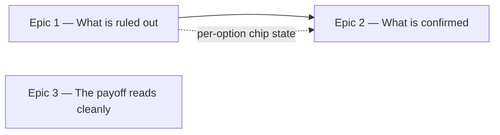

# Roadmap — Fair Feedback

Source: [briefing.md](briefing.md)

## Overview

Feature-16 gave both chip rows a voice; this one stops the app talking over
them. The nudge currently names the day's root after two misses, which answers
by reading the half of the puzzle the player came to learn by ear — so the root
goes back to being hidden until the day is solved or given up, and the nudge
earns its name by *narrowing* the row instead. Ruled out and spent are one
state: a root the nudge eliminated and a root the player checked and missed look
the same, dimmed and unpickable, still in place on the row. The narrowing stops
at four live roots, so the app never eliminates its way to the answer — past
that point the row only shrinks by the player's own deductions. Then the card starts
remembering the other half — a check mark on what a press of *Check* confirmed,
sticky for the rest of the day. Three smaller fixes ride along: the four-bar
sheet stays four bars on a phone, the mode explanation drops its padding, and
the line telling you what to listen for comes back when the tap sounds are off.

Three epics. Epic 1 is the fairness change and the headline — it also carries
the per-option chip state both it and Epic 2 need; Epic 3 is the cleanups and is
independent of everything; Epic 2 is the confirmation half, and it waits on
Epic 1's mechanism and shares three files with it.

## Epics

### Epic 1 — The row shows what is ruled out

**Visible when done:** Sam misses twice and the app no longer tells them the
answer. Instead roots start going dim — the ones they checked and missed, and
some the app has eliminated for them — and the twelve stay exactly where they
were on the row, so the ones still live are the ones still worth hearing. The
day's root is spelled out in the two places it always was: the solved box, and
the reveal after giving up.
**Depends on:** none
**Parallel with:** Epic 3

**Scope**
- **The nudge stops naming the root.** `feedback.ts` has
  `NUDGE_AFTER_MISSES = 2` and `nudgeVisible`; `NudgeBox` renders "The day's
  root is X". The reveal goes.
- **One dim state, two sources.** A chip the player checked and missed and a
  chip the nudge eliminated read identically: dimmed, unpickable, still on the
  row. That is a single concept with a single visual, which is why both sources
  live in this epic rather than being split across two — Epic 1 shipping only
  half of "ruled out looks dim" would ship a rule that is visibly untrue.
- **Per-option state in the design system.** `ChipGroup` takes `disabled` for
  the whole row today. It gains the ability to vary state per option, and stays
  ignorant of what a root is or why one is out — `Chip` already has a locked
  treatment (`disabled:opacity-60`) to build on, and both keep their own
  contract tests. **This is the mechanism Epic 2's check mark also needs**, and
  it lives here because this epic ships first.
- **The nudge narrows from the second miss on**, taking exactly two wrong roots
  off each time — never the answer. `lib/theory/music.ts` has the shape to
  follow: `simpleRootOptions` draws six roots around the answer, date-seeded,
  and this is the same idea keyed on the miss count instead of a preference.
- **It stops at four live roots and never goes below.** Narrowing to a single
  live chip would reveal the root, which is the behaviour this feature exists to
  remove; four is a guess that can still be reasoned about by ear. **The floor
  bounds the app's help, not the player's own deductions:** once four are live
  the nudge stops eliminating, and a root the player then checks and misses
  still dims. So the row can reach one live root around the eighth miss — by
  their own hand, which is earned rather than handed over, and the difference
  is the whole point.
- **In the full row the floor first bites at the fourth miss.** Counting both
  sources — one for the player's own checked root, two for the nudge — the live
  count runs 11, 8, 5, then holds at 4 rather than dropping to 2.
- **In simple mode the nudge never gets to help, and that is accepted.** Six
  roots minus the player's own two checks already sits at the floor by the
  second miss, which is when the nudge is first due. Simple mode's narrowing
  *is* its six roots; this feature adds none. If that turns out to be the wrong
  call the fix is a proportional floor — three against a pool of six — and it is
  one number.
- **The box stays, and says what it did.** A row that quietly dims three chips
  reads as a bug. `NudgeBox` keeps its slot in `GuessCard` and its status-line
  relationship with `FeedbackLine`; only its sentence changes, from naming the
  answer to naming the help.
- **The two existing reveals are untouched.** `SolvedPanel` on a solved day and
  the give-up path from three misses (`REVEAL_AFTER_MISSES = 3`) both still name
  the root. That is what keeps the day always resolvable, and it is why removing
  the nudge's reveal costs the player nothing they need: the dots mark par, not
  lives, so no guess budget runs out.
- Tests: the narrowing arithmetic as plain functions — how many live at how many
  misses, the answer always among them, stable for the day; the per-option chip
  state against `Chip` and `ChipGroup`'s own contracts, independently of the
  feature; the box's new wording as a component test; and the behaviour through
  `index.ts` via `testing/renderFeature.tsx` — miss twice, chips dim, no root is
  named.

**Out of scope**
- **The check mark.** Epic 2 owns confirmation; this epic owns elimination. The
  seam is clean in concept and not in files: both derive from the same attempt
  list and both pass through `feedback.ts`, `GuessCard` and `GroovePuzzle`, which
  is why they are in different waves.
- **Narrowing the mode row.** The briefing asks for roots. Four modes is already
  a shortlist, and the mode row is where feature-16 just put a voice. A mode the
  player checked and missed still dims — that is the elimination rule, not
  narrowing.
- **The give-up flow, the attempt budget and the dots.** Unchanged.
- **The solved box.** Epic 3.

**Validation**
- Demo: guess wrong twice and confirm no root is named anywhere on the card
  while chips visibly dim. Then give up and confirm the root appears; then solve
  a different day and confirm it appears there too.
- **Demo the unforgivable bug:** the answer must never be dimmed. Test it across
  every root in the catalogue, in both modes — a narrowing that can eliminate
  the correct root makes the day unwinnable.
- Demo the floor: miss four times in the full row and confirm four roots are
  still live, then keep missing and confirm the row only shrinks by the roots
  you yourself checked.
- Demo simple mode: confirm the nudge eliminates nothing, because the floor is
  already met — and that this reads as "simple mode is already narrowed" rather
  than as a broken nudge. The box's sentence has to hold in a mode where it has
  nothing to announce.
- Tests as above, plus the existing nudge tests updated rather than deleted:
  they asserted a reveal, and their subject is now the narrowing.

### Epic 2 — The row shows what is confirmed

**Visible when done:** Sam presses *Check* on `G` + `Dorian`, gets "right home
note, wrong colour", and `G` keeps a check mark for the rest of the day — still
there three wrong guesses later. Four attempts in, the card holds both halves of
what they know: what is out, and what is settled. And the line under the play
control tells them what to listen for again, even with the tap sounds off.
**Depends on:** Epic 1's per-option chip state, and its dim rule — a mark and a
dim share one slot on one chip.
**Parallel with:** nothing; it shares three files with Epic 1.

**Scope**
- **A check mark on what a press of *Check* confirmed**, root or mode, and only
  after the press — never on a bare selection.
- **The mark is sticky.** It survives every later wrong guess. A mark that only
  described the most recent check would say nothing the feedback line did not
  already say, and holding that straight is the single most likely thing to get
  wrong.
- **Simple mode's two-chip row is marked the same way.** A right family gets a
  check mark exactly as one of four modes would; the family was guessed, not
  given.
- **The `♪` and the mark share one slot.** Per the briefing the check can
  replace the note icon, and with the sounds off there is no icon to replace.
  Worth watching: a chip whose `♪` has been replaced becomes the one chip on an
  audible row that does not look audible, so keeping both or putting the check
  after the label are both on the table.
- **The caption tells the truth again.** `CAPTION_SOUNDS_OFF` currently reads
  "Tap sounds are off — switch them back on under Simple mode.", which spends
  the card's one caption line describing a switch the player just flipped and
  costs them the line that sets the task. It becomes the sounds-on sentence
  minus its tap clause. **This changes feature-16's AC11a**, which asserts the
  current wording — the criterion moves, not just the string.
- **The feedback line gets shorter.** "Right home note, wrong colour. Keep the
  root and try another flavour." instructs what the mark now shows.
- Tests: the mark derivation as plain functions over an attempt list, which is
  where stickiness is actually provable; the per-chip mark against `Chip` and
  `ChipGroup`'s contracts; and through `index.ts` — check a partly-right pair,
  then two more wrong pairs, and the first mark is still there.

**Out of scope**
- **Which roots are live, and the dim treatment.** Epic 1.
- **Marking anything before *Check* is pressed.** A selection is not a guess,
  and feature-16's rule that tapping is never a guess is unchanged.
- **Re-opening a finished day.** Marks on a solved or revealed day are a record,
  not a control.
- **The solved box.** Epic 3.

**Validation**
- Demo the sticky path end to end: confirm a root, then miss twice more with
  other roots, and the confirmation is still on screen. Then the same for a
  mode, and for a family in simple mode.
- Demo with the tap sounds off: the marks still work, the caption sets the task,
  and no chip claims to sound.
- Demo a chip that is both confirmed and locked once the day ends, and one that
  carries a mark next to a dimmed neighbour — the two states have to be
  distinguishable at a glance, in both themes.
- Screen-reader pass: a mark is decoration and a chip's accessible name stays
  its label, as the `♪` already does. Whether a marked or dimmed chip needs more
  than that is the one accessibility question worth answering out loud.

### Epic 3 — The payoff reads cleanly

**Visible when done:** on Sam's phone the four bars of the lead sheet read as
four bars across one row, the way a lead sheet does, instead of folding into a
2 × 2 block. And the line explaining the mode stops padding itself: "major with
a ♯4" rather than "major with a ♯4 — that's the note doing it".
**Depends on:** none
**Parallel with:** Epic 1, Epic 2 — it shares no file with either

**Scope**
- **The sheet stays one row, bought with type size and padding.** `LeadSheet` is
  `grid grid-cols-2 sm:grid-cols-4`, so below `sm` it is deliberately 2 × 2 —
  feature-11 chose a grid over a wrapping flex row precisely so it could never
  break 3 + 1, which "reads as a mistake rather than a line break". Below `sm`
  the type comes down and the padding tightens so four bars fit one row; the
  sheet is read rather than tapped, so it can take a size a control could not.
  The numerals stay — they are feature-15's lesson and the degrees are what
  transfer to the instrument.
- **The filler clause goes.** Ten of the twelve lines in
  `lib/theory/character.ts` end in a phrase that only points at what the line
  has already said — eight in "that's the note doing it" or "those are the notes
  doing it", two in "that's the sound of it". The clause before it already says
  it; the pointing is the app elbowing the player in the ribs, which is what
  `docs/persona.md` means by homework. `Melodic minor` has no such phrase, and
  **`Blues` keeps its em-dash clause** because that clause is the only place its
  line names its ♭5 — so the rule bans the phrases, never a trailing clause. No
  test asserts a literal line string, so nothing outside `character.test.ts`
  moves with the copy.
- Tests: `LeadSheet` against its own contract at both widths, with the existing
  bar-order and numeral-geometry assertions kept; `character.ts` as plain data.

**Out of scope**
- **What the solved box says beyond that clause.** Feature-15 settled the
  lesson; this trims one phrase and re-lays one component.
- **The staff notation.** Feature-15's briefing already flagged it as ugly and
  left it; still open, still not this.
- **The guess card.** Epics 1 and 2.

**Validation**
- Demo at 360px and at 320px: four bars, one row, nothing clipped, and the
  numerals still under their own bars. Then at desktop width, unchanged.
- Demo the longest possible chord symbol in bar 1 and in bar 4.
- Read the twelve mode lines aloud and confirm each still says what it is.

## Dependency map

## Execution waves

- **Wave 1 (parallel):** Epic 1, Epic 3. Disjoint: Epic 1 has
  `lib/presentation/feedback.ts`, `lib/theory/music.ts`,
  `src/components/controls/{Chip,ChipGroup}.tsx`,
  `components/puzzle/NudgeBox.tsx` and `GuessCard`'s chip rows and nudge slot;
  Epic 3 has `components/solved/LeadSheet.tsx` and `lib/theory/character.ts`.
- **Wave 2:** Epic 2 — needs Epic 1's per-option chip state, and shares
  `lib/presentation/feedback.ts`, `components/puzzle/GuessCard.tsx` and
  `components/GroovePuzzle.tsx` with it.
- **Not claimed as parallel, deliberately.** Feature-16's roadmap said its three
  epics had disjoint file sets and they did not — all three ended up editing
  `GroovePuzzle.tsx` and its sounding test, and the wiring had to be serialised
  mid-run. Epics 1 and 2 here share three files outright, so they are in
  different waves from the start rather than discovering it at implementation.

## Assumptions

- **The narrowing keeps the answer.** Non-negotiable, and worth asserting over
  every root in the catalogue rather than trusting: a narrowing that can dim the
  correct root makes the day unwinnable, which is the one thing
  `docs/persona.md` says loses the player outright.
- **The floor is on the nudge, not on the row.** The only coherent reading:
  bounding the total live count would mean a root the player checked and missed
  stops dimming once four are live, which contradicts this epic's own rule that
  ruled out looks dim. So the app stops helping at four and the player can still
  narrow past it themselves.
- **The narrowing is stable for the day.** Like the option rows, derived from
  the date and the attempts, not from a shuffle that moves on re-render.
- **A dimmed chip is unpickable but still audible.** Feature-10 and feature-16
  established that a locked row is still a sounding row; a root that has been
  ruled out is still a root worth hearing against the loop, and silencing it
  would take away the comparison that makes the elimination make sense.
- **The nudge box keeps its slot and its role.** It stays the card's one status
  line beside `FeedbackLine`, and only its sentence changes. Removing the
  component and letting chips silently dim would be cheaper and worse.
- **In simple mode, one wrong family leaves one live family, and that is
  accepted.** A two-chip row cannot absorb an elimination without conceding the
  half; the feedback line already says as much on a mode-right or mode-wrong
  check, so nothing new is given away.
- **A mark is decoration, and a chip's accessible name stays its label** — the
  bargain the `♪` already struck.
- **The feedback line loses its instruction, not its diagnosis.** "Right home
  note, wrong colour" stays; "keep the root and try another flavour" goes, once
  the mark shows it.
- **Grinding is not designed against.** The check mark makes brute force more
  legible — lock the root, then cycle the modes — but the feedback line already
  allowed it and the dots mark par, not lives, so anyone who wants that path
  already has it.
- **Feature-16's AC11a changes rather than breaks.** Its record stands as what
  was built and verified; this feature moves the criterion, and the caption's
  two wordings stay mirrored in `testing/puzzleHarness.tsx`, which is where
  every assertion about them reads from.
