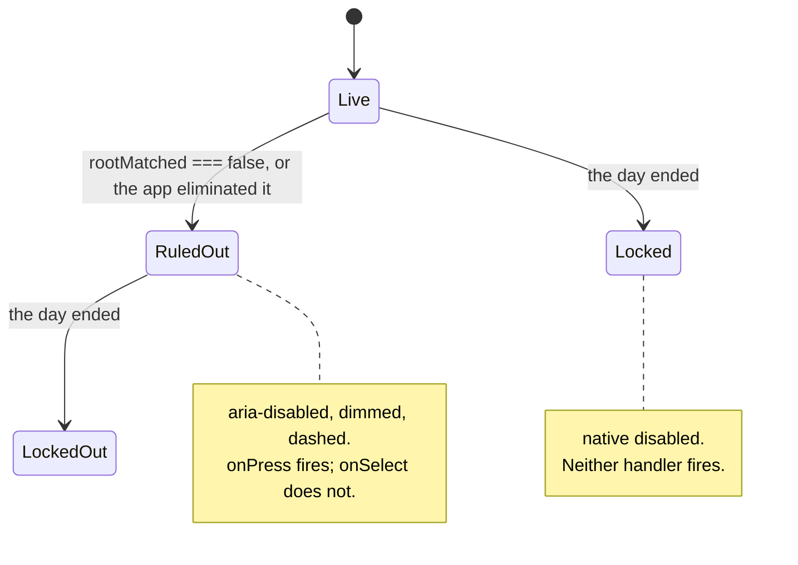

# Tech spec — Epic 1: The row shows what is ruled out

PRD: [../prd/epic-1-the-row-shows-what-is-ruled-out.md](../prd/epic-1-the-row-shows-what-is-ruled-out.md) ·
Roadmap: [../roadmap.md](../roadmap.md)

## Approach

Four pieces, in a line from the design system outwards. `Chip` learns a **second
lock** — `unavailable`, carried by `aria-disabled` and a handler that declines
the pick while still reporting the press — and `ChipGroup` learns to hand that
state to one option rather than the whole row, through a per-option record that
is deliberately incapable of expressing the row's native `disabled`. That is how
R4b stops being a sentence and becomes a shape: the state that keeps a chip
audible cannot silence it, and the state that silences it cannot be set per
option.

The arithmetic is two pure modules. `lib/puzzle/narrowing.ts` is the app's
elimination — a fold over the attempt list that draws from a date-seeded shuffle
of *the wrong roots only*, so the answer is not a candidate at all rather than
being filtered out afterwards. `lib/presentation/ruledOut.ts` unions that with
the roots and modes the player checked and missed, and reports the one number the
box is allowed to say. `feedback.ts` loses `NUDGE_AFTER_MISSES` and
`shouldShowNudge` stops counting misses: the box is due when the app has
eliminated something, which makes R19 one predicate instead of a mode check.

The card is then wiring plus two deletions. `GuessCard` loses `answerRoot`,
`NudgeBox` loses `root`, and the store stops handing the answer's root over as a
selection on the second miss — three removals that together make R1 structural:
the answer's root is no longer a value the playable card is given. In its place
the store clears whichever half of the selection was just ruled out, and the call
to action asks for the half that is now missing.

**No step in this spec adds an explanatory comment.** `AGENTS.md` now says code
should explain itself and forbids prose in comments, and the surrounding files
are heavily prose-commented in the old style — so this spec does not match them.
Every "why" that would previously have been a comment block is in the
Architecture and Contracts sections below, and the contract snippets are
signatures only; the reasoning attached to each one is the prose underneath it.
Two consequences for the tracks: a rule that has to survive is held by a test or
by a type, never by a warning in a comment (R4b is the worked example), and where
a step changes behaviour an existing comment describes, the step **deletes** that
comment rather than rewriting it into new prose — a stale comment is worse than
none, and a replacement would break the rule.

## Architecture

### The derivation chain

```
attempts ─┬─▶ lib/puzzle/narrowing.ts        eliminatedRoots(pool, answer, attempts, seed)
          │        │  a fold over the misses; candidates are the pool minus the answer
          │        ▼
          └─▶ lib/presentation/ruledOut.ts   ruledOut({ attempts, answer, roots, date })
                   │  ∪ the player's own missed roots/modes; counts what the app took
                   ▼
             GroovePuzzle ──▶ shouldShowNudge(eliminatedCount, solved)   (feedback.ts)
                   │
                   ├─ ruledOutRoots / ruledOutFlavours / eliminated ──▶ GuessCard
                   │                                                        │
                   │                                    optionStates ──▶ ChipGroup ──▶ Chip
                   └─ eliminated ─────────────────────────────────────▶ NudgeBox
```

Every arrow already exists as a direction the app may draw. The one new
design-system capability — per-option state — is expressed as a generic record
keyed by the option string, so `ChipGroup` learns that state can vary within a
row and learns nothing about roots, modes or why one is out. `globals.test.ts`
guards I2, I4 and I5 stay green: no feature import, no `className` escape hatch,
and no domain vocabulary — `unavailable` is a word about a control, not about
music.

### Two locks, and why they cannot collapse

| | rendered as | click reaches | who sets it | when |
| :-- | :-- | :-- | :-- | :-- |
| **ruled out** | `aria-disabled="true"` + the dim treatment | `onPress` only | `optionStates[option].unavailable` | per option, all day |
| **the day ended** | the native `disabled` attribute | nothing at all | `ChipGroup`'s row-wide `disabled` | the whole row, once |

Three things make R4b structural rather than aspirational:

1. **`Chip` never derives one from the other.** `disabled` goes straight to the
   button's `disabled` attribute; `unavailable` never touches it. Step A4 asserts
   the four-way truth table *and* reads the source for the two collapses someone
   would actually write.
2. **`ChipOptionState` cannot express the row's lock**, and Step A9 reads the
   type from disk to keep it that way — it rejects a `disabled` field, or a
   `silent`, `inert` or `locked` one, however spelled. The row's lock is not
   expressible per option, so no later edit can silence one chip by marking it.
   Note what that step deliberately does *not* do: it does not freeze the field
   list. New per-option state is expected — Epic 2's `mark` is already in the
   contract — and a guard that failed on every addition would fail for a reason
   unrelated to the thing it protects.
3. **`GuessCard` passes them from different props** — `disabled={over}` and
   `optionStates={unavailableStates(ruledOutRoots)}` — and passes the second one
   *whatever* `over` says, which is what keeps the record legible under the lock
   (R20).

### Why the answer cannot be eliminated

`eliminatedRoots` shuffles `pool.filter((root) => root !== answer)`. The answer
is not in the candidate list, so there is no code path — no off-by-one, no
floor bug, no reload — that can take it. The two other ways a chip could dim are
equally closed:

- A **root** is ruled out by the player only when `attempt.rootMatched === false`,
  and the answer's root always matches. Strict `=== false`, not `!attempt.rootMatched`:
  a legacy or unreadable attempt with no `rootMatched` field rules out nothing,
  which is R21's safe direction and closes the one way a stored record could dim
  the answer.
- A **mode** is ruled out on `attempt.flavourMatched === false`, by the same rule.
  The app never eliminates a mode at all (PRD, out of scope).

Step B6 sweeps it anyway — every root in `ROOTS` as the day's answer, in both
pools, played to the floor and past it, in three attempt shapes — because AC8 is
the criterion that makes the day unwinnable when it fails.

### Where the floor sits, and what simple mode gets

The fold walks the misses in order. For each miss the player's own ruled-out root
is recorded first, then the app eliminates:

```
live = pool.length − |player's ruled-out ∪ already eliminated|
if (missIndex >= ELIMINATE_AFTER_MISSES && live − ELIMINATED_PER_MISS >= LIVE_ROOT_FLOOR)
  take the next ELIMINATED_PER_MISS still-live candidates, in shuffled order
```

Which reproduces the PRD's table exactly — 11, 8, 5, 4, 3, 2 live in the twelve
row, with the app's column at 0, 2, 4, 4, 4, 4 — and holds the floor on the
app's help rather than on the row, so the player can still narrow past four
themselves (R13).

**Simple mode is exempt by pool size, not by a mode flag.** A pool of
`LIVE_ROOT_FLOOR + ELIMINATED_PER_MISS` (six) or fewer is narrowed by nobody:

```ts
const NARROWABLE_ABOVE = LIVE_ROOT_FLOOR + ELIMINATED_PER_MISS
if (pool.length <= NARROWABLE_ABOVE) return []
```

The reasoning, which lives here and not in the file: a row that small can absorb
at most one elimination step, which would make the app's help the whole shortlist
rather than a narrowing of it. Simple mode's six roots sit exactly there, so the
app takes none of them. The threshold is derived from the two constants that
already exist rather than being a third number, and the name is what carries it
in the source.

This matters because R16 is stronger than its own stated reasoning. The PRD
justifies it as "six roots minus the player's own two checked roots already sits
at the floor" — true when the two misses were root-wrong, but a player who
misses twice with the *right* root has six live, and the general rule would then
take two. AC16 is absolute ("no root is dimmed except the ones the player
checked"), so the exemption is implemented as written and derived from the two
constants that already exist rather than added as a third number. Dropping
`LIVE_ROOT_FLOOR` to 3 is still the one-number change the PRD promises: five
becomes the threshold, and simple mode narrows.

### The row on offer is what gets narrowed

`ruledOut` is handed `roots` — the row `GroovePuzzle` is actually rendering, so
`ROOTS` or `simpleRootOptions(today, answer)`. Two consequences, both intended
and both asserted:

- Switching to simple mode mid-day **withdraws the app's eliminations and the
  box with them**, because the six-root row is exempt. The player's own dimmed
  roots survive the switch wherever they are still on the row, and switching back
  restores exactly the same eliminations, because the derivation is a function of
  the attempts, the pool and the date. R8 is about a row that never un-dims under
  its own rules, and it holds per row; the existing composed case that asserts
  "the nudge those two misses earned is still there" across the switch flips to
  the opposite expectation in Step F10.
- Nothing is stored. R9 comes free: the dims are arithmetic over the attempt
  list, so a reload that restores the attempts restores the dims.

### What this epic leaves in the three files Epic 2 also edits

Epic 2 runs in wave 2 and shares `lib/presentation/feedback.ts`,
`components/puzzle/GuessCard.tsx` and `components/GroovePuzzle.tsx` with this
epic — plus `testing/puzzleHarness.tsx`, which the roadmap's wave list does not
name and which this epic touches in one line. Feature-16's roadmap claimed
disjoint file sets for three epics that all ended up editing `GroovePuzzle.tsx`;
this is the paragraph that stops that happening twice.

**`lib/presentation/feedback.ts`** — after this epic: `DOT_COUNT`,
`REVEAL_AFTER_MISSES`, `selectFeedback`, `dotStates`, `shouldOfferReveal` and the
private `missCount` are all unchanged in name and signature. `NUDGE_AFTER_MISSES`
is **gone**; its 2 lives on as `ELIMINATE_AFTER_MISSES` in
`lib/puzzle/narrowing.ts`. `shouldShowNudge` keeps its name and changes shape to
`shouldShowNudge(eliminatedCount: number, solved: boolean)`. Epic 2's edit here
is the `ROOT_MATCHED` message losing its instruction clause — one string
constant, no signature — and its own confirmation derivation should be a new
module (`lib/presentation/confirmed.ts`) beside `ruledOut.ts` rather than growing
this file.

**`components/puzzle/GuessCard.tsx`** — after this epic: `answerRoot` is gone;
`ruledOutRoots`, `ruledOutFlavours` and `eliminated` are added; both `ChipGroup`
calls take `onSelect` **and** `onPress` (the pick and the tap, split) plus
`optionStates={unavailableStates(...)}`; the CTA label has two new branches.
Epic 2's mark goes into **the same record**: `ChipOptionState.mark` is already
declared and unused, `Chip.mark` likewise, so Epic 2 fills the slot rather than
adding a second `optionStates`-shaped prop or a per-chip `adornment`. On this
side that means `unavailableStates` becomes a merge over the ruled-out and the
confirmed lists — one map that carries both per-option facts, which is why Step
A9 checks that the type has room for a field it never sets and does **not**
freeze the list. The row-wide `adornment={tapSounds ? '♪' : undefined}` is untouched
by this epic (R4c) and is the seam Epic 2 has to decide about, exactly as its
roadmap entry says.

**`components/GroovePuzzle.tsx`** — after this epic: one new `useMemo` named
`narrowing` sits directly above the existing `showNudge` memo, and
`answerRoot={answer.root}` is deleted from the `GuessCard` call. Epic 2 adds a
sibling memo beside `narrowing` and two more props to the same call. Nothing else
in the file moves: the caption ternary, the handlers, the gates and the transport
are untouched here.

**`testing/puzzleHarness.tsx`** — after this epic: `control()`'s regex is widened
from `/^(Pick a root|Check |Solved$)/` to `/^(Pick a |Check |Solved$)/`, because
the control can now say "Pick a mode". `CAPTION`, `CAPTION_SOUNDS_OFF`,
`chipLabel`, `chipAdornment` and `nudge()` are untouched; `CAPTION_SOUNDS_OFF` is
Epic 2's to rewrite.

Epic 3 shares nothing with either.

### The state a chip can be in



`LockedOut` is not a fourth treatment: it is `disabled` and `unavailable` at
once, and the dashed border is what keeps it apart from `Locked` on a finished
day (R20, AC19).

## Contracts

Frozen. Tracks build against these rather than against each other.

### C1 — per-option state in the design system

```ts
// src/components/controls/Chip.tsx

type ChipProps = {
  label: string
  selected: boolean
  disabled: boolean
  unavailable?: boolean
  onSelect: () => void
  onPress?: () => void
  tone?: ChipTone
  adornment?: string
  mark?: string
}
```

What each of the five props this epic adds or leans on means, held here rather
than in the file:

- `disabled` — settled: the browser declines the press outright, so neither
  handler runs. It is the row's own lock and never one option's.
- `unavailable` — shown as not choosable: it reports `aria-disabled`, takes the
  dim treatment, and its press reaches `onPress` but never `onSelect`. It is not
  `disabled` and must never be turned into it; a chip can be unpickable and
  still do something (R4a, R4b). Step A4's source guard is what holds that, not
  this paragraph.
- `onSelect` — the option was chosen. Never called while `unavailable`.
- `onPress` — the chip was pressed, chosen or not. Called after `onSelect`.

`label`, `selected`, `tone` and `adornment` are unchanged, including
`adornment`'s existing `aria-hidden` treatment.

`mark` is **declared here and rendered by nobody in this epic.** It is the slot
Epic 2's check mark fills, frozen now so that its consumer extends one type
rather than adding a second per-option map beside `optionStates`. Track A adds
the optional prop to `ChipProps` and stops: it does not destructure it, does not
render it, does not pass it down from `ChipGroup`, and writes no test for it —
the mark's rendering and its geometry (out of the content flow, in the chip's
trailing padding) are specified in Epic 2's Track B, which owns both files for
that change. Nothing in this epic sets it, so no chip in a feature-17 Epic 1
render carries one.

```ts
// src/components/controls/ChipGroup.tsx

export type ChipOptionState = {
  unavailable?: boolean
  mark?: string
}

type ChipGroupProps = {
  label: string
  options: string[]
  value: string | null
  onSelect: (option: string) => void
  onPress?: (option: string) => void
  disabled: boolean
  name: string
  columns: ChipColumns
  adornment?: string
  optionStates?: Record<string, ChipOptionState>
}
```

`ChipOptionState` is what one option's chip is, beyond what the row is, keyed by
the option string; an option with no entry is an ordinary chip. Two fields, and
this epic uses one:

- `unavailable` — set by this epic, from `ruledOutRoots` and
  `ruledOutFlavours`.
- `mark` — set by Epic 2, never here. It is in the frozen type so the check
  mark extends this one record instead of arriving as a parallel
  `Record<string, …>` prop that `ChipGroup` would then have to keep in step
  with `optionStates`. One map, two consumers.

**The type cannot express the row's `disabled`, and that is the point** — the
row's lock silences every chip and `unavailable` does not, so a type that could
say both would let a later edit collapse them (R4b). Step A9 reads the type from
disk and rejects a disabled-like field; it does **not** freeze the field list,
because a third per-option field is a normal thing to add and breaking on it
would say nothing about the two locks.

This reverses what `ChipGroup`'s own docstring says today — "a row where some
chips are marked and others are not is not a thing this group models" — and the
reversal is generic: the group learns that state can vary within a row, and
learns nothing about roots, modes or why one option is out. `adornment` stays
row-wide (R4c). The docstring's now-false sentence is deleted in Step A7 rather
than replaced.

- Behaviour of a press, exactly: native `disabled` → nothing; else
  `unavailable` → `onPress?.()` only; else `onSelect()` then `onPress?.()`.
- The dim treatment is one appended class string,
  `const UNAVAILABLE = 'border-dashed opacity-60'`, added after the tone
  palette. Opacity alone would be invisible under the row's own
  `disabled:opacity-60`; the border style is the channel that survives the lock
  (AC19). It sets no ink colour, so the `♪` keeps riding `currentColor` (R4c).
- **Additive for Epic 2.** `mark` is already declared on both types and set by
  nothing; Epic 2 fills it and renders it. No further prop is added for
  per-option anything, on either type.

### C2 — the app's elimination

```ts
// src/features/daily-groove/lib/puzzle/narrowing.ts
import type { Attempt, Root } from '../../types'

export const ELIMINATE_AFTER_MISSES = 2
export const ELIMINATED_PER_MISS = 2
export const LIVE_ROOT_FLOOR = 4

export function eliminatedRoots(
  pool: readonly Root[],
  answer: Root,
  attempts: readonly Attempt[],
  seed: string,
): Root[]
```

The three constants are the PRD's three numbers: the app eliminates nothing until
the second miss (R10), each qualifying miss takes two still-live roots (R11), and
its elimination never takes the live count below four (R12). Their names are what
say so in the source; the steps that pin each number are B2, B3 and B5.

`eliminatedRoots` returns the roots the app has eliminated, cumulatively, for a
day played as `attempts` describes. The properties it guarantees, each with the
step that proves it:

- **Never the answer** (R7, Step B6) — the candidates are `pool` minus `answer`,
  so the answer is not selectable rather than filtered out afterwards.
- **Deterministic in `seed`** (R14, Step B7) — every player sees the same
  eliminations all day, and a re-render sees the same ones.
- **Accumulates** (R15, Step B4) — a root eliminated at one miss is in every
  later result.
- **Exempts a small pool** (R16, Step B8) — `[]` for a pool of
  `LIVE_ROOT_FLOOR + ELIMINATED_PER_MISS` or fewer.
- **Cannot fail** (R21, Step B9) — an attempt that cannot be read counts as
  neither a miss nor a ruling-out, which offers every root.

- The returned array is in `pool` order, deduped.
- `attempts` is read in order; only `attempt.correct === false` counts as a miss.
- Seed string used internally: `` `${seed}:eliminate` ``, shuffled with
  `seededShuffle` from `../theory/options` — the feature's only seeded shuffle,
  as `lib/puzzle/selectGroove.ts` already uses it.

### C3 — what the card reads as ruled out

```ts
// src/features/daily-groove/lib/presentation/ruledOut.ts
import type { Answer, Attempt, Flavour, Root } from '../../types'

export type RuledOut = {
  roots: Root[]
  flavours: Flavour[]
  eliminatedCount: number
}

export function ruledOut(args: {
  attempts: readonly Attempt[]
  answer: Answer
  roots: readonly Root[]
  date: Date
}): RuledOut
```

One day's ruled-out state, derived from the attempts and nothing else, so it
survives a reload exactly as they do (R9). The three fields:

- `roots` — the roots that read as dimmed: the player's own misses unioned with
  the app's eliminations (R4, R5). Which source ruled a chip out is not
  recoverable from here, because a player cannot recover it either.
- `flavours` — the modes the player checked and missed. The app eliminates no
  mode, and Step B12 is the guard that keeps it that way.
- `eliminatedCount` — how many roots the app has eliminated so far,
  cumulatively. The whole of what the box is allowed to say (R17); zero means it
  says nothing (R19).

The `roots` argument is the row actually on offer — `ROOTS`, or simple mode's
six — which is what makes the pool-size exemption in `narrowing.ts` do R16's
work without either module hearing about simple mode.

- `roots` and `flavours` come back in the order the options were given / the
  attempts were checked, deduped, and never contain the answer's half.
- A root is the player's only on `attempt.rootMatched === false`; a mode only on
  `attempt.flavourMatched === false`. Strict, so an unreadable attempt dims
  nothing (R21).
- `eliminatedCount === eliminatedRoots(...).length`, and is always a multiple of
  `ELIMINATED_PER_MISS`.
- Seed: `isoDate(args.date)`, as `simpleRootOptions` already does it.

### C4 — the box's visibility

```ts
// src/features/daily-groove/lib/presentation/feedback.ts

export function shouldShowNudge(eliminatedCount: number, solved: boolean): boolean
```

Whether the box beside the feedback line has anything to say. It says one thing —
how many roots the app has ruled out — so it is due exactly when that number is
not zero, which is why a mode where the app eliminates nothing renders no box at
all rather than a box claiming nothing happened (R17, R19). Body:
`!solved && eliminatedCount > 0`.

`NUDGE_AFTER_MISSES` is deleted, and the docstring that describes the function as
revealing the day's root goes with it — Step B14 deletes it rather than rewriting
it. Nothing else in the module changes.

### C5 — the box

```ts
// src/features/daily-groove/components/puzzle/NudgeBox.tsx

type NudgeBoxProps = {
  eliminated: number
}
```

`eliminated` is how many roots the app has ruled out so far, cumulatively (R17).
The `root` prop and the docstring describing the box as revealing the day's root
are both deleted in Step D1.

The sentence, fixed here so no track invents it:

```
`${eliminated} roots ruled out. Narrowing as you go.`
```

It names a count and no root (R18), never a live count (R17a), and reads
identically for two consecutive misses at the floor because it is a function of
the count alone (R17b). It has no singular form and needs none: eliminations
land in pairs, so the count is 0, 2, 4, 6 or 8. Step B5 pins the evenness as a
property of the arithmetic, which is what makes the plural safe — a future
`ELIMINATED_PER_MISS = 1` breaks that step and the copy at once, in that order.

The `aria-label="A nudge"`, the `aria-live="polite"`, the eyebrow and the box's
slot in `GuessCard` are all unchanged: it keeps its status-line relationship
with `FeedbackLine`, and `puzzleHarness`'s `nudge()` keeps working. The
`font-display` span around the root goes with the root — the count is a number,
not a hand-lettered note name, which leaves no `font-display` anywhere in
`components/puzzle/`.

### C6 — the card's props

```ts
// added
  ruledOutRoots: Root[]
  ruledOutFlavours: Flavour[]
  eliminated: number

// removed
  answerRoot: Root
```

`ruledOutRoots` is the union `lib/presentation/ruledOut` already computed (R4,
R5) — the card is not told which source ruled a chip out, because a player
cannot tell either. `ruledOutFlavours` is the modes the player checked and
missed (R4). `eliminated` is the box's whole content (R17).

**`answerRoot` has exactly one reader today**, `<NudgeBox root={answerRoot} />`
at `GuessCard.tsx:320`, and exactly one writer, `answerRoot={answer.root}` at
`GroovePuzzle.tsx:525`; its other three appearances are the prop declaration, its
docstring, and the `props()` factory plus three overrides in
`GuessCard.test.tsx`. Nothing else in `src/` names it — so it goes, and with it
the last channel by which the playable card could learn the answer.

`showNudge` stays as the gate (`GroovePuzzle` derives it through C4) and
`eliminated` is the content. Both, rather than one: the card takes derived
values as props and recomputes nothing, which is the rule this file already
states about itself.

### C7 — the store, after a check

```ts
// src/features/daily-groove/state/useDailyGrooveStore.ts — check()
set({
  attempts: next,
  solved: attempt.correct,
  ...(attempt.correct
    ? {}
    : {
        ...(attempt.rootMatched ? {} : { selectedRoot: null }),
        ...(attempt.flavourMatched ? {} : { selectedFlavour: null }),
      }),
})
```

And `hydrate` restores the same thing a check would have left:

```ts
selectedRoot: last?.rootMatched ? last.root : null,
selectedFlavour: last?.flavourMatched ? last.flavour : null,
```

The half that was just ruled out is dropped and the half that was not stays where
the player put it (R19a, R19b); a solve keeps both, because the finished card
shows the pair that won. Hydration restoring only the matched halves is what
makes a reload agree with the check that preceded it rather than re-offering a
pair the day has already refused.

The `selectedRoot: answer.root` hand-over on the second miss is **deleted**, and
with it the store's only reference to the answer outside scoring — and the
comment above it, which describes a nudge that has "already named the day's root
in prose", goes in the same step (C1) rather than being reworded.

## Tracks

### Track A — Per-option state in the design system

- **Goal** — `Chip` carries a second lock that is unpickable and still audible,
  `ChipGroup` can give it to one option, and neither knows what a root is. Both
  keep their own contract tests.
- **Owns** — `src/components/controls/Chip.tsx`,
  `src/components/controls/Chip.test.tsx`,
  `src/components/controls/ChipGroup.tsx`,
  `src/components/controls/ChipGroup.test.tsx`
- **Role** — `implementer`
- **Depends on** — nothing. Contract C1 is frozen above.
- **Parallel with** — Track B, Track C, Track D
- **Done when** — its own cases pass, every pre-existing case in both files
  passes **unchanged**, and `npm test` is green (no consumer passes the new
  props yet, so nothing else moves).
- **Not owned** — `src/components/structure.test.ts`. No component is added or
  removed, so its lists do not change.

### Track B — The arithmetic

- **Goal** — the elimination, the union, the count, and the box's visibility, as
  plain functions with the AC8 sweep behind them.
- **Owns** — `src/features/daily-groove/lib/puzzle/narrowing.ts` and its test,
  `src/features/daily-groove/lib/presentation/ruledOut.ts` and its test,
  `src/features/daily-groove/lib/presentation/feedback.ts` and its test
- **Role** — `implementer`
- **Depends on** — nothing. It reads `seededShuffle` and `isoDate`, both of
  which already exist.
- **Parallel with** — Track A, Track C, Track D
- **Done when** — every case below passes and `npm test` is green. The
  `shouldShowNudge` signature change makes `GroovePuzzle.tsx` a type error until
  Track F lands, so this track ends by making that one call site compile —
  `shouldShowNudge(0, solved)` is **not** acceptable; see the note under the
  waves.

`narrowing.ts` and `ruledOut.ts` are one track because `ruledOut.test.ts` must
run against the real elimination: mocking `../puzzle/narrowing` would be a
`vi.mock` of an internal path, which `docs/testing.md` rules out. `feedback.ts`
joins them because its change *is* the derivation's last step, and it is a file
Epic 2 also edits — one owner in one wave is what keeps that seam legible.

### Track C — The selection after a check

- **Goal** — the store stops handing the answer's root over, clears the half
  that was just ruled out, keeps the half that survived, and restores exactly
  that on a reload.
- **Owns** — `src/features/daily-groove/state/useDailyGrooveStore.ts` and its
  test, `src/features/daily-groove/hooks/usePuzzleSession.test.ts`
- **Role** — `implementer`
- **Depends on** — nothing. `usePuzzleSession.ts` itself needs no edit: it
  delegates, and the one case that asserted the hand-over is in its test.
- **Parallel with** — Track A, Track B, Track D
- **Done when** — the store's rewritten describe block passes, the session case
  passes with its subject moved, and `npm test` is green apart from the composed
  cases Track F owns.

### Track D — The box says what it did

- **Goal** — `NudgeBox` names a count, names no root, states no live count, and
  keeps its slot, its eyebrow and its live region.
- **Owns** — `src/features/daily-groove/components/puzzle/NudgeBox.tsx` and its
  test
- **Role** — `implementer`
- **Depends on** — nothing. Contract C5 fixes the copy and the prop.
- **Parallel with** — Track A, Track B, Track C
- **Done when** — its four cases pass. `GuessCard.tsx` still passes `root=` at
  this point, so the tree does not typecheck until Track E lands — expected, and
  the reason D and E are in different waves.

### Track E — The card

- **Goal** — the two rows render per-option state, a ruled-out chip is dimmed,
  unpickable and audible, the day-over lock silences it, the `♪` stays row-wide,
  the box appears only when it has something to say, and the control asks for
  the missing half.
- **Owns** — `src/features/daily-groove/components/puzzle/GuessCard.tsx` and its
  test
- **Role** — `implementer`
- **Depends on** — Track A's `Chip` and `ChipGroup` **real** (its assertions are
  rendered chips, and the only way to render them without the primitives is to
  mock a design-system path), Track D's `NudgeBox` **real**, and contracts C3
  and C6.
- **Parallel with** — nothing in this epic.
- **Done when** — every case below passes, every pre-existing `GuessCard` case
  passes with only the `props()` factory's `answerRoot` removed, and `npm test`
  is green apart from Track F's composed cases.

### Track F — The page, and the composed behaviour

- **Goal** — the page derives the narrowing from the row it is rendering, hands
  it down, and every composed acceptance criterion is proven through
  `index.ts`.
- **Owns** — `src/features/daily-groove/components/GroovePuzzle.tsx`,
  `src/features/daily-groove/components/GroovePuzzle.guessing.test.tsx`,
  `src/features/daily-groove/testing/puzzleHarness.tsx`
- **Role** — `implementer`
- **Depends on** — Track B's modules real, Track C's store real, Track E's
  props.
- **Parallel with** — nothing in this epic.
- **Done when** — every case below passes, `npm test` is green,
  `npm run lint` and `npx tsc --noEmit` are clean.
- **Not owned, and expected to stay untouched** —
  `GroovePuzzle.sounding.test.tsx`, `GroovePuzzle.page.test.tsx`,
  `GroovePuzzle.header.test.tsx`, `GroovePuzzle.intro.test.tsx`,
  `components/puzzle/AttemptDots.test.tsx` (its composed case asserts *no* nudge
  on an untouched day, which is still true), `components/solved/SolvedPanel.tsx`
  and its test. If any of them goes red, that is a finding for Track G, not a
  file to edit quietly.

### Track G — Integration and verification

- **Goal** — the epic is proven end to end and every R and AC is graded.
- **Owns** — no source file. It runs checks and reports.
- **Role** — `verifier`
- **Depends on** — Tracks A–F.
- **Parallel with** — nothing.
- **Done when** — `npm test`, `npx tsc --noEmit`, `npm run lint` and
  `npm run build` are clean, the demo path below has been walked, and every
  criterion is marked done / partly / not done. It diagnoses; it does not fix.

## Execution waves

- **Wave 1 (parallel):** Track A, Track B, Track C, Track D — four disjoint file
  sets, no shared path.
- **Wave 2:** Track E — needs A's primitives and D's box for real.
- **Wave 3:** Track F — needs B, C and E.
- **Wave 4:** Track G — integration and verification.

**Three scheduling facts for the lead.**

1. **The tree does not typecheck between waves, and that is planned.** Track B
   changes `shouldShowNudge`'s signature and Track D changes `NudgeBox`'s prop,
   while their two call sites live in Tracks F and E. Wave 1 ends with `npm test`
   green for the files each track owns and two known type errors at those call
   sites. Track B's last step makes `GroovePuzzle.tsx` compile by threading the
   real count through — not by passing a literal `0`, which would ship a card
   that never narrows and a green suite that says so.
2. **Nothing in this epic runs concurrently with feature-17 Epic 2.** Epic 2 is
   wave 2 of the feature and edits `feedback.ts`, `GuessCard.tsx`,
   `GroovePuzzle.tsx` and `puzzleHarness.tsx` — all four of them files this epic
   rewrites. The "What this epic leaves" section above is what Epic 2 rebases
   onto.
3. **Epic 3 is genuinely parallel.** `components/solved/LeadSheet.tsx` and
   `lib/theory/character.ts` appear nowhere in this spec.

## Implementation

### Track A — Per-option state in the design system

#### Step A1 — An ordinary chip is unchanged

Covers: R4b, R6

The track's regression guard. It passes today, and it is what proves the new
props acquired no default.

- **Test first** — `src/components/controls/Chip.test.tsx`: a case
  `it('is an ordinary pressable chip with no state given (R4b)')` rendering
  `<Chip label="C" selected={false} disabled={false} onSelect={onSelect} />` and
  asserting `expect(chip).not.toBeDisabled()`,
  `expect(chip).not.toHaveAttribute('aria-disabled')`, and that a click calls
  `onSelect` once. Run it: passes.
- **Implement** — nothing yet.
- **Green when** — it passes on the unmodified component, and still passes after
  every later step in this track.
- **Refactor** — none.

#### Step A2 — An unavailable chip says so, and stays pressable

Covers: R4, R4a, AC4, AC5a

- **Test first** — same file: render with `unavailable`, and assert
  `expect(chip).toHaveAttribute('aria-disabled', 'true')` and
  `expect(chip).not.toBeDisabled()`. Run it: fails with
  `expected <button> to have attribute "aria-disabled" with value "true"` —
  the attribute is absent, and `unavailable` is not yet a prop (TypeScript
  reports `Object literal may only specify known properties` first).
- **Implement** — `Chip.tsx`: add `unavailable?: boolean` to `ChipProps` — the
  prop and nothing else, no doc comment — and render
  `aria-disabled={unavailable ? true : undefined}`. The `disabled` attribute
  keeps reading `disabled` alone.
- **Green when** — both assertions pass, and A1 still passes.
- **Refactor** — none.

#### Step A3 — It declines the pick and reports the press

Covers: R4, R4a, AC4, AC5a

- **Test first** — same file: with `unavailable` and both handlers spied, click
  the chip and assert `expect(onSelect).not.toHaveBeenCalled()` and
  `expect(onPress).toHaveBeenCalledTimes(1)`. Add the live case: without
  `unavailable`, a click calls `onSelect` once **then** `onPress` once — the
  order asserted with `onSelect.mock.invocationCallOrder[0]` <
  `onPress.mock.invocationCallOrder[0]`, because the pick is the half allowed to
  fail loudly. Run it: fails with `expected "spy" to be called 1 times, but got
  0 times` — `onPress` does not exist yet.
- **Implement** — `Chip.tsx`: add `onPress?: () => void` to `ChipProps`, and
  give the button
  `onClick={() => { if (!unavailable) onSelect(); onPress?.() }}`.
- **Green when** — all four assertions pass.
- **Refactor** — none.

#### Step A4 — The two locks cannot collapse

Covers: R4b, AC5b

- **Test first** — same file, two cases.

  The truth table, as `it.each` over
  `[{ disabled: false, unavailable: false, select: 1, press: 1 },
  { disabled: false, unavailable: true, select: 0, press: 1 },
  { disabled: true, unavailable: false, select: 0, press: 0 },
  { disabled: true, unavailable: true, select: 0, press: 0 }]`, asserting the
  call counts after a click and, for the last two rows,
  `expect(chip).toBeDisabled()`. Run it: the `disabled + unavailable` row fails
  with `expected "spy" to be called 0 times, but got 1 times` if the
  implementation ever routes a press around the native lock; on the current
  A3 implementation it passes, which is the point — it is the guard that keeps
  it that way.

  The source guard,
  `it('never derives one lock from the other (R4b)')`, reading
  `src/components/controls/Chip.tsx` from disk the way the width guard beside it
  already does:

  ```ts
  expect(source).toContain('disabled={disabled}')
  expect(source).not.toMatch(/disabled=\{[^}]*unavailable/)
  expect(source).not.toMatch(/unavailable\s*(\|\||&&|\?\?)\s*disabled/)
  expect(source).not.toMatch(/disabled\s*(\|\||&&|\?\?)\s*unavailable/)
  ```

  Run it: passes on A3's implementation, fails the moment someone writes
  `disabled={disabled || unavailable}`.
- **Implement** — nothing; both cases must pass on Step A3's code. If either
  fails, A3 was implemented wrong.
- **Green when** — both cases pass.
- **Refactor** — none.

#### Step A5 — It is drawn apart from idle, and from locked

Covers: R4, R5, R20, AC4, AC19

- **Test first** — same file:
  `it('draws an unavailable chip apart from an idle and a locked one (R4, AC19)')`.
  Render three chips — idle, `unavailable`, `disabled` — and assert their
  `className` strings are three distinct values. Then the case AC19 actually
  needs: a chip that is `disabled` **and** `unavailable` has a `className`
  distinct from one that is only `disabled`, so a finished row still shows which
  chips were ruled out during play. Run it: fails with
  `expected 'inline-flex …' not to be 'inline-flex …'` — the two strings are
  identical today.
- **Implement** — `Chip.tsx`: add
  `const UNAVAILABLE = 'border-dashed opacity-60'` beside the other treatment
  constants and append it: ``className={`${BASE} ${selected ? palette.selected : palette.idle}${unavailable ? ` ${UNAVAILABLE}` : ''}`}``.
  Why a border style rather than opacity alone — the row's own
  `disabled:opacity-60` swallows a second opacity on a finished day — is in the
  Contracts section and is held by this step's fourth assertion, not by a note
  in the file.
- **Green when** — all four class strings differ as asserted.
- **Refactor** — none. Do not put the dim on the tone record: it is one modifier
  that composes with every tone, and a per-tone copy is three places to forget.

#### Step A6 — The glyph rides the chip's own ink

Covers: R4c, AC5c

- **Test first** — same file:
  `it('leaves the adornment untouched when unavailable (R4c, AC5c)')`. Render an
  `unavailable` chip with `adornment="♪"` and assert the button's `textContent`
  is `'♪C'`, the mark's `className` is identical to the mark's on an available
  adorned chip, and the mark carries no colour or opacity of its own — the same
  three regexes the existing "inherits the ink" case uses. Run it: passes on A5's
  implementation.
- **Implement** — nothing. The case exists so a later treatment that colours the
  glyph directly is caught.
- **Green when** — it passes, and the existing
  "carries horizontal spacing and nothing else" case still passes.
- **Refactor** — none.

#### Step A7 — The group varies state per option

Covers: R4, R5, R6, AC4, AC6, AC7

- **Test first** — `src/components/controls/ChipGroup.test.tsx`:
  `it('gives per-option state to the options it names (R4, R5)')`. Render
  `renderGroup({ options: TWELVE, optionStates: { Two: { unavailable: true }, Five: { unavailable: true } } })`
  and assert exactly the chips named `Two` and `Five` carry
  `aria-disabled="true"`, that neither is `toBeDisabled()`, and that the other
  ten carry no `aria-disabled`. Then the row-wide invariants: twelve chips, in
  the order given, and the chip-list `className` identical to a render with no
  `optionStates` at all. Run it: fails with
  `expected <button> to have attribute "aria-disabled"` (and a type error on
  the unknown prop).
- **Implement** — `ChipGroup.tsx`: export `ChipOptionState` per contract C1 —
  **both** fields, `unavailable?: boolean` and `mark?: string`, because the type
  is the seam Epic 2 extends and Step A9 checks both slots are there — add
  `optionStates?: Record<string, ChipOptionState>`, and pass
  `unavailable={optionStates?.[option]?.unavailable}` to each `Chip`. `mark` is
  declared and not passed down: this epic never sets it and `Chip` never renders
  it, and wiring a pass-through with nothing behind it would read as a working
  feature. Epic 2's Track B adds the pass-through and the rendering together.
  Then **delete** the two sentences of the component's docstring that say a
  part-marked row "is not a thing this group models" — they are now false, and
  the reversal's reasoning is in this spec's Contracts section rather than in a
  replacement paragraph.
- **Green when** — every assertion passes, and every pre-existing case in the
  file passes unchanged.
- **Refactor** — none.

#### Step A8 — The group reports a press per option

Covers: R4a, AC5a

- **Test first** — same file:
  `it('reports the press of an unavailable option without reporting a choice (R4a)')`.
  With `onSelect` and `onPress` spied and `optionStates: { Two: { unavailable: true } }`,
  click `Two` and assert `onPress` was called with `'Two'` and `onSelect` was
  not called; then click `Three` and assert both were called with `'Three'`.
  Add the row-lock case: with `disabled: true`, clicking either calls neither.
  Run it: fails with `onPress is not a function` / `expected "spy" to be called
  with arguments: [ 'Two' ]`.
- **Implement** — `ChipGroup.tsx`: add `onPress?: (option: string) => void` and
  pass `onPress={onPress ? () => onPress(option) : undefined}`.
- **Green when** — all five assertions pass.
- **Refactor** — none.

#### Step A9 — The per-option type cannot lock the row

Covers: R4b

- **Test first** — same file:
  `it('cannot express the row’s own lock per option (R4b)')`, reading
  `src/components/controls/ChipGroup.tsx` from disk the way Step A4's guard
  reads `Chip.tsx`:

  ```ts
  const source = readFileSync(
    resolve(process.cwd(), 'src/components/controls/ChipGroup.tsx'),
    'utf8',
  )
  const block = source.match(/export type ChipOptionState = \{([\s\S]*?)\n\}/)
  expect(block).not.toBeNull()
  const fields = [
    ...(block as RegExpMatchArray)[1].matchAll(/^\s{2}(\w+)\??:/gm),
  ].map((match) => match[1])

  // The two slots the contract froze, one per consuming epic.
  expect(fields).toContain('unavailable')
  expect(fields).toContain('mark')

  // And nothing that means the row's own lock, however it is spelled.
  const ROW_LOCK = /disabled|silen|inert|locked|frozen|readonly|unclickable/i
  expect(
    fields.filter((field) => ROW_LOCK.test(field)),
    'a per-option field that silences a chip would collapse the two locks: the row owns `disabled`, an option owns `unavailable`',
  ).toEqual([])
  ```

  Run it: passes after A7. Confirm both halves fail loudly before moving on —
  add `disabled?: boolean` to the type and the last assertion fails with
  `expected [ 'disabled' ] to deeply equal []`, naming the offending field;
  rename `mark` and the `toContain` fails with
  `expected [ 'unavailable', 'badge' ] to include 'mark'`. Remove the probe
  field afterwards.
- **Implement** — nothing.
- **Green when** — it passes, and both deliberate breakages above have been
  observed.
- **Refactor** — none, and specifically **do not tighten this to an exact field
  list.** An earlier draft asserted `toEqual(['unavailable'])`, which would have
  made every future per-option field — Epic 2's `mark` first among them — fail a
  test named after the two locks, for a reason that has nothing to do with them.
  That is what pushed Epic 2's spec towards a second parallel
  `Record<string, …>` prop rather than one type with two fields. The rule
  this step stands behind is "no per-option field can silence a chip", so that
  is exactly what it asserts, and a new field is allowed to arrive without
  anybody editing this test.

#### Step A10 — No domain word got in

Covers: R4b, R5

- **Test first** — nothing new: `src/app/globals.test.ts` guards I2, I4 and I5
  already read every design-system file from disk. Run `npm test` and confirm
  they are green — `unavailable`, `optionStates` and `border-dashed` are all
  words about a control.
- **Implement** — nothing.
- **Green when** — I2, I4, I5 and `src/components/structure.test.ts` all pass
  with no edit to either file.
- **Refactor** — none.

### Track B — The arithmetic

#### Step B1 — A day with no misses is not narrowed

Covers: R10, R21, AC20

- **Test first** — `src/features/daily-groove/lib/puzzle/narrowing.test.ts`
  (new): `expect(eliminatedRoots(ROOTS, 'C', [], SEED)).toEqual([])`, with
  `SEED = '2026-09-02'`, and the same for an attempt list holding a single
  correct attempt. Run it: fails to collect with
  `Failed to resolve import "./narrowing" from "src/features/daily-groove/lib/puzzle/narrowing.test.ts"`.
- **Implement** — `lib/puzzle/narrowing.ts`: the three exported constants from
  contract C2, and `eliminatedRoots` returning `[]` — no fold yet.
- **Green when** — both assertions pass.
- **Refactor** — none.

#### Step B2 — One miss eliminates nothing

Covers: R10, AC11

- **Test first** — same file: one miss (`{ root: 'G', flavour: 'Dorian',
  correct: false, rootMatched: false, flavourMatched: false }`) against
  `ROOTS`/`'C'` returns `[]`. Run it: passes on B1's stub — so pair it with the
  case that cannot pass, below, and treat B2 as the guard that keeps the
  threshold at two.
- **Implement** — nothing yet.
- **Green when** — it passes, and still passes after B3.
- **Refactor** — none.

#### Step B3 — The second miss takes two, and never the answer

Covers: R11, R7, AC6, AC12

- **Test first** — same file: two misses with distinct wrong roots, then
  `const out = eliminatedRoots(ROOTS, 'C', [missA, missB], SEED)`;
  `expect(out).toHaveLength(2)`, `expect(out).not.toContain('C')`, and
  `expect(out).not.toContain(missA.root)` / `missB.root` — the app takes roots
  the player never chose (AC6). Then the live count AC12 asks for:
  `expect(ROOTS.length - new Set([...out, missA.root, missB.root]).size).toBe(8)`.
  Run it: fails with `expected [] to have a length of 2 but got 0`.
- **Implement** — `narrowing.ts`: the fold from the Architecture section.
  Candidates are `seededShuffle(pool.filter((r) => r !== answer), `${seed}:eliminate`)`;
  a miss is `attempt.correct === false`; the player's ruled-out set grows on
  `attempt.rootMatched === false`; from `ELIMINATE_AFTER_MISSES` on, take the
  next `ELIMINATED_PER_MISS` candidates that are in neither set, and only if
  `live - ELIMINATED_PER_MISS >= LIVE_ROOT_FLOOR`. Return in `pool` order.
- **Green when** — all four assertions pass, and B1 and B2 still pass.
- **Refactor** — none.

#### Step B4 — Eliminations accumulate

Covers: R11, R15, AC15

- **Test first** — same file: with three distinct-root misses,
  `const two = eliminatedRoots(ROOTS, 'C', [a, b], SEED)` and
  `const three = eliminatedRoots(ROOTS, 'C', [a, b, c], SEED)`;
  `expect(three).toHaveLength(4)` and
  `expect(two.every((root) => three.includes(root))).toBe(true)`. Then AC12's
  neighbour: the live count runs `[11, 8, 5]` over the first three misses,
  asserted as an array so a single-step regression is visible. Run it: fails
  with `expected [ 'X', 'Y' ] to have a length of 4 but got 2` if the fold
  stops after the first qualifying miss.
- **Implement** — nothing if B3's fold is right; otherwise fix the fold to
  accumulate rather than recompute per miss.
- **Green when** — both assertions pass.
- **Refactor** — none.

#### Step B5 — The floor stops the app, not the player

Covers: R12, R13, AC13, R17b

- **Test first** — same file, three cases.

  The table: for one to six distinct-root misses, the live count is
  `[11, 8, 5, 4, 3, 2]` and the app's own column is `[0, 2, 4, 4, 4, 4]`,
  asserted as two arrays — the PRD's table, verbatim, in one assertion each.

  The floor bites on the app only: at the fifth and sixth miss the count is
  still 4, so the row shrank by the player's own hand (R13).

  The count is always a multiple of `ELIMINATED_PER_MISS`, for zero through ten
  misses — which is what lets the box's sentence have no singular form (R17b's
  neighbour, and C5's note).

  Run it: fails with
  `expected [ 11, 8, 5, 2, ... ] to deeply equal [ 11, 8, 5, 4, ... ]` if the
  floor is missing or compared with `>` instead of `>=`.
- **Implement** — nothing if B3's guard reads
  `live - ELIMINATED_PER_MISS >= LIVE_ROOT_FLOOR`; the failure message above is
  what an off-by-one looks like.
- **Green when** — all three cases pass.
- **Refactor** — none.

#### Step B6 — The answer is never dimmed, swept

Covers: R7, AC8

The criterion that makes a day unwinnable when it fails, so it is a sweep and
not a spot check.

- **Test first** — same file:
  `it.each(ROOTS)('never eliminates %s when it is the day’s answer (R7, AC8)', ...)`.
  For each root, and for each pool in `[ROOTS, simpleRootOptions(DATE, { root, flavour: 'Dorian' })]`,
  and for each of three attempt shapes — eight root-wrong misses over distinct
  wrong roots drawn from the pool; eight root-*right* misses
  (`rootMatched: true`, so the player rules out nothing and the app runs to its
  own floor); and an alternating mixture — assert
  `expect(eliminatedRoots(pool, root, attempts, SEED)).not.toContain(root)`
  and, through `ruledOut`, that the union does not contain it either. Sweep two
  dates as well (`'2026-09-02'` and `'2026-01-01'`), so the assertion is not one
  lucky shuffle. Run it: passes on B3's implementation, because the answer is
  never a candidate — and that is the property being pinned.
- **Implement** — nothing. If any row fails, the candidate list was built from
  `pool` rather than `pool.filter((r) => r !== answer)`, and that is the fix.
- **Green when** — every row passes (12 roots × 2 pools × 3 shapes × 2 dates).
- **Refactor** — none.

#### Step B7 — Same day, same eliminations

Covers: R14, AC14

- **Test first** — same file: two calls with identical arguments return
  `toEqual` arrays; a call with a different seed returns a different set (assert
  `not.toEqual`, over a seed pair chosen in the test so the case cannot pass by
  the two being equal); and the result is unchanged when the same attempts
  arrive as a fresh array literal, so nothing is cached by identity. Run it:
  passes on B3 — a seeded shuffle is what makes it pass, and the case is what
  stops a `Math.random()` creeping in.
- **Implement** — nothing.
- **Green when** — all three assertions pass.
- **Refactor** — none.

#### Step B8 — A six-root row is narrowed by nobody

Covers: R16, R19, AC16, AC18

- **Test first** — same file: with `pool = simpleRootOptions(DATE, { root: 'C', flavour: 'Aeolian' })`
  (six roots, answer included), assert `[]` for one through six misses — both
  for root-wrong misses **and** for root-right ones, which is the path the
  PRD's own reasoning does not cover. Then the boundary, so the rule is legible:
  a pool of seven arbitrary roots *does* eliminate two at the second miss. Run
  it: fails with `expected [ 'X', 'Y' ] to deeply equal []` on the root-right
  rows.
- **Implement** — `narrowing.ts`: the derived threshold
  `const NARROWABLE_ABOVE = LIVE_ROOT_FLOOR + ELIMINATED_PER_MISS` and an early
  `if (pool.length <= NARROWABLE_ABOVE) return []`. The name is what carries the
  rule in the source; the reasoning is in the Architecture section above and the
  root-right rows of this step are what hold it.
- **Green when** — every row passes.
- **Refactor** — none. Do not key this on a `simple` flag: the module has never
  heard of simple mode, and a flag would put the exemption two files away from
  the number that sets it.

#### Step B9 — An attempt that cannot be read rules out nothing

Covers: R21

- **Test first** — same file, and
  `src/features/daily-groove/lib/presentation/ruledOut.test.ts`: an attempt list
  holding `{ root: 'G', flavour: 'Dorian' } as unknown as Attempt` — no
  `correct`, no `rootMatched` — returns `[]` from `eliminatedRoots` and empty
  `roots`/`flavours` from `ruledOut`. Add the mixed case: one readable miss plus
  one unreadable attempt rules out exactly the readable one's root. Run it:
  fails with `expected [ 'G' ] to deeply equal []` if the implementation tests
  `!attempt.rootMatched` rather than `=== false`.
- **Implement** — both modules: count a miss on `attempt.correct === false`, and
  rule out on `attempt.rootMatched === false` / `attempt.flavourMatched === false`.
  The strictness is the requirement, and this step's cases are what state it: a
  legacy record with no flags must offer every root, because the loose reading
  would let stored data dim the answer.
- **Green when** — all four assertions pass, and Step B6's sweep still passes.
- **Refactor** — none.

#### Step B10 — The union, in the order the row is drawn

Covers: R4, R5, R6, R8, R9, AC4, AC6, AC9

- **Test first** — `ruledOut.test.ts`: two root-wrong misses over `ROOTS` with
  answer `'C'`; assert `result.roots` contains both checked roots and the two
  the app took, has length 4, is in `ROOTS` order, and does not contain `'C'`.
  Then R8 as a property: for one through six misses, each result's `roots` is a
  superset of the previous one's — nothing un-dims. Then R9: calling twice with
  a freshly-rebuilt attempt list gives `toEqual` results, which is what a reload
  is. Run it: fails to collect with
  `Failed to resolve import "./ruledOut"`.
- **Implement** — `lib/presentation/ruledOut.ts` per contract C3: `isoDate` from
  `../puzzle/selectGroove`, `eliminatedRoots` from `../puzzle/narrowing`, the
  union deduped and sorted into `args.roots` order.
- **Green when** — every assertion passes.
- **Refactor** — none.

#### Step B11 — A half that matched is never ruled out

Covers: R7, R13, AC8

- **Test first** — same file: three misses whose `rootMatched` is `true`
  (right root, wrong mode, repeatedly) leave `result.roots` free of that root —
  it is the answer's — while `result.flavours` holds all three wrong modes. The
  converse: misses with `flavourMatched: true` leave that mode live. Run it:
  fails with `expected [ 'C' ] not to contain 'C'` if the derivation reads
  `attempt.root` unconditionally.
- **Implement** — nothing if B9's strict reads are in place.
- **Green when** — both directions pass.
- **Refactor** — none.

#### Step B12 — Modes are ruled out by the player alone

Covers: R4, AC5

- **Test first** — same file: with two misses whose modes differ,
  `result.flavours` holds exactly those two, in the order they were checked, and
  nothing else — no four-mode row is ever narrowed by the app, at any miss
  count up to eight. And in simple mode, one wrong family leaves exactly that
  family ruled out, which is the row reaching one live chip by the player's own
  hand. Run it: passes on B10 — it is the guard that stops a later "narrow the
  modes too" from arriving unnoticed.
- **Implement** — nothing.
- **Green when** — both cases pass.
- **Refactor** — none.

#### Step B13 — The count is what the box gets

Covers: R17, R17a, R17b, R19, AC17, AC17b, AC18

- **Test first** — same file: `eliminatedCount` is `0` with no misses and with
  one; `2` at two misses; `4` at three; `4` again at four, five and six — the
  floor, so the number stops moving (R17b). In a six-root pool it is `0` at
  every depth (R19/AC18). And `eliminatedCount === result.roots.length -
  <the player's own ruled-out roots>` at every depth, so the count can never
  describe the player's own deductions as the app's work. Run it: fails with
  `expected 0 to be 2` before the field is added.
- **Implement** — `ruledOut.ts`: return
  `eliminatedCount: eliminated.length`.
- **Green when** — every depth matches.
- **Refactor** — none.

#### Step B14 — The box is due when there is something to say

Covers: R1, R17, R19, AC18

- **Test first** — `src/features/daily-groove/lib/presentation/feedback.test.ts`:
  rewrite the `shouldShowNudge` describe block against the count — its subject
  moves from the miss threshold to the narrowing, which is the roadmap's
  instruction to update these rather than delete them. Cases:
  `shouldShowNudge(0, false)` is `false`; `shouldShowNudge(2, false)` is `true`;
  `shouldShowNudge(4, false)` is `true`; `shouldShowNudge(2, true)` is `false`
  (a solved day withdraws it, unchanged). Run it: fails to typecheck with
  `Argument of type 'Attempt[]' is not assignable to parameter of type 'number'`
  in the old cases, which is the signal to rewrite them.
- **Implement** — `feedback.ts`: delete `NUDGE_AFTER_MISSES`, change
  `shouldShowNudge` to contract C4's signature and body
  (`!solved && eliminatedCount > 0`), and **delete** its docstring — it
  describes a reveal that no longer happens, and its replacement is contract C4,
  not a new paragraph in the file. Then make `GroovePuzzle.tsx` compile by threading the real
  count: add the `narrowing` memo of Step F1 and pass
  `shouldShowNudge(narrowing.eliminatedCount, solved)`. That one line is this
  track's only edit outside `lib/`, and Track F owns everything else in the
  file.
- **Green when** — `feedback.test.ts` passes, `npx tsc --noEmit` reports no
  error in `feedback.ts`, `ruledOut.ts`, `narrowing.ts` or the
  `shouldShowNudge` call.
- **Refactor** — none. `missCount` stays private: nothing outside the module
  needs it, and the narrowing counts its own misses because it folds over the
  list in order anyway.

### Track C — The selection after a check

#### Step C1 — The store stops handing the answer over

Covers: R1, AC1

- **Test first** — `src/features/daily-groove/state/useDailyGrooveStore.test.ts`:
  rewrite the `describe("the second miss selects the day's root")` block as
  `describe('a miss clears the half it ruled out')`. Its first case inverts the
  old one: after two misses whose roots are both wrong,
  `expect(store.getState().selectedRoot).not.toBe('E')` and
  `expect(store.getState().selectedRoot).toBeNull()` — the answer's root is
  never selected on the player's behalf. Run it: fails with
  `expected 'E' to be null`.
- **Implement** — `useDailyGrooveStore.ts`: delete the
  `...(!attempt.correct && misses === 2 ? { selectedRoot: answer.root } : {})`
  spread, the `misses` local it needs, and the four-line comment above it about
  the nudge having already named the day's root — deleted, not reworded.
- **Green when** — the case passes.
- **Refactor** — none.

#### Step C2 — The ruled-out half clears; the other half stays

Covers: R19a, R19b, AC19a

- **Test first** — same file, three cases against
  `E_DORIAN = { root: 'E', flavour: 'Dorian' }`:
  a mode-only miss (`selectRoot('E')`, `selectFlavour('Mixolydian')`, `check()`)
  leaves `selectedRoot === 'E'` and `selectedFlavour === null`; a root-only miss
  leaves the mode and clears the root; a both-wrong miss clears both. Run the
  first: fails with `expected 'Mixolydian' to be null`.
- **Implement** — `useDailyGrooveStore.ts`: contract C7's conditional spread in
  `check()`.
- **Green when** — all three cases pass.
- **Refactor** — none. Leave `canCheck`'s "same pair twice" guard exactly as it
  is: a cleared half already makes `canCheck` false, and deleting the guard
  would change what happens after a *solve* is undone by a mode switch.

#### Step C3 — A solve keeps the pair that won

Covers: R19a, R20

- **Test first** — same file: a correct check leaves both `selectedRoot` and
  `selectedFlavour` at the values that solved it. Run it: passes on C2's
  implementation, because the spread is gated on `!attempt.correct` — and the
  case is what stops a later simplification from clearing the finished card.
- **Implement** — nothing.
- **Green when** — it passes.
- **Refactor** — none.

#### Step C4 — A reload restores what survived the check

Covers: R9, R19a, AC10

- **Test first** — same file, in the `hydrate` describe block: a stored record
  whose last attempt is a mode-only miss restores `selectedRoot` to that
  attempt's root and `selectedFlavour` to `null`; one whose last attempt is
  both-wrong restores neither; a solved record restores both. Run the first:
  fails with `expected 'Mixolydian' to be null`.
- **Implement** — `useDailyGrooveStore.ts`: contract C7's two `hydrate` lines.
- **Green when** — all three cases pass, and every other `hydrate` case in the
  file passes unchanged.
- **Refactor** — none.

#### Step C5 — Through the session

Covers: R19a, R19b, AC19a

- **Test first** — `src/features/daily-groove/hooks/usePuzzleSession.test.ts`:
  rewrite `it("hands the day's root over on the second miss (E3 R4, AC3)")` as
  `it('clears the half a miss ruled out, and keeps the half it did not (R19a, R19b)')`
  — same render, same two guesses, inverted expectations:
  `expect(result.current.selectedRoot).toBeNull()` after a both-wrong miss, and
  the mode kept after a mode-right one. Keep its two closing assertions
  (`solved` and `revealed` are both `false`): the day is still playable, which
  is the part of the old case that survives. Run it: fails with
  `expected 'C' to be null`.
- **Implement** — nothing. `usePuzzleSession.ts` delegates to the store, and
  this case is the store's behaviour seen through the hook.
- **Green when** — it passes and no other case in the file moves.
- **Refactor** — none.

### Track D — The box says what it did

#### Step D1 — It names the count, and no root

Covers: R17, R18, AC17

- **Test first** — `src/features/daily-groove/components/puzzle/NudgeBox.test.tsx`:
  rewrite the two root-naming cases. `render(<NudgeBox eliminated={2} />)`, then
  `const line = screen.getByText(/ruled out/)`;
  `expect(line).toHaveTextContent('2 roots ruled out. Narrowing as you go.')`.
  Then R18, asserted on the **paragraph** and not the box:

  ```ts
  for (const root of ROOTS) {
    expect(line.textContent).not.toMatch(new RegExp(`\\b${escape(root)}\\b`))
  }
  ```

  It has to be the paragraph, because the box's own eyebrow reads "A nudge" and
  `A` is a root name — asserting on the whole box would fail on its own label.
  Run it: fails with
  `Unable to find an element with the text: /ruled out/`.
- **Implement** — `NudgeBox.tsx`: props become `{ eliminated: number }` per
  contract C5; the paragraph renders the fixed sentence; the `font-display`
  span goes with the root. Delete the component's docstring, which describes a
  box that "reveals the day's root and nothing else", rather than rewriting it.
  Keep the `<aside aria-label="A nudge" aria-live="polite">`, the
  `EyebrowLabel`, the panel classes and the `Stack` exactly as they are.
- **Green when** — both assertions pass.
- **Refactor** — none. Leave the eyebrow wording alone: `puzzleHarness`'s
  `nudge()` and `AttemptDots.test.tsx` both query by that accessible name, and
  the box's slot and role are explicitly unchanged by this epic.

#### Step D2 — One number, and it is the one the app took

Covers: R17a, AC17a

- **Test first** — same file: for `eliminated` of 2, 4, 6 and 8,
  `expect(line.textContent?.match(/\d+/g)).toEqual([String(eliminated)])` —
  exactly one number in the line, and it is the count of what was ruled out. A
  live count would be a second number, so the assertion is the requirement.
  Run it: fails with `expected [ '2', '10' ] to deeply equal [ '2' ]` if the
  copy ever grows a "ten still live".
- **Implement** — nothing.
- **Green when** — all four cases pass.
- **Refactor** — none.

#### Step D3 — At the floor it reads the same

Covers: R17b, AC17b

- **Test first** — same file: render `eliminated={4}`, capture
  `line.textContent`, `cleanup()`, render `eliminated={4}` again, and assert the
  two strings are identical — the fourth and the fifth miss both arrive here as
  4, so the line cannot move. Run it: passes on D1, and pins that the copy takes
  nothing but the count (no miss count, no clock, no "still").
- **Implement** — nothing.
- **Green when** — it passes.
- **Refactor** — none.

#### Step D4 — It keeps its slot, its region and its silence

Covers: R17, AC17

- **Test first** — same file: keep the three structural cases already there,
  rewritten only where they name a root — the named live region
  (`getByRole('complementary', { name: /a nudge/i })` with
  `aria-live="polite"`), the absence of `role="status"`, and the absence of any
  button. Run them: they pass with `eliminated={2}` substituted for `root="G"`.
- **Implement** — nothing.
- **Green when** — all three pass.
- **Refactor** — none.

### Track E — The card

#### Step E1 — The card is no longer told the answer

Covers: R1, AC1

- **Test first** — `src/features/daily-groove/components/puzzle/GuessCard.test.tsx`:
  add `it('is never given the day’s root (R1, AC1)')`, reading
  `GuessCard.tsx` from disk and asserting
  `expect(source).not.toContain('answerRoot')` and
  `expect(source).not.toMatch(/answer/i)`. Then delete `answerRoot: 'G'` from
  the `props()` factory and from the three overrides that set it, and rewrite
  `it('names the day’s root in the nudge, alongside the feedback line')` as
  `it('names the count the app ruled out, alongside the feedback line (R17, AC17)')`
  — same render shape, `eliminated: 2`, asserting the box reads
  `/2 roots ruled out/` and the status line still carries the feedback message.
  Run it: fails to typecheck with
  `Property 'answerRoot' is missing in type` until the prop is removed, then the
  source case fails with `expected '…answerRoot…' not to contain 'answerRoot'`.
- **Implement** — `GuessCard.tsx`: delete the `answerRoot` prop, its docstring
  and its destructuring; add `ruledOutRoots`, `ruledOutFlavours` and
  `eliminated` per contract C6, as bare declarations; render
  `<NudgeBox eliminated={eliminated} />`. Delete the paragraph of the
  component's docstring that says the nudge "touches nothing else: no chip is
  selected, filtered or disabled on its account" — this epic makes that false,
  and Steps E3 and E4 are what say what is true now.
- **Green when** — both cases pass, and the two cases that assert the nudge
  touches no chip are rewritten as E3's (see below) rather than left asserting
  a nudge that no longer exists in that form.
- **Refactor** — none.

#### Step E2 — The rows split the pick from the tap

Covers: R4a, AC5a

- **Test first** — same file: the existing cases that assert a root tap calls
  both `onSelectRoot` and `onHearRoot`, and that a re-tap of the selected chip
  sounds again, must pass **unchanged** — they are the regression guard for the
  split. Add `it('sounds a chip it declines to select (R4a, AC5a)')`: with
  `ruledOutRoots: ['G']`, click `G` and assert `onHearRoot` was called with
  `'G'` and `onSelectRoot` was not called at all. Run it: fails with
  `expected "spy" not to be called` — today's combined handler selects it.
- **Implement** — `GuessCard.tsx`: split each `ChipGroup`'s handler in two —
  `onSelect={disarming((option) => onSelectRoot(option as Root))}` and
  `onPress={disarming((option) => onHearRoot(option as Root))}`, and the same
  pair for the mode row with `onSelectFlavour` / `onHearMode`. Both stay inside
  `disarming`: pressing a ruled-out chip is still doing something with the card,
  which is the documented way out of an armed give-up.
- **Green when** — the new case and every pre-existing tap case pass.
- **Refactor** — delete the two long comment blocks above the rows. They narrate
  a combined handler that no longer exists ("selection goes first — it is the
  half that is allowed to fail loudly"), and under `AGENTS.md`'s comment rule
  they are not replaced: the split is legible from the two props, and what it is
  for is in this spec's Architecture section. The feature-16 seam those blocks
  documented — one `tapSounds` flag drives both rows' marks — survives as the
  code itself, which is unchanged.

#### Step E3 — A ruled-out root is dimmed, unpickable and in place

Covers: R4, R5, R6, R8, AC4, AC6, AC7

- **Test first** — same file:
  `it('dims the roots it is told are ruled out, and leaves the row alone (R4, R5, R6)')`.
  With `ruledOutRoots: ['G', 'B♭', 'F♯']`, assert the row still renders twelve
  chips in `ROOTS` order (AC7); that exactly those three carry
  `aria-disabled="true"`; that none of the three is `toBeDisabled()`; that their
  `className` differs from a live chip's; and that clicking one calls neither
  `onSelectRoot` nor `onCheck`. Then rewrite the two feature-7 cases that
  asserted the nudge locks nothing: with `eliminated: 2` and
  `ruledOutRoots: []`, no chip carries `aria-disabled` — the box on its own
  still dims nothing, which is the assertion those cases were really making.
  Run it: fails with `expected null to have attribute "aria-disabled"` (the prop
  does not reach the row yet).
- **Implement** — `GuessCard.tsx`: a module-level
  `const unavailableStates = (options: readonly string[]): Record<string, ChipOptionState> =>
  Object.fromEntries(options.map((option) => [option, { unavailable: true }]))`,
  and `optionStates={unavailableStates(ruledOutRoots)}` on the root row. That
  this is the record Epic 2's mark merges into — not a second prop it sits
  beside — is recorded in "What this epic leaves in the three files Epic 2 also
  edits", which is where Epic 2's author reads, rather than in a comment here.
- **Green when** — every assertion passes.
- **Refactor** — none.

#### Step E4 — A ruled-out mode is the same treatment

Covers: R4, R5, AC5

- **Test first** — same file: with `ruledOutFlavours: ['Mixolydian']`, that chip
  carries `aria-disabled="true"`, is not `toBeDisabled()`, is drawn like a
  ruled-out root chip (same class difference), and a click calls `onHearMode`
  but not `onSelectFlavour`. And the row still renders all four modes, in order.
  Then the simple-mode case: with `flavours: FAMILIES` and
  `ruledOutFlavours: ['Major']`, the two-chip row keeps both chips and dims one.
  Run it: fails with `expected null to have attribute "aria-disabled"`.
- **Implement** — `GuessCard.tsx`:
  `optionStates={unavailableStates(ruledOutFlavours)}` on the mode row.
- **Green when** — every assertion passes.
- **Refactor** — none.

#### Step E5 — The day-over lock silences it

Covers: R4b, AC5b

- **Test first** — same file:
  `it.each([['solved', { solved: true }], ['revealed', { revealed: true }]])`
  with `ruledOutRoots: ['G']`: the `G` chip is `toBeDisabled()`, a click calls
  neither `onHearRoot` nor `onSelectRoot`, and every other chip in both rows is
  `toBeDisabled()` too. Run it: passes once E3 lands, because `disabled={over}`
  is untouched — and the case is the one that keeps the two locks from being
  merged in this file.
- **Implement** — nothing. Do **not** gate `optionStates` on `!over`.
- **Green when** — both rows pass.
- **Refactor** — none.

#### Step E6 — A finished row still shows what was ruled out

Covers: R20, AC19

- **Test first** — same file:
  `it('keeps the ruled-out chips distinguishable once the day has ended (R20, AC19)')`.
  With `revealed: true` and `ruledOutRoots: ['G', 'B♭']`, collect the twelve
  chips' `className` strings and assert exactly two distinct values, that the
  two ruled-out chips share the one and the ten others share the other, and that
  all twelve are `toBeDisabled()`. Run it: fails with
  `expected 1 to be 2` if the treatment is opacity-only, which is the concrete
  reason Step A5 chose a border style.
- **Implement** — nothing if A5 landed as specified.
- **Green when** — the case passes.
- **Refactor** — none.

#### Step E7 — The `♪` stays row-wide

Covers: R4c, AC5c

- **Test first** — same file, in the existing tap-sounds describe block:
  with `tapSounds: true` and `ruledOutRoots: ['G']`, every chip in both rows —
  the ruled-out one included — carries the glyph, asserted through
  `chipAdornment`; with `tapSounds: false`, no chip in either row does, ruled
  out or not. And the existing case that asserts both rows are built the same
  way passes unchanged, because with no ruled-out options every chip's class
  string is still identical. Run it: passes once E3 and E4 land.
- **Implement** — nothing. No per-chip rule for the glyph is added: the row-wide
  `adornment={tapSounds ? '♪' : undefined}` is untouched, which is exactly what
  R4c asks for.
- **Green when** — both cases pass and the pre-existing glyph cases stay green.
- **Refactor** — none.

#### Step E8 — The box appears only when it has something to say

Covers: R17, R19, AC18

- **Test first** — same file: with `showNudge: false` and `eliminated: 0`, no
  `complementary` named "A nudge" is rendered; with `showNudge: true` and
  `eliminated: 4`, it is, and it reads `/4 roots ruled out/`. Keep the existing
  case that a solved day renders no box. Run it: passes after E1.
- **Implement** — nothing.
- **Green when** — all three pass.
- **Refactor** — none.

#### Step E9 — The control asks for the half that is missing

Covers: R19c, AC19b

- **Test first** — same file:
  `it.each([
  [{ selectedRoot: 'G', selectedFlavour: null }, 'Pick a mode'],
  [{ selectedRoot: null, selectedFlavour: 'Dorian' }, 'Pick a root'],
  [{ selectedRoot: null, selectedFlavour: null }, 'Pick a root and a mode'],
  ])`, asserting the control's accessible name. Then the unchanged pair: both
  chosen reads `Check G Dorian`, solved reads `Solved`. Run it: fails with
  `Unable to find an accessible element with the role "button" and name "Pick a mode"`.
- **Implement** — `GuessCard.tsx`: the four-branch `label` from the
  Architecture notes — solved, both chosen, root only, mode only, neither.
- **Green when** — all five names render.
- **Refactor** — none. The label stays a single expression in this file: it is
  the control's own words, and no derived-prop seam is needed for a string this
  card already computes.

### Track F — The page, and the composed behaviour

#### Step F1 — The page derives the narrowing from the row it draws

Covers: R4, R5, R9, R16, R17

- **Test first** — `GroovePuzzle.guessing.test.tsx`: the composed case of F2
  below is what proves this step; there is no unit assertion on a memo.
- **Implement** — `GroovePuzzle.tsx`: import `ruledOut` from
  `../lib/presentation/ruledOut`, and add, directly above the existing
  `showNudge` memo:

  ```tsx
  const narrowing = useMemo(
    () => ruledOut({ attempts, answer, roots, date: today }),
    [attempts, answer, roots, today],
  )
  ```

  `roots` — the row actually on offer — is the argument that makes simple mode
  exempt by pool size, so nothing in this file has to know what simple mode is.
  No comment says so; Step F6 does.

  Then `shouldShowNudge(narrowing.eliminatedCount, solved)` (already threaded by
  Step B14), and on the `GuessCard` call: delete `answerRoot={answer.root}`, add
  `ruledOutRoots={narrowing.roots}`, `ruledOutFlavours={narrowing.flavours}` and
  `eliminated={narrowing.eliminatedCount}`. `roots` is declared above the memo
  already; no other line in the file moves.
- **Green when** — `npx tsc --noEmit` is clean and F2 passes.
- **Refactor** — none.

#### Step F2 — Two misses dim four roots, and the card names none

Covers: R1, R4, R5, R11, R17, R18, AC1, AC6, AC12, AC17

- **Test first** — `GroovePuzzle.guessing.test.tsx`: rewrite
  `it("reveals the day's root in a nudge after the second miss (E3 R5, R6, AC8, AC9)")`
  as `it('narrows the row instead of naming the root, from the second miss (R1, R11, R17)')`.
  Two misses over roots that are not `'C'` (the fixture's answer), then:
  `nudge()` is present and its paragraph reads `/2 roots ruled out/`; the
  paragraph names none of the twelve roots (the same per-root regex as Step D1,
  on the paragraph, not the box); the root row still renders twelve chips
  (`chipTexts(rootGroup())` unchanged in length and order); exactly four carry
  `aria-disabled="true"` — the two the player checked and two they never chose,
  which is the live count falling from 11 to 8 (AC12) — and `'C'` is not among
  them; and no chip is `aria-pressed="true"`, because the store no longer hands
  the root over. Run it: fails with `expected '…root is C…' to match /2 roots ruled
  out/` before Tracks B, D, E land; after them it fails only if the wiring is
  wrong.
- **Implement** — nothing beyond F1.
- **Green when** — every assertion passes.
- **Refactor** — none.

#### Step F3 — One miss dims one root

Covers: R10, R6, AC11, AC7

- **Test first** — same file: after a single root-wrong miss, exactly one chip
  carries `aria-disabled="true"` and it is the one the player checked; the row is
  twelve long; `nudge()` is absent. Run it: fails with `expected 3 to be 1` if
  the threshold slipped.
- **Implement** — nothing.
- **Green when** — it passes.
- **Refactor** — none.

#### Step F4 — The dims survive a reload

Covers: R9, R8, AC10, AC9

- **Test first** — same file: seed `mockStore.get` with a day whose attempts are
  three root-wrong misses, render, and assert the same chips are
  `aria-disabled` as a live play of those three guesses produces — captured by
  running the live play in the same case and comparing the two label sets. Then
  R8 through the page: a fourth guess leaves every previously dimmed chip
  dimmed. Run it: fails with
  `expected [] to deeply equal [ 'D', 'E', … ]` before F1.
- **Implement** — nothing.
- **Green when** — both halves pass.
- **Refactor** — none.

#### Step F5 — The floor, through the page

Covers: R12, R13, AC13

- **Test first** — same file:
  `it('stops narrowing at four live roots, and lets the player go past it (R12, R13, AC13)')`.
  Four root-wrong misses over distinct roots, then count the chips *without*
  `aria-disabled`: four. A fifth miss: three. Assert `'C'` is live at every
  step. Run it: fails with `expected 2 to be 4` if the floor is missing.
- **Implement** — nothing.
- **Green when** — it passes.
- **Refactor** — none. Note for whoever writes it: a fifth guess needs a root
  that is still live, so read the live chips off the row rather than hard-coding
  a list — the eliminations are seeded by the run's own date.

#### Step F6 — Simple mode claims nothing

Covers: R16, R19, AC16, AC18

- **Test first** — same file: rewrite
  `it('keeps the nudge and the way out at the same thresholds in simple mode (E5 R10, AC10)')`
  as `it('never narrows simple mode’s six, and claims nothing (R16, R19)')`.
  Two misses in simple mode: `nudge()` is **absent**; exactly the two checked
  roots are `aria-disabled`; `giveUp()` is still `null`. Then the third miss —
  which needs a fresh pair, because the second miss cleared the selection — and
  the way out is offered at exactly the same point as ever, which is the half of
  the old case that survives. Run it: fails with
  `expected null not to be null` on the nudge assertion until B8 lands.
- **Implement** — nothing.
- **Green when** — it passes.
- **Refactor** — none.

#### Step F7 — The two reveals still name the root

Covers: R2, R3, AC2, AC3

- **Test first** — same file: keep
  `it('withdraws the nudge and turns the dots on the solve (E3 R9, AC13)')`
  as it is, and add to it that the solved box names `C Aeolian`. Then the
  give-up path: three misses, give up twice, and the solution panel names the
  root — the existing composed give-up cases already assert this, so the step is
  to confirm they pass untouched and to add the AC3 assertion beside them, that
  a mode-right/root-wrong check still renders
  `/the mode is right\. but the tonic is somewhere else/i`. Run it: the feedback
  assertion passes today and must keep passing; the epic changes no message.
- **Implement** — nothing.
- **Green when** — both paths pass and `SolvedPanel.test.tsx` is untouched.
- **Refactor** — none.

#### Step F8 — The selection after a miss, composed

Covers: R19a, R19b, R19c, AC19a, AC19b

- **Test first** — same file:
  `it('keeps the half that survived a check and asks for the other (R19a, R19c)')`.
  Guess `'C'` + a wrong mode (root right): the root chip is still
  `aria-pressed="true"`, the mode row has no pressed chip, and the control reads
  `Pick a mode`. Then guess a wrong root + a wrong mode: neither row has a
  pressed chip and the control reads `Pick a root and a mode`. Run it: fails
  with `Unable to find … name "Pick a mode"` before E9.
- **Implement** — `testing/puzzleHarness.tsx`: widen `control()`'s regex to
  `/^(Pick a |Check |Solved$)/`. Nothing else in the harness changes.
- **Green when** — the case passes and every other file that uses `control()`
  stays green.
- **Refactor** — none.

#### Step F9 — The retired assertions

Covers: R1, R8, R16

Three existing composed cases lose their subject or change their answer. Each is
handled explicitly rather than left to fail.

- **`it('leaves the nudge’s revealed root on the serif (E4 R2, AC2)')`** —
  deleted. Its subject was the `font-display` span the nudge wrapped the revealed
  root in, and R1 removes the root from the box entirely. Feature-4 Epic 4's
  AC2 keeps its coverage where a root is still printed: `SolvedPanel.test.tsx`
  asserts the answer's heading is `font-display`, and that file is untouched. Record
  the deletion in the epic's report — a deleted assertion is a decision, not a
  cleanup.
- **`it('carries no near-miss line on a simple-mode day (F15 E4 R5, R5a, AC4)')`** —
  edited, not deleted. Its inline comment says "the nudge has selected the day's
  root by now, so the third press is the third miss", which is exactly the
  behaviour C1 removes; after two misses nothing is selected, so `control()` is
  disabled and the bare third press spends no attempt. Delete that comment with
  the press it describes. Replace the press with a third full
  `guess(...)`: a live root plus `'Minor'`. It must be `'Minor'` rather than
  another wrong family, because the first miss ruled `'Major'` out and simple
  mode's row holds only two — a fact the PRD accepts (one wrong family leaves
  one live family). `'Minor'` is the right family, so the guess is a root-only
  miss and the day reaches three misses as before.
- **The simple-mode switch case's nudge assertion** (`expect(nudge()).toBeInTheDocument()`,
  "The nudge those two misses earned is still there") — **inverted** to
  `expect(nudge()).not.toBeInTheDocument()`, and its comment line deleted rather
  than rewritten. Why it inverts — the box and the dims are derived from the row
  on offer, and simple mode's six are exempt by pool size (R16), so switching
  mid-day withdraws the app's eliminations — belongs in the *test's name*, which
  becomes something like
  `it('withdraws the app’s eliminations when the row narrows to six (R16)')`.
  Add the other half of the property in the same case: the two
  roots the player checked are still dimmed wherever they appear in the six, and
  switching back restores both the box and the same eliminations, because the
  derivation is a function of the attempts, the pool and the date (R8, R14).

- **Test first** — make the three edits above; run the file. The serif case is
  gone, the near-miss case reaches three misses again, and the switch case
  asserts the withdrawal.
- **Implement** — nothing.
- **Green when** — `GroovePuzzle.guessing.test.tsx` is green in full.
- **Refactor** — none.

## Integration and verification

### Track G — Integration and verification

- **The gates.** `npm test` (the app and tooling tiers — no track here touches
  `scripts/grooves/`, so `npm run test:gen` is not this epic's suite),
  `npx tsc --noEmit`, `npm run lint`, `npm run build`.
- **The structural guards, named because they are the ones that catch a
  boundary slip:** `src/components/structure.test.ts`,
  `src/app/globals.test.ts` (I2, I4, I5),
  `src/features/daily-groove/structure.test.ts`,
  `src/app/route-boundary.test.ts`. All four must pass with no edit — this epic
  adds no component, no `lib/` concern folder and no feature export, so any of
  them going red is a finding.

### The demo path, walked by hand

From the PRD's and the roadmap's validation lists:

1. **The headline.** Load today's puzzle, guess wrong twice with two different
   roots. Confirm: no root is named anywhere on the card, four root chips are
   dimmed, the box says "2 roots ruled out. Narrowing as you go.", and the row
   is still twelve chips in the same places.
2. **The audible dim.** Tap a dimmed root. It sounds; nothing is selected. Tap
   a dimmed mode. Same.
3. **The unforgivable bug.** Keep guessing to the floor and confirm the answer's
   chip never dims. (Step B6's sweep is the real coverage; this is the eyes-on
   confirmation.)
4. **The floor.** Miss four times: four roots live. Keep missing: the row
   shrinks by one a miss, and the box's number stops moving.
5. **The two reveals.** Give up — the box names the root. Solve a different day
   — the solved box names it too.
6. **Simple mode.** Switch on: no chip is dimmed but the ones you checked, and
   no box is rendered. Confirm that reads as "simple mode is already narrowed"
   rather than as a broken nudge. Switch back: the eliminations and the box
   return, the same ones.
7. **The finished row.** Give up with four chips dimmed and confirm the dimmed
   ones are still distinguishable from the live ones under the lock, in both
   themes.
8. **A reload.** Refresh mid-day: the same chips are dimmed, and the selection
   is whatever survived the last check.

### Coverage

Every R and AC below maps to at least one step. Nothing in the PRD's scope is
carried by the demo alone.

## Requirement coverage

| Requirement | Steps |
| :-- | :-- |
| R1 | C1, E1, B14, F2, F9 |
| R2 | F7 |
| R3 | F7 |
| R4 | A2, A3, A7, B10, B12, E3, E4 |
| R4a | A2, A3, A8, E2, E3, E4 |
| R4b | A1, A4, A9, A10, E5 |
| R4c | A6, E7 |
| R5 | A5, A7, A10, B10, E3, E4, F2 |
| R6 | A1, A7, A10, B10, E3, F2, F3 |
| R7 | B3, B6, B11 |
| R8 | B10, F4, F9 |
| R9 | B10, C4, F1, F4 |
| R10 | B1, B2, F3 |
| R11 | B3, B4, F2 |
| R12 | B5, F5 |
| R13 | B5, B11, F5 |
| R14 | B7, F9 |
| R15 | B4 |
| R16 | B8, F1, F6, F9 |
| R17 | B13, B14, D1, D4, E1, E8, F1, F2 |
| R17a | B13, D2 |
| R17b | B5, B13, D3 |
| R18 | D1, F2 |
| R19 | B8, B13, B14, E8, F6 |
| R19a | C2, C3, C4, C5, F8 |
| R19b | C2, C5, F8 |
| R19c | E9, F8 |
| R20 | A5, C3, E6 |
| R21 | B1, B9 |
| AC1 | C1, E1, F2 |
| AC2 | F7 |
| AC3 | F7 |
| AC4 | A2, A3, A5, A7, E3 |
| AC5 | B12, E4 |
| AC5a | A2, A3, A8, E2, E3 |
| AC5b | A4, E5 |
| AC5c | A6, E7 |
| AC6 | A7, B3, B10, F2 |
| AC7 | A7, E3, F2, F3 |
| AC8 | B6, B11 |
| AC9 | B10, F4 |
| AC10 | C4, F4 |
| AC11 | B2, F3 |
| AC12 | B3, B4, F2 |
| AC13 | B5, F5 |
| AC14 | B7 |
| AC15 | B4 |
| AC16 | B8, F6 |
| AC17 | B13, D1, D4, E1, F2 |
| AC17a | B13, D2 |
| AC17b | B13, D3 |
| AC18 | B8, B13, B14, E8, F6 |
| AC19 | A5, E6 |
| AC19a | C2, C4, C5, F8 |
| AC19b | E9, F8 |
| AC20 | B1 |

## Assumptions

- **The codebase's comments were stripped after this spec was drafted, and
  before it runs.** `AGENTS.md` gained a Comments section — code should explain
  itself, a comment is for something genuinely non-obvious, and prose in a
  comment is not allowed — and 274 files were stripped to match, 12,522
  deletions in `git diff --stat`. Both tiers are green after it: 106 files /
  2038 tests, and 39 / 834. So every step below that deletes or rewrites a
  now-false comment is **already satisfied, and is a no-op rather than a
  mistake** — what it would have removed is gone. Do not re-add any of it, and
  do not rewrite a doc comment a step describes rewriting: where reasoning needs
  a home it is this document or a named test. `ChipGroup`'s docstring sentence about a part-marked row is already gone, so
  Step A7 has nothing to delete — its type change stands unaffected, and R4b is
  held by Step A4's truth table and Step A9's source read, neither of which is a
  comment.

Lower-stakes technical calls made without asking.

- **The dim treatment is `border-dashed opacity-60`.** Opacity alone cannot
  satisfy AC19: the row's own `disabled:opacity-60` wins on a finished day and
  every chip would fade the same. A border style is the channel that survives
  the lock, and it sets no ink colour, so the `♪` keeps riding `currentColor`.
  The exact classes are a palette decision; the assertions that matter are
  "three distinct class strings" and "distinct under `disabled`", so a designer
  can change the treatment without touching a test.
- **`unavailable` is the prop name**, not `ruledOut`, `spent` or `locked`. It is
  a word about a control rather than about a puzzle, so `globals.test.ts`'s I5
  guard stays honest, and it does not collide with `disabled` in a reader's head
  the way `locked` would.
- **`ChipOptionState` is a record keyed by the option string, not a predicate.**
  Options are unique within a row — `ChipGroup` already keys its chips on them —
  and a record is what a test can pass and assert on. It also already carries Epic 2's
  `mark` slot, so the check mark extends one record instead of arriving as a
  second parallel map.
- **The elimination lives in `lib/puzzle/`, the union in `lib/presentation/`.**
  Which roots the app removes is a rule of the game, like scoring; which chips
  read as dimmed and what the box says is turning state into what the UI shows.
  Two modules rather than one because they sit in different concern folders, and
  the guidelines treat a module that fits neither as a signal that it is two.
- **R16 is implemented as written, via a pool-size threshold derived from the
  two constants that already exist.** Its stated reasoning does not cover the
  path where a player misses twice with the right root, but AC16 is absolute, so
  the rule is the requirement and not its rationale. If the intended rule is the
  rationale — the app narrows any row that can still afford a step — that is a
  one-line change to `NARROWABLE_ABOVE`, and Step B8's root-right rows are the
  cases that would flip.
- **The box's sentence is `${eliminated} roots ruled out. Narrowing as you go.`**
  A numeral rather than a word, because eliminations land in pairs (so the count
  is always 0, 2, 4, 6, 8) and a number-word table for four values is more
  machinery than the line is worth. It is copy: the assertions pin the
  behaviour — one number, that number, no root, stable at the floor — and Step
  D1's exact-text case is the only place the string is spelled out.
- **`shouldShowNudge` keeps its name.** The box is still the nudge as far as the
  player, the harness and the `aria-label` are concerned; only what it nudges
  with changed. Renaming it would churn four files for no behaviour.
- **The store keeps `canCheck`'s "same pair twice" guard**, even though a
  cleared half already blocks the press. It covers the case a cleared selection
  does not: a pair re-picked by hand.
- **`GroovePuzzle.sounding.test.tsx` needs no edit.** It taps chips on days with
  no attempts, so nothing it renders is ruled out. If a case there does miss
  twice, the fix is a fresh pair, not a mock.

## Decision log

### Cycle 1 — 2026-09-02

**Q1. How does a chip stay unpickable and still audible?**
Decision: **`aria-disabled` plus a declining handler, with the native `disabled`
kept for the end-of-day lock** — a disabled button takes no clicks at all, and
R4a needs the tap to reach the hear handler. Reversing it would mean either
silencing a ruled-out chip (against R4a) or letting the finished day's lock leak
clicks (against AC5b).
Changed: contract C1, Track A steps A2–A5, Track E steps E2, E5.

**Q2. How is R4b made structurally hard rather than merely stated?**
Decision: **three mechanisms, not one** — `Chip` never derives one lock from the
other (asserted by a truth table *and* a source read); `ChipOptionState` cannot
express `disabled` (asserted by reading the type block from disk); and
`GuessCard` passes the two from different props, ungated. Any one of the three
alone would leave the collapse one edit away.
Changed: contract C1, Steps A4, A9, E5.

**Q3. Where does the arithmetic live, and what does it take?**
Decision: **`lib/puzzle/narrowing.ts` takes a pool, an answer, an attempt list
and a seed; `lib/presentation/ruledOut.ts` takes the row on offer and a date.**
Passing the row rather than a `simple` flag is what makes R16 a property of the
pool and keeps both modules ignorant of simple mode. It also settles that
switching mode mid-day withdraws the app's eliminations, which is a visible
behaviour change to an existing composed case.
Changed: contracts C2 and C3, Steps B8, F1, F6, F9.

**Q4. What happens to the second-miss hand-over?**
Decision: **deleted, and replaced by clearing the ruled-out half.** With the
root never named on a playable card, a rule that *selects* the answer's root is
the same reveal wearing a selection's clothes — it would put the root in the
control's own label ("Check C Dorian"). R19a's deselection is what the card does
instead, and `hydrate` restores the same thing so a reload agrees with a check.
Changed: contract C7, Track C in full, Steps E9, F2, F8, F9.

**Q5. Does the `♪` get a per-chip rule?**
Decision: **no.** PRD R4c settles it row-wide, and the dim carries the glyph
through `currentColor` because the treatment sets no ink colour. The cost of the
alternative is a second per-option channel that Epic 2 would then have to
reconcile with its mark.
Changed: contract C1's treatment note, Steps A6, E7.

**Q6. Where does the reasoning live, now that comments cannot carry it?**
Decision: **in this spec, in test names, and in named constants — and a comment
a step falsifies is deleted rather than rewritten.** `AGENTS.md` gained a
Comments section mid-drafting: code should explain itself, and prose in a comment
is out. The surrounding files are heavily prose-commented in the old style, so
matching them was the wrong instinct. Concretely: the contract snippets are
signatures with the meaning in prose beneath them; R4b is held by Step A4's truth
table and source read and Step A9's type read; `NARROWABLE_ABOVE` carries R16 by
its name; and six now-false comment blocks are deleted by the steps that
falsify them — the store's hand-over block (C1), `feedback.ts`'s
`shouldShowNudge` docstring (B14), `NudgeBox`'s docstring (D1), `ChipGroup`'s
"not a thing this group models" sentences (A7), `GuessCard`'s "the nudge touches
nothing else" paragraph (E1) and its two chip-row blocks (E2).
Changed: the Approach's closing paragraph, all seven contracts, and the Implement
bullets of A2, A5, A7, B8, B9, B14, C1, D1, E1, E2, E3, F1 and F9.

**Q7. Does `ChipOptionState` freeze its field list?**
Decision: **no — it declares `mark?: string` now, and Step A9 asserts only that
no field can silence a chip.** Epic 2's spec landed against the earlier draft,
where A9 pinned the list to `['unavailable']`; unable to extend the type without
failing a test named after R4b, it routed around this epic with a second flat
`Record<string, …>` prop beside `optionStates` — two per-option maps to keep in
step where one type does. The over-tightness was in the guard, not the design:
R4b needs the type to be incapable of expressing the row's lock, which says
nothing about how many other fields it has. So `mark` is frozen here as a slot
this epic declares and never sets, and A9 checks both slots exist plus a
disabled-like-field rejection that a new field cannot trip.
Changed: contract C1 (both `ChipProps` and `ChipOptionState`), the second point
of "Two locks", Step A7's implement bullet, Step A9 in full, the `GuessCard`
paragraph of "What this epic leaves", and one assumption. No requirement
coverage moved: `mark` carries no feature-17 Epic 1 requirement, and nothing in
this epic renders or tests it.

## Readiness

No architectural decision is left open. Every one this epic needs is settled above: the PRD has
no open questions, the two contracts Epic 2 consumes are frozen in C1 and C6,
and the one place the requirements are stronger than their own stated reasoning
(R16) is implemented as written and recorded as an assumption a reviewer can
challenge in one line. The spec is ready to implement.
