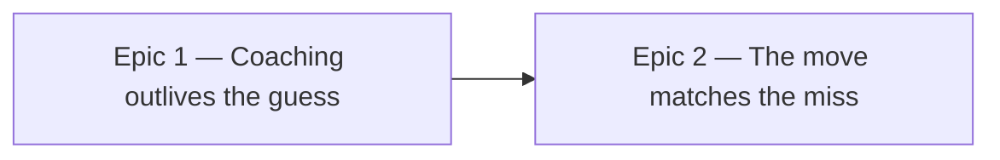

# Roadmap — Coach the Ear

Source: [briefing.md](briefing.md)

## Overview

The app has exactly one sentence that teaches a listening technique — *"Loop it
a few times. Sing the note that feels like rest — that's usually the root."* —
and `selectFeedback` returns it only while `attempts` is empty. One guess and it
is gone for the rest of the day, replaced by a verdict. A Wordle player guesses
inside fifteen seconds, so the fastest player is the one who never sees it
twice. This feature makes the coaching outlive the guess: a how-to-listen line
that stays in the Hint box for as long as the puzzle is open, and moves on to a
new suggestion each time a guess misses.

The Hint box gets quieter as it gets more useful (**Q1 → A**). Feature-17 taught
the chip rows to hold the record of the guess — dimmed for ruled out, one live
chip for a confirmed half — so the verdict line is now mostly restating what the
row already shows. The coaching takes that slot, and the verdict survives only
where the row is genuinely mute. Moves may point at the chips themselves — "tap
the roots under the bass note and find the one that disappears into it" — and
say something else when the tap sounds are switched off (**Q3 → A**).

Two epics, and they are the two halves of the briefing. Epic 1 is the fix for
the complaint — the coaching persists, and escalates with the miss count. Epic 2
is the refinement — the move is chosen from *what the miss showed*, because a
player who has the mode right and the root wrong has a different listening job
from one who has neither, and because simple mode's Major/Minor is a different
job again (**Q4 → A**). Epic 1 alone is shippable and is the larger share of the
value; Epic 2 without it has nowhere to put a line.

## Epics

### Epic 1 — The coaching outlives the first guess

**Visible when done:** Sam guesses wrong and the Hint box still tells them
*something to try with their ears*. Where today the opening line vanishes and
"Not it. Keep playing and try again." is the whole of the help, there is now a
listening move on the first miss, a different one on the second, a third on the
third — and it is there from the moment the page loads, without having to guess
first to find out it was ever there. It disappears when the day ends, and not
before.
**Depends on:** none
**Parallel with:** none — see *Execution waves*

**Scope**

- **Coaching becomes its own line, not a state of the outcome line.**
  `lib/presentation/feedback.ts` has one selector: `selectFeedback` returns
  `OPENING` when `attempts` is empty and a `WRONG_GUESS[...]` verdict otherwise.
  The coaching splits out into its own selector that returns a move for *every*
  open state of the day, so there is no state in which the box has a verdict and
  no technique.
- **A ladder of listening moves, keyed on the miss count.** Move one is today's
  `OPENING` line — it is the best sentence in the app and it keeps its place at
  the front. What follows are the moves the briefing names: hum the bass note on
  beat one, compare the third against a major scale you already know, listen for
  what changes in bar three.
- **The ladder holds on its last rung** (**Q2 → A**). Attempts are unbounded, so
  the ladder always runs out eventually; the last move is the most concrete job
  on it, and repeating it is honest. By then the give-up button has been on
  screen since the third miss, so a player still stuck has the exit the persona
  is promised.
- **The coaching takes the verdict's slot** (**Q1 → A**). The verdict line stays
  only where the chip rows cannot say the same thing — and after feature-17 they
  usually can, since a confirmed half collapses its row to one live chip and a
  missed half dims what was tried. **Which states count as mute is the one thing
  `/brainstorm` must pin down**; the decision here is the direction, not the
  boundary. The `N roots ruled out. Narrowing as you go.` count is untouched.
- **The moves are jobs for the ear, never readings off the page.** No move names
  a note, a mode, a chord or a degree of the day's answer. This is the rule that
  keeps the feature from becoming the reveal by instalments, and it is the one
  worth testing directly.
- **A move may point at the chips, and knows when they are silent**
  (**Q3 → A**). Tapping a root or a mode to hear it is the most concrete move
  available, so the coaching is allowed to name it — which means the selector
  takes the `tapSounds` preference as an input, and every move that leans on a
  tap has a sounds-off wording. `GuessCard` already reads the switch for the `♪`
  adornment and `GroovePuzzle` for the card caption, so there is precedent for
  both the plumbing and the two-wordings pattern.
- **The box still goes when the day does.** `GuessCard` renders
  `{!over && <NudgeBox …/>}` today, so the briefing's last bullet is already
  true — the work is keeping it true, not adding it.
- **No new persisted state.** The move is derived from `attempts` and the
  existing `tapSounds` preference, both of which already survive a reload, so a
  player who comes back mid-day sees the move they were on.

**Out of scope**

- Choosing the move from *which half* of the guess was wrong — Epic 2 has it.
- Simple mode's own moves — Epic 2.
- The narrowing count, the attempt dots and the give-up button, which keep their
  current copy and behaviour.

**Validation**

- **Demo:** load with empty `localStorage` → a listening move in the Hint box
  before anything is pressed. Check a wrong pair → a *new* move, where today
  only the verdict remains. Miss twice more → the move keeps changing, then
  holds. Turn the tap sounds off → any move that named a tap is worded for a
  silent row. Solve, or give up → the Hint box is gone.
- Unit tests through the feature's public surface, per
  [docs/testing.md](../../docs/testing.md): the selector across zero, one, two,
  three and many misses, crossed with the tap-sounds switch; an assertion that no
  move in the ladder contains a root name or a mode name, which is the rule above
  made mechanical.
- `NudgeBox` and any design-system piece it gains keep their own contract tests.

### Epic 2 — The move matches the miss

**Visible when done:** Sam checks and finds the mode was right and the root
wrong — and the move underneath is now about hunting a home note, not generic
advice. A player who had the root and missed the colour gets a different job:
listen to what the third is doing. In simple mode, where the choice is Major or
Minor, the move is phrased for that choice rather than for one of four modes.
**Depends on:** Epic 1 — the coaching slot, the selector and the ladder
**Parallel with:** none

**Scope**

- **The situation, not only the count, picks the move.** `feedback.ts` already
  computes the three-way split this needs — `matchedHalf` reads `rootMatched`
  and `flavourMatched` off the last attempt and returns `root` / `flavour` /
  `neither`. The coaching selector takes the same signal.
- **Three families of move, one per situation.** Root found, colour still
  wrong → moves about the quality of the third and sixth. Colour found, root
  still wrong → moves about finding the tonic against the bass. Neither →
  the general ladder from Epic 1.
- **Simple mode gets its own phrasing** (**Q4 → A**). Major versus Minor is one
  question about one note; the full row is four modes that differ in two or
  three, and the same move text cannot serve both honestly. It stays inside this
  epic rather than becoming a third: simple mode exists for "the ear that is
  still arriving", which is the ear this whole feature is for, so coaching that
  misfires there inverts the point.
- **Every rule from Epic 1 holds in every situation.** A move that fires because
  the mode was right must still not name the mode, and a move that leans on a
  tap must still have its sounds-off wording.

**Out of scope**

- The ladder, the hold-on-last-rung behaviour and the box layout, which Epic 1
  settles.
- Any new audio. The coaching may point at the taps features 10 and 16 built; it
  adds no sound of its own.
- Changing the verdict messages themselves. Epic 1 decides when they show;
  neither epic rewrites them.

**Validation**

- **Demo:** two runs on the same day. In one, guess the right mode with a wrong
  root → a tonic-hunting move. In the other, the right root with a wrong mode →
  a colour move. Flip to simple mode and miss → phrasing that fits Major/Minor.
- Unit tests over the selector for each of the three situations crossed with
  simple and full mode, and the no-answers-in-the-copy and sounds-off assertions
  extended to every new move.

## Dependency map

## Execution waves

- **Wave 1:** Epic 1.
- **Wave 2:** Epic 2 — needs Epic 1's coaching slot and selector.
- **No parallelism is claimed, deliberately.** Both epics edit
  `lib/presentation/feedback.ts`, `components/puzzle/NudgeBox.tsx` and the Hint
  box wiring in `components/puzzle/GuessCard.tsx`. Feature-16's roadmap claimed
  three disjoint epics and all three ended up in `GroovePuzzle.tsx`, which had
  to be serialised mid-run; feature-17 responded by putting overlapping epics in
  different waves from the start. This follows that. A two-epic feature over one
  box was never going to parallelise, and saying so up front is cheaper than
  discovering it at implementation.

## Assumptions

- **Move one stays the line that is there now.** "Loop it a few times. Sing the
  note that feels like rest — that's usually the root." is the sentence this
  whole feature exists to stop losing; replacing it was not asked for.
- **The coaching reads muted, not warm.** `FeedbackLine` colours the verdict
  `text-warm`; a suggestion is not a verdict, so the coaching takes the neutral
  `text-text-muted` treatment the narrowing count already uses.
- **Derived, never stored.** No new key in `localStorage` and no change to
  `DailyResult` — everything needed is in `attempts` and the `tapSounds`
  preference.
- **The ladder is short.** Three or four moves, not a library. The briefing says
  "not a lesson: no curriculum, no levels", and a long ladder is a curriculum
  that arrives one miss at a time.
- **Writing the moves is a musical decision, not a copy decision.** The moves
  are claims about what is audible in these grooves; `.claude/agents/musician.md`
  is the role for that, and `/writespec` should give the copy its own track.
- **Q2 → A is read from a touched-but-unmarked box.** Option A on Q2 came back
  as `- []` rather than `- [x]`, with the other three questions all ticked on
  their recommendation. It is folded in as A — hold on the last rung — because
  that is the most likely reading and because the alternatives differ only in
  one selector's tail behaviour. One word corrects it.
