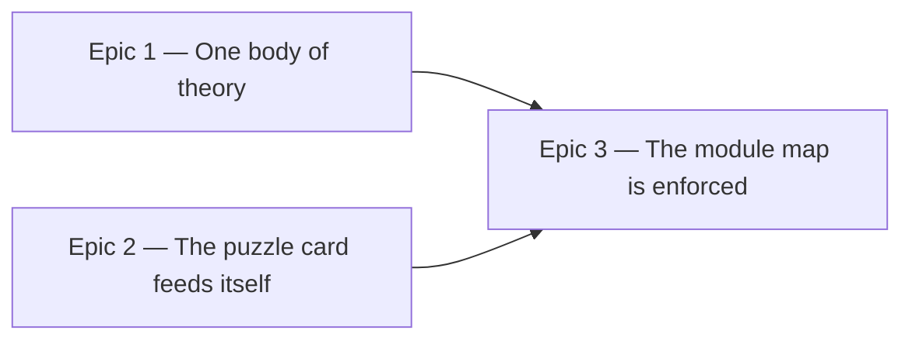

# Roadmap — Modular architecture

Source: [briefing.md](briefing.md)

## Overview

Eighteen features have all landed in one slice. The slice shape promises that
work can be picked up independently, and it has never once paid out, because
`daily-groove` *is* the app. This feature draws the boundaries that were only
ever implied: one body of music theory both halves of the system share, one door
into the coaching modules, and a written module map with lint behind it.

Three epics, each independently useful: a duplication removed, a hub file
demoted, a rule that stops both growing back. Nothing here changes what the app
does — the app's behaviour is the invariant every epic is judged against, and
for Epic 1 the generator's *output* is a second invariant just as hard.

## Epics

### Epic 1 — One body of theory

**Visible when done:** music theory lives in one place, `src/lib/theory/`,
imported by both the generator and the app. `ROOTS` and the twelve scales exist
once. A thirteenth scale, or a change to an existing one, is one edit instead of
two that can disagree. Every rendered MP3 is byte-identical and
`grooves.lock.json` is untouched.

**Depends on:** none
**Parallel with:** Epic 2

**Contract frozen here, for Epic 3 to build against**
- the path and public surface of `src/lib/theory/` — Epic 3's lint zone names it,
  so the name is fixed on day one and the contents can follow.
- the shim surface: `lib/theory/*` keeps its current exports *and its current
  signatures*, so no file under `components/` changes a line. This is what lets
  Epic 2 run in the same wave, and Epic 3 is what removes it.

**Scope**
- the duplication is literal, not thematic. `ROOTS` is the same twelve-element
  array in `src/features/daily-groove/lib/theory/music.ts:6` and
  `scripts/grooves/theory/notes.ts:3`. The twelve scales' semitone sets are
  identical in `lib/theory/notes.ts:40` (`FLAVOUR_INTERVALS`, keyed `Ionian`)
  and `scripts/grooves/theory/scales.ts:20` (`INTERVALS`, keyed `ionian`)
- **all thirteen modules of `src/features/daily-groove/lib/theory/` move to
  `src/lib/theory/`** — `changes`, `character`, `degrees`, `difference`,
  `families`, `licks`, `music`, `notes`, `numerals`, `options`, `phrase`,
  `simpleModes`, `staff`. One theory module, no per-module argument about what
  counts as shared (Q2)
- **from the generator, `theory/notes.ts` and `theory/scales.ts` merge in** —
  they are the duplicated primitives. `harmony.ts`, `pitches.ts` and
  `validity.ts` stay in `scripts/grooves/theory/` and import the shared module:
  they take `MusicMeta`, `NoteEvent` and `VoiceName` from the generator's own
  `types.ts`, so they are the quality gate rather than theory, and dragging
  generator event types into `src/lib/` would invert the dependency the leaf rule
  protects
- **the slug is canonical** (Q1). `displayFlavour` — today at
  `scripts/grooves/cli.ts:31`, applied when the manifest is written — moves into
  the shared module, and the app converts at the edge. The slug is what
  `catalogue.json` and `grooves.lock.json` already hold, and `docs/music.md`
  pins the order of `FLAVOURS`
- resolve the one name collision the merge creates: `notes.ts` exists on both
  sides with different contents — the app's holds `FLAVOUR_INTERVALS` and
  `scaleNotes`, the generator's holds `ROOTS`, `pitchClassOf`, `midiOf`,
  `noteName`. Proposed split: `scales.ts` for the twelve and their intervals,
  `roots.ts` for the root list and pitch-class/midi conversion, `names.ts` for
  the slug-to-display conversion. The other eleven keep their names
- **one signature has to change, and it is the only one.** `music.ts` is pure
  except for `flavourOptions(date, groove)`, which closes over `GROOVES` from
  `../../data/grooves.generated` — an app import that `src/lib/` may not make.
  `flavourPool` already takes its grooves as a parameter; `flavourOptions` gains
  the same argument. The shim keeps the two-argument form and supplies `GROOVES`
  itself, so `GroovePuzzle.tsx` is untouched in this epic and Epic 3 updates the
  call site
- `isoDate` moves with them. It is a five-line date formatter that sits in
  `lib/puzzle/selectGroove.ts` by accident of history, and `music.ts` and
  `simpleModes.ts` both need it
- `Answer` and `Attempt` move from the feature's `types.ts` into
  `src/lib/groove.ts`, which already holds `Root`, `Flavour` and `Groove`.
  `types.ts` re-exports them, as it already does for the other three
- `options.ts` imports `@/lib/hash`. The `@/` alias does not resolve from
  `scripts/` — `docs/architecture.md` is explicit that this is why `src/lib/` is
  a leaf the generator reaches by relative path — so it becomes a relative import
- `scripts/grooves/boundary.test.ts` already asserts the generator reaches
  `src/features` only as the two manifests it writes. Extend it: `src/lib/` is
  the one channel in, and this move must not open a second
- **one existing assertion has to change, and it is load-bearing.**
  `boundary.test.ts:96` asserts `scripts/grooves/types.ts` still declares
  `Flavour`, and `coding-guidelines.md` explains at length why the generator's
  slug union and the app's display string are "not a duplicate" and why
  "unifying the two would be a behaviour change wearing a de-duplication's
  clothes". Q1 does not unify them — both spellings survive — but it moves the
  slug union and the conversion into `src/lib/theory/names.ts`, so the sentence
  the test guards stops being where the distinction lives. Rewrite the
  assertion and the paragraph together, or the guard fails for the right reason
  and gets deleted for the wrong one
- **narrow the generator tier trigger** (Q5). Feature-14 keyed it on the folder
  name, which was fair when `src/lib/` was two files the generator imports. After
  this epic it is roughly twenty and the generator imports five:
  `src/lib/groove.ts`, `src/lib/hash.ts`, and the shared primitives
  `theory/roots.ts`, `theory/scales.ts`, `theory/names.ts`. Trigger on those.
  Feature-14's own words are that "tier selection has to follow the import graph,
  not the folder name", and this epic is the change that makes the folder name
  stop being a good proxy

**Out of scope**
- any change to the generated catalogue. Not one MP3 re-renders, not one uuid
  moves. `docs/music.md` §"What must never change" names `MUSIC_LABEL`'s draw
  order and the order of `FLAVOURS` for the reason that matters to Sam: a
  re-render reassigns every past date's puzzle and breaks every share link
  already sent
- `src/lib/hash.ts`. Frozen, pinned by a fixed table in `hash.test.ts`, and not
  touched here
- adding a thirteenth scale. This epic makes that a one-edit job; it does not do
  it
- the generator's `harmony.ts`, `pitches.ts` and `validity.ts`, per the scope
  note above
- updating any call site under `components/`. The shims absorb it; Epic 3
  collects the debt

**Validation**
- the demo path: `npm run grooves:verify` passes and `git status` shows
  `grooves.lock.json`, `catalogue.json` and `public/grooves/*.mp3` unchanged.
  Necessary, and **not sufficient** — `grooves:verify` hashes the committed
  outputs against the lock, so it proves nobody edited them; it never re-renders,
  so it cannot prove the refactored generator would still produce them. Epic 1's
  PRD carries that as its own requirement and asks how hard to prove it
- the generator tier (`npm run test:gen`) is green
- the same twelve interval sets and the same root order, asserted once, in the
  shared module's own test — the duplicate tests on both sides collapse into it
- the slug/display conversion is tested in both directions for all twelve,
  including the multi-word ones (`harmonic-minor` ↔ `Harmonic minor`) where the
  naive capitalisation is the thing that breaks
- `boundary.test.ts` still green, with its new `src/lib/` assertion failing when
  deliberately broken. A guard nobody has seen fail is not known to work
- `structure.test.ts` updated: `lib/` holds five concern folders now, not six
- the narrowed tier trigger is tested in both directions: editing
  `src/lib/theory/scales.ts` runs the generator tier, editing
  `src/lib/theory/licks.ts` does not. A trigger that fires on everything is the
  old rule with extra steps

### Epic 2 — The puzzle card feeds itself

**Visible when done:** `GuessCard` gets its derived state from one call into the
coaching module instead of 28 props, and `GroovePuzzle` stops computing what it
does not render. Two tracks that both add coaching behaviour can be dispatched
into the same wave. The puzzle plays, scores, nudges, locks and solves exactly
as it does today.

**Depends on:** none
**Parallel with:** Epic 1

**Scope**
- `GroovePuzzle.tsx` is the serialization point: 9 of the last 40 commits, 395
  lines, 40 imports — 33 from its own feature, 23 of those reaching sideways into
  `lib/`, `data/` and `hooks/` — and a `GuessCard` call site passing 28 props.
  Feature-14
  split it to 274 lines by lifting `usePuzzleSession` and `useTransport`; it is
  back at 395. More hooks is not the fix
- of the 28 props, 13 are derived — `feedback`, `coaching`, `showVerdict`,
  `showNudge`, `dots`, `ruledOutRoots`, `ruledOutFlavours`, `confirmedRoots`,
  `confirmedFlavours`, `eliminated`, `showReveal`, `roots`, `flavours`. Every one
  is a pure function of attempts, answer, date and the two settings, and every
  one is currently `useMemo`'d in the parent and posted down
- **one entry point returning one view model for the whole guess card** (Q3):
  state in, every derived value out. A door that returns half the card leaves
  the parent computing the other half, which is the shape being removed
- it is a pure function, not a hook, so it is tested as a plain function per
  `docs/testing.md`
- `lib/presentation/` is eleven modules today — `coaching`, `coachingFamily`,
  `coachingMoves`, `confirmed`, `feedback`, `moves`, `nearMiss`, `ruledOut`,
  `verdict`, plus `date` and `staffLabel` — five of which arrived with
  feature-18
- `GuessCard` calls the entry point. The briefing settles this: a boundary only
  the parent may cross is not a boundary. The remaining props are the genuinely
  interactive ones — the callbacks, the two selections, `solved` and `revealed`
- the 2,426-line `GuessCard.test.tsx` — the largest file in the repo — should
  shrink as assertions about *what the coaching says* move to the module that
  decides it. Per `docs/testing.md`, a relocated assertion keeps its subject:
  this is a move, not a rewrite
- `date` and `staffLabel` are not coaching and do not belong behind that door.
  They stay as they are; the door is for the guess card's view model

**Out of scope**
- **any change to what the coaching says.** Feature-18 is choosing those words
  right now. This epic moves where they are computed and nothing else, and the
  existing cases passing unchanged is the proof
- the audio and puzzle modules. `lib/audio/`, `state/`, `lib/puzzle/` and
  `lib/persistence/` are named as modules in the briefing but are already behind
  reasonable seams and are not touched here
- a second `features/` slice. Deliberate, per the briefing: wait for a screen
  that is not the puzzle
- splitting `GuessCard.tsx` itself. It should shed props and test lines here; if
  it is still too big afterwards that is a finding, not this epic's job

**Validation**
- the demo path: play a full puzzle in the browser — first visit, a wrong guess
  at each rung of the ladder, the nudge, a lock-in, a solve, a give-up, a shared
  link — and see no difference
- every existing case still exists and passes, distributed across the new files.
  Count them before and after; a refactor that quietly drops tests is the failure
  mode to guard against
- `GuessCard`'s prop count is down from 28, and the removed ones are the derived
  thirteen — not thirteen arbitrary ones bundled into an object
- the view model is tested directly as a pure function, with the card's rendered
  behaviour still tested through the feature's public surface
- `structure.test.ts` knows about whatever the split creates, and the
  design-system boundary tests stay green

### Epic 3 — The module map is written down and enforced

**Visible when done:** `docs/architecture.md` names the six modules and the
arrows between them, `docs/coding-guidelines.md` carries the rules, and `npm run
lint` rejects an import that crosses a boundary the wrong way. `GroovePuzzle.tsx`
reaches its feature only through narrow entry points, and a structural test fails
the moment it goes back to reaching past them. Epic 1's shims are gone.

**Depends on:** Epics 1 and 2 — it names what they create, deletes Epic 1's
shims, and its guards would fail against today's tree.

**Scope**
- name the six in `docs/architecture.md`: catalogue (`scripts/grooves/` + the
  generated manifests), theory (`src/lib/theory/`), audio (`lib/audio/` + its
  four hooks), puzzle (`state/`, `lib/puzzle/`, `lib/persistence/`), coaching
  (`lib/presentation/`), shell (`GroovePuzzle` + the routes). The document
  already explains why the dependency *direction* is load-bearing; this adds the
  arrows inside the slice, which it currently does not draw
- **a structural test on fan-in, expressed as a rule rather than a number**
  (Q4, Q6): assert `GroovePuzzle.tsx` imports nothing from `lib/` directly — only
  module entry points. `coding-guidelines.md` already names the import list as
  "the tell": "a composer reaches *down* into the regions it assembles, so a long
  list of sideways `../lib/` imports means the file is holding logic that belongs
  behind a seam." The rule states what the count was a proxy for
- **which means every module in the map needs an entry point, not just
  coaching.** This is what Q6's answer costs, and it is the largest single item
  in this epic. Of `GroovePuzzle.tsx`'s 23 sideways imports, **15 name a `lib/`
  module** across five concern folders — `audio` (3), `presentation` (6), `theory`
  (4, in `src/lib/` after Epic 1), `puzzle` (1), `persistence` (1). The other 8 are
  `../data/` (2) and `../hooks/` (6), which are not `lib/` and are unaffected, as
  is `../types`. Epic 2 builds coaching's;
  the other four are built here. Note the door is per concern *folder*, while the
  map's `puzzle` module spans two of them — the map is how a reader groups the
  code, the doors are what the import rule can check
- **each entry point is narrow, and a test says so** (Q7). It exports what the
  shell imports through it and nothing more. This is the half of the
  `src/components/` no-barrel rule that transfers: "the grouping would stop
  telling a reader anything, because every path would end at the barrel." Five
  wide barrels would let `GroovePuzzle.tsx` read as five imports while reaching
  exactly as far as it does today — the rule would pass and the coupling would be
  invisible. Narrow doors move the tell from *how many paths* to *how wide is
  each door*, which is the question the fan-in count was always a proxy for
- so `coding-guidelines.md` gains the entry-point rule next to the no-barrel one,
  and says why one folder set gets doors and the other does not: the design
  system is a flat catalogue of interchangeable primitives, a feature module is a
  seam with a job
- extend the existing ESLint zone config rather than inventing a second
  mechanism. `docs/coding-guidelines.md` §"The five zones" documents what is
  there; this adds zones, each carrying a `message` naming the rule and the
  reason, as the existing ones do
- delete the theory re-export shims Epic 1 left behind, fix the import lines in
  `components/`, and update the one `flavourOptions` call site to pass its pool.
  Mechanical, and it is the reason this epic is last
- the honest part: **guard against regrowth this time.** Feature-5 cut
  `GroovePuzzle.tsx` from 362 lines to 274; it was 488 by feature-14, which
  looked at it, declined the split, and recorded the residual in its
  assumptions; it stands at 395 today with the fan-in worse than either. Both
  features shipped with no guard, and feature-14 said so in as many words
- update the agent definitions under `.claude/agents/` if the module map changes
  what a role needs to know

**Out of scope**
- restructuring `docs/coding-guidelines.md`. It stays the source of truth and
  keeps its shape; this epic adds the entry-point rule, rewrites the `src/lib/`
  "genuinely shared" bar that Q2 invalidated, and touches the `Flavour` paragraph
  Epic 1 moved — nothing else
- `docs/music.md`. It documents the generator's musical model, which Epic 1 does
  not change
- enforcing anything about `scripts/grooves/` beyond the boundary test that
  already exists

**Validation**
- the demo path: write an import that crosses a boundary the wrong way — a
  design-system component reaching into coaching, the shell reaching past a
  module's entry point — and watch `npm run lint` reject it with a message that
  says why
- the fan-in test fails when a direct `lib/` import is added to
  `GroovePuzzle.tsx`, and passes on the tree this epic leaves. Both directions,
  or the rule is a claim nobody checked
- each of the five entry points exports strictly what the shell imports through
  it, asserted by a structural test that reads both sides from disk. An entry
  point that re-exports its whole folder passes the fan-in test while defeating
  it, so this is the assertion that makes the other one mean anything
- break it deliberately: widen one entry point with an unused re-export and watch
  the test fail
- each new zone is tested by breaking it deliberately, once. A rule that has
  never been seen to fire is a comment
- no re-export shim remains under `lib/theory/`, and no file imports the old
  paths
- the full gate is green: `npm test`, `npm run test:gen`, types, lint, build
- read `docs/architecture.md` back against the tree. If the map and the folders
  disagree, the map is wrong — it describes a shape that exists, it does not
  propose one

## Dependency map

## Execution waves

- **Wave 1 (parallel):** Epic 1, Epic 2 — disjoint *because* Epic 1 leaves
  re-export shims with unchanged signatures. Epic 1 owns `src/lib/`,
  `scripts/grooves/theory/` and the bodies of `lib/theory/`; Epic 2 owns
  `lib/presentation/` and `components/puzzle/`. Without the shims, Epic 1
  rewrites `GroovePuzzle.tsx`'s import block and changes its `flavourOptions`
  call, and the two epics collide on the one file this feature exists to stop
  being a bottleneck.
- **Wave 2:** Epic 3 — it deletes Epic 1's shims and its guards describe Epic 2's
  result. It cannot start meaningfully before either lands.
- **Feature-18 must land first.** It is in progress and owns the new files under
  `lib/presentation/` — `coaching.ts`, `coachingFamily.ts`, `coachingMoves.ts`,
  `moves.ts`, `verdict.ts`, all currently uncommitted — which are exactly the
  files Epic 2 puts behind a door. Starting Epic 2 before 18 is merged means
  refactoring code that is still being written. Epic 1 has no overlap with
  feature-18 and could start immediately.
- Epic 1 is the larger of the two after Q2, and its internal tracks split
  cleanly: the primitives merge (roots, scales, names — the part the generator
  imports) is separable from the wholesale move of the app-only eleven, and the
  first is what the second depends on.

## Assumptions

- **The app's behaviour is unchanged by all three epics.** A player should not be
  able to tell this shipped. This is the invariant, not a goal.
- **No epic here is visible to Sam, and that is a deliberate exception to the
  rule that epics must be.** Feature-5 and feature-14 made the same exception for
  the same reason: the cost of building features is paid by every feature after
  it. This one is judged by the builder, and it should not be the next such
  feature for a while — three of nineteen is a defensible ratio, four would need
  an argument.
- **Epic 1 renders nothing.** The generator's output is frozen, and
  `grooves.lock.json` plus `grooves:verify` are what prove it. If the move turns
  out to require a re-render, that is not a refactor and the epic stops.
- **`src/lib/` goes from three files to roughly twenty.** That is what Q2's
  answer buys, and it is a real change in what the leaf directory is for:
  `coding-guidelines.md` currently admits a module only if it is "pure,
  dependency-free" *and* needed by both halves, and staff positions and mode
  descriptions meet the first test but not the second. Epic 3 rewrites that rule
  to match. Stated plainly because it is the assumption most likely to be
  regretted: if `src/lib/` becomes the place things go when nobody wants to
  decide, this feature caused it.
- **The shims are temporary and Epic 3 removes them.** If Epic 3 slips, the tree
  has two paths to the same module — worse than before Epic 1. The shim is a
  scheduling device with an expiry date and should be written into the code as
  such.
- **`GuessCard` importing the coaching module directly widens what a feature
  component may know.** It is not a design-system primitive, so no architecture
  rule is breached — but the reflex that says "components take props" is worth
  overriding explicitly rather than quietly.
- **The 13-of-28 prop count is measured with feature-18's uncommitted work
  applied.** Feature-18 may change it before Epic 2 starts; re-count then.
- **Q2 weakens removability, and the guidelines say so out loud.** The bar for
  `src/lib/` is "genuinely shared — two callers on opposite sides of the
  app/generator boundary. Something only the feature uses belongs in
  `src/features/<feature>/lib/`, *where deleting the feature deletes it*." After
  Epic 1, deleting `src/features/daily-groove/` leaves eleven orphan theory
  modules — `licks`, `staff`, `character`, `numerals`, `degrees` and the rest —
  that nothing imports. `architecture.md`'s removability standard still holds
  literally (the app builds), but the folder stops being a clean cut. Accepted as
  the price of one theory module; worth revisiting if a second slice arrives and
  wants none of it.
- Six modules describes the tree as it is, not a target shape. If Epic 3 finds
  one does not survive contact with a lint zone, the map is what changes.
- Nothing here is a rewrite. Every epic rearranges code that already exists and
  already passes.

## Decisions taken

Settled through the roadmap cycles; `/brainstorm` inherits these rather than
reopening them.

1. **The slug is canonical.** `displayFlavour` moves into the shared module; the
   app converts at the edge. Both spellings survive — they are not unified.
2. **All thirteen of `lib/theory/` move** to `src/lib/theory/`, not only the
   duplicated primitives. From the generator, `notes.ts` and `scales.ts` merge
   in; `harmony.ts`, `pitches.ts` and `validity.ts` stay behind.
3. **One view model for the whole guess card**, returned by one pure function —
   not a per-concern set of doors, and not a hook.
4. **The hub file is guarded**, which neither feature-5 nor feature-14 did.
5. **The generator tier triggers on the five modules the generator imports**, not
   on the `src/lib/` folder name.
6. **The guard is a rule, not a number:** `GroovePuzzle.tsx` imports no `lib/`
   module directly, only entry points — which means five entry points, not one.
7. **Every entry point is narrow, and a test asserts it.** Without this, 6 is a
   barrel file that hides the coupling it was written to expose.
