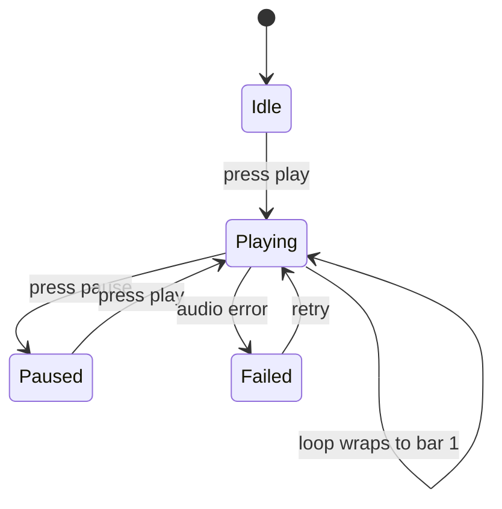

# PRD — Epic 1: The designed shell and today's groove card

Feature: [briefing.md](../briefing.md) · [roadmap.md](../roadmap.md) · Design: [Daily Groove.dc.html](../Daily%20Groove%20webapp%20design/Daily%20Groove.dc.html)

## Summary

Turns the app from unstyled semantic HTML into the design: warm paper background,
Newsreader/DM Sans type pairing, a header carrying the brand, the date and the
streak, and a cream card holding the loop transport and its round green play
button. It also pins the two contracts the other four epics build against — the
`@theme` token names and the design-system primitive APIs — and moves every
layout decision out of `src/app` into `src/components`.

## Problem

Feature-1 shipped a working game that looks like a form. Nothing about it is
presentable, and layout currently lives in `src/app/page.tsx` and `layout.tsx`,
which the briefing explicitly forbids. Until the token layer and the primitives
exist, no other epic can be styled at all — so this is the walking skeleton for
the whole feature.

## Scope

- Fonts, the light and dark token layers, and the core layout primitives.
- The page shell, the header, and the groove card with its transport panel.
- Extending the seed data with a name and a tempo per groove.
- Restyling `PlayControl`, and moving playback to a looping play/pause model.
- Emptying `src/app` of layout.

**Out of scope**
- The option chips and the CTA — Epic 2.
- Attempt dots, feedback copy, the nudge — Epic 3.
- The solved panel — Epic 4. A correct guess keeps feature-1's plain result until then.
- The archive strip — Epic 5. `HistoryView` keeps its current unstyled form below the
  fold and is expected to look unfinished at the end of this epic.
- Any change to the game model, scoring, or storage — Epic 2 owns that rewrite.
- Per-groove tips and note data — still deferred to a follow-up feature. Only the
  name and the tempo are added here.
- The canvas' meta line — the puzzle number, the bar count and "loops forever". It
  is dropped rather than filled, so no puzzle numbering scheme is introduced.

## Requirements

- **R1** — The app renders on the design's paper ground: a radial gradient from
  `#FBF9F3` through `#F5F2EA` to `#EDEBE0`, with DM Sans for body text and
  Newsreader for display text.
- **R2** — Colour, radius, shadow and spacing values are defined once as named
  tokens in `globals.css` under Tailwind v4 `@theme`. No component carries a raw
  hex value.
- **R3** — A dark palette is defined over the same token names, so the whole app
  re-themes by token swap alone. The app follows the viewer's system theme.
- **R4** — The header shows, left to right: a brand mark (accent dot plus a
  letter-spaced uppercase wordmark), the page title "Today's groove" set in
  Newsreader, and a right-hand cluster of the weekday, the day and month, a
  divider, and the streak pill.
- **R5** — The date shown is the viewer's local calendar day, and matches the day
  used to select the groove.
- **R6** — The current streak appears as a pill in the header. A streak of zero
  renders a legible empty state rather than a bare "0".
- **R7** — Today's groove is presented in a raised cream card, which contains a
  header region and an inset transport panel.
- **R8** — Every groove in the seed set carries a name and a tempo in beats per
  minute, alongside its existing fields.
- **R9** — The card's header region shows two things and no more: the groove's name
  set in Newsreader on the left, and the tempo as a right-aligned figure labelled
  "BPM". There is no meta line beneath the name.
- **R10** — Playback loops continuously, and the play control is a toggle: pressing
  it starts the loop, pressing it again pauses at the current position, and
  pressing it again resumes. The control's accessible name states which action it
  will perform.
- **R11** — The transport panel shows a progress bar divided into four bars by
  three markers, with a label per bar. Progress reflects the real playback
  position, and the label of the currently sounding bar is highlighted while
  playing. When paused or stopped, no bar is highlighted.
- **R12** — If the groove's audio fails to load or play, the player sees a clear
  error with a retry affordance, and the rest of the UI stays usable.
- **R13** — Every layout, spacing and structural decision is expressed through a
  component in `src/components`. `src/app/page.tsx` and `layout.tsx` contain
  routing, metadata and composition only — no layout or spacing classes.
- **R14** — Components in `src/components` are generic and prop-driven, carry no
  domain vocabulary, and import nothing from `src/features`.
- **R15** — The layout is usable from 375px to desktop. The design's two-column
  split collapses to a single column on narrow screens, and the header cluster
  reflows without overflowing.

## Behaviour details

The play control is a three-state toggle rather than feature-1's play/replay
button, because the design labels it "Pause the loop" while sounding and draws a
looping progress bar.

## Acceptance criteria

- **AC1** (R1, R2) — Given the app is open, when the page renders, then the
  background, body font and display font match the design, and no component
  source contains a raw hex colour.
- **AC2** (R3) — Given a viewer whose system theme is dark, when the page renders,
  then every surface, text and border resolves to the dark palette and remains
  legible.
- **AC3** (R4, R5) — Given today is 29 August 2026, when the header renders, then
  it shows the weekday and "29 August", and that day matches the one used to pick
  the groove.
- **AC4** (R6) — Given a player with no results, when the header renders, then the
  streak pill shows the zero state rather than "0 days".
- **AC5** (R8, R9) — Given today's groove, when the card renders, then its name and
  BPM figure are shown, the BPM matches the groove's seed value, and no meta line
  appears between the name and the transport panel.
- **AC6** (R8) — Given the seed set, when it is inspected, then every groove has a
  non-empty name and a tempo in a plausible range.
- **AC7** (R10) — Given the groove is not playing, when the player presses the
  control, then audio starts and the control offers to pause; pressing it again
  pauses without resetting position, and pressing it once more resumes from there.
- **AC8** (R11) — Given the groove is playing, when playback passes from the first
  bar into the second, then the highlighted bar label moves with it; when the loop
  wraps, the highlight returns to the first bar.
- **AC9** (R12) — Given audio that fails to load, when the player presses play,
  then an error with a retry affordance appears and the rest of the card still
  renders.
- **AC10** (R13) — Given the repository, when `src/app/**` is inspected, then it
  contains no layout or spacing utility classes.
- **AC11** (R14) — Given the repository, when `src/components/**` is inspected,
  then no file imports from `src/features`.
- **AC12** (R15) — Given a 375px viewport, when the page renders, then no element
  overflows horizontally and the columns are stacked.

## Dependencies

Needs nothing. Hands two contracts to Epics 2–5, both of which should be frozen
on day one so the later epics can start in parallel:

- **The token names** in `@theme` — surface, paper, accent ramp, text tints,
  border tints, radii, shadow — in both palettes.
- **The primitive APIs** — page shell, container, `Card`, stack/row, heading,
  text, eyebrow label, `Pill`, `IconButton` — as prop signatures.

Changes the `AudioPlayer` contract from `play/stop` to a looping
`play/pause/resume` with an observable position, which Epic 3 and Epic 5 do not
depend on but which replaces feature-1's replay behaviour.

Also widens the `Groove` type with `name` and `bpm`. Epic 2 rewrites the same
type for the root/flavour model, so the two epics touch `types.ts` and `seed.ts`
together — agree the widened shape before either starts rather than merging twice.

## Assumptions

- The wordmark reads "daily-groove", matching the project. The design canvas
  renders it "daily-grooove" with three o's, which is treated as a typo.
- Playback position drives the progress bar via the audio element's
  `currentTime`/`duration`; each groove is treated as a four-bar loop, so the
  sounding bar is the position quartered.
- Pausing holds position; it does not reset to the start.
- Theme follows the system only. No in-app theme toggle is added, since the
  design has no control for one.
- Feature-1's deterministic daily groove selection is unchanged.
- Names and tempos are authored for the seven existing grooves as part of this
  epic. They are descriptive labels, not a new content pipeline.
- The tempo is displayed but does not drive playback or the progress bar, which
  follow the audio file's own duration.
- With the meta line gone the card header is a single row — name left, BPM right —
  so the space the canvas gave to three stacked lines closes up rather than being
  held open.
- The four-bar framing survives only in the transport panel's markers and labels,
  which is the one place it is load-bearing.

## Question log

### Cycle 1 — 2026-08-29

**Q1. What fills the groove card's header?**
Answer: **D) Add `name` and `bpm` to the seed data now** — the card header is too
prominent to leave empty, and a name and tempo are cheap to author for seven
grooves. This reverses the roadmap's blanket deferral of unbacked design elements
for these two fields only; tips and note data stay deferred.
Applied to: R8, R9, AC5, AC6, Scope, Out of scope, Dependencies, Assumptions

### Cycle 2 — 2026-08-29

**Q2. What completes the meta line under the groove's name?**
Answer: **C) Drop the meta line; the header carries the name and the BPM only** —
avoids introducing a puzzle-numbering scheme and a bar-count claim to fill a
decorative line, leaving the header to the two things backed by real data.
Applied to: R9, AC5, Out of scope, Assumptions
