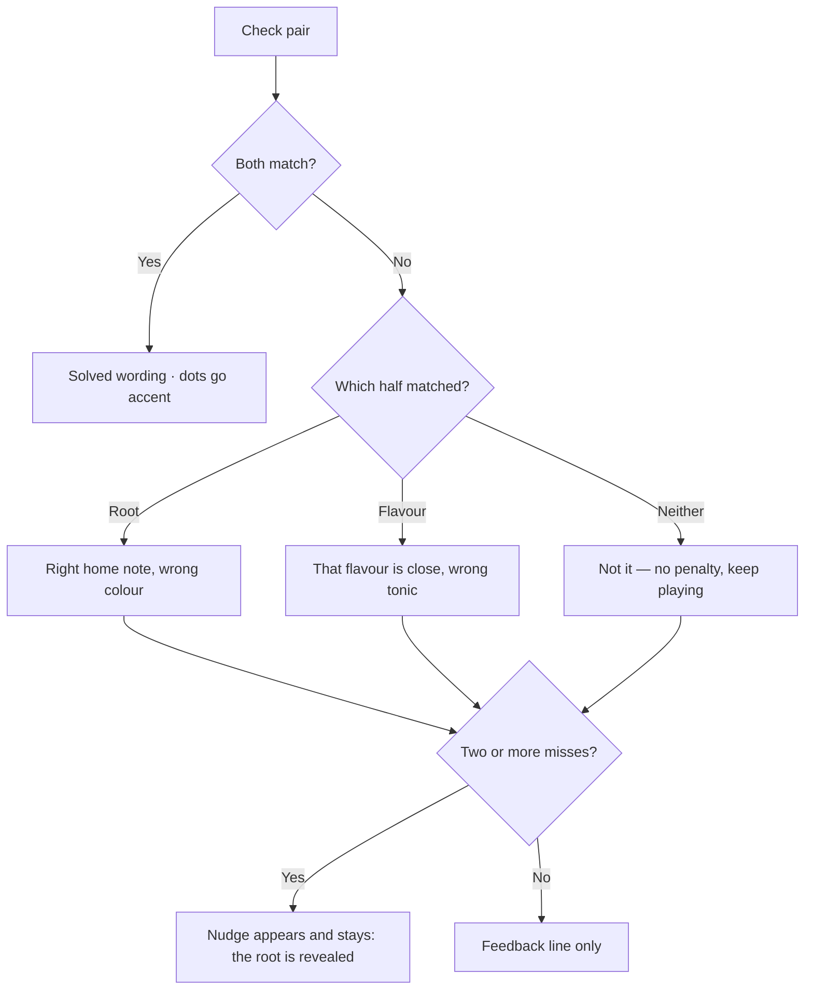

# PRD — Epic 3: Attempts, feedback, and the nudge

Feature: [briefing.md](../briefing.md) · [roadmap.md](../roadmap.md) · Design: [Daily Groove.dc.html](../Daily%20Groove%20webapp%20design/Daily%20Groove.dc.html)

## Summary

Gives a wrong guess consequences the player can see and learn from: three attempt
dots that fill as guesses are spent, a line under the check control that changes
from generic encouragement to targeted feedback about what was right, and a nudge
that appears after two misses and stays. There is no lose state — the player can
keep guessing until they get it.

## Problem

After Epic 2 a wrong guess says only "incorrect", which is both unhelpful and
visually flat next to the design. The canvas carries three distinct feedback
messages keyed to *how* the guess was wrong, a dot row that shows progress, and a
hint box — and together they are what make repeated guessing feel like listening
rather than brute force.

## Scope

- The attempt dot row and its states.
- Feedback selection keyed to which half of the pair was right.
- The nudge, its trigger, and its persistence.
- Keeping guessing open indefinitely.

**Out of scope**
- Any lockout, lose state, or "missed" screen. There is none, so the artboard the
  canvas lacks is not needed.
- The solved panel's content — Epic 4.
- Persisting attempts across a reload — Epic 5. Within this epic attempts live for
  the session.
- Per-groove hint text as seed data — deferred to a follow-up feature.

## Requirements

- **R1** — A row of three dots sits with the guessing card's heading. A dot is
  neutral while unspent, warm once a guess has been spent, and accent-coloured
  once the day is solved.
- **R2** — The dot row is always three dots wide. It marks par, not lives: a
  fourth and later attempt leaves the row full rather than extending it.
- **R3** — After each wrong guess the line under the check control states which
  half of the pair was right: the root, the flavour, or neither. Each case has its
  own wording and its own tone colour.
- **R4** — Before any guess, that line shows generic guidance about listening for
  the tonic.
- **R5** — After two wrong guesses a nudge appears beneath the control, and
  remains visible for the rest of the day. It does not replace the feedback line.
- **R6** — The nudge reveals the day's correct root, and says so plainly. It is
  informational: the root chips are not auto-selected, not filtered, and not
  locked, so the player still makes the selection themselves.
- **R7** — The chips carry no record of which pairs have already been tried. The
  only selection state a chip shows is whether it is currently chosen.
- **R8** — The player is never locked out. After any number of wrong guesses the
  check control returns to its ready state and another guess can be made.
- **R9** — Once the day is solved, the feedback line switches to its solved
  wording and the nudge is withdrawn.
- **R10** — Feedback and nudge changes are announced to assistive technology, and
  no feedback state is conveyed by colour alone.

## Behaviour details

Feedback is a pure function of the answer and the attempted pair, so it is
testable in `lib/` without rendering:

Revealing the root turns the remaining problem into a choice among the four
flavours, minus whatever has already been tried — which is what makes the nudge
worth its prominent box without needing per-groove hint text the app does not
have.

## Acceptance criteria

- **AC1** (R1) — Given no guesses have been made, when the card renders, then all
  three dots are in their neutral state.
- **AC2** (R1) — Given one wrong guess, when the dots render, then exactly one dot
  is warm and two are neutral.
- **AC3** (R2) — Given five wrong guesses, when the dots render, then exactly
  three dots are shown and all three are warm.
- **AC4** (R4) — Given no guess has been made, when the card renders, then the
  line under the control shows the opening guidance, not feedback.
- **AC5** (R3) — Given the answer is G Dorian, when the player checks G
  Mixolydian, then the feedback states the root was right.
- **AC6** (R3) — Given the answer is G Dorian, when the player checks C Dorian,
  then the feedback states the flavour was right.
- **AC7** (R3) — Given the answer is G Dorian, when the player checks C
  Mixolydian, then the feedback states neither was right.
- **AC8** (R5) — Given one wrong guess, when the card renders, then no nudge is
  shown; given a second wrong guess, the nudge appears and is still present after
  a third and fourth guess.
- **AC9** (R6) — Given the answer is G Dorian and the player has guessed wrong
  twice, when the nudge appears, then it names G as the root.
- **AC10** (R6) — Given the nudge has revealed the root, when the chips render, then
  no root is auto-selected and all twelve remain selectable.
- **AC11** (R7) — Given the player has tried three pairs, when the chips render,
  then none of them is marked as previously tried.
- **AC12** (R8) — Given three wrong guesses, when the player changes their
  selection, then the check control is enabled and a fourth guess can be made.
- **AC13** (R9) — Given the nudge is showing, when the player then solves the day,
  then the nudge is gone and the feedback line shows the solved wording.
- **AC14** (R10) — Given a screen reader, when the feedback changes after a guess,
  then the new message is announced.

## Dependencies

Needs Epic 2's domain contract — specifically the scoring result carrying which
half matched, and the attempt list on the store. Needs Epic 1's tokens for the
warm and accent dot states and the nudge surface.

Hands nothing to other epics. Epic 5 persists the attempt list this epic
populates, but reads it through Epic 2's contract, not this one.

## Assumptions

- The feedback line and the nudge are separate elements: the nudge is additional
  context, not a replacement message.
- Feedback wording follows the canvas' copy, adapted so it does not name intervals
  the app cannot verify for an arbitrary groove.
- The dot row appears in the guessing card's header, where the canvas places it,
  rather than beside the check control.
- Attempt count is not shown as a number anywhere in this epic; the dots are the
  only representation until the solved panel's "solved in N tries" line in Epic 4.
- The nudge names the root in the canvas' hint-box treatment, replacing its
  groove-specific advice copy with the revealed note.
- Revealing the root does not end the day or alter the dots; a guess made after the
  nudge is spent and counted like any other.

## Question log

### Cycle 1 — 2026-08-29

**Q1. What is the nudge, actually?**
Answer: **A) Reveal the correct root and say so** — real help drawn from data the
app already holds, it reduces the remaining problem to the flavour, and it needs
no per-groove hint text.
Applied to: R6, AC9, AC10, Behaviour details, Assumptions

**Q2. Should pairs the player has already tried be marked on the chips?**
Answer: **A) No marking; the chips show only the current selection** — it is what
the canvas draws, and the feedback line plus the root-revealing nudge already
carry the memory work.
Applied to: R7, AC11
