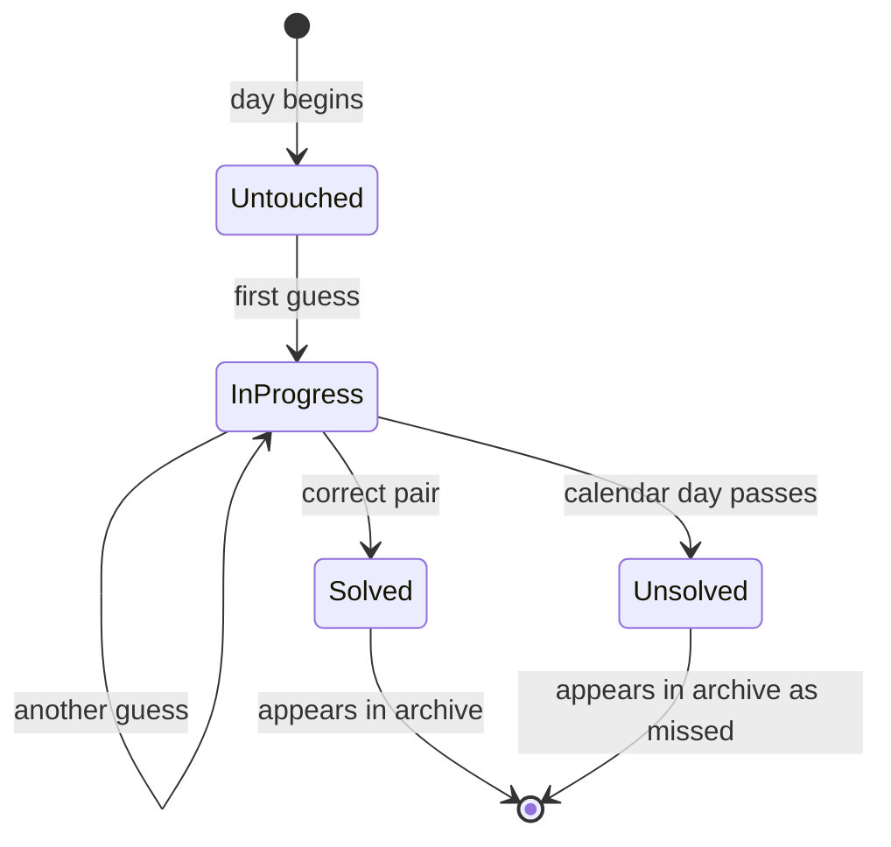

# PRD — Epic 5: The archive strip, and the day you already played

Feature: [briefing.md](../briefing.md) · [roadmap.md](../roadmap.md) · Design: [Daily Groove.dc.html](../Daily%20Groove%20webapp%20design/Daily%20Groove.dc.html)

## Summary

Makes the game persist. Attempts survive a reload so a refresh is not a free
reset, a finished day reopens in its solved state, and past days appear beneath
the puzzle as a row of small cards showing the date, how it went, and the answer.
This epic carries the storage rewrite that the new game model requires.

## Problem

Feature-1's saved results are keyed by scale/chord/progression attributes that no
longer exist, so the storage shape has to change with the game. Without that,
attempts vanish on refresh — which both breaks the attempt dots and hands the
player an obvious way to wipe a bad start. And `HistoryView` remains the last
unstyled thing on the page.

## Scope

- A version-2 result shape and store, carrying attempts and the solved flag.
- Restoring an in-progress or finished day on load.
- Updating the streak rule for the new model.
- The archive strip and its card, empty state, and section header.

**Out of scope**
- An archive route or a full-history page. The "All →" affordance in the design
  has no destination and none is built.
- Migrating feature-1's saved results — they are discarded.
- Accounts or cross-device sync — the store stays local, behind feature-1's
  existing `ResultStore` seam.

## Requirements

- **R1** — A day's record carries the date, the attempts made, whether it was
  solved, and the answer.
- **R2** — Attempts are persisted as they happen, not only when the day ends.
- **R3** — On load, a day already in progress is restored: the attempts spent come
  back with their dots, the feedback state matches the last guess, and the player
  continues from there.
- **R4** — On load, a day already solved reopens showing the solved panel, with the
  guessing card locked.
- **R5** — Results are stored under a new version. A stored record from feature-1
  is ignored rather than migrated, and its presence never throws.
- **R6** — A write that fails — quota, disabled storage — does not break play.
- **R7** — A day counts toward the streak when it was solved, however many
  attempts it took. A past day left unsolved breaks the streak.
- **R8** — Below the puzzle, past days render as a grid of cards, most recent
  first, under a section label.
- **R9** — Each card shows a day label, an outcome mark, and the day's answer. The
  card carries no sparkline or other decorative graphic.
- **R10** — The outcome mark distinguishes solved on the first try, solved in
  several, and a past day left unsolved.
- **R11** — A past day left unsolved still reveals its answer, alongside its
  missed mark. The day cannot be replayed, so the answer is never withheld.
- **R12** — A player with no history sees a designed empty state, not an empty
  grid.
- **R13** — The card grid reflows from the design's six columns down to fewer on
  narrow screens without overflowing.
- **R14** — The archive card and its parts are generic components in
  `src/components`, carrying no musical or domain vocabulary.

## Behaviour details

The day's record moves through a small lifecycle, and the archive only ever shows
days that have left the current day behind:

A day never opened produces no record and never appears in the archive.

Storage already rejects a mismatched envelope version and falls back to empty, so
bumping the version is a clean break with no migration code.

## Acceptance criteria

- **AC1** (R2, R3) — Given the player has made two wrong guesses, when they
  reload, then two dots are still spent and the feedback from the second guess is
  shown.
- **AC2** (R3) — Given a restored in-progress day, when the player guesses again,
  then it counts as the third attempt, not the first.
- **AC3** (R4) — Given the player solved today, when they reload, then the solved
  panel is shown and the chips do not accept input.
- **AC4** (R5) — Given a feature-1 result blob in storage, when the app loads,
  then it is ignored, no error surfaces, and the day starts fresh.
- **AC5** (R6) — Given storage that throws on write, when the player guesses, then
  the guess still registers in the session.
- **AC6** (R7) — Given yesterday was solved and today is solved, when the streak is
  computed, then it is two; given yesterday was left unsolved, then today's streak
  is one.
- **AC7** (R8, R9) — Given three past days played, when the archive renders, then
  three cards appear, most recent first, each showing its answer.
- **AC8** (R10) — Given a past day solved on the first try, one solved in three,
  and one left unsolved, when the archive renders, then all three marks are
  distinguishable without relying on colour alone.
- **AC9** (R11) — Given a past day the player never solved, when its card renders,
  then the answer for that day is shown next to the missed mark.
- **AC10** (R9) — Given any archive card, when it renders, then it contains no
  sparkline or decorative bar graphic.
- **AC11** (R12) — Given no history, when the archive renders, then the empty state
  is shown.
- **AC12** (R13) — Given a 375px viewport, when the archive renders, then the grid
  is narrower and nothing overflows.
- **AC13** (R14) — Given the repository, when the archive card components are
  inspected, then they take content as props and name no musical concept.

## Dependencies

Needs Epic 2's domain contract for the attempt and answer shapes, and Epic 1's
tokens for the card surface. Reuses feature-1's `ResultStore` interface unchanged,
so only the record shape and the envelope version move.

Hands nothing to other epics; it is the last of Wave 3.

## Assumptions

- The archive shows the most recent six days, matching the design's row, with the
  real total in the section header. No link is rendered, since there is no
  destination.
- Day labels are relative for the last week — "Yesterday", "Thu" — and fall back to
  a date beyond that, as the canvas shows.
- Today never appears in the archive; it is the puzzle above.
- The store stays local and keeps its promise-returning interface, so a future
  server-backed store needs no caller changes.
- Restoring an in-progress day restores attempts and feedback, but not the chip
  selection — the player re-picks, which pairs with Epic 2's rule that a repeat
  submission is blocked.
- Without the sparkline the card is shorter than the canvas draws it; the grid
  keeps the design's card proportions rather than stretching to fill the old
  height.

## Question log

### Cycle 1 — 2026-08-29

**Q1. For a past day left unsolved, does the card reveal the answer?**
Answer: **A) Reveal it, alongside the missed mark** — the day cannot be replayed,
so withholding the answer means the player never learns it, and a blanked card is
a dead tile.
Applied to: R11, AC9

**Q2. What is the sparkline on each archive card?**
Answer: **B) Drop it; cards carry the date, mark and answer only** — there is no
waveform data behind it, and decorative bars would be the one invented element
left on the page.
Applied to: R9, R14, AC10, Scope, Assumptions
