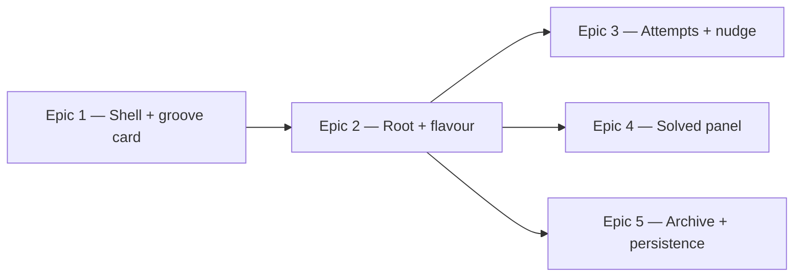

# Roadmap — Daily Groove: the design, and the game it encodes

Source: [briefing.md](briefing.md) · Design: [Daily Groove.dc.html](Daily%20Groove%20webapp%20design/Daily%20Groove.dc.html)

> **Settled.** All questions are answered and folded in; nothing is left open. The
> shape: the design's game model replaces feature-1's guessing flow (Q1=C); flavour
> chips are derived per day from the seed data, four at a time and always including
> the right answer (NQ2=C), beside the canvas' full twelve roots (NQ5=A); and there is
> no lockout — past three attempts the nudge stays up and you keep guessing (NQ1=C).

## Overview

The design canvas encodes a different game than feature-1 shipped: pick one root
and one flavour, check, and keep trying across a handful of attempts with escalating
feedback. This feature builds that game *and* dresses the
whole app in the canvas' visual language — warm paper, Newsreader/DM Sans, cream
cards, deep-green accent — with a matching dark palette and full responsiveness.
Epic 1 renders the shell and pins the design contract; Epic 2 rewrites the guessing
flow and pins the domain contract; Epics 3–5 then build attempts, the solved panel,
and the archive in parallel against it.

Every layout decision lands in `src/components` as a generic, prop-driven primitive.

## Epics

### Epic 1 — The designed shell and today's groove card

**Visible when done:** Opening the app shows the design, not a stylesheet-less page —
the warm radial paper background, the header with its brand eyebrow, the serif
"Today's groove" title, today's date, the streak pill, and the cream groove card
holding the loop transport and the round green play button. It looks right in light
and dark, and from phone to desktop.
**Depends on:** none
**Parallel with:** none — it pins the contract everything else is built against

**Scope**
- Load Newsreader (display) and DM Sans (body) via `next/font`, replacing Geist.
- Define the token layer in `globals.css` under Tailwind v4 `@theme`: paper and
  surface backgrounds, the accent green ramp, text and border tints, radii
  (22/16/14/10/pill), and the card shadow. Later epics consume these names, never
  raw hex.
- **Author the matching dark palette** in the same token layer (Q3=B), so a token
  swap re-themes every component. Dark is a first-class acceptance criterion in
  every epic, not a later pass.
- First design-system primitives in `src/components`, all generic and prop-driven:
  page shell, centred container, `Card`, stack/row layout, heading/text/eyebrow
  label, `Pill`, circular `IconButton`.
- Move **all** layout out of `src/app` — `page.tsx` and `layout.tsx` keep routing and
  metadata only, and compose primitives for structure.
- The groove card header, and the loop transport panel: inset panel, segmented
  progress bar with four bar markers and labels, wired to the existing play state.
- Restyle `PlayControl` into the design's round accent button with its play/stop
  glyph and accessible label.
- Responsive behaviour for the header and groove card (Q4=A): the canvas' 1.35fr/1fr
  split collapses to a single column on narrow screens.

**Out of scope**
- The option chips and CTA — Epic 2.
- Anything touching the game model, scoring, or storage — Epic 2 owns that rewrite.
- The solved panel — Epic 4; the archive strip — Epic 5. Until then `HistoryView`
  renders in its current form below the fold and is expected to look unfinished.
- Per-groove tips and note data — no backing data. A groove **name** and **tempo**
  are added to the seed set in this epic; the rest of the card header is settled in
  the PRD.

**Validation**
- Demo: load `/` — header, date, streak pill and groove card match the canvas;
  pressing play animates the transport and highlights the active bar. Toggle the OS
  theme and the page re-themes. Narrow to 375px and nothing overflows.
- Design-system components tested against their own contract (props, states, a11y),
  independently of the feature, per `docs/testing.md`.
- `src/app/**` contains no layout or spacing classes.
- Every feature-1 test still passes — Epic 1 changes no behaviour.

### Epic 2 — Guess the root and the flavour

**Visible when done:** The "What is it?" card is the real game: a row of root chips and
a short row of flavour chips that select and deselect, a full-width CTA that reads
"Pick a root and a flavour" until both are chosen and then "Check G Dorian", and
pressing it tells you whether you were right.
**Depends on:** Epic 1 (tokens + primitives contract)
**Parallel with:** none — it pins the domain contract Epics 3–5 build against

**Scope**
- The domain rewrite, carried by the epic that makes it visible:
  - `Root` and `Flavour` types, and their chip sets (NQ2=C): roots are the canvas'
    twelve chromatic notes; **flavours are derived from the seed data's own scales,
    narrowed to four per day and always including the correct one.**
  - Keep and adapt feature-1's `buildOptions(correct, pool, seed)` — it already does
    exactly this narrowing, deterministically per day. The flavour pool is whatever
    the seed set actually uses, so Locrian needs no special-casing.
  - Derive each groove's answer from the existing `Groove.scale` (`"G mixolydian"` →
    root `G`, flavour `Mixolydian`), mapping the seed's lowercase values to the
    canvas' display casing.
  - New store shape: selected root, selected flavour, attempts, solved.
  - New scoring: an attempt is correct only when **both** root and flavour match.
  - Retire the subset-guessing model — `Attribute`, `AttributeSelector`,
    `AttributePicker`, `scoreSelected`, and the per-attribute `DailyResult` shape
    all go.
- Generic `Chip` / `ChipGroup` in `src/components`: idle, selected, disabled, hover
  and focus-visible states, in both themes, driven purely by props.
- Field label and a `Button` carrying the design's three CTA treatments (idle,
  ready, solved).
- Root chips are fixed-width, flavour chips size to content, both wrapping — and
  reflowing cleanly at narrow widths. With four flavours the second row is
  visually lighter than the canvas' eight; the group keeps its label and spacing.

**Out of scope**
- Attempt dots, targeted feedback copy, and the nudge box — Epic 3.
- The solved panel — Epic 4. On a correct check this epic may show a plain
  confirmation; the designed reveal is Epic 4's.
- Persisting attempts — Epic 5.

**Validation**
- Demo: pick a root, pick a flavour, watch the CTA change, press it, learn whether
  you were right.
- `Chip`/`ChipGroup`/`Button` tested against their contract in isolation; the
  guessing flow tested through rendered behaviour, colocated in the feature.
- Scoring, root/flavour derivation, and per-day option narrowing tested directly in
  `lib/` — including that the correct flavour is always among the four offered, and
  that the same day yields the same four.
- Fully operable by keyboard and screen reader.

### Epic 3 — Attempts, feedback, and the nudge

**Visible when done:** Wrong guesses now tell you something — the attempt dots fill in,
the line under the CTA changes from generic encouragement to targeted feedback ("Right
home note, wrong colour…"), and after two misses a nudge box appears and stays. You are
never locked out; you can keep guessing until you get it.
**Depends on:** Epic 2 (domain contract)
**Parallel with:** Epic 4, Epic 5

**Scope**
- The attempt-dot row, with the canvas' three dot states (unused, spent, solved). The
  row is three dots wide — a par marker, not a life counter — so a fourth and later
  attempt leaves it full rather than growing it.
- Feedback selection logic in `lib/`: right-root-wrong-flavour, right-flavour-wrong-
  root, and neither — each with its own copy and tone colour.
- The nudge box, revealed after two wrong attempts and **persisting** from then on
  (NQ1=C) rather than being replaced by a lockout.
- Guessing stays enabled indefinitely: the CTA keeps returning to its ready state
  after every wrong check, and the canvas' "No penalty — keep playing" copy is
  literally true.

**Out of scope**
- Any lose state. NQ1=C means there is no lockout and no "missed" screen, so the one
  artboard the canvas lacked is no longer needed.
- The solved panel's content — Epic 4.
- Per-groove hint text: `Groove` carries none, so the nudge uses generic
  interval-based copy rather than groove-specific advice (Q2=D).

**Validation**
- Demo: guess wrong three ways in a row and watch the dots, the copy, and the nudge
  respond — then guess a fourth and fifth time and confirm you are still allowed to.
- Feedback selection tested directly in `lib/`; the dots and nudge tested through
  rendered behaviour, including that the nudge persists and the dot row caps at three.
- Feedback is announced to assistive tech, not conveyed by colour alone.

### Epic 4 — The solved panel

**Visible when done:** Solving reveals the full-width deep-green gradient panel — the
answer set in serif, "solved in two tries · streak now 12" beside it, and columned
groups showing the groove's changes and the notes to live in.
**Depends on:** Epic 2 (domain contract)
**Parallel with:** Epic 3, Epic 5

**Scope**
- An inverted `Panel` surface primitive and the inverted chip treatment used on it.
- A generic labelled-column primitive for the panel's grouped content.
- The answer line, the tries/streak meta line, and the columns fed from the groove's
  existing `chord` and `progression` — real data, kept and revealed here but never
  guessable (NQ3=A).
- The panel's three columns collapse to one on narrow screens.

**Out of scope**
- The "Try this" tips column — `Groove` carries no tips (Q2=D).
- `ResultReveal` is deleted here: it is exported but unused and hardcodes "The scale
  was", which the new model makes meaningless.

**Validation**
- Demo: solve the day and see the panel, with the tries count matching what you spent.
- `Panel` and the column primitive tested against their contract; the reveal tested
  through rendered behaviour.
- Contrast holds for the light-on-dark panel in both themes.

### Epic 5 — The archive strip, and the day you already played

**Visible when done:** Below the puzzle, "Grooves you've played" renders as a row of
small cards — date, outcome mark, and the day's answer in serif. Reload
mid-game and your attempts are still there; come back to a finished day and it opens
in its final state.
**Depends on:** Epic 2 (domain contract)
**Parallel with:** Epic 3, Epic 4

**Scope**
- Storage v2: a new `DailyResult` carrying the day's attempts, the solved flag, and
  the answer. Bump the envelope to `version: 2` under a new key — `readEnvelope`
  already rejects a mismatched version, so old v1 blobs are ignored, not migrated.
- Restore an in-progress day on load (NQ4=A): the attempts you had spent come back
  with their dots, and you carry on from there — so a reload is not a free reset.
  This means attempts persist as they happen, not only at the end of the day.
- Update `isQualifying`/`computeStreak` for the new model: a day counts toward the
  streak when it was solved, however many attempts it took.
- Generic `SectionLabel`, `MiniCard` and `TextLink` in `src/components`.
- Restyle `HistoryView` onto them as the responsive card grid, most-recent first,
  with the canvas' three outcome marks. With no lockout (NQ1=C), "missed" can only
  mean a past day left unsolved — solved-first-try and solved-in-N are the other two.
- The designed empty state for a player with no history.

**Out of scope**
- The "All 213 →" link target — there is no archive route and this feature adds none.
  Render the real count and drop the link, or link to nothing.
- The canvas' per-card sparkline. There is no waveform data behind it, so the card
  carries the date, the mark and the answer only.

**Validation**
- Demo: play a day, reload mid-attempt and see your dots preserved; finish it and see
  it appear as a card; clear storage and see the empty state.
- `MiniCard` tested against its contract; `HistoryView` and the
  restore path tested through rendered behaviour including the empty case.
- Storage and streak logic tested directly in `lib/`, including a stale v1 blob.

## Dependency map

## Execution waves

- **Wave 1:** Epic 1 — pins the token and primitive contract.
- **Wave 2:** Epic 2 — pins the domain contract.
- **Wave 3 (parallel):** Epic 3, Epic 4, Epic 5 — disjoint components, sharing only
  the primitives and domain types they consume read-only.

Two sequential contract epics is the real shape here, but the chain is shortenable:
freeze Epic 1's `@theme` token names and primitive prop signatures on day one and
Epic 2 can build against them while Epic 1 is still landing. Same for Wave 3 — write
the new `DailyResult`, store API, and scoring signatures first and three streams
start immediately.

## Assumptions

- **The design's game replaces feature-1's** (Q1=C). Subset-guessing across
  scale/chord/progression is retired; the app becomes root + flavour with attempts.
  Feature-1's tests for the old model are deleted with it, not fixed.
- Each groove's answer is derived from its existing `scale` field rather than new
  data — `"A dorian"` is root `A`, flavour `Dorian`.
- **Flavour chips are four per day, derived from the seed data** (NQ2=C), always
  including the correct answer, chosen deterministically from the day's date so the
  same day always offers the same four. The pool is the seven flavours the seed set
  actually uses, so the canvas' Harmonic minor and Blues simply never appear and
  Locrian needs no seed edit. Seed values are lowercase; display uses the canvas'
  capitalisation.
- Root chips stay as the canvas' full twelve chromatic notes (NQ5=A); only flavours
  narrow. The guess space is therefore 48 pairs.
- **No lose state** (NQ1=C). Three dots mark par, not lives; after two misses the
  nudge appears and stays, and guessing continues until solved. A day is only ever
  "missed" in the archive by being left unsolved when the calendar day passes.
- A past unsolved day breaks the streak, matching the existing `computeStreak` walk.
- Old saved results are discarded, not migrated: storage is already versioned and
  `readEnvelope` rejects a mismatched version, so bumping to v2 is a clean break.
  The app is pre-release, so no real player loses a streak.
- A day counts toward the streak when it was solved, regardless of attempts used.
- Design elements with no backing data are omitted rather than faked. Q2=D deferred
  all of them; brainstorming Epic 1 narrowed that: a groove **name** and **tempo**
  are authored into the seed set as part of this feature, while per-groove tips and
  note data stay deferred to a follow-up. `chord` and `progression` are real data and
  do render, and the solved panel's scale notes are computed rather than stored.
- The token layer lives in `globals.css` via Tailwind v4 `@theme`; no CSS-in-JS and no
  new styling dependency.
- No new routes; `src/app` keeps its single page.
- New tests assert rendered behaviour and component contracts, never CSS values or
  snapshots.
- "No layout outside the components folder" means structural and spacing decisions are
  expressed through primitives from `src/components`; feature components keep their
  semantic elements (`fieldset`, `ul`, `section`) for accessibility.

## Answered questions

All nine questions raised across the three passes are settled and folded into the
epics above:

| | Question | Answer |
|---|---|---|
| Q1 | The design encodes a different game than the app plays | **C** — adopt it; rewrite the guessing flow as part of this feature |
| Q2 | Design elements with no backing data | **D** — omit for now; a follow-up feature enriches the groove data |
| Q3 | The design is light-only | **B** — author a matching dark palette in Epic 1 |
| Q4 | Fixed 1440px artboard | **A** — fully responsive; each epic owns its region's breakpoints |
| NQ1 | Are attempts limited? | **C** — no lockout; past three the nudge stays and you keep guessing |
| NQ2 | Canvas flavours vs. seed data | **C** — derive from seed data, four per day, always including the answer |
| NQ3 | `chord` and `progression` | **A** — keep as data, reveal in the solved panel, never guessable |
| NQ4 | Reload mid-game | **A** — attempts are restored; a reload is not a free reset |
| NQ5 | Should roots narrow too? | **A** — keep all twelve; only flavours narrow |
