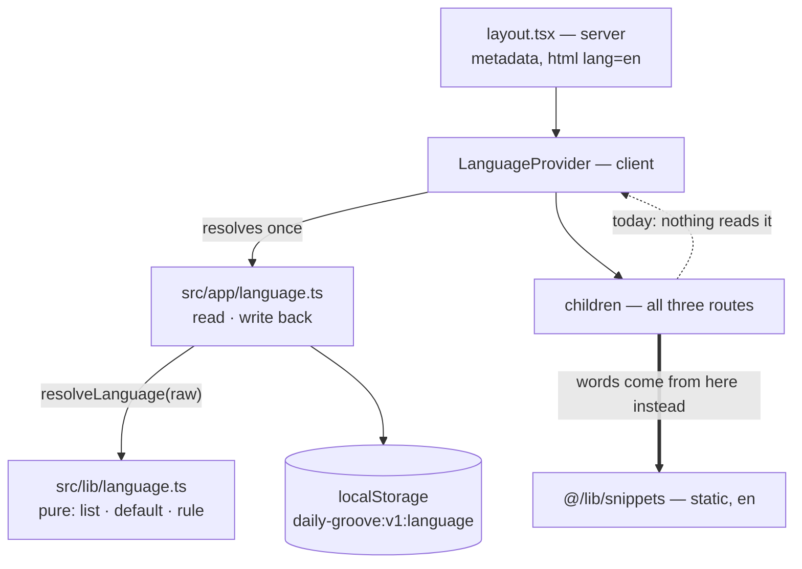

# PRD — Epic 2: The app knows which language it is in

Feature: [briefing.md](../briefing.md) · [roadmap.md](../roadmap.md)

## Summary

The app gains a chosen language: stored in `localStorage`, read on app start,
written as `en` when absent, repaired when it is something the app does not have.
Nothing renders differently, because English is the only language installed. This
is the seam the translation feature plugs into, built now while the sweep that
gathers the strings is happening anyway.

## Problem

The briefing asks for it directly: *"the selected language (currently only
'en') is stored in localStorage and read on app start. If it's not there, put it
with 'en'."*

Today the app has no notion of a language at all. `<html lang="en">` is a literal
in `layout.tsx`, `en-GB` is a literal in the date formatter, and nothing anywhere
represents *the language the player is reading*. The translation feature would
otherwise have to invent the store, the fallback, the supported-language list and
the translated strings all in one epic, which is three risky things and one
tedious one in the same diff.

## Scope

- `src/lib/language.ts` — the vocabulary and the rule, kept pure: the supported
  list, the default, and `resolveLanguage(raw)`, which decides what a stored value
  resolves to
- `src/app/language.ts` — the storage adapter: the key, the read, and the
  write-back that repairs a value the rule rejected
- a client provider in `src/app/` mounted by `src/app/layout.tsx`, resolving the
  language once and holding it in context, with one hook to read it
- the value is read once at app start and written back when absent
- an unsupported, corrupt or unreadable value falls back to `en`
- unit tests over every path, including storage that throws

**Out of scope**
- **a language picker.** One installed language means nothing to choose; the
  picker arrives with the second language
- **a second language, and any translation of anything**
- **resolving snippets through the stored value.** Epic 1's
  `src/lib/snippets/index.ts` re-exports `en/` directly, so the app renders
  English whatever the key says. Swapping that re-export for a resolver is the
  translation feature's first move, and it is one file
- **`<html lang>` following the stored language.** It is rendered on the server,
  where `localStorage` does not exist; it stays `en`
- **the `Intl` locale.** `en-GB` in `lib/presentation/date.ts` is a formatting
  locale, not the app's language, and the two are not the same choice — a German
  reader may well still want British date formatting
- **`navigator.language` sniffing.** The briefing says the default is `en`
- **live switching without a reload.** The briefing says read on app start
- **migrating or versioning the stored value.** There is one value and one
  version of it

## Requirements

- **R1** — `src/lib/language.ts` owns the vocabulary and the rule: the supported
  languages, the default, and `resolveLanguage(raw: string | null): Language`. It
  sits beside `src/lib/snippets/`, the module it will one day select from, because
  the app's language must outlive any one feature slice — `docs/architecture.md`'s
  standard is that deleting `src/features/daily-groove/` leaves a building app.
- **R1a** — `src/lib/language.ts` is pure, and stays inside every bar
  `docs/coding-guidelines.md` §Shared code calls absolute: it is a function of its
  arguments, with no state, no clock, no `localStorage`, no DOM and no React. It
  has zero import specifiers, which is stronger than the leaf rule asks for.
- **R1b** — The storage lives in `src/app/language.ts` and the provider beside it.
  `src/app/` is glue and already knows about client and server, so the impure half
  sits where impurity is expected rather than widening the bar for `src/lib/`.
- **R1c** — Nothing under `scripts/` imports either module. `scripts/grooves/`
  reaches exactly five `src/lib/` paths and the generator's boundary test asserts
  that set exactly; this epic adds no sixth, so the test needs no edit and its
  continuing to pass unchanged is the proof.
- **R2** — The supported languages are one exported list containing `en`, and it
  is the only place the set is written down. Adding a language is one entry.
- **R3** — The default is `en`.
- **R4** — On app start the chosen language is read. If nothing is stored, `en` is
  written and returned.
- **R5** — A stored value that is not in the supported list — `de`, `EN`, `""`, a
  number, an object — resolves to `en`, and `en` is written back, so the bad value
  does not survive to the next load.
- **R6** — `localStorage` being unavailable or throwing — private mode, a quota
  error, storage disabled — resolves to `en` and does not throw. The app renders
  normally with nothing persisted, the way `preferences.ts` already behaves.
- **R7** — The read happens once per app start, not per component render. A
  client provider in `src/app/`, mounted by `src/app/layout.tsx`, resolves the
  language and puts it on a context; one hook reads that context and is the only way in. Called outside the
  provider the hook throws rather than returning a default, the way
  `usePuzzleSessionContext` already does, so a component mounted without it fails
  loudly in a test instead of silently rendering the default language.
- **R7a** — The provider is a client component rendered by the server layout
  around `children`. `layout.tsx` stays a server component and keeps exporting
  its `metadata`.
- **R8** — Every route the app can be entered on gets the same treatment: the
  daily puzzle, the shared-groove route, and the not-found route. A player who
  lands on a shared link first has the same stored state as one who lands on the
  home page.
- **R9** — The chosen language is readable by anything that needs it, and today
  nothing does. That is the epic's honest state: the value round-trips through the
  context, and no rendering path consumes it. Components still get their words by
  static import from `@/lib/snippets`; the context holds the language, never the
  snippets.
- **R10** — Nothing the player can observe changes. Every rendered string, every
  accessible name, identical, in the same conditions as today, whatever the key
  holds.

## Behaviour details

**The resolution, once, at start:**

```
read(raw)
  raw is null            → write 'en',  return 'en'
  raw in SUPPORTED       →              return raw
  raw is anything else   → write 'en',  return 'en'
  storage threw          →              return 'en'    // nothing written
```

The write on the unsupported branch is what makes R5 self-healing: a value the
app cannot use is not left sitting in the browser for the next release to trip
over.

**Where the read happens.** `src/app/layout.tsx` is a server component, so the
read cannot happen there — `localStorage` does not exist where it runs. A client
provider mounted around `children` covers all three entry routes with one mount,
and it is the seam that grows into something real the day there is a second
language: the translation feature adds the resolver behind the same hook rather
than finding a mount point of its own.



**What the key holds.** A bare language tag, not a JSON envelope. There is one
value; wrapping it in an object buys a version field nothing needs yet and makes
the corrupt-value path a JSON parse as well as a membership check.

**Why the `Intl` locale stays put.** `en-GB` formats the date on the card. It
answers "which conventions for numbers and dates", not "which language is this
app in", and the two diverge the moment a German reader keeps British dates. The
translation feature can pair them if it wants; this epic does not.

## Acceptance criteria

- **AC1** (R1, R2) — Given `src/lib/language.ts`, when read, then the supported
  languages are one exported list containing `en`, and no other file writes the
  set down.
- **AC1a** (R1a) — Given `scripts/grooves/boundary.test.ts` and
  `src/lib/leaf.test.ts`, when they run, then both pass and no file under
  `scripts/` imports `src/lib/language.ts`.
- **AC2** (R3, R4) — Given empty `localStorage`, when the app starts, then the
  key holds `en` and the read returns `en`.
- **AC3** (R4) — Given the key already holds `en`, when the app starts, then it
  is returned unchanged and nothing else is written.
- **AC4** (R5) — Given the key holds `de`, `EN`, `""` or `{"language":"en"}`,
  when the app starts, then the read returns `en` and the key is repaired to `en`.
- **AC5** (R6) — Given `localStorage` throws on read, and given it throws on
  write, when the app starts, then the read returns `en`, nothing is thrown, and
  the page renders.
- **AC6** (R7) — Given the app renders and re-renders, when the reads are counted,
  then the value is resolved once per start.
- **AC6a** (R7) — Given the hook called outside the provider, when the component
  renders, then it throws.
- **AC6b** (R7a) — Given `src/app/layout.tsx`, when read, then it is not a client
  component and still exports `metadata`; and given the app, when it renders,
  then there is no hydration warning.
- **AC7** (R8) — Given each of the three entry routes with empty storage, when
  loaded, then the key holds `en` afterwards.
- **AC8** (R9, R10) — Given the key present, absent and corrupt, when the app is
  played through a full session, then every rendered string and accessible name
  is identical in all three.
- **AC9** — Given the full gate, when `npm test`, the type check, lint and build
  run, then all pass.

## Dependencies

**Needs to start:** nothing. Epic 1 settled the snippets entry point away from a
resolver, so the two epics share no surface and run in parallel.

**Hands to the translation feature:** the stored value, the supported list and
the fallback, so its first move is changing `src/lib/snippets/index.ts` from a
re-export to a resolver over a language it can already read.

**Must not collide with Epic 1:** Epic 1 owns `src/lib/snippets/`, the thirty
components and `src/lib/theory/character.ts`. This epic owns `src/lib/language.ts`,
its provider, its tests, and the one line in `src/app/layout.tsx` that wraps
`children`. Epic 1 also edits `layout.tsx` — to repoint `APP_NAME` and `TAGLINE`
at the new snippets path — so that file is the one place the two epics meet, and
they touch different lines of it.

## Assumptions

- The key follows the existing convention: `daily-groove:v1:<name>`, alongside
  `daily-groove:v1:prefs` and `daily-groove:v2:results`.
- The stored value is a bare string, not JSON.
- Language tags are lowercase two-letter codes for now. Regional variants
  (`en-GB` versus `en-US`) are a translation-feature problem, and the supported
  list is where that would be decided.
- The read is synchronous. `preferences.ts` wraps its reads in promises for a
  store interface this module does not need.
- No telemetry, no logging of the repair. A corrupt value is fixed silently.
- The provider resolves the language during its first client render and the
  context is never null. Nothing renders from it, so there is no hydration
  mismatch to manage; the translation feature inherits that problem along with the
  resolver.
- The provider and its hook live in `src/app/`, beside the storage adapter they
  read and the layout that mounts them. Both files sit flat rather than in a
  subfolder, because a folder under `src/app/` reads as a route segment.
- The write-back rule is the predicate `resolved !== raw`: the caller writes
  exactly when the resolution differs from what it read, which covers absent,
  valid and corrupt with no fourth branch and keeps the whole repair rule on the
  pure side.
- The hook's name and the provider's name follow `PuzzleSessionContext`'s
  precedent.

## Question log

Answered questions, kept for traceability. The requirements above are the source
of truth — this records how they got there.

### Cycle 1 — 2026-09-03

**Q1. Where does the language module live?**
Answer: **A) `src/lib/language.ts`**, a sibling of `src/lib/snippets/` — the
language pairs with the words it will one day select, and both have to outlive
the feature slice that `docs/architecture.md` requires to be deletable.
Applied to: Scope, R1, R1a, AC1, AC1a, Dependencies.

**Q2. Who reads it at app start?**
Answer: **B) A client provider in `layout.tsx`** holding the resolved language in
context — one mount covers all three entry routes, and it is the seam the
translation feature's resolver slots into rather than hunting for a mount point
of its own.
Applied to: Scope, R7, R7a, R9, AC6a, AC6b, Behaviour details, Assumptions.

This does not reopen the roadmap's decision that a snippet is a plain static
import. The context holds the language; it never holds the snippets, and no
component reads its words through it.

### Cycle 2 — 2026-09-03 (from the tech spec)

**Q1. `docs/coding-guidelines.md` calls the `src/lib/` purity bar absolute. This
module breaks it. Which gives?**
Answer: **A) Split the module and keep the bar absolute.** The vocabulary and the
rule are a pure function of their arguments and stay in `src/lib/language.ts`;
the `localStorage` touch and the provider move to `src/app/`. The bar is not
widened, the doc is not amended, and the epic stops contradicting a written rule.
Applied to: Scope, R1, R1a, R1b, R1c, R7, Behaviour details, Assumptions.

The seam is real rather than a compromise. The translation feature still points
its resolver at one module — a resolver needs `resolveLanguage` and
`SUPPORTED_LANGUAGES`, and both are in the pure half. The tests get simpler too:
resolution is tested by calling a function with `string | null`, and only the
storage-throws and no-storage-on-the-server cases need a faked accessor.

Cycle 1's Q1 answer stands for the half it describes — the language module belongs
beside `src/lib/snippets/` and must outlive the feature slice. What changed is
which half of it lives there.
