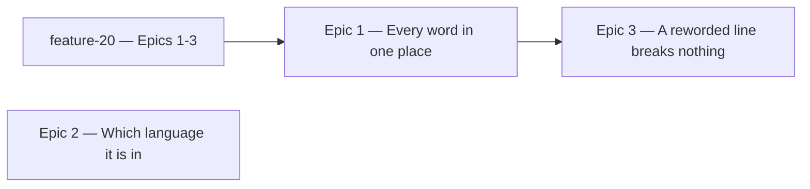

# Roadmap — Internationalization

Source: [briefing.md](briefing.md) · reference: [every-word-in-one-place.md](every-word-in-one-place.md)

## Overview

Roughly a hundred user-facing strings sit wherever they happen to render, across
about thirty files. This feature gathers all of them into `src/lib/snippets/en/`,
gives the app a stored notion of which language it is in, and makes rewording a
line one edit instead of a grep hunt. English stays the only language — the
translating is a later feature, and this one is the sweep it needs first.

Three epics: the sweep, the locale the sweep is filed under, and the test half
that stops a reworded line breaking fifty assertions. The first two are
independent and run together; the third needs the sweep landed.

**Nothing here is visible to Sam, and that is the point.** Every string moves
byte-identical; the existing assertions passing is what proves it. The
"visible when done" lines below are therefore written for the person holding the
diff, and where an epic genuinely shows Sam nothing it says so rather than
dressing a build task in persona language.

## Epics

### Epic 1 — Every word in one place

**Visible when done:** the app renders identically, and every word it says is
readable in one sitting under `src/lib/snippets/en/`. Change `TAGLINE` in one
file and it changes in the header and the browser tab at once; change a coaching
line and it changes wherever that line appears. Nothing Sam sees is different —
that is the acceptance test, not a caveat.

**Depends on:** feature-20's Epics 1–3 landed (they have)
**Parallel with:** Epic 2

**Contract frozen here, on day one**
The sweep touches thirty files, so the shape has to be right before it starts —
changing it afterwards is the same thirty files a second time.
- **the path**: `src/lib/snippets/en/<area>.ts`, one file per area of the UI —
  `branding`, `header`, `intro`, `puzzle`, `coaching`, `solved`, `routes` — each
  exporting one object, with `src/lib/snippets/index.ts` as the only entry point
  a component imports. The `en/` level exists so a second language is a sibling
  folder, never a second sweep.
- **how a component gets a snippet**: a plain static import from the index —
  `import { puzzle } from '@/lib/snippets'` — which re-exports `./en/<area>`
  directly. No resolver, no hook, no runtime language lookup. The call shape is
  an imported object either way, so the day a second language arrives the switch
  from a re-export to a resolved bundle happens inside `index.ts` and the thirty
  call sites do not move. Deferring the resolver costs nothing it cannot buy
  back.
- **constants and functions**: a snippet needing a value is a function taking
  typed arguments, everything else a constant, so the compiler checks every call
  site and no placeholder syntax gets invented.

**Scope**
- every string a person can read moves: rendered text, aria-labels, the
  player-facing failure text, and the seventeen mode-description lines
- `src/lib/branding.ts` is folded in and deleted; its four importers repoint
- `MODE_CHARACTERS` splits along the language/data line — the degree arrays stay
  in `src/lib/theory/character.ts`, the prose lines become a snippet function.
  `src/lib/snippets/` and `src/lib/theory/` are siblings and neither imports the
  other; the solved panel composes them
- `PlayControl` stops holding app words: its labels and accessible names become
  props with no domain-flavoured default, and the rest of `src/components/` is
  checked for the same
- `puzzleHarness.tsx`'s `CAPTION`, `CAPTION_SOUNDS_OFF` and `CHANGES_READ` become
  imports rather than copies
- `docs/coding-guidelines.md` gains the rule for the gap no linter covers: no
  user-facing string written inline in a component
- `structure.test.ts` learns where snippets live and asserts the theory/snippets
  arrow does not exist in either direction

**Out of scope**
- **translating anything.** No second language, no translation step. Feature-22
  (or whatever the translation feature is numbered) owns all of it
- **rewording anything.** Every string moves byte-identical; a diff containing a
  wording change is a failed epic
- theory names, degree labels and numerals — `Harmonic minor`, `III`, `♭7`. Data
  with one owner in `src/lib/theory/`
- storage keys, the `Intl` locale, thrown `Error` messages, invariant messages
- the generator. `scripts/grooves/` prints to a terminal, not to Sam
- the test half and the lint rule — Epic 3
- a keyed catalogue format, JSON files, a `t()` call. Snippets stay TypeScript

**Validation**
- play a full session before and after — first visit, how-to-play, a wrong guess
  at each rung, the nudge, a lock-in, a solve, a give-up, a shared link, the
  not-found route — and every rendered string and accessible name matches
- the existing suite stays green untouched. That is the whole proof: 209
  assertions still quoting the sentences are 209 witnesses that nothing moved
- change one snippet to a different word: the app renders the new word and the
  suite goes red in exactly the places that quote it. Revert; the tree is
  byte-identical
- the count of snippets added reconciles against the count of strings removed
- `npm test`, `npm run test:gen`, types, lint and build

### Epic 2 — The app knows which language it is in

**Visible when done:** nothing, to Sam. On first load the app writes `en` as the
chosen language and reads it back on every load after. There is no picker,
because there is nothing to pick, and nothing renders differently, because there
is one language installed. This is the briefing's own bullet, built as a
preference the next feature reads rather than a mechanism nobody asked for.

**Depends on:** nothing — Epic 1's contract settled the entry point away from a
resolver, so the two epics no longer share a surface at all
**Parallel with:** Epic 1

**Scope**
- the chosen language is a stored preference, read at app start, defaulting to
  `en` and written back when absent
- an unknown, corrupt or unsupported stored value falls back to `en` and is
  repaired on write, the way `preferences.ts` already treats a bad field
- the set of installed languages is one exported list with `en` in it, so the
  fallback has something to check against and the translation feature has one
  line to add to
- it is honest about doing nothing yet: the value is stored and readable, and no
  rendering path consumes it. Under Epic 1's static index the app renders English
  whatever the key says, and that is the documented behaviour, not a bug

**Out of scope**
- a language picker in the UI. One language, nothing to choose
- a second language, and any translation of anything
- resolving snippets through the stored value. Epic 1's index re-exports `en/`
  directly; swapping that for a resolver is the translation feature's first move
- `navigator.language` sniffing. The briefing says default `en`
- live switching without a reload — the briefing says read on app start

**Validation**
- clear `localStorage`, load the app: the key is there with `en`
- set the key to `de`, or to garbage, load: the app renders English and the key
  is repaired to `en`
- unit tests on the store: absent → `en` and written; valid → returned;
  unsupported → `en`; storage throwing → `en` and no crash
- the page renders identically with the key present, absent and corrupt

### Epic 3 — A reworded line stops breaking fifty tests

**Visible when done:** nothing, to Sam. Rewording a coaching line is one edit and
the suite stays green — the thing feature-19 paid for the hard way across 209
assertions. Lint rejects a sentence typed into a `getByText`.

**Depends on:** Epic 1 — the snippets have to exist before an assertion can
import one
**Parallel with:** none

**Scope**
- every assertion on rendered language imports its snippet instead of quoting it,
  `testing/` included
- an ESLint block scoped to the call shapes whose argument is rendered language
  by definition: `*ByText`, `*ByRole`'s `name`, `toHaveTextContent`,
  `toHaveAccessibleName`, in every `get`/`query`/`find`/`All` spelling
- a second block over the coaching modules' own test files, where `toBe`,
  `toEqual` and `toContain` carry sentences by construction — with `date.test.ts`
  and `staffLabel.test.ts` named as exclusions and the reason written beside them
- the rule is proven to fire once per call shape it claims, and proven to stay
  quiet on `toBe('Aeolian')` and `toHaveAttribute('data-tone', 'warm')`
- every escape hatch is an `eslint-disable-next-line` with a reason on the line,
  and the epic's report lists all of them

**Out of scope**
- a lint rule on `toBe`/`toEqual`/`toContain` outside the coaching modules' tests.
  Elsewhere those carry data more often than language, and a rule that fires on
  `toBe('Aeolian')` gets switched off within a week
- the design system's own test literals. `Button.test.tsx` keeps writing `'Play'`
- a snapshot of the English bundle, or any other test that pins the exact
  wording. Considered and declined: the wording lives in one readable file now,
  and a snapshot that must be approved on every reword is the grep hunt again in
  a smaller costume
- any mechanical guard on inline strings in components. That stays a
  *human-checked* rule in `docs/coding-guidelines.md`, added by Epic 1

**Validation**
- reword one snippet: the whole suite stays green and the app renders the new
  word. Nothing now checks the exact wording, by decision — the diff on
  `src/lib/snippets/en/` is where a reword is read, and a reviewer reads it
- introduce a violation in each call shape the rule claims: lint fails. Remove it:
  lint passes
- the two data assertions above stay legal
- `npm test`, types, lint and build

## Dependency map

## Execution waves

- **Wave 1 (parallel):** Epic 1, Epic 2 — genuinely independent now. Epic 1 owns
  the area files and the thirty components; Epic 2 owns the language store and
  app start, and touches no snippet file. Epic 2 is the short one by a wide
  margin, so it costs no wall-clock.
- **Wave 2:** Epic 3 — needs the snippets to exist before a test can import one.

## Assumptions

- **The sweep is one epic, not one per area.** Splitting it by area gives every
  slice the same shared `index.ts` and no independent value; the parallelism
  belongs one level down, in `/writespec`'s tracks, where a track per area works
  cleanly behind the frozen index.
- **No language picker anywhere in this feature.** One installed language means
  nothing to choose; the picker arrives with the second language.
- **`en/` is a folder of area files, not one file.** `snippets/en/puzzle.ts`, with
  `snippets/index.ts` above the language level as the only import path — which is
  also what keeps the later switch to a resolver contained to one file.
- **Snippet names are English identifiers describing the string's job** —
  `coaching.rootMatched` — not i18n-style dotted keys. The translation feature can
  add a key scheme if it needs one.
- **No new strings are invented.** A string that does not exist today does not get
  a snippet today.
- **The seven area files are a starting split, not a contract.** If `routes.ts`
  holds two strings it folds into `puzzle.ts`. The rule that survives is one file
  per area, not this exact list.
- **feature-20 lands and is committed first.** Epic 1 splits
  `src/lib/theory/character.ts`, rewrites the same `eslint.config.mjs` block and
  the same `coding-guidelines.md` section feature-20 just touched. The two must
  not run at the same time.

## Decisions taken

Settled through the roadmap cycles; `/brainstorm` inherits these rather than
reopening them.

1. **A snippet is a plain static import from `src/lib/snippets`**, which
   re-exports `en/` directly. No resolver, no context, no hook. The second
   language is the translation feature's problem, and because the call shape is
   an imported object either way, that feature changes `index.ts` and not the
   thirty call sites.
2. **Every assertion on rendered language imports its snippet**, with the ESLint
   block enforcing it on the call shapes whose argument is language by
   definition. This is the moved PRD's R7–R10 unchanged.
3. **Nothing checks the exact wording afterwards, and that is accepted.** The
   bundle snapshot was offered and declined: the words are readable in one place
   now, and a snapshot approved on every reword reintroduces the cost the epic
   exists to remove.
4. **The language store is its own epic, parallel to the sweep.** Small, but
   independently validatable and on nobody's critical path. It stores and reads a
   value that nothing renders from yet — deliberately, per decision 1.
5. **No language picker in this feature.** One installed language, nothing to
   choose.
6. **The snippets decisions from feature-20 stand** — where the strings land, the
   "would a translator translate it" line, constants versus functions, the
   language/data split through `MODE_CHARACTERS`. They are recorded in
   [every-word-in-one-place.md](every-word-in-one-place.md) and are not reopened.
