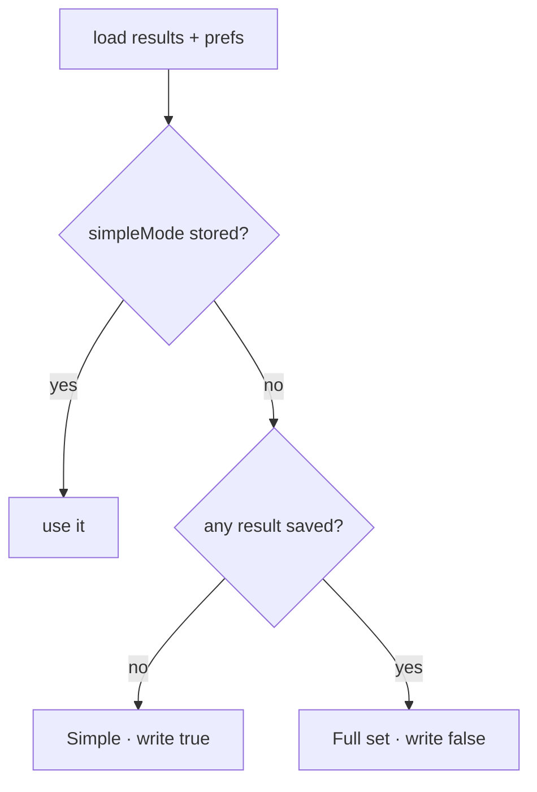

# PRD — Epic 1: Day one is six roots, Major or Minor

Feature: [briefing.md](../briefing.md) · [roadmap.md](../roadmap.md)

## Summary

A player opening Eardle with no result saved starts in Simple mode: six root
chips, two mode chips, switch on. That choice is written down the moment it is
made, so the same player is still in Simple tomorrow even if they never touch
the switch. A stored preference, either way, is never overridden — a player
with results and no stored preference keeps the full set they have been playing.

## Problem

Today every new player lands on twelve roots and four names like "Phrygian
dominant". Sam — who learned by ear and has abandoned three theory courses —
reads that as being asked what they don't yet know, and closes the tab. Simple
mode already exists; it is just off by default, behind a switch nobody has told
them about.

## Scope

- who counts as first-time, and the Simple default for them
- the default persisted on the first visit
- a stored `simpleMode` always winning
- the card never showing the wrong set while the preference loads
- the same rule on the shared-groove route

**Out of scope**
- **what the switch says** — Epic 2
- **naming the two ways in the how-to-play box** — Epic 2
- **what Simple mode is** — six roots from `simpleRootOptions`, Major or Minor,
  family matching on Check, the family lick on tap. All unchanged.
- **a third difficulty**, or any change to the full set — the briefing rules it
  out
- **re-defaulting a lapsed player** — the how-to-play box returns after 31 days;
  the six-root card does not

## Requirements

- **R1** — A player with no saved result and no stored `simpleMode` sees the
  Simple card on their first visit: six root chips, two mode chips (Major,
  Minor), and the switch on.
- **R2** — That decision is written to the preference store during the first
  visit, before the player does anything. A first-time player who never touches
  the switch is still in Simple on day two, when a result exists.
- **R3** — A player with at least one saved result and no stored `simpleMode`
  gets the full set, exactly as today, and that decision is written down the
  same way. They have been playing the full puzzle; nothing changes for them.
- **R4** — A stored `simpleMode`, `true` or `false`, is the only thing consulted
  once it exists. No result count, lapse or visit re-defaults it.
- **R5** — Touching the switch stores the new value at once, as today, and the
  preference beside it (`tapSounds`) is left alone.
- **R6** — The guess card does not render with one set and collapse to the
  other. Until the preference and the results are both known, the page shows
  the loading line it shows today.
- **R7** — On the shared-groove route the same rule applies through the same
  hook. A saved result from a daily puzzle counts; a shared groove, which is
  never recorded, leaves a player first-time.
- **R8** — With storage unavailable or throwing, the rule still decides for the
  session — Simple for no results — and nothing crashes. The choice is simply
  not remembered.
- **R9** — Everything else about Simple mode is as before: the same groove, the
  same solve, the same reveal, the same streak.

## Behaviour details

The rule on load, once results and preferences are both read:

"Stored" means the key is present with a boolean value. Today's reader treats a
missing key and a stored `false` the same; telling them apart is the one change
the store needs.

## Acceptance criteria

- **AC1** (R1) — Given empty `localStorage`, when the page renders, then the
  root group has six chips, the mode group has Major and Minor, and the switch
  reads checked.
- **AC2** (R2) — Given empty `localStorage`, when the page has rendered, then
  `daily-groove:v1:prefs` holds `simpleMode: true`; and given that store plus a
  saved result for yesterday, when the page renders, then the card is still
  Simple.
- **AC3** (R3) — Given a saved result and no prefs, when the page renders, then
  the root group has twelve chips and the switch reads unchecked, and the store
  now holds `simpleMode: false`.
- **AC4** (R4) — Given `simpleMode: false` stored and no results, when the page
  renders, then the full set shows; given `simpleMode: true` stored and forty
  results, then the Simple card shows.
- **AC5** (R5) — Given a first-time Simple card, when the switch is flipped off,
  then the store holds `simpleMode: false` with `tapSounds` unchanged, and a
  reload shows the full set.
- **AC6** (R6) — Given a stored `simpleMode: true`, when the page renders, then
  at no point is a twelve-chip root group in the document.
- **AC7** (R7) — Given empty `localStorage`, when a shared-groove page renders,
  then the card is Simple; given results and no prefs, then it is the full set.
- **AC8** (R8) — Given a preference store whose `get` rejects and no results,
  when the page renders, then the card is Simple and no error surfaces.
- **AC9** (R9) — Given the first-time Simple card, when the correct root and
  family are checked, then the day solves and records as it does today for a
  Simple solve.

## Dependencies

- Hands nothing to Epics 2 and 3 beyond the fact the switch may start on; both
  work against the switch and the card as they are.
- `useSimpleMode` needs to know whether any result exists. `useProgress` already
  loads all results; the hook can take the result store or the loaded flag. The
  wiring is `/writespec`'s call.

## Assumptions

- The decision is written on the first load with no stored key, whether it
  comes out `true` or `false`. One rule, no special case for veterans.
- The seed is written on the shared route too. It is a preference, not a
  result, and the read-only result store does not apply to it.
- The loading gate costs nothing visible: both reads come from `localStorage`
  and resolve in the same tick.
- No prompt ever suggests trying the full set. The switch, and Epic 2's words on
  it, are the invitation.
