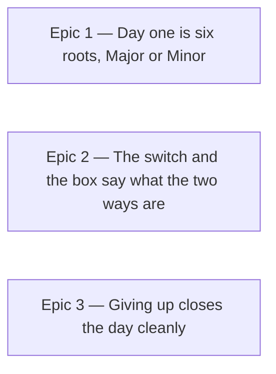

# Roadmap — Gentle first round

Source: [briefing.md](briefing.md)

## Overview

A first-time player opens Eardle and meets six roots and two names, Major or
Minor, instead of twelve roots and "Phrygian dominant". The switch that widens
the set stays on the card, says what it changes, and is named in the how-to-play
box so nobody has to find it. The moment the player touches the switch the
choice is theirs for good; a player with a preference already stored sees no
change at all. Two riders tidy the day's ending — the Check button reads
*Revealed* after a give-up and the answer panel stops saying the day is over —
and two lines swap rooms: the listening advice under the play button moves into
the hint box as its opening line, and the drum credit moves out of the
how-to-play box to the foot of the groove box.

Three epics, all independent, all in one wave. The order below is the order the
player would notice them, not the order they must be built.

## Epics

### Epic 1 — Day one is six roots, Major or Minor

**Visible when done:** Sam opens Eardle for the first time and the card offers
six roots and two mode names. Nobody told them about Simple mode; it is simply
where they start. Flip the switch once and tomorrow is whatever they picked.
A player who already has a stored preference — either way — sees exactly what
they saw yesterday.
**Depends on:** none
**Parallel with:** Epic 2, Epic 3

**Scope**
- First-time means no saved result at all — the "nothing saved" half of the
  test the how-to-play box uses, without its lapse clause. Such a player
  defaults to Simple, in `hooks/useSimpleMode.ts` and
  `lib/persistence/preferences.ts`.
- That default is written to the preference store on the first visit, so a
  player who never touches the switch is still in Simple on day two, once a
  result exists. Without the write, the "no result" rule would flip them.
- A player with results but no stored preference keeps the full set — they have
  a preference in practice, and the briefing says nothing changes for them.
- A lapsed player is not a first-time player. The how-to-play box comes back
  after 31 days; the six-root card does not.
- A stored `simpleMode` — `true` or `false` — always wins. Nothing migrates,
  nothing re-defaults.
- The same rule on the shared-groove route: it renders the same card through
  the same hook.
- No change to what Simple mode *is*: `simpleRootOptions` still deals six, the
  mode row is still `FAMILIES`, the solve and the reveal are unchanged.

**Out of scope**
- What the switch says (Epic 2).
- Naming the two ways to play in the how-to-play box (Epic 2).
- A third difficulty level, or any change for the trained musician's end of the
  scale — the briefing rules both out.

**Validation**
- Demo: empty `localStorage`, open the page → six root chips, two mode chips,
  switch on. Reload → same. Flip the switch off, reload → twelve roots, four
  modes. Seed `daily-groove:v1:prefs` with `simpleMode: false` and results →
  full set, untouched.
- `hooks/useSimpleMode.test.ts`: Simple for no results and no stored value;
  full set for results and no stored value; a stored value winning either way;
  the first-visit default being persisted; a lapsed player untouched.
- `lib/persistence/preferences.test.ts`: whatever the store gains to tell
  "never stored" from "stored false".
- A page-level test through `testing/renderFeature.tsx`: a fresh browser gets
  the six-root card; a seeded one gets what it had.

### Epic 2 — The switch and the box say what the two ways are

**Visible when done:** Sam reads on the switch what flipping it does — the
label still says "Simple mode", and a line beneath it says "Six roots, Major or
Minor" when on and "Twelve roots, four modes" when off. The how-to-play box names
both ways to play in one line under its four steps, so the switch is announced
before it is needed. Under the
play button the groove box is quiet; the hint box opens with "Loop it a few
times. Find the note that feels like home — Play along with your instrument, or
tap a root or a mode to hear it." The DrumGizmo credit sits at the foot of the
groove box, and the how-to-play box is four steps and the new line, nothing
else.
**Depends on:** none
**Parallel with:** Epic 1, Epic 3

**Scope**
- The design-system `Switch` gains an optional `description` line under its
  label, tested against its own contract in
  `src/components/controls/Switch.test.tsx`; it knows nothing about modes.
- `components/puzzle/ModeToggle.tsx` keeps `puzzle.simpleMode` as the label and
  passes a description that follows the state — on: "Six roots, Major or
  Minor", off: "Twelve roots, four modes" — from `src/lib/snippets/en/puzzle.ts`.
- One line under the four steps in `components/intro/HowToPlay.tsx`, from
  `src/lib/snippets/en/intro.ts`, naming both ways and the switch by its name.
  The four steps stay four; the `IntroSnippets` tuple does not grow.
- The caption leaves the groove card: `captionSoundsOn` / `captionSoundsOff`
  go, along with the `Text` under `PlayControl` in `GroovePuzzle.tsx`.
- The coaching ladder's first rung becomes the briefed sentence, in
  `src/lib/snippets/en/coaching.ts`, with a sounds-off variant that drops
  "or tap a root or a mode to hear it" the way today's caption does.
- The drum credit — "Drum samples provided by DrumGizmo.org · CC BY 4.0", both
  links intact — leaves `components/intro/HowToPlay.tsx` for the bottom of
  `components/puzzle/GrooveCard.tsx`; `intro.drumCredit` moves to the `puzzle`
  snippets with it.
- Every new string lands in `src/lib/snippets/en/` and its type in
  `snippets/types.ts`, per feature-21.

**Out of scope**
- Which set a first-time player starts in (Epic 1).
- A page footer. The **Footer** candidate in `specs/features.md` wanted the
  credit out of the how-to-play box; this epic does that, and the candidate row
  is left for the user to retire or keep.
- The rest of the coaching ladder — only the opening line changes.
- Any redesign of the how-to-play box beyond the added words.

**Validation**
- Demo: the card's switch reads its new words in both positions; open
  how-to-play → both ways are named and no credit line; the groove box shows
  the play button with nothing under it and the credit at its foot; the hint
  box's first line is the briefed sentence, and with tap sounds off it ends at
  "instrument."
- `components/puzzle/ModeToggle.test.tsx`, `src/components/controls/Switch.test.tsx`,
  `components/intro/HowToPlay.test.tsx` (the credit
  assertions move to `components/puzzle/GrooveCard.test.tsx` and keep their
  subject — same text, same two links).
- `components/GroovePuzzle.copy.test.tsx`: the caption assertions move to the
  hint box and keep their subject — the same sentence, now in the `Hint` aside.
- `lib/presentation/coaching.test.ts` or `index.test.ts`: rung one, sounds on
  and off.

### Epic 3 — Giving up closes the day cleanly

**Visible when done:** Sam gives up. The Check button reads *Revealed*, the way
it reads *Solved* after a solve, and the answer panel shows the mode and its
line without "given up · the day is over" beside it. The give-up itself, the
reveal and the streak rule are unchanged.
**Depends on:** none
**Parallel with:** Epic 1, Epic 2

**Scope**
- `lib/presentation/index.ts`: `revealed` takes precedence in the label chain
  and yields a new `coaching.checkRevealed` snippet; the button stays disabled.
- `components/solved/SolvedPanel.tsx`: the `revealed && …` text is removed;
  `solved.givenUp` goes from `snippets/en/solved.ts` and `SolvedSnippets`.
- `specs/features.md`: the two bullets under **Bugs** come out, and the section
  with them if it is then empty — the briefing owns them now.

**Out of scope**
- The near-miss line on a revealed day (`selectNearMiss` already handles it).
- Anything about how giving up is offered or armed.

**Validation**
- Demo: pick wrong twice, give up, confirm → button says *Revealed*, panel
  header is root + mode + mode line only.
- `lib/presentation/index.test.ts`: label and tone for `revealed: true` with
  and without a selection.
- `components/solved/SolvedPanel.test.tsx`: no "day is over" text when
  revealed.
- `components/GroovePuzzle.guessing.test.tsx`: the give-up path through the
  composed page.

## Dependency map

No arrows. Each epic is complete and demonstrable without the other two.

## Execution waves

- **Wave 1 (parallel):** Epic 1, Epic 2, Epic 3

Files more than one epic may touch, for `/writespec` to sequence rather than
split: `components/GroovePuzzle.tsx` (Epic 1 if the hook's wiring changes,
Epic 2 for the caption), `src/lib/snippets/en/coaching.ts` and
`snippets/types.ts` (Epic 2 rung one and the credit's move, Epic 3 the
*Revealed* string).

## Assumptions

- **Simple mode's content is untouched.** Six roots from `simpleRootOptions`,
  `FAMILIES` for the modes, the same solve and reveal — the briefing says "only
  fewer names to choose between", and nothing here reads otherwise.
- **The *Revealed* button keeps the idle tone.** "Similarly to showing solved"
  is read as the label pattern, not the green; a give-up should not look like
  a win. `/brainstorm` can overturn this cheaply.
- **The opening hint gets a sounds-off variant.** Today's caption has one that
  drops the tap clause; the sentence moving into the ladder keeps that
  behaviour, as every other rung with a tap instruction does.
- **The shared-groove route follows the same default.** It renders the same
  `GuessCard` through the same hook; a different rule there would be a second
  concept for no reason.
- **The Bugs section of `specs/features.md` is removed by Epic 3**, not by this
  roadmap — the removal belongs with the fix.
- **The credit keeps its two links and its faint small type.** It moves as a
  block; the groove box gains a line, not a footer.
