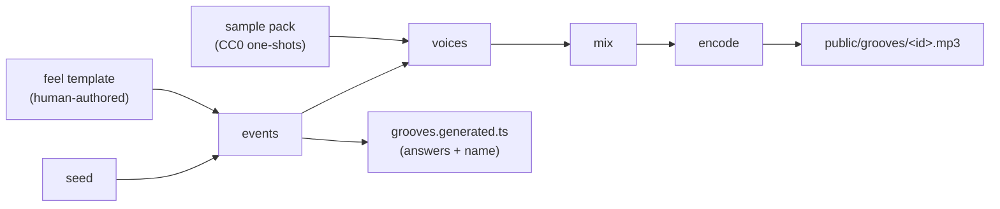

# PRD — Epic 1: Today's groove actually plays

Feature: [briefing.md](../briefing.md) · [roadmap.md](../roadmap.md)

## Summary

Make the app produce sound. A generator we own renders a 4-bar groove from a feel
template and a seed, using committed CC0 one-shot samples, and writes both the mp3
and the answers that describe it. This epic is the walking skeleton: one groove, end
to end, played straight but made of real recordings — and it pins the four contracts
the rest of the feature is built against.

## Problem

Feature-1 shipped the game against seven zero-byte `groove-NN.mp3` placeholders.
Pressing play today can only produce the audio-error banner, so the product's central
act — listen, then guess what you heard — has never once worked. Nothing downstream
is worth building until a real sound comes out.

## Scope

- An offline Node generator at `scripts/grooves/`, run with `npm run grooves`.
- The feel-template contract, the sample-pack interface, the pipeline stages, and the
  generated-manifest field set — the four contracts Epics 2–4 consume.
- A sourced, committed CC0 one-shot sample pack — complete enough for Epic 2, with
  velocity layers and round-robins — with per-file provenance, plus a placeholder pack
  the tests render against.
- Rendering one groove from the real pack to a committed mp3, and a committed metadata
  module that becomes the app's only source of groove data.
- A node-environment test project, so generator tests actually run.

**Out of scope**
- Sounding natural, funky or seam-free, and looping playback in the app — Epic 2.
- The feel templates themselves beyond the single one needed here, the full rotation,
  and retiring hand-written `seed.ts` — Epic 3.
- `grooves:add`, the build guard, and the quality gate — Epic 4.
- Any change to `selectGrooveForDate`, to how a date maps to a groove, or to the
  guessing UI.

## Requirements

**The generator**

- **R1** — `npm run grooves` renders every groove in the catalogue definition to
  `public/grooves/<id>.mp3` and writes the metadata module, with no arguments and no
  network access.
- **R2** — A groove is identified by `{ template, seed }`. Everything else about it —
  key, harmony, tempo, rhythm, name — is derived from those two values.
- **R3** — The same `{ template, seed }` always produces the same musical content:
  identical note events, identical metadata, and identical rendered PCM.
- **R4** — The generator runs offline against committed assets. It requires ffmpeg for
  encoding and nothing else.

**The four contracts**

- **R5** — A **feel template** declares what a human decides: tempo range,
  subdivision, swing amount, instrumentation, and the harmonic vocabulary a groove
  built from it may draw on. Epic 3 adds templates; it does not change their shape.
- **R6** — The renderer obtains its voices through a **sample-pack interface** — a
  declared mapping from voice name to sample files — never from hard-coded paths. Two
  packs satisfy it: the real CC0 pack, and a placeholder pack used by tests. The
  interface describes velocity layers and round-robin alternates from the outset, so
  Epic 2 consumes what the pack already declares rather than reshaping the contract.
- **R7** — The pipeline is four replaceable stages: **events** (template + seed → note
  events), **voices** (events + pack → per-track buffers), **mix** (tracks → one
  buffer), **encode** (buffer → mp3). Each stage is independently callable and
  independently testable, so Epic 2 can replace one without touching the others.
- **R8** — The generator emits `src/features/daily-groove/lib/grooves.generated.ts`
  exporting a `Groove[]`, where each entry carries `id`, `audioSrc`, `scale`, `chord`,
  `progression`, `root`, `flavour`, `tempo`, `bars`, and `name`. The module is
  committed and imported directly — never fetched at runtime.
- **R9** — `Groove` in `types.ts` gains `root`, `flavour`, `tempo`, `bars` and `name`.
  Existing fields keep their meaning and their format.

**The audio**

- **R10** — A rendered groove is exactly 4 bars long at its stated tempo, and contains
  drums, a bass line spelling the harmony's roots, and a chord comp.
- **R11** — The rendered audio is harmonically the thing its metadata claims: the
  chord and progression written to the manifest are the ones actually played.
- **R12** — Timing is straight and dynamics are flat. The groove is made of real
  recordings and is recognisably music, but it is not yet *played* — no swing, no
  velocity layers, no round-robins. Epic 2 is what makes it sound like a band.

**The name**

- **R13** — Each groove gets a name built by seeded pairing from a curated word list
  committed with the generator.
- **R14** — No generated name contains a note name or a mode name. A name that could
  identify the key or the flavour would hand the player the answer they are being
  asked to guess.

**The app**

- **R15** — The generated module is the app's only source of groove data. The
  hand-written `GROOVES` entries stop feeding the app and the seven placeholder mp3s
  stop being referenced, so no date can resolve to a groove that cannot play.
  `seed.ts` survives this epic only as the home of the distractor pools, which Epic 3
  retires with it.
- **R16** — Pressing play produces audio. The error/retry banner appears only on a
  genuine playback failure, never as the normal outcome.
- **R20** — The committed audio is rendered from the real CC0 pack. Placeholder-rendered
  audio is a test artifact and is never committed, so the epic is not complete until a
  real pack has been sourced and the groove genuinely sounds like music.

**Assets and tests**

- **R17** — Sample files live under `scripts/grooves/samples/`, are generation-time
  assets, and are never served to the browser.
- **R21** — The sourced pack is complete for the whole feature, not just this epic:
  multiple velocity layers per drum voice and round-robin alternates for the voices
  that repeat, plus the pitched instruments. Epic 1's renderer plays one sample per
  voice and leaves the rest unused, so that Epic 2 needs no second sourcing round.
- **R18** — Every sample file has a provenance record naming its source and licence.
  Only CC0 / public-domain material is committed.
- **R19** — Generator tests run in a node environment. The existing `src/**` jsdom
  test project is unaffected and every feature-1 test still passes.

## Behaviour details

The pipeline, and where each contract sits:

The answers and the audio leave the same stage. That is the whole point of generating
metadata rather than transcribing it: a groove's `chord` cannot drift from the chord
you hear, because the events that produced the sound also produced the word.

**Placeholder pack.** The placeholder pack contains synthesized one-shots generated by
the test suite itself — a click for each drum voice, a short tone for each pitched
voice. It exists so the pipeline is testable without binary fixtures, and so the code
can be written while the real pack is still being sourced. It is never what ships:
what gets committed is rendered from the real pack.

**A catalogue of one.** This epic's catalogue holds a single groove, so every date
resolves to the same one and the app plays it every day. That is what a walking
skeleton looks like here — it is better than six days in seven landing on silence, and
Epic 3 is what turns it into a rotation.

**What determinism is asserted on.** Two renders of the same template and seed produce
identical PCM. The mp3 is treated as an artifact of that PCM rather than as the thing
being verified, because mp3 encoders differ between ffmpeg builds and versions and a
byte-comparison of the encoded file would fail across machines for reasons that have
nothing to do with the music. No ffmpeg version is pinned.

## Acceptance criteria

- **AC1** (R1, R15, R16) — Given a clean checkout, when `npm run grooves` is run and
  the app is opened, then pressing play plays a 4-bar loop and no error banner appears.
- **AC2** (R3) — Given a fixed template and seed, when the events stage runs twice,
  then both runs produce identical note events.
- **AC3** (R3) — Given a fixed template and seed, when the full render runs twice,
  then both runs produce identical PCM buffers.
- **AC4** (R10) — Given a groove at tempo T, when it is rendered, then the buffer's
  duration equals 4 bars at T within one sample period.
- **AC5** (R10) — Given a rendered groove, when its buffer is inspected, then it is not
  silent, and each of the three tracks contributes non-zero signal.
- **AC6** (R11) — Given a rendered groove, when its note events are compared to its
  manifest entry, then the pitches played are the ones the `chord` and `progression`
  fields name.
- **AC7** (R8, R9) — Given the generated module, when it is type-checked against
  `Groove`, then every entry carries all ten fields and the project compiles.
- **AC8** (R13, R14) — Given any generated name, when it is checked against the note
  and mode vocabularies, then it contains neither.
- **AC9** (R6) — Given the placeholder pack, when the renderer runs against it, then it
  produces audio without a single code change from the real-pack path.
- **AC13** (R20) — Given the committed catalogue, when its render configuration is
  inspected, then it names the real pack and not the placeholder.
- **AC14** (R15) — Given the app, when it is searched for imports of the hand-written
  `GROOVES`, then none remain.
- **AC10** (R15) — Given every date in a full year, when the day's groove is resolved,
  then its `audioSrc` names a file that exists and is non-empty.
- **AC11** (R18) — Given the sample directory, when it is compared to the provenance
  record, then every file is listed and every listed licence is CC0 or public domain.
- **AC15** (R21) — Given the sourced pack, when its declaration is inspected, then each
  drum voice offers multiple velocity layers and the repeating voices offer round-robin
  alternates.
- **AC16** (R6, R21) — Given a pack declaring layers and round-robins, when Epic 1's
  renderer runs, then it renders correctly while using only one sample per voice.
- **AC12** (R19) — Given the test suite, when `npm test` runs, then generator tests
  execute in a node environment and all feature-1 tests still pass.

## Dependencies

**Needs before starting:** nothing in code — R6's interface and the placeholder pack
let the pipeline be written and tested immediately.

**Needs before finishing:** the real CC0 sample pack. This epic does not complete until
that audio is sourced and committed (R20), which makes the pack a hard prerequisite for
the whole feature, not a hand-off that can trail behind it. The interface still earns
its place: it decouples the *code* from the sourcing, just not the *release*.

**Hands to later epics:**
- The feel-template shape (R5) → Epic 3 authors more of them.
- The sample-pack interface (R6) and the fully-stocked pack (R21) → Epic 2 turns on the
  velocity layers and round-robins that are already there.
- The four pipeline stages (R7) → Epic 2 replaces `events`, `voices` and `mix`.
- The manifest field set and module path (R8) → Epics 3 and 4 extend the catalogue
  behind it.
- `npm run grooves` and its exit behaviour → Epic 4 builds `grooves:add` and the guard
  on the same entry point.

## Assumptions

- Output is 44.1 kHz mp3 at a fixed bitrate; the exact bitrate is a tuning detail, not
  a contract.
- The generator is written in TypeScript and run through the repo's existing toolchain,
  with tests colocated beside it in `scripts/grooves/` per `docs/testing.md`.
- Deleting `src/features/daily-groove/` leaves `scripts/grooves/` and `public/grooves/`
  orphaned. This is accepted: a Node audio renderer does not belong inside a browser
  feature slice.
- `npm run grooves` regenerates everything it knows about. Incremental and additive
  behaviour is Epic 4's concern.
- The mp3's exact bytes are not part of any contract, so ffmpeg is free to differ
  between machines. Epic 4's build guard compares checksums recorded when a groove was
  minted rather than re-rendering, so it is unaffected by this.
- Pitched voices are sampled sparsely and pitch-shifted a few semitones either side of
  each source note, rather than one sample per note.

## Question log

### Cycle 1 — 2026-08-29

**Q1. Epic 1 renders one groove, but the app has seven seeded ones. What does the app play in the meantime?**
Answer: **A) The generated module replaces the catalogue entirely** — one source of
groove data means no date can land on a placeholder.
Applied to: R15, AC10, AC14, Behaviour details ("A catalogue of one")

**Q2. The real CC0 pack is a human hand-off. Is Epic 1 done before it arrives?**
Answer: **B) No — Epic 1 is only done when real audio is committed and the app
genuinely sounds like music.** Overrides the roadmap's line that sourcing "does not
block the code": it does not block the code, but it does block the epic.
Applied to: Summary, Scope, R12, R20, AC13, Dependencies

**Q3. "Byte-identical output" — mp3 encoders differ between ffmpeg versions. What actually gets asserted?**
Answer: **A) Determinism is asserted on the pre-encode PCM** — the strongest claim that
holds across machines.
Applied to: R3, AC3, Behaviour details ("What determinism is asserted on"), Assumptions

### Cycle 2 — 2026-08-29

**Q4. Epic 1 now blocks on a sourced pack, and Epic 2 needs a richer one. How much gets sourced now?**
Answer: **A) Source the full Epic 2-ready pack now** — one sourcing effort instead of
two, on a path that is already critical.
Applied to: R6, R21, AC15, AC16, Scope, Dependencies

---

**This PRD is settled.** No high-impact questions remain.
