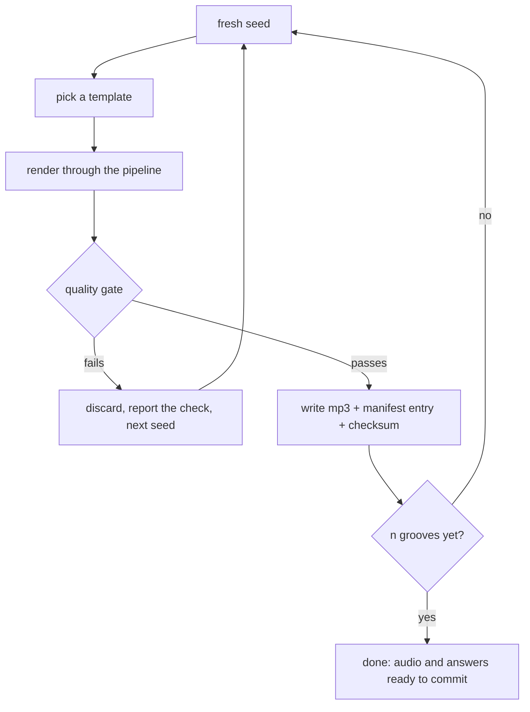

# PRD — Epic 4: One command adds grooves, and the build won't ship a broken one

Feature: [briefing.md](../briefing.md) · [roadmap.md](../roadmap.md)

## Summary

Make the catalogue grow without anyone hand-editing a file, and make it impossible to
ship a broken one. `npm run grooves:add <n>` mints new grooves from fresh seeds,
checks them automatically, and commits the audio and answers together. The build then
verifies that what is committed is what the generator would produce — and fails if a
groove is stale, missing or silent.

## Problem

The briefing asks for "a way to add more grooves (e.g. on every build)". Since the
artifacts are committed, a build cannot add anything; what it can do is guarantee that
what was added is intact. And the failure this feature exists to prevent has already
happened once: seven zero-byte mp3s shipped, and nothing noticed.

## Scope

- `npm run grooves:add <n>` — minting from fresh seeds.
- An automated quality gate that rejects a bad render before it enters the catalogue.
- The freeze rule that keeps existing grooves stable.
- A build guard that verifies committed artifacts.
- Documentation for adding, regenerating and reviewing grooves.

**Out of scope**
- Sound quality — Epic 2.
- The initial catalogue and the templates — Epic 3.
- Any admin UI, runtime generation endpoint, or CI job that commits on its own.
- Human curation of minted grooves; the gate is automated.

## Requirements

**Minting**

- **R1** — `npm run grooves:add <n>` adds exactly `n` grooves to the catalogue, each
  from a fresh seed inside an existing template, and writes their audio and their
  manifest entries.
- **R2** — The command edits no file by hand and requires no follow-up edit. After it
  runs, the working tree contains everything needed for the new grooves to play.
- **R3** — A newly minted groove never reuses an existing `id` or an existing seed.
- **R4** — Minting distributes new grooves across the available templates rather than
  piling them onto one.

**The quality gate**

- **R5** — A minted groove enters the catalogue only if it passes every automated
  check: harmony valid for its flavour, peak and loudness in range, note density
  within its template's bounds, and a clean loop seam.
- **R6** — A groove that fails any check is discarded and never written to the
  catalogue or to disk.
- **R7** — When a candidate is rejected, the command reports which check failed, moves
  to the next seed automatically, and continues until `n` grooves have passed. A
  rejection never stops the run and never waits for a human.
- **R8** — If the command cannot produce `n` passing grooves within a bounded number of
  attempts, it fails loudly rather than silently adding fewer.

**The freeze**

- **R9** — The freeze begins when this feature's final epic merges, whether or not
  anything has been deployed. From that merge, a groove in the catalogue is frozen: its
  `id`, its audio and its answers do not change, and adding grooves never re-renders,
  renumbers or re-answers an existing one. Before it, Epics 1–3 re-render freely — the
  renderer is still being built, and Epic 2 exists precisely to change how every groove
  sounds.
- **R10** — Removing a groove from rotation does not renumber the others.

**The build guard**

- **R11** — The build verifies, before producing a bundle, that every groove the
  manifest names has an audio file on disk that is non-empty and matches the checksum
  recorded when that groove was minted. Checksums are written by the same run that
  writes the audio and are committed alongside the manifest.
- **R12** — The build fails, with a message naming the offending groove and the reason,
  when a file is missing, empty, or does not match what was committed.
- **R13** — The guard requires no audio toolchain. It inspects committed artifacts; it
  does not render.

**Documentation**

- **R14** — `public/grooves/README.md` and the generator's own documentation state how
  to add grooves, how to regenerate, what is committed, and why.

## Behaviour details

Minting one groove, including the rejection path:

**Why the guard compares checksums rather than re-rendering.** A re-render would need
ffmpeg and the sample pack on every CI runner, would be slow, and would fail for a
reason that has nothing to do with the catalogue: mp3 encoders differ between ffmpeg
builds, and Epic 1 deliberately asserts determinism on the pre-encode PCM rather than
on the encoded file. A checksum recorded at mint time sidesteps all of that and still
catches every failure this epic names — missing, empty, stale, or corrupted.

**When the freeze starts.** A frozen groove and an improving renderer cannot coexist,
and during Epics 1–3 the renderer is the thing being built. So the freeze begins at the
merge of the feature's last epic rather than at mint — a repository event, visible in
history, that does not wait on a deploy. Under the serialized wave order that last epic
is Epic 3, which lands after this one: this epic writes the rule, and the merge that
completes the catalogue is what switches it on. Until then, re-rendering the whole
catalogue is a normal operation; afterwards it is a breaking change to a player's
history.

**What "on every build" became.** The briefing's phrasing assumed generation happened
at build time. It does not: artifacts are committed, so a build has nothing to add.
The build's job is the other half of the same intent — making sure the catalogue it is
about to ship is whole. Adding is a command a person runs; verifying is what happens
every time.

## Acceptance criteria

- **AC1** (R1, R2) — Given a catalogue of size N, when `grooves:add 3` is run, then the
  catalogue has N+3 entries and all three new grooves play in the app with no further
  edit.
- **AC2** (R3) — Given an existing catalogue, when new grooves are minted, then no new
  `id` or seed collides with an existing one.
- **AC3** (R4) — Given several templates, when a batch is minted, then the new grooves
  are spread across more than one.
- **AC4** (R5, R6) — Given a candidate that clips, is silent, has invalid harmony, or
  has a discontinuous seam, when it is minted, then it is rejected and appears in
  neither the catalogue nor `public/grooves/`.
- **AC5** (R7) — Given a rejected candidate, when the command reports, then the output
  names the failed check.
- **AC6** (R8) — Given a template that cannot yield a passing groove, when
  `grooves:add` is run, then the command exits non-zero and the catalogue is unchanged.
- **AC7** (R9) — Given an existing catalogue, when new grooves are minted, then every
  pre-existing entry's `id`, answers and audio bytes are unchanged.
- **AC13** (R7) — Given a run in which several candidates are rejected, when it
  completes, then it produced exactly `n` grooves without any human input.
- **AC8** (R11, R12) — Given a manifest entry whose audio file is missing, when the
  build runs, then it fails and names that groove.
- **AC9** (R11, R12) — Given a zero-byte audio file, when the build runs, then it fails
  and names that groove — the check that today's placeholders would not survive.
- **AC10** (R11, R12) — Given an audio file whose checksum does not match the committed
  one, when the build runs, then it fails and names that groove.
- **AC11** (R13) — Given an environment with no ffmpeg and no sample pack, when the
  build runs against an intact catalogue, then the guard passes.
- **AC12** (R14) — Given the documentation, when a newcomer follows it, then they can
  add a groove without reading the generator's source.

## Dependencies

**Needs before starting:** Epic 1's `npm run grooves` entry point, manifest contract
and pipeline stages. `grooves:add` is a second entry point over the same machinery.

**Needs from Epic 2 and Epic 3, but not to start:** the gate's thresholds (Epic 2's
peak ceiling and seam constants) and the templates to mint from (Epic 3). The gate can
be built against Epic 1's single template and have thresholds substituted when they
land; AC3, which asks for grooves spread across templates, can only be verified once
Epic 3's four templates exist.

Epics 2 and 3 are serialized against each other, but this epic is independent of both:
it touches the CLI, the gate and the guard rather than the catalogue's sound, so it can
run alongside Epic 2.

**Hands on:** nothing — this is the last epic in the feature.

## Assumptions

- Checksums live alongside the manifest, generated by the same run that writes the
  audio, so the guard has something committed to compare against. They cover the mp3 as
  committed, which is why the guard is unaffected by ffmpeg differing between machines.
- The guard runs as a `prebuild` step and in CI, and is a plain node script with no
  dependency on the audio toolchain.
- `grooves:add` writes into the working tree and leaves committing to the person who
  ran it. It does not touch git.
- Seeds are drawn so that reruns do not collide; the exact scheme is an implementation
  detail behind R3.
- "Bounded number of attempts" in R8 is a constant chosen during implementation.

## Question log

### Cycle 1 — 2026-08-29

**Q1. R9 freezes a groove's audio forever — but Epic 2 changes the renderer, which re-renders everything. When does the freeze begin?**
Answer: **A) The freeze begins when the feature ships** — during Epics 1–3 grooves are
re-rendered freely as the renderer improves.
Applied to: R9 (rewritten), Behaviour details ("When the freeze starts")

**Q2. What does the build guard actually compare?**
Answer: **A) Committed checksums** written when the groove was minted — satisfies
R13's no-toolchain rule and catches every failure mode the epic names.
Applied to: R11, Behaviour details ("Why the guard compares checksums"), Assumptions

**Q3. What is a "clean" rejection when the gate turns a candidate down?**
Answer: **A) Skip that seed and try the next one automatically**, up to a bounded
number of attempts.
Applied to: R7, AC13

### Cycle 2 — 2026-08-29

**Q5. R9 begins at "ship". What event is that, concretely?**
Answer: **B) The merge of this feature's last epic**, regardless of deployment — a
repository event rather than a release one. Under the serialized wave order that is
Epic 3's merge.
Applied to: R9, Behaviour details ("When the freeze starts")

---

**This PRD is settled.** No high-impact questions remain.
