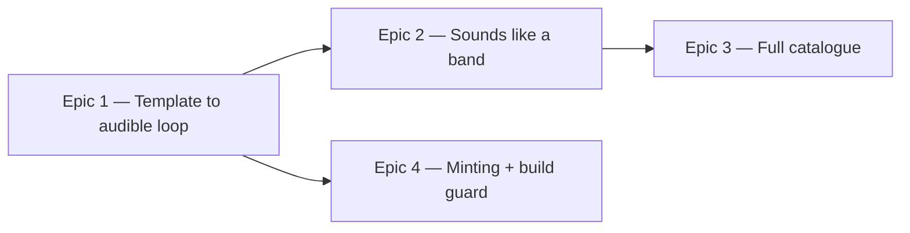

# Roadmap — Groove generation

Source: [briefing.md](briefing.md)

> **Settled.** Q1–Q5 and NQ1–NQ4 are all answered — every recommendation taken —
> and no open questions remain. The sound comes from a curated CC0 one-shot pack
> committed to the repo and rendered offline (Q1=A, Q2=A, NQ1=A); grooves are minted
> from seeds inside hand-authored feel templates (Q3=A); jamming is an audio property,
> not a UI feature (Q4=A); the generator writes down everything it knows about a
> groove including a seeded, answer-safe name (Q5=A, NQ4=A); `grooves:add` is run by a
> human and committed while the build only verifies (NQ2=A); and minted grooves are
> auto-accepted behind automated musical and audio checks (NQ3=A).
>
> One human hand-off remains, called out in Epic 1: someone has to actually source the
> CC0 pack. The pipeline is built against a placeholder pack so that sourcing never
> blocks the code.

## Overview

Feature-1 shipped the game against seven **empty** `groove-NN.mp3` placeholders, so
pressing play today produces the error banner and nothing else. This feature makes
sound: an offline generator we own renders a groove — a feel template plus a seed —
from committed CC0 samples into a 4-bar mp3, and writes the answers next to it.
Epic 1 is the thinnest end-to-end path from template to audible loop and pins the
contracts; Epic 2 then thickens the *sound* (natural, funky, seamless to jam over),
Epic 3 thickens the *catalogue* (a real rotation whose answers come from the rendered
audio), and Epic 4 makes minting new grooves a one-command job the build defends.
Epics 2–4 run in parallel.

## Epics

### Epic 1 — Today's groove actually plays

**Visible when done:** Pressing play makes music. A real 4-bar loop — drums, bass
and a chord comp in the day's key — comes out of the speakers instead of the
audio-error banner, and it was rendered by our own generator, not dropped in by hand.

**Depends on:** none
**Parallel with:** none — it pins the contracts the other three build against

**Scope**
- The generator as an offline Node tool (`scripts/grooves/`), run with
  `npm run grooves`: feel template + seed → note events → sampled voices → mix →
  WAV → mp3 in `public/grooves/`, encoded with ffmpeg. Output is committed (Q2=A).
- **The committed CC0 sample pack** rides along here (Q1=A, NQ1=A): a curated set of
  one-shots under `scripts/grooves/samples/` — generation-time assets, never served to
  the browser — plus a provenance record naming the source and licence of every file.
- **A sample-pack interface** in front of it, so the renderer loads voices through a
  declared contract rather than hard-coded paths. The pipeline is therefore built and
  tested against a placeholder pack, and the real one drops in without a code change.
  Sourcing the pack is the feature's one human hand-off; it does not block the code.
- **The feel-template contract**, pinned here (Q3=A): a template fixes what a human
  decides — tempo range, subdivision, swing, instrumentation, harmonic vocabulary —
  and a seed fixes the rest. `{ template, seed }` is what identifies a groove;
  everything else is derived.
- **The generated manifest contract**, pinned here and carrying the full field set
  (Q5=A): `id`, `audioSrc`, `scale`, `chord`, `progression`, `root`, `flavour`,
  `tempo`, `bars`, `name` — the last being a seeded pairing from a curated word list
  (NQ4=A), which by construction cannot contain a root or a flavour and so cannot leak
  the answer. Emitted to
  `src/features/daily-groove/lib/grooves.generated.ts` — committed, imported, no
  runtime fetch. `types.ts` grows these fields rather than changing existing ones.
- **The pipeline stages as replaceable interfaces** — events, voices, mix, encode —
  so Epic 2 can swap the innards of one stage without touching the others.
- Enough instrument to *state the harmony*: kick/snare/hat, a bass line spelling the
  roots, a chord comp. Straight timing, flat dynamics, one sample per voice — it will
  sound mechanical, and Epic 2 is what fixes that. It must be audible, in time, and
  harmonically the thing the answer claims it is.
- Determinism from day one: the same template and seed render byte-identical audio
  and identical metadata.
- Replace `public/grooves/README.md`'s placeholder story with the real one.

**Out of scope**
- Sounding natural, funky, or seam-free — Epic 2.
- The full rotation and retiring hand-written `seed.ts` — Epic 3.
- Minting new grooves and the build guard — Epic 4.
- Any change to `selectGrooveForDate` or to how the app picks the day's groove.

**Validation**
- Demo: `npm run grooves` → `npm run dev` → press play → you hear a 4-bar loop, and
  the answer revealed after guessing is the harmony you just heard.
- Unit tests colocated with the generator: note events land on the grid; template +
  seed → events is deterministic; the rendered buffer's duration matches tempo × bars;
  the buffer is not silent.
- A regeneration test: running the generator twice produces identical bytes.
- Every sample in the pack is accounted for in the provenance record.
- A test that no generated name contains a root or flavour token — the constraint that
  keeps the name from spoiling the puzzle.
- Every feature-1 test still passes.

### Epic 2 — Grooves that sound like a band, and loop forever

**Visible when done:** The same groove now sounds played rather than programmed —
swing, dynamics, real timbres, a balanced mix — and the app repeats it with no
audible seam, so you can pick up any instrument and play over it for a few minutes
without fighting it.

**Depends on:** Epic 1 (template + pipeline stages)
**Parallel with:** Epic 3, Epic 4

**Scope**
- Instrument voices: the full sampled kit, bass and comp — velocity layers and
  round-robins so repeated hits aren't machine-gun identical, which is most of what
  "natural" means in a sampled renderer.
- Feel: swing ratio, micro-timing humanization, velocity dynamics, ghost notes,
  note lengths; funk idioms — 16th-note hats, syncopated bass, off-beat comping.
- Arrangement rules that keep it jammable for **every** instrument: backing-track
  texture with no lead melody competing for the tune, registers left open, one
  steady tempo, harmony clearly enough voiced to be guessable by ear.
- Mix and master: per-track level and pan, light bus glue, peak normalization, and
  consistent perceived loudness from one groove to the next.
- The loop seam: tails wrapped around the loop point, downbeat alignment, and
  encoder settings that don't introduce mp3 padding gaps.
- **Looping playback in the app** (Q4=A): `createAudioPlayer` gains a loop so the
  groove repeats until stopped. This is the whole of "jam with the groove" on the app
  side, and it belongs here because a seam is only observable on repeat.

**Out of scope**
- Variety across the catalogue — Epic 3. This epic makes *one* groove sound right;
  the rules it lands then apply to all of them.
- Any jam UI beyond looping — no count-in, no click, no chart, no download (Q4=A).
- Minting and the build guard — Epic 4.

**Validation**
- Demo: press play and leave it running for two minutes while playing along on an
  instrument — no seam, no drift, and the chords under your hands are the stated ones.
- Unit tests: humanization stays within its declared bounds and is seed-deterministic;
  swing displaces the right subdivisions; the mix never clips; seam energy between
  the loop's last and first samples is below threshold.
- The player loops and still stops cleanly; tested through the feature's behaviour.
- A recorded human listening check — this is the one criterion tests cannot assert,
  and the roadmap says so rather than pretending otherwise.

### Epic 3 — A full rotating catalogue whose answers come from the audio

**Visible when done:** Seven days running give seven genuinely different grooves —
different keys, modes, chord qualities and feels — and the answer the app scores you
against is the one that was actually rendered, because both came out of the same
generator run.

**Depends on:** Epic 1 (template + manifest contract)
**Parallel with:** Epic 2, Epic 4

**Scope**
- **The feel templates** — the hand-authored half of Q3=A. Enough distinct feels
  (straight funk, half-time, shuffle, and so on) that the rotation doesn't feel like
  one groove in twelve keys, each with its harmonic vocabulary and tempo range.
- The catalogue itself: template × seed combinations spanning keys, modes, chord
  qualities, progressions, tempos and feels.
- **Cover feature-2's eight flavours** — Major, Minor, Dorian, Mixolydian, Lydian,
  Phrygian, Harmonic minor, Blues — with at least one groove each. feature-2's NQ2
  exists only because today's seven hand-written grooves miss two of them and add a
  ninth (locrian); a generated catalogue makes that mismatch disappear rather than
  forcing a re-key.
- Metadata generated *alongside* the audio: `GROOVES` and the distractor pools come
  out of the generator, so an answer can never drift from its mp3. Hand-written
  `lib/seed.ts` retires; `buildOptions` and `selectGrooveForDate` keep working
  against the generated module unchanged.
- Musical guard rails: a groove's chord and progression genuinely belong to its
  stated scale; distractors are plausible but wrong; ids and `audioSrc` are unique.
- Delete the empty placeholder mp3s they replace.

**Out of scope**
- How good it sounds — Epic 2 owns the voices, feel and mix for every groove here.
- Growing the catalogue after this first pass — Epic 4.
- Changing the date → groove mapping; feature-1's hash-by-date selection stays.

**Validation**
- Demo: step the system clock across a week and hear a different groove each day,
  each scoring against the harmony you heard.
- Unit tests: every entry's chord and progression are diatonic to its scale; ids and
  `audioSrc` unique; each pool contains its correct values plus enough distractors
  for `buildOptions`; `selectGrooveForDate` reaches the whole set; every flavour the
  game offers has at least one groove behind it.
- A test that every referenced mp3 exists **and is non-empty** — the check that would
  have caught today's zero-byte placeholders.

### Epic 4 — One command adds grooves, and the build won't ship a broken one

**Visible when done:** Running one command mints new grooves and they appear in the
rotation the same day, with the audio and answers committed alongside the code. Every
groove already in the catalogue is untouched, so yesterday's result still means what
it meant — and a build that would ship a stale, missing or silent groove fails
instead of shipping it.

**Depends on:** Epic 1 (generator CLI + manifest contract)
**Parallel with:** Epic 2, Epic 3

**Scope**
- The CLI for growth: `npm run grooves:add <n>` mints grooves from fresh seeds inside
  the existing templates (Q3=A), writes the mp3s and extends the manifest — no file
  hand-editing anywhere in the process.
- **The build guard**, which is what the briefing's "on every build" becomes once
  artifacts are committed (Q2=A, NQ2=A): a `prebuild`/CI check that the committed
  manifest matches what the generator produces, that every referenced mp3 exists and is
  non-empty, and that nothing drifted. It verifies; it does not generate.
- **Stability as a hard rule:** once minted, a groove's id, audio and answers are
  frozen. Regeneration never re-renders, re-numbers or re-answers an existing
  groove — a player's stored history stays valid forever.
- **Automated quality gating, then auto-accept** (NQ3=A): a minted groove enters the
  rotation only if it passes the checks that are actually machine-detectable — harmony
  valid against its stated scale, peak and loudness in range, note density inside the
  template's bounds, and a clean loop seam. A groove that fails is rejected and the
  seed is skipped; minting stays hands-off and nothing unheard-of ships silently
  broken.
- Docs: how to add grooves, how to regenerate, what is committed and why.

**Out of scope**
- Sound quality — Epic 2.
- The initial catalogue and the templates themselves — Epic 3.
- Any admin UI or runtime generation endpoint.

**Validation**
- Demo: run `grooves:add 3` → three new grooves appear in the rotation and play; run
  the generator again → nothing changes; delete an mp3 and the build fails saying so.
- Tests: existing entries are byte-stable across a regeneration; new seeds never
  collide with existing ids; the manifest stays valid as it grows; the guard fails on
  a stale manifest, a missing file and a zero-byte file.
- Gate tests: a deliberately out-of-range render (clipped, silent, harmonically wrong)
  is rejected rather than admitted to the catalogue.

## Dependency map

## Execution waves

- **Wave 1:** Epic 1 — pins the feel-template contract, the pipeline stages, the CLI
  surface and the generated-manifest field set, and lands the sample pack.
- **Wave 2 (parallel):** Epic 2 and Epic 4 — the renderer's sound, and the minting
  command and build guard, which touch different files.
- **Wave 3:** Epic 3 — mints the catalogue through a finished renderer.

Epic 3 was originally planned alongside Epic 2, but the two both rewrite the committed
audio, so they are serialized (Epic 2's PRD, Q3). Minting after the renderer is final
also means nothing in the catalogue needs re-rendering later.

Wave 2 can start before Epic 1 finishes if the four contracts are frozen on day one.
Leave them floating and both streams wait on one.

**One caveat on Epic 1's completion:** the epic is not done until the real CC0 pack is
sourced and its audio committed (Epic 1's PRD, Q2), so the sample pack sits on the
critical path rather than trailing behind it.

## Assumptions

- **The generator is an offline build-time Node tool, not a feature slice.** It lives
  in `scripts/grooves/` with colocated tests and never enters the client bundle. Its
  outputs — the mp3s and the generated TS manifest inside the feature's `lib/` — are
  committed (Q2=A). Consequence, stated plainly: deleting `src/features/daily-groove/`
  leaves `scripts/grooves/` and `public/grooves/` orphaned. That is accepted; putting a
  Node audio-rendering tool inside a browser feature slice would be worse.
- ffmpeg is the encoder (already present on this machine). The build guard must
  therefore not require ffmpeg — it checks committed artifacts, it doesn't render.
- Only CC0 / public-domain audio assets get checked in — nothing carrying an
  attribution or redistribution burden. Provenance is recorded per sample.
- **What the pack needs to contain**, so whoever sources it knows the target: a drum
  kit (kick, snare, closed and open hat, and a rim or ghost-snare layer), an electric
  bass, and one comping instrument — electric piano or clean guitar. Several velocity
  layers per drum voice, since that is where most of "natural" comes from in a sampled
  renderer.
- **Pitched instruments are sampled sparsely and pitch-shifted** a few semitones either
  side of each source note, the standard sampler trade-off: a handful of samples per
  instrument rather than one per note, kept inside a range narrow enough that shifting
  doesn't turn audibly artificial.
- The name word list is curated and committed with the generator, and is checked to
  contain no note names or mode names — the constraint, not just the intent, lives in
  a test.
- Repo weight is acceptable: a 4-bar loop is roughly 10 seconds, ~150 KB at 128 kbps,
  so even a few dozen grooves plus a sample pack stay in single-digit MB.
- Deterministic by construction: template + seed in, identical bytes out. This is what
  lets the answers be generated rather than transcribed.
- 4 bars per the briefing, one tempo per groove, no count-in, no stems, mp3 only.
- Initial catalogue target ~12–16 grooves — comfortably more than today's 7 and enough
  for the rotation to feel varied before Epic 4 starts growing it.
- feature-1's date → groove mapping is untouched throughout.
- Replacing the seven seeded grooves invalidates any stored history; feature-2 is
  already version-bumping storage for a clean break and the app is pre-release, so
  nobody loses a streak.
- "Sounds natural" is judged by a human listening; the tests cover structure,
  determinism, levels and seams, not taste.
- **feature-2 runs in parallel and is rewriting the game** to root + flavour with
  attempts. It derives answers from `Groove.scale`, keeps `chord`/`progression` as
  reveal-only data (its NQ3), and deferred the design's missing data — name, BPM, bar
  count — to "a follow-up feature to enrich the groove data" (its Q2=D). **This is
  that feature**, and Q5=A means the generator now supplies exactly that data.
- The two features touch different files — feature-2 owns `components/`, `hooks/` and
  the store; this one owns `scripts/grooves/` and the generated data module. The one
  shared file is `types.ts`, where `Groove` grows fields rather than changing existing
  ones.
