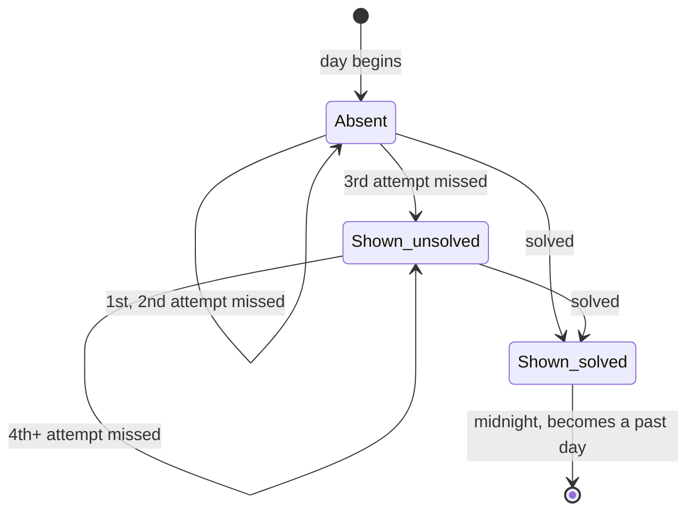

# PRD — Epic 4: Today joins the played row as soon as it's done

Feature: [briefing.md](../briefing.md) · [roadmap.md](../roadmap.md)

## Summary

Today's groove currently only reaches "Grooves you've played" the following
morning. This epic lets it appear the moment the day is finished — solved, or
three attempts spent — as the first card in the row, labelled "Today", and
updates that card in place if a later attempt solves the day.

## Problem

Finishing the day's groove produces no change in the row that records the days
you've played. The row is filtered to `date < today`, so the day you just spent
is the one day it will not show you, and the count beside it is short by one
until midnight. The player's most recent result is the one the page is least
willing to acknowledge.

## Scope

- When today's record becomes an archive entry.
- Today's card label and position in the row.
- Updating that card in place when the day's outcome changes.
- The empty state, when today's card is the only one.

**Out of scope**
- Playing an archive card back — Epic 5.
- Any attempt cap, day lock, or "out of tries" state. Three spent attempts makes
  the day *showable*, never *over*; the puzzle above stays playable.
- An archive route, an "All →" link, a count, or paging beyond the week shown.
- Any change to `GroovePuzzle`. The full result set including today's record is
  already handed to `toArchiveEntries`, so the whole rule lives in `lib/`, which
  is what lets this epic run beside Epic 2.

## Requirements

- **R1** — Today's record becomes an archive entry once the day is solved, or
  once three attempts have been spent on it, whichever comes first.
- **R2** — A today record with fewer than three attempts and no solve produces
  no archive entry.
- **R3** — Today's entry sorts first in the row, ahead of every past day.
- **R4** — Today's entry is labelled "Today".
- **R5** — Spending a third attempt does not end the day. The puzzle above stays
  playable, and further attempts are still recorded.
- **R6** — When a later attempt solves a day already showing in the row, its
  card changes outcome in place. Its position does not change.
- **R6a** — Today's entry does not display its answer while the day is unsolved.
  The puzzle above is still winnable, and the row must not give away what the
  page is still asking the player to name. The answer appears on the card the
  moment the day is solved.
- **R6b** — Today's entry, while shown and unsolved, is marked "In play" — not
  "missed", which would state something untrue of a day that can still be won.
  On solving, the mark becomes the ordinary solved mark.
- **R6c** — R6a and R6b apply only to today. A past day that was never solved is
  a miss and shows its answer, because it can no longer be played.
- **R7** — The empty state ("No grooves behind you yet…") does not render when
  today's card is present. It renders only when the row has no entries at all.
- **R8** — The row shows at most seven days — one week — and nothing beside the
  heading counts the rest. Days older than that fall off the row entirely rather
  than being summarised.
- **R9** — Today's card is a normal card in the same seven-card grid, taking one
  of the seven slots.
- **R10** — Past days behave exactly as they do today: a past record that was
  never solved is a miss, derived at read time, with nothing running at midnight
  to close a day out.

## Behaviour details

Today's card has a lifecycle no past card has — it can appear mid-day and then
change while the player is looking at it.

`Shown_unsolved` is the state that does not exist for any past day: the card is
in the row while the puzzle above is still winnable. It is the one state in
which a card withholds its answer — it shows the day, the mark "In play", and a
placeholder where the answer will go. Every other card in the row, today's
included once solved, prints its answer as before.

That asymmetry is the point. A past miss shows its answer because the day can
never be replayed and withholding it would mean the player never learns it. An
unsolved today is the opposite case: the day is still winnable, so the answer is
the one thing the card must not say.

Whether a day is "finished" is derived from the record on every read — attempt
count and solved flag — never stored as a status. That is what keeps R6 free:
the card re-derives after the solve like any other render.

## Acceptance criteria

- **AC1** (R1, R4) — Given today's record is solved on the first attempt, when
  archive entries are derived, then the first entry is today's, labelled "Today".
- **AC2** (R1) — Given today's record has three attempts, none correct, then an
  entry for today exists.
- **AC3** (R2) — Given today's record has two attempts, none correct, then no
  entry for today exists.
- **AC4** (R2) — Given today's record has no attempts, then no entry for today
  exists.
- **AC5** (R3) — Given today is finished and two past days exist, then the
  entries are ordered today, yesterday, the day before.
- **AC6** (R6) — Given today's entry exists with three missed attempts, when a
  fourth attempt solves the day, then the entry's outcome changes and it is
  still first.
- **AC6a** (R6a) — Given today's entry exists with three missed attempts, when
  it renders, then neither the day's root nor its flavour appears anywhere in
  the row.
- **AC6b** (R6a) — Given that entry, when a later attempt solves the day, then
  the answer appears on the card.
- **AC6c** (R6b) — Given today's entry exists and is unsolved, then its mark
  reads "In play"; when the day is solved, then the mark reads as a solved day's
  does.
- **AC6d** (R6c) — Given a past day that was never solved, then its answer is
  shown and its mark reads "missed".
- **AC7** (R5) — Given three attempts have been spent and the day is unsolved,
  then the guessing card is still interactive and a fourth attempt is recorded.
- **AC8** (R7) — Given today's entry is the only entry, when the strip renders,
  then the cards render and the empty-state text does not.
- **AC9** (R7) — Given no entries at all, then the empty-state text renders.
- **AC10** (R8, R9) — Given today's entry plus seven past days, then seven cards
  render, today first, and no "All N" text appears anywhere in the row.
- **AC11** (R10) — Given a past day that was never solved, then its entry is a
  miss and shows its answer.

`lib/archive.ts` is logic and is asserted directly; `ArchiveStrip` is asserted
through rendered output, both colocated in the feature.

## Dependencies

Depends on nothing. Hands two things to Epic 5, which owns the same files
afterwards:

- `ArchiveEntry` keeps `date`, which is what Epic 5 resolves a groove from when
  a record carries no groove id.
- The card layout Epic 5 renders its small play control into.

## Assumptions

- Three is the attempt count that makes a day showable, matching the three dots
  the guessing card has always drawn.
- An unsolved today's card renders a muted placeholder where the answer would
  be, so it keeps the same height as its neighbours and the grid does not
  ragged.
- The section label "Grooves you've played" is unchanged; today counts as played
  once it is finished.
- Today's card takes one of the seven visible slots rather than being shown in
  addition to them.
- A record's answer is read off the record, never off the last guess, exactly as
  now.

## Amendments

Changes made after the epic was implemented and verified, at the user's request.
Recorded here so the requirements above stay the source of truth rather than
drifting from the code.

### 2026-08-30 — the card names its groove

Each archive card now shows the groove's display name beneath the answer, so the
row says *which* groove a day was as well as what it turned out to be.
`ArchiveStripEntry` gained an optional `grooveName`, supplied by `GroovePuzzle`
from the groove it already resolves for the play control; a day whose groove has
left the catalogue simply omits the line.

Checked against R6a: the name is safe on an unsolved today. A name like "Sunroom
Shuffle" carries nothing about the root or the flavour, so it does not undo the
masking — and a test asserts exactly that, with the answer still absent from the
card while the name renders.

### 2026-08-30 — one week, no count

The row now shows **seven** days instead of six, and the "All N" count beside
the heading is removed. R8, R9, AC10, the out-of-scope list and the assumptions
were rewritten to match; `SHOWN` moved 6 → 7, `MiniCardGrid` widened to
`lg:grid-cols-7` so a week fits one row, and `ArchiveStrip`'s `total` prop was
dropped along with the value it displayed.

The count existed to stand in for days the row could not show. With a week as
the deliberate limit there is no remainder to summarise, so the count was
reporting a number nothing acted on. Two tests that asserted it were retired and
replaced by assertions that no count renders — the coverage moved rather than
disappearing.

## Question log

Answered questions, kept for traceability. The requirements above are the source
of truth — this records how they got there. Append-only.

### Cycle 1 — 2026-08-30

**Q1. Does today's card show the answer while the day is still unsolved?**
Answer: **A) Mask it until the day is solved** — the roadmap is explicit that
three spent attempts does not end the day, so nothing in the row may give away a
puzzle the page is still asking the player to solve.
Applied to: R6a, R6c, Behaviour details, AC6a, AC6b, AC6d, Assumptions

**Q2. What does today's card say while it is shown and unsolved?**
Answer: **A) "In play"** — the only one of the candidates that is accurate while
the puzzle above is still open, and it makes the card's later change to "solved"
read as progress rather than as a correction.
Applied to: R6b, AC6c
