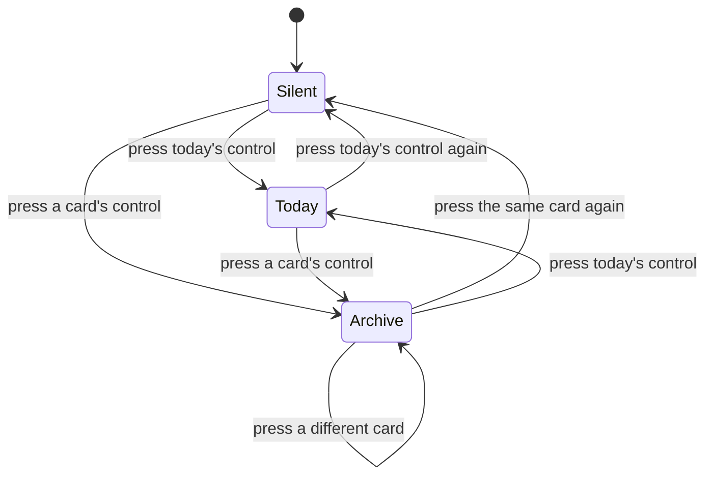

# PRD — Epic 5: Replay any groove you've played

Feature: [briefing.md](../briefing.md) · [roadmap.md](../roadmap.md)

## Summary

Puts a small play button on every card in the played row, so a groove you missed
— or one you simply want to hear again — is a click away instead of gone. To
make that honest, a day's record starts remembering *which* groove it played,
and the page grows a single owner for playback so only one groove ever sounds.

## Problem

Two things are missing. The row of days you've played is inert: it shows what
the answer was but never lets you hear what you were listening to, which is the
part that would actually teach you something. And there is no way to get it
right even if you tried — groove selection is `hash(date) % catalogue.length`,
so the next time the catalogue grows, every past date re-resolves to a different
groove. A naive replay would play audio the player never heard, under an answer
that no longer matches it.

## Scope

- Persisting which groove a day played.
- Resolving a record to its groove, with a fallback for records saved before
  this ships.
- A single owner for page playback, so starting one groove stops any other.
- A small play control on each archive card.

**Out of scope**
- Backfilling a groove id onto records already saved. They keep resolving by
  date, and drift if the catalogue has grown since — accepted, because it
  affects only days played on the old catalogue.
- Tempo control, transposition, count-in, or a note display — that is the "Jam
  mode" candidate in `specs/features.md`, not this.
- Re-guessing or re-scoring a past day. Replay is listening only; the record is
  never written by it.
- Any archive route or paging. Replay reaches the six cards the row shows.

## Requirements

- **R1** — Each archive card carries a play control, smaller than the groove
  card's, rendered as the small variant of the same design-system component
  rather than a second component.
- **R2** — Pressing an archive card's control plays that day's groove.
- **R3** — Only one groove sounds at a time anywhere on the page. Starting any
  groove stops whatever was playing, in both directions: an archive card stops
  today's loop, and today's control stops an archive card. Stopping means back
  to the top — a groove interrupted this way and then started again begins at
  bar 1, never mid-phrase.
- **R4** — Playback is owned once, by the puzzle, and the pressed source is
  handed to it. There is no audio element per card.
- **R5** — A control whose groove is not currently sounding shows the play
  affordance. Every control bound to the groove that *is* sounding shows the
  sounding affordance. At most one groove sounds, but more than one control can
  point at it: today's card carries a control for the same groove the full-width
  button plays, and when it is sounding both show the sounding state and either
  one stops it.
- **R6** — Each archive control's accessible name says which day it plays, so
  six controls in a row are distinguishable to a screen reader.
- **R7** — A day's record stores the id of the groove it played, written from
  the moment this ships.
- **R8** — The stored groove id is optional. A record without one resolves its
  groove by date, exactly as the page does today, and loads without error. No
  storage version bump and no migration.
- **R9** — Replay never writes to the record. Attempts, answer and solved state
  are untouched by playing a groove back.
- **R10** — A groove that cannot be resolved leaves its card without a working
  play control rather than playing the wrong audio. The control still renders,
  disabled, with an accessible name saying that day's groove is unavailable —
  the card still shows the day and its answer, so dropping the control would
  leave the row looking inconsistent for no stated reason.
- **R11** — Today's finished groove, once it is a card in the row, carries a
  play control like every other card. It plays the same source the full-width
  button plays, and R3 makes the two agree rather than compete.
- **R12** — An archive groove loops until it is stopped, exactly as today's
  does. Being able to play along with a groove is the point of playing it back,
  and that needs more than one pass.

## Behaviour details

### One transport, many sources

Exclusivity is structural rather than a rule anyone has to remember: today's
loop and every archive card are the same player, so it cannot play two things.

The `Archive --> Archive` transition is the one worth writing a test for: the
source swaps and the previously sounding card returns to its play affordance in
the same tick.

### Two controls, one source

Today's card is the only entry whose groove is also playable from elsewhere on
the page. Both controls are bound to the same source, so R5's rule is about the
source, not the button: when today's groove sounds, the full-width button and
today's card control both show the sounding affordance, and pressing either
stops it. Nothing special-cases today — it falls out of there being one player.

### Resolving a record to its groove

1. The record carries a groove id present in the catalogue → that groove. This
   is the path that survives the catalogue growing.
2. The record carries no groove id → resolve by date, as the page does today.
   Correct for every record saved before this shipped, on the catalogue those
   days were played against.
3. The record carries an id no longer in the catalogue → unresolvable; R10 and
   Q1 govern the card.

## Acceptance criteria

- **AC1** (R1, R2) — Given two days in the row, when a card's control is
  pressed, then that day's groove source is requested.
- **AC2** (R3) — Given today's loop is playing, when an archive card's control
  is pressed, then today's loop stops and the card's groove plays.
- **AC3** (R3) — Given an archive card is playing, when today's control is
  pressed, then the card stops and today's groove plays.
- **AC4** (R3) — Given one archive card is playing, when a second card's control
  is pressed, then the first stops and the second plays.
- **AC5** (R5) — Given a past day's card is playing, then exactly one control on
  the page shows the sounding affordance.
- **AC5a** (R5, R11) — Given today's groove is sounding, then both the
  full-width button and today's card control show the sounding affordance, and
  pressing either one stops playback.
- **AC6** (R6) — Given six cards render, then each control's accessible name
  names its own day.
- **AC7** (R7) — Given a day is played after this ships, when its record is read
  back, then it carries the id of the groove that was played.
- **AC8** (R8) — Given a record saved without a groove id, when it is loaded,
  then it loads without error and resolves its groove by date.
- **AC9** (R8) — Given a record with a groove id and one without, when both are
  saved and read back, then both round-trip intact.
- **AC10** (R7, R8) — Given the catalogue grows by one groove, then a record
  with an id still resolves to the same groove, and a record without one
  resolves to a different one — the regression this whole piece exists to
  prevent.
- **AC11** (R9) — Given a past day is replayed, then its record is unchanged.
- **AC12** (R10) — Given a record whose stored groove id is not in the
  catalogue, when its card renders, then its control is disabled and its
  accessible name says that day's groove is unavailable, and pressing it plays
  nothing.
- **AC13** (R11) — Given today is finished and in the row, then its card carries
  a play control.
- **AC14** (R12) — Given an archive groove is playing, when it reaches the end
  of the loop, then it continues from the start rather than stopping.

The resolver is `lib/` logic and asserted directly. The strip is asserted
through rendered behaviour with a stubbed player. Storage gets a round-trip
assertion for both record shapes.

## Dependencies

Runs after Epic 4 (both own `lib/archive.ts` and `ArchiveStrip`) and after
Epic 2 (both own `GroovePuzzle`, and this epic consumes the play control's size
prop). It needs from them:

- The small variant of the design-system play control — Epic 2.
- The archive card layout, including today's card — Epic 4.

It changes, and therefore owns: `types.ts` (`DailyResult` gains an optional
groove id), `storage.ts` (accepts and round-trips it), `hooks/useProgress.ts`
(`DayProgress` carries it), `GroovePuzzle` (supplies it at the call site, owns
the transport), plus the resolver in `lib/`.

The persistence work rides in this epic rather than an earlier one because this
is the first epic that reads the id back, and because hoisting it into Wave 1
would put `GroovePuzzle` in two parallel epics at once.

## Assumptions

- Every archive card is replayable, missed days included. A missed day already
  reveals its answer, so withholding its audio would teach nothing.
- Today's card, once Epic 4 puts it in the row, is an archive card like any
  other for the purposes of R3.
- The groove id is `Groove.id`, which the generator already writes and which is
  already stable per groove.
- Replay does not show a progress track on the card; the sounding state on the
  control is the whole indication.
- The archive controls use the play/stop wording Epic 2 settles for the
  full-width control, so the page says one thing everywhere. There is no pause
  anywhere in the feature.
- Pressing check on today's puzzle while an archive groove plays does nothing to
  audio.

## Question log

Answered questions, kept for traceability. The requirements above are the source
of truth — this records how they got there. Append-only.

### Cycle 1 — 2026-08-30

**Q1. What happens to a card whose groove can no longer be resolved?**
Answer: **A) Render the control disabled, with an accessible name saying the
groove is unavailable** — the card still shows the day and its answer, so
silently dropping the control would make the row inconsistent for no visible
reason.
Applied to: R10, AC12

**Q2. Does today's card in the row get a play control too?**
Answer: **A) Yes — every card behaves identically** — a card that looks like the
others but does nothing on press is exactly the inconsistency this feature
exists to remove.
Applied to: R5, R11, AC5, AC5a, AC13, Behaviour details

**Q3. Does an archive groove loop, or play once?**
Answer: **A) Loops until stopped, like today's** — the reason to play an old
groove back is to play along with it, and that needs more than one pass.
Applied to: R12, AC14
