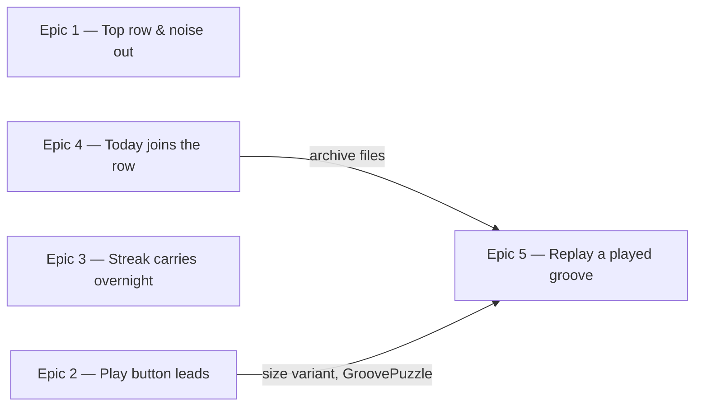

# Roadmap — Clarity pass

Source: [briefing.md](briefing.md)

## Overview

The game works; it just doesn't read clearly. This pass moves the page's
furniture to where it belongs (date and streak in the top row, attempt dots onto
the check button), strips what doesn't earn its place (BPM, "BAR 1–4"), makes
the play button as prominent as the solve button, fixes a streak that reads 0
the morning after a solve, and turns the bottom row from a passive record into
something you can play back.

Value arrives in four independent slices — header, play button, streak, archive
membership — that can all land at once because they own different files. Replay
follows them: it is the one slice that reaches across the page, since it has to
own playback for the whole page and start persisting which groove a day played.

## Epics

### Epic 1 — Date, title and streak in the top row; noise out of the cards

**Visible when done:** The top row reads *date · Daily Groove · "N days streak"*
instead of the `daily-groove` wordmark and "Today's groove". The groove card no
longer shows a BPM number, the player no longer labels "BAR 1 BAR 2 BAR 3 BAR
4", and the three attempt dots sit above the check button rather than beside the
"What is it?" heading, where they read as a hamburger menu.
**Depends on:** none
**Parallel with:** Epics 2, 3, 4

**Scope**
- `GrooveHeader` — the date replaces the dot-and-wordmark eyebrow on the left of
  the top row; the `<h1>` becomes "Daily Groove"; the streak moves to the right
  of the top row on its own, and the vertical divider that separated it from the
  date goes with the date.
- `StreakBadge` — the label becomes `"N days streak"`. The zero case keeps
  today's wording, "No streak yet", rather than reading "0 days streak" like a
  score of nothing — so only the non-zero branch changes.
- `GrooveCard` — the BPM number and its `BPM` eyebrow are removed; the card
  header carries the groove's name alone. `groove.bpm` stays in the type and the
  seed data, it just stops being rendered.
- `TransportPanel` — the four bar labels are removed. The segmented
  `ProgressTrack` stays: it is the only thing showing where in the loop you are.
- `GuessCard` — `AttemptDots` moves out of the heading row to sit above the
  check button, right-aligned to it. `AttemptDots` itself is unchanged.

**Out of scope**
- Making the play button bigger and re-laying-out the groove card's controls —
  Epic 2.
- Correcting the *number* the streak shows — Epic 3. This epic only changes its
  wording and position; `StreakBadge`'s `{ streak: number }` prop is the frozen
  contract between the two.

**Validation**
- Demo: load the page. Top row: today's date left, streak right. Title reads
  "Daily Groove". No BPM anywhere, no bar labels under the progress bar. Make a
  guess — the dots that tick sit over the check button.
- Component tests, colocated, driven through rendered output: header renders the
  date and "Daily Groove" and no `daily-groove` wordmark; `StreakBadge` renders
  "3 days streak" at three and "No streak yet" at zero; `GrooveCard` renders the
  name and not the bpm it is handed; `TransportPanel` renders the track and no
  `BAR` text; `GuessCard` renders the dots within the check control's group.
- Existing tests that assert the old strings are updated, not deleted — each one
  is the old requirement and should be re-pointed at the new one.

### Epic 2 — The play button leads

**Visible when done:** The play control is a full-width button the size and
shape of the solve button, with "Play along. Find the note that feels like
home." sitting below it rather than squeezed alongside a 52px circle.

**Depends on:** none
**Parallel with:** Epics 1, 3, 4

**Scope**
- `src/components/PlayControl` gains a size/width variant so it can render as a
  full-width control matching `Button`'s geometry (`w-full`, `rounded-control`,
  the same vertical padding). It stays generic and prop-driven — no feature
  knowledge — per the design-system rule.
- Whatever `IconButton` needs to support that variant without breaking its
  circular default, since `IconButton` is what `PlayControl` renders through.
- `GroovePuzzle` — the `Row` holding the control and the caption becomes a
  `Stack`: control first, caption below it.
- The transport moves from pause-and-resume to stop-and-restart, so the word on
  the button matches what pressing it does. This pulls `lib/audio.ts` into the
  epic; no other Wave 1 epic touches it. *(Settled in the Epic 2 PRD.)*
- The variant is defined with a third size in mind, not just this one: Epic 5
  needs a *smaller* control for the archive cards and will take the other end of
  the same prop rather than introducing a second component.

**Out of scope**
- The smaller play buttons on the archive cards — Epic 5.
- Removing the bar labels above the button — Epic 1.

**Validation**
- Demo: the play button spans the groove card at the same height as the solve
  button opposite it; the caption reads underneath.
- `PlayControl` is tested against its own contract in `src/components`,
  independent of the feature: each size variant renders, the accessible name
  still states the action ("Play the loop" / "Pause the loop"), the toggle
  fires.
- The feature's existing playback tests keep passing unchanged — this is a
  presentation change, and the fact that they don't need editing is the evidence.

### Epic 3 — The streak carries overnight

**Visible when done:** Solve today, come back tomorrow, and the header says "1
day streak" before you've touched the new groove — not "No streak yet". Solve
that one too and it says "2 days streak". Skip a whole day and it is back to
nothing.

**Depends on:** none
**Parallel with:** Epics 1, 2, 4

**Scope**
- `lib/streak.ts` — `computeStreak` currently requires *today* to qualify and
  returns 0 otherwise, which is what wipes the number every midnight. The run
  becomes: the consecutive qualifying days ending at today, or, when today is
  not yet solved, the consecutive qualifying days ending at yesterday.
- The "one day without trying clears the streak" rule falls straight out of
  that — a fully skipped day is neither today nor yesterday-qualifying — and
  gets its own test rather than being assumed. The briefing asks whether it is
  already implemented: it is, and this epic is what keeps it true under the new
  rule.
- No change to `useProgress`, `storage`, or the record shape. The streak stays
  derived from the result set, never persisted.

**Out of scope**
- The badge's wording and position — Epic 1.
- Whether an unsolved-but-attempted day should ever qualify. It should not, and
  this epic does not change that.

**Validation**
- `lib/streak.ts` is logic, so it is tested directly, with dates as fixtures and
  no fake timers. The table that matters: solved-today-only → 1; solved
  yesterday, today untouched → 1; solved yesterday, today attempted-not-solved →
  1; solved yesterday and today → 2; solved two days ago, nothing since → 0;
  no records at all → 0.
- Demo, without waiting a day: seed localStorage with a record dated yesterday
  and reload.

### Epic 4 — Today joins the played row as soon as it's done

**Visible when done:** Finish today's groove and it appears immediately as the
first card in "Grooves you've played", labelled "Today", instead of only
surfacing tomorrow. The count beside the row includes it.

**Depends on:** none
**Parallel with:** Epics 1, 2, 3

**Scope**
- `lib/archive.ts` — `toArchiveEntries` currently filters to `r.date < today`,
  which is what holds today out. It keeps today's record once the day is
  **solved, or three attempts have been spent**, and orders it first.
- Three spent attempts does not end the day — there is no attempt cap, and this
  epic does not add one. A card can therefore appear while the puzzle above is
  still winnable. Such a card is marked "In play" and **withholds its answer**
  until the day is solved, so the row never gives away the puzzle the page is
  still asking about. On solving, the mark and the answer both appear in place;
  its position does not change. *(Settled in the Epic 4 PRD.)*
- `dayLabel` gains a `Today` case for distance 0.
- `outcomeOf` / `outcomeMark` are re-checked against a same-day entry, which is
  the first entry that can change outcome after it is first rendered.
- `ArchiveStrip` — the empty state ("No grooves behind you yet…") must not show
  when today's card is the only one. Today's card is a normal card in the same
  six-card grid.
- No change to `GroovePuzzle`: it already passes the full result set including
  today's record into `toArchiveEntries`, so the whole rule lives in `lib/`.
  Keeping it there is what lets this epic run beside Epic 2, which owns that file.

**Out of scope**
- Playing a card back — Epic 5.
- Any attempt cap, day lock, or "out of tries" state.
- Any archive route or "All →" link. The count stays plain text.

**Validation**
- `lib/archive.ts` is tested directly: a solved today produces a first entry
  labelled "Today"; a today with three misses produces one too, marked missed; a
  today with one or two attempts produces none; a today that flips from three
  misses to solved changes outcome without changing position.
- `ArchiveStrip` is tested through rendered behaviour: with only a today entry,
  the cards render and the empty state does not.
- Demo: solve today's groove and watch the card appear without a reload. Then,
  on a fresh day, miss three times and watch it appear as missed — and solve on
  the fourth to watch it turn.

### Epic 5 — Replay any groove you've played

**Visible when done:** Every card in the played row carries a small play button.
Press it and that day's groove loops — so a groove you missed, or one you want
to hear again, is two clicks away instead of gone. Only ever one groove sounds
at a time: starting one stops whatever else was playing, today's loop included.

**Depends on:** Epic 4 — both own `lib/archive.ts` and `ArchiveStrip.tsx`, and
this epic renders into the card layout Epic 4 finalises. Also lands after Epic 2
(shares `GroovePuzzle` and the control's size variant).
**Parallel with:** nothing

**Scope**
- **Remembering which groove a day played.** Selection is
  `hash(date) % GROOVES.length`, so every past date re-resolves to a different
  groove the moment `grooves:add` grows the catalogue — a replayed day would
  play audio the player never heard, under an answer that no longer matches it.
  `DailyResult` gains a `grooveId`, written from now on; a record without one
  falls back to date-resolution. The field is optional, so no migration and no
  storage version bump — `storage.ts` only has to stop rejecting it.
  - Touches `types.ts`, `storage.ts`, `hooks/useProgress.ts` (`DayProgress`
    gains the id) and `GroovePuzzle` (supplies it at the call site).
  - It rides here rather than earlier because this is the first epic that reads
    it back, and because pulling it into Wave 1 would put `GroovePuzzle` in two
    parallel epics at once.
- **A resolver in `lib/`** taking a record to its groove: by `grooveId` when
  present, by date otherwise, and handling an id that is no longer in the
  catalogue.
- **One transport for the page.** A player per card is wrong — twelve `Audio`
  elements — so playback is owned once, in `GroovePuzzle`, and the pressed
  source is passed to it. Exclusivity is then structural rather than a rule
  anyone has to remember: today's loop and every archive card are the same
  player, so starting either stops the other in both directions.
- **The small control** on each mini card — the other end of the size variant
  Epic 2 adds, not a second component. `MiniCard` may need to accommodate it;
  if it does, that stays a generic layout prop, not an archive-shaped one.

**Out of scope**
- Backfilling `grooveId` onto records saved before this ships. They keep
  date-resolving, and drift if the catalogue has since grown — accepted, since
  it affects only days already played on an old catalogue.
- Tempo control, transposition, count-in, a note display — that is the "Jam
  mode" candidate in `specs/features.md`, not this.
- Re-guessing or re-scoring a past day. Replay is listening only; the record is
  untouched.

**Validation**
- Demo: with two days in the row, press one card's play button — it loops. Press
  the second — the first stops and the second plays. Press today's big button —
  the archive card stops. Press an archive card while today's loop runs — it
  stops.
- The resolver is `lib/` logic, tested directly: record with `grooveId` resolves
  to it; record without resolves by date; catalogue growth changes the
  date-resolved answer but not the id-resolved one — the regression this whole
  piece exists to prevent.
- Rendered-behaviour tests on `ArchiveStrip` with a stubbed player: each card
  exposes a control whose accessible name says which day it plays; pressing one
  requests that day's source; pressing another releases the first.
- A round-trip through `storage`: a record saved with an id reads back with it,
  and a record saved without one still loads.

## Dependency map

## Execution waves

- **Wave 1 (parallel):** Epic 1, Epic 2, Epic 3, Epic 4. Their file sets are
  disjoint — Epic 1 owns `GrooveHeader`/`StreakBadge`/`GrooveCard`/
  `TransportPanel`/`GuessCard`, Epic 2 owns `PlayControl`/`IconButton`/
  `GroovePuzzle`/`lib/audio.ts`, Epic 3 owns `lib/streak.ts`, Epic 4 owns
  `lib/archive.ts`/`ArchiveStrip` — so all four can run at once.
  **One exception, found while speccing:** `GroovePuzzle.test.tsx` and
  `src/app/page.test.tsx` assert page-wide chrome and are edited by Epics 1, 2
  and 4 alike. Each epic's spec confines those edits to its own integration
  track, and those tracks must land one at a time rather than concurrently.
- **Wave 2:** Epic 5 — needs Epic 4's archive files, Epic 2's control variant,
  and `GroovePuzzle` after Epic 2 has finished with it. It is the largest of the
  five and the only one that reaches across the feature; if it needs splitting
  during speccing, the seam is *persist and resolve the groove id* before *the
  control and the shared transport*.

## Assumptions

- **The date reads as one line.** The top-left slot renders "Saturday, 29
  August" rather than the two-line weekday-over-date stack the right-hand
  cluster uses today. The small accent dot goes with the wordmark it belonged
  to. *(Settled in the Epic 1 PRD.)*
- **The archive still shows six cards.** Today's card takes one of the six, and
  the count beside the row reports every day played including today.
- **Every archive card is replayable, missed days included.** A missed day
  already reveals its answer on the card, so withholding the audio would teach
  nothing.
- **`groove.bpm` stays in the data.** Only its rendering is removed; the field
  is still written by the generator and may be shown again later.
- **No attempt cap is introduced.** The game lets you keep guessing past three;
  the dots mark par, not lives. Epic 4 uses three spent attempts as the moment a
  day becomes *showable*, never as the moment it becomes *over*.
