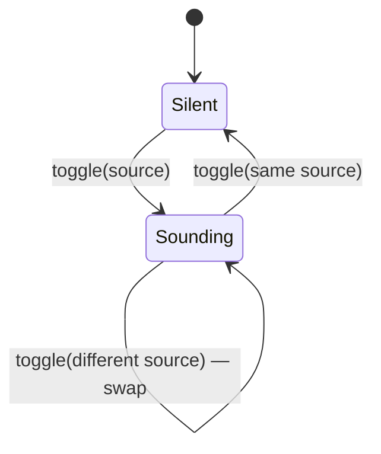

# Tech spec — Epic 5: Replay any groove you've played

PRD: [../prd/epic-5-replay-a-played-groove.md](../prd/epic-5-replay-a-played-groove.md) ·
Roadmap: [../roadmap.md](../roadmap.md)

## Approach

Four separable pieces meeting at one wiring step. Records start carrying the id
of the groove they played, so a past day can be resolved back to its audio after
the catalogue grows. A resolver turns a record into a groove, by id when it has
one and by date when it does not. The design-system control gains an accessible
name override so six controls in a row are distinguishable. And the puzzle's
single-groove transport becomes a single-*source* transport that any card can
hand a new source to.

That last piece is what makes exclusivity structural rather than a rule: there
is one player, so it cannot play two things, and every control derives its state
from "is the sounding source mine?" — which is also why today's card control and
the full-width button light up together with no special case.

## Architecture

The transport moves out of `GroovePuzzle` into
`src/features/daily-groove/lib/transport.ts`. Its source-swapping rules are the
most intricate new logic in the epic and `docs/architecture.md` puts logic in
`lib/`, where `docs/testing.md` says it is tested directly — so those rules are
asserted without mounting the puzzle, and they leave
`GroovePuzzle.test.tsx` (the file three epics already contend over) carrying
only the wiring.

It also stops being bound to one groove at construction. It holds the currently
sounding source and swaps it on demand:



Every control asks the same question: `soundingId === myGrooveId`. Today's
groove has one id and two controls pointing at it, so both read `true` together
and either one's press lands on the same `toggle`. Nothing special-cases today.

Resolution runs at render time, per entry, and is pure:

```
resolveGrooveForResult(result, grooves)
  ├─ result.grooveId  → grooves.find(g => g.id === result.grooveId) ?? null
  └─ no grooveId      → selectGrooveForDate(parse(result.date), grooves)
```

A `null` return is what disables a card's control. It is a real state, not an
error path: a groove can leave the catalogue.

## Contracts

Frozen. Track D builds the wiring against all of these while A, B and C
implement behind them.

```ts
// src/features/daily-groove/types.ts
export type DailyResult = {
  date: string
  answer: Answer
  attempts: Attempt[]
  solved: boolean
  /** The groove played. Absent on records saved before this epic. */
  grooveId?: string
}
```

```ts
// src/features/daily-groove/hooks/useProgress.ts
export type DayProgress = {
  answer: Answer
  attempts: Attempt[]
  solved: boolean
  grooveId: string
}
```

```ts
// src/features/daily-groove/lib/resolveGroove.ts
export function resolveGrooveForResult(
  result: DailyResult,
  grooves: Groove[],
): Groove | null
```

```ts
// src/features/daily-groove/lib/transport.ts
export function createPageTransport(): PageTransport

export type PlayableSource = { id: string; src: string }

export type PageTransport = {
  subscribe(fn: () => void): () => void
  /** The id of the groove currently sounding, or null. */
  getSoundingId(): string | null
  /** Position through the sounding loop, 0..1. */
  getPosition(): number
  /** Toggles `source`: starts it, or stops it if it is already sounding. */
  toggle(source: PlayableSource): Promise<void>
  dispose(): void
}
```

```ts
// src/components/PlayControl.tsx — additive
type PlayControlProps = {
  isPlaying: boolean
  onToggle: () => void
  size?: PlayControlSize
  /** Overrides the accessible name. Falls back to "Play/Stop the loop". */
  label?: string
}
```

`ArchiveStrip` gains two props and keeps the rest:
`{ entries, total, soundingId: string | null, onToggle(entry: ArchiveEntry): void }`.

## Tracks

### Track A — Records remember their groove

- **Goal** — a day saved from now on carries `grooveId`; one saved without it
  still loads.
- **Owns** — `src/features/daily-groove/types.ts`, `types.test.ts`,
  `lib/storage.ts`, `lib/storage.test.ts`, `hooks/useProgress.ts`,
  `hooks/useProgress.test.ts`, `hooks/useProgress.integration.test.ts`
- **Depends on** — the `DailyResult` and `DayProgress` contracts
- **Parallel with** — Tracks B, C
- **Done when** — both record shapes round-trip through storage.

### Track B — Resolving a record to its groove

- **Goal** — `resolveGrooveForResult` covers all three paths.
- **Owns** — `src/features/daily-groove/lib/resolveGroove.ts`,
  `lib/resolveGroove.test.ts`
- **Depends on** — the `DailyResult` contract and the existing
  `selectGrooveForDate`
- **Parallel with** — Tracks A, C
- **Done when** — its tests pass, including the catalogue-growth case.

### Track C — The control names its day

- **Goal** — `PlayControl` accepts an accessible-name override at any size.
- **Owns** — `src/components/PlayControl.tsx`, `PlayControl.test.tsx`,
  `src/components/IconButton.tsx`, `IconButton.test.tsx`
- **Depends on** — Epic 2's `size` prop and its `label` on `Button`
- **Parallel with** — Tracks A, B
- **Done when** — the override is asserted in `src/components`, with no feature
  imported.

### Track D — The page transport

- **Goal** — a source-swapping transport, asserted without a component.
- **Owns** — `src/features/daily-groove/lib/transport.ts`,
  `lib/transport.test.ts`
- **Depends on** — the `PageTransport` contract and `createAudioPlayer`
- **Parallel with** — Tracks A, B, C
- **Done when** — its own tests pass with no React involved.

### Track E — Wiring

- **Goal** — the puzzle holds the transport; the strip renders controls into it.
- **Owns** — `src/features/daily-groove/components/GroovePuzzle.tsx`,
  `GroovePuzzle.test.tsx`, `components/ArchiveStrip.tsx`, `ArchiveStrip.test.tsx`
- **Depends on** — Tracks A, B, C and D landed
- **Done when** — the exclusivity cases pass through the rendered page.

### Track F — Integration

- **Owns** — `src/app/page.test.tsx`
- **Depends on** — Track E

This epic runs in Wave 2 of the feature, after Epics 2 and 4 have released
`GroovePuzzle`, `lib/audio.ts` and the archive files, so it has no concurrent
collisions.

## Execution waves

- **Wave 1 (parallel):** Track A, Track B, Track C, Track D
- **Wave 2:** Track E
- **Wave 3:** Track F — integration

## Implementation

### Track A — Records remember their groove

#### Step A1 — A record round-trips with a groove id

Covers: R7, R8, AC7, AC9

- **Test first** — `lib/storage.test.ts`: save a record with
  `grooveId: 'groove-07'`, read it back through `get` and `getAll`, and assert
  the id survives both. Run it: fails if the envelope validator drops or rejects
  unknown fields.
- **Implement** — `types.ts`: add the optional `grooveId` to `DailyResult`.
  `storage.ts`: ensure the record validator carries the field through. The key
  and `version: 2` are unchanged — an optional field is backward compatible in
  both directions.
- **Green when** — both reads carry the id.
- **Refactor** — none.

#### Step A2 — A record without a groove id still loads

Covers: R8, AC8, AC9

- **Test first** — `lib/storage.test.ts`: write a v2 envelope by hand containing
  a record with no `grooveId`, then `getAll` and assert it loads with
  `grooveId === undefined` and every other field intact. Run it: fails if A1's
  validator made the field required.
- **Implement** — none beyond A1, if the field is genuinely optional. This step
  is what proves it.
- **Green when** — the record loads unchanged.
- **Refactor** — none.

#### Step A3 — The day is written with the groove it played

Covers: R7, AC7

- **Test first** — `hooks/useProgress.test.ts`: call `recordAttempt` with a
  `DayProgress` carrying `grooveId: 'groove-03'` and assert the record handed to
  the injected store has that id. Run it: fails — `DayProgress` has no such
  field and the record is built without it.
- **Implement** — `hooks/useProgress.ts`: add `grooveId` to `DayProgress` and
  include it when constructing the `DailyResult`.
- **Green when** — the store receives the id.
- **Refactor** — none.

#### Step A4 — Replay writes nothing

Covers: R9, AC11

- **Test first** — `hooks/useProgress.test.ts`: assert `useProgress` exposes no
  method that playback could call — structurally, that its returned object's
  keys are exactly `todayResult`, `streak`, `history`, `recordAttempt`,
  `loaded`. It is a guard: replay must never gain a write path.
- **Implement** — none.
- **Green when** — the key assertion passes.

### Track B — Resolving a record to its groove

#### Step B1 — A record with an id resolves by id

Covers: R7, AC10

- **Test first** — `lib/resolveGroove.test.ts`: given a two-groove catalogue and
  a record with `grooveId` matching the second, assert the second is returned.
  Run it: fails with `resolveGrooveForResult is not a function`.
- **Implement** — `lib/resolveGroove.ts`: new module exporting
  `resolveGrooveForResult`, returning `grooves.find(g => g.id === result.grooveId)`
  when `result.grooveId` is set.
- **Green when** — the assertion passes.
- **Refactor** — none.

#### Step B2 — A record without an id resolves by date

Covers: R8, AC8

- **Test first** — `lib/resolveGroove.test.ts`: given a record with no
  `grooveId` and a date, assert the result equals
  `selectGrooveForDate(that date, grooves)`. Run it: fails — the id branch
  returns `undefined`.
- **Implement** — `lib/resolveGroove.ts`: fall back to `selectGrooveForDate`,
  parsing the record's ISO date noon-anchored as `archive.ts` and `streak.ts`
  both do.
- **Green when** — the two agree.
- **Refactor** — none.

#### Step B3 — An id survives the catalogue growing; a date does not

Covers: R7, AC10

- **Test first** — `lib/resolveGroove.test.ts`: resolve one record with an id
  and one without against a three-groove catalogue; resolve both again against
  the same catalogue plus one groove. Assert the id-carrying record returns the
  same groove both times, and that the date-only record's result changes. Run
  it: fails before B1/B2.
- **Implement** — none. This is the regression the epic exists to prevent, and
  it is asserted rather than argued.
- **Green when** — both halves assert.
- **Refactor** — none. If the date-only result happens *not* to change for the
  chosen fixture, pick a date whose hash lands differently — the assertion must
  demonstrate the drift, not accidentally avoid it.

#### Step B4 — An unknown id resolves to null

Covers: R10, AC12

- **Test first** — `lib/resolveGroove.test.ts`: given a record whose `grooveId`
  is not in the catalogue, assert `null`. Run it: fails — `find` returns
  `undefined`, not `null`.
- **Implement** — `lib/resolveGroove.ts`: `?? null` on the id branch. A record
  with an id that is gone must not silently fall back to date resolution — that
  would play the wrong groove, which is exactly what R10 forbids.
- **Green when** — the assertion passes.
- **Refactor** — none.

### Track C — The control names its day

#### Step C1 — The accessible name can be overridden

Covers: R6, AC6

- **Test first** — `src/components/PlayControl.test.tsx`: render
  `size="sm" label="Play Tuesday's groove"` and assert that accessible name;
  render without `label` and assert it still falls back to "Play the loop".
  Run it: fails — the name is always the built-in one.
- **Implement** — `PlayControl.tsx`: add the optional `label` prop, used in
  place of the derived name when present.
- **Green when** — both assert.
- **Refactor** — none.

#### Step C2 — A disabled control states why

Covers: R10, AC12

- **Test first** — `PlayControl.test.tsx`: render with `disabled` and a label,
  and assert the button is disabled and pressing it does not call `onToggle`.
  Run it: fails — there is no `disabled` prop.
- **Implement** — `PlayControl.tsx`: add `disabled?: boolean`, forwarded to the
  host primitive. `Button` already accepts `disabled`; `IconButton` does not, so
  it gains the same optional prop and applies the disabled styling `Button`
  uses.
- **Green when** — both assert.
- **Refactor** — none.

### Track D — The page transport

#### Step D1 — The transport swaps sources

Covers: R3, R4, AC2, AC3, AC4

- **Test first** — `lib/transport.test.ts`: with `createAudioPlayer` stubbed,
  `toggle({ id: 'a', src: '/a.mp3' })` and assert `getSoundingId()` is `'a'`;
  `toggle({ id: 'b', src: '/b.mp3' })` and assert it is `'b'` and that the
  player built for `a` was stopped and disposed; `toggle` `b` again and assert
  `null`. Run it: fails with `createPageTransport is not a function`.
- **Implement** — `lib/transport.ts`: `createPageTransport()` returning
  `PageTransport`. It holds `soundingId` and at most one player, forwards the
  player's notifications to its own listener set, and on `toggle(source)` stops
  and disposes the current player when the id differs before building and
  playing one for the new source.
- **Green when** — all three assertions pass.
- **Refactor** — the lazy-construction and listener-forwarding shim that lived
  in `GroovePuzzle`'s `createTransport` moves here whole; only the binding of a
  single `src` is dropped.

#### Step D2 — Toggling the sounding source stops it

Covers: R3, AC4

- **Test first** — `lib/transport.test.ts`: toggle `a`, then toggle `a` again,
  and assert `getSoundingId()` is `null` and the player was stopped. Run it:
  fails if `toggle` always starts.
- **Implement** — none beyond D1, if the id comparison is written first. This
  step is what proves the same-source branch exists.
- **Green when** — the assertion passes.
- **Refactor** — none.

#### Step D3 — Every player loops

Covers: R12, AC14

- **Test first** — `lib/transport.test.ts`: toggle an archive source and assert
  `createAudioPlayer` was called with `{ loop: true }`; repeat after a swap. Run
  it: fails if `loop` is passed only for the first source.
- **Implement** — `lib/transport.ts`: construct every player with
  `{ loop: true }`.
- **Green when** — both calls carry it.
- **Refactor** — none.

#### Step D4 — Disposing releases the sounding player

Covers: R4

- **Test first** — `lib/transport.test.ts`: toggle a source, call `dispose()`,
  and assert the player was disposed, the listener set cleared and
  `getSoundingId()` is `null`. Run it: fails if `dispose` only clears listeners.
- **Implement** — `lib/transport.ts`: `dispose()` stops and disposes any current
  player before clearing listeners.
- **Green when** — all three assertions pass.
- **Refactor** — none.

### Track E — Wiring

#### Step E1 — Today's groove plays through the transport

Covers: R3, AC3

- **Test first** — `GroovePuzzle.test.tsx`: press the full-width control and
  assert the transport's sounding id is today's groove id. Run it: fails until
  the puzzle passes a `PlayableSource` rather than relying on a bound src.
- **Implement** — `GroovePuzzle.tsx`: replace the local `createTransport` with
  `createPageTransport()` held in state, pass
  `{ id: groove.id, src: groove.audioSrc }` to `toggle`, and derive the
  control's `isPlaying` from `soundingId === groove.id`. Read `soundingId` and
  `position` through `useSyncExternalStore` as the position is read today.
- **Green when** — the assertion passes and Epic 2's play/stop cases still pass.
- **Refactor** — delete the now-unused `createTransport` and its `Transport`
  type from `GroovePuzzle.tsx`.

#### Step E2 — Each card carries a control naming its day

Covers: R1, R2, R6, R11, AC1, AC6, AC13

- **Test first** — `ArchiveStrip.test.tsx`: render three entries with
  `soundingId={null}` and a spy `onToggle`, and assert three controls exist with
  accessible names naming their own labels, and that pressing the second calls
  `onToggle` with the second entry. Run it: fails — the strip renders no
  controls.
- **Implement** — `ArchiveStrip.tsx`: add the `soundingId` and `onToggle` props;
  render `<PlayControl size="sm" label={...} isPlaying={...} onToggle={...} />`
  in each `MiniCard`. The strip stays presentational — it holds no player and no
  store reference.
- **Green when** — all three assertions pass.
- **Refactor** — none.

#### Step E3 — Exclusivity, in both directions

Covers: R3, R5, AC2, AC3, AC4, AC5

- **Test first** — `GroovePuzzle.test.tsx`: press an archive card while today's
  groove sounds, and assert today's control returns to its play affordance and
  the card shows the sounding one; then press today's control and assert the
  reverse; then press a second card and assert the first returns to play. Assert
  in each case that exactly one control shows the sounding affordance. Run it:
  fails before E1.
- **Implement** — `GroovePuzzle.tsx`: pass `soundingId` down to `ArchiveStrip`
  and a handler that resolves the entry's groove and calls `toggle`.
- **Green when** — all three transitions and the single-sounding invariant pass.
- **Refactor** — none.

#### Step E4 — Today's two controls agree

Covers: R5, R11, AC5a

- **Test first** — `GroovePuzzle.test.tsx`: with today finished and in the row,
  press the full-width control and assert *both* it and today's card control
  show the sounding affordance; press today's card control and assert both
  return to play. Run it: fails if either control derives its state from
  anything other than `soundingId === myGrooveId`.
- **Implement** — none beyond E1 and E2, if both derive state the same way. This
  step is what proves they do.
- **Green when** — both assertions pass.
- **Refactor** — none.

#### Step E5 — An unresolvable groove disables its control

Covers: R10, AC12

- **Test first** — `GroovePuzzle.test.tsx`: seed a record whose `grooveId` is
  not in the catalogue, and assert its card's control is disabled, names the
  groove as unavailable, and plays nothing on press. Run it: fails — the control
  is enabled and `toggle` is called with a null source.
- **Implement** — `GroovePuzzle.tsx`: when `resolveGrooveForResult` returns
  `null`, pass `disabled` and the unavailable label instead of a source.
- **Green when** — the control is inert.
- **Refactor** — none.

### Track F — Integration

#### Step F1 — The page test covers a replay

Covers: R1, R2, R3

- **Test first** — `src/app/page.test.tsx`: with two seeded past days, assert
  each card carries a play control, and that pressing one and then the other
  leaves exactly one sounding.
- **Implement** — none.
- **Green when** — `npm test` is green across the suite.

## Integration and verification

- `npm test`, `npm run lint`, `npm run build` green.
- Demo path, from the PRD: with two days in the row, press one card's control —
  it loops. Press the second — the first stops and the second plays. Press
  today's big button — the archive card stops. Press an archive card while
  today's loop runs — it stops. Let an archive groove run past the end of its
  loop — it repeats.
- Catalogue-growth check, by hand: play a day, run `npm run grooves:add`, reload,
  and confirm the archived day still plays the groove it was played with. This
  is the behaviour the whole persistence half exists for, and it cannot be
  demonstrated by the unit tests alone.

## Requirement coverage

| Requirement | Steps |
| :-- | :-- |
| R1 | E2, F1 |
| R2 | E2, F1 |
| R3 | D1, D2, E1, E3, F1 |
| R4 | D1, D4 |
| R5 | E3, E4 |
| R6 | C1, E2 |
| R7 | A1, A3, B1, B3 |
| R8 | A1, A2, B2 |
| R9 | A4 |
| R10 | B4, C2, E5 |
| R11 | E2, E4 |
| R12 | D3 |
| AC1 | E2 |
| AC2 | D1, E3 |
| AC3 | D1, E1, E3 |
| AC4 | D1, D2, E3 |
| AC5 | E3 |
| AC5a | E4 |
| AC6 | C1, E2 |
| AC7 | A1, A3 |
| AC8 | A2, B2 |
| AC9 | A1, A2 |
| AC10 | B1, B3 |
| AC11 | A4 |
| AC12 | B4, C2, E5 |
| AC13 | E2 |
| AC14 | D3 |

## Assumptions

- The groove id stored is `Groove.id`, which the generator already writes and
  which is already stable per groove.
- `resolveGroove.ts` is a new module rather than an addition to
  `selectGroove.ts`, which stays the pure date→groove function it is today and
  which the resolver calls.
- `ArchiveStrip` receives `soundingId` and `onToggle` as props rather than
  reaching for a context or a hook, keeping `GroovePuzzle` the feature's only
  stateful component as it is today.
- `createPageTransport` is a plain factory in `lib/`, not a hook. `GroovePuzzle`
  holds the instance in `useState` and reads it through `useSyncExternalStore`,
  exactly as it holds the store today — so the React binding stays in the
  component and the swapping rules stay testable without one.
- The archive control's label reads "Play Tuesday's groove" / "Stop Tuesday's
  groove", built from the entry's existing `label` field.
- No progress track is rendered on an archive card.
- Records saved before this epic are not backfilled.

## Decision log

Settled architectural decisions. The sections above are the source of truth —
this records how they got there, and what each one cost. Append-only.

### Cycle 1 — 2026-08-30

**Q1. How does the transport change source?**
Decision: **A) One player at a time, disposed and rebuilt on every source
change** — `createAudioPlayer` already owns construction, polling and teardown
as a unit, and disposal is a path Epic 2 already tests. Reassigning `src` on a
live element would leave `currentTime`, the `loop` flag and the rAF poll to be
reset by hand.
Changed: nothing. Steps D1 and D4 were drafted against this.
Rejected because: a player per source kept in a map means up to seven live media
elements, and a second dedicated archive player reintroduces exactly what R4
rules out — two players kept exclusive by a rule rather than by structure.

**Q2. Where does the multi-source transport live?**
Decision: **A) Extract to `src/features/daily-groove/lib/transport.ts`, with
`GroovePuzzle` holding the instance** — `docs/architecture.md` puts logic in
`lib/` and `docs/testing.md` tests `lib/` directly, and the source-swapping
rules are the part of this epic most worth asserting without a render.
Changed: Architecture, Contracts (`createPageTransport` added), the track
structure — the former Track D split into Track D (the transport, now parallel
with A/B/C) and Track E (wiring), with integration becoming Track F. Steps D1
and D7 moved into `lib/transport.test.ts` and became D1–D4; the former D2, D4,
D5 and D6 became E1, E3, E4 and E5; the former E1 became F1. Execution waves and
the whole coverage table were rewritten to match.
Second benefit, worth recording: it moves four transport cases out of
`GroovePuzzle.test.tsx` — the file Epics 1, 2 and 4 already contend over — and
into a file this epic owns outright.
