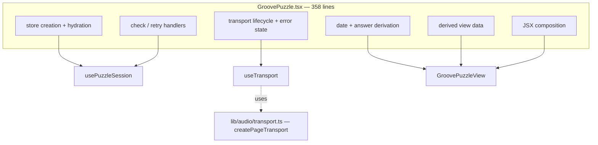

# PRD — Epic 3: The god component, dismantled

Feature: [briefing.md](../briefing.md) · [roadmap.md](../roadmap.md)

## Summary

Three concrete anti-patterns, found by surveying the codebase against its own
stated rules: a 358-line root component that owns everything, a route test that
reaches past the feature's public surface, and a hash function duplicated across
the app/generator boundary with only a comment holding the two copies together.
This epic fixes all three and writes the rules they produce into
`docs/coding-guidelines.md`.

## Problem

`docs/architecture.md` sets a standard: delete a feature's folder and its route,
and the app still builds. That standard does not currently hold — `src/app/page.test.tsx`
deep-imports four feature internals, so deleting the feature breaks the route's
tests. `GroovePuzzle.tsx` imports eight lib modules and both of the feature's
hooks, and has an 1,184-line test — the largest file in `src/` by a factor of
three, and still growing. And `scripts/grooves/rng.ts` asserts
in a comment that its `hashString` is "byte-for-byte the same" as the app's, with
nothing checking it — if they drift, the app picks a different groove than the
generator's seed implies.

## Scope

- Split `GroovePuzzle` into two hooks plus a composition component.
- Relocate the feature assertions out of `src/app/page.test.tsx`.
- Un-duplicate `hashString` into a new `src/lib/hash.ts`.
- Fill the anti-patterns and shared-code sections of `docs/coding-guidelines.md`.

**Out of scope**
- The lint rules that stop these recurring — Epic 4.
- Any change to puzzle behaviour, the store's state shape, or `index.ts`.
- Re-rendering groove audio. The freeze rule in `scripts/grooves/README.md`
  holds: ids, audio and answers do not change.
- Moving the `Groove` type to `src/lib/` — Epic 4 settles that alongside the
  generator's other boundary crossing.

## Requirements

- **R1** — `GroovePuzzle` is split into exactly two extracted seams and a
  composition component:
  - `usePuzzleSession` — store creation, hydration, and check.
  - `useTransport` — audio transport lifecycle and error state.
  - `GroovePuzzleView` — composition only.
- **R2** — No component file constructs an I/O adapter. Feature-4 already moved
  the page transport out to `lib/transport.ts`, so this holds at the start of the
  epic; extracting `useTransport` must not put lifecycle construction back into a
  component to get there.
- **R3** — `src/app/page.test.tsx` imports nothing from `src/features/daily-groove`
  except through its `index.ts`, and asserts only what the route itself does:
  that it composes `PageShell`, `Container` and `GroovePuzzle`.
- **R4** — The feature-behaviour assertions currently in `page.test.tsx` are
  preserved and relocated into the feature test file that owns their subject, per
  the table in Behaviour details. None is deleted, and none is relocated to a
  file whose subject it does not test.
- **R5** — `src/lib/hash.ts` exists and exports `hashString`. Both
  `src/features/daily-groove/lib/puzzle/selectGroove.ts` and
  `scripts/grooves/rng.ts` import it; neither holds its own copy.
- **R6** — The generator imports it by relative path with the extension —
  `../../src/lib/hash.ts` — the mechanism `scripts/grooves/manifest.ts` already
  uses. No alias, bundler or build step is introduced.
- **R7** — `src/lib/hash.ts` is runtime-safe TypeScript: a plain function, no
  enums, namespaces or decorators, and no `@/` imports of its own, because Node
  strips types but does not resolve the alias.
- **R8** — `src/lib/hash.ts` carries a header stating what an edit costs: the
  same function seeds the generator's RNG and picks the player's groove of the
  day, so changing it re-renders every groove and reassigns every past date's
  puzzle.
- **R9** — Every assertion from the 1,184-line `GroovePuzzle.test.tsx` survives,
  redistributed across the extracted units. The count of assertions does not go
  down.
- **R10** — Puzzle behaviour is unchanged: the same groove for the same date, the
  same attempt and solve flow, the same persisted progress, the same audio.
- **R11** — After this epic, deleting `src/features/daily-groove/` and
  `src/app/page.tsx` leaves a tree with no dangling imports.
- **R12** — The anti-patterns section of `docs/coding-guidelines.md` states each
  rule against the violation that produced it: no I/O adapter in a component
  file, no deep import past a feature's `index.ts` (tests included), tests
  colocated with the code they cover. The shared-code section states what
  qualifies for `src/lib/` — pure, dependency-free, runtime-safe TypeScript,
  importable by both the app and the generator.
- **R13** — `GroovePuzzle.test.tsx` is split to mirror the new units: a test file
  beside each of `usePuzzleSession` and `useTransport`, and a slimmer
  `GroovePuzzle` test that keeps the assertions about the composed whole — the
  ones that hold only when every region is rendered together.
- **R14** — `src/lib/hash.test.ts` pins `hashString` against a fixed table of
  input/output pairs, so any edit to the one function the app and the generator
  share fails loudly. The test imports nothing but `src/lib/hash.ts` and needs
  neither ffmpeg nor the generator.

## Behaviour details

What `GroovePuzzle` owns today, and where each piece lands:

Two seams, not four: these are the ones the existing 1,184-line test is already
organised around, so its assertions redistribute rather than get rewritten. R9 is
the check on that — if assertions have to be rewritten to fit the new shape, the
split has gone past a refactor and into a redesign.

`hashString` becomes a genuinely shared module rather than a duplicated one. The
generator already reaches into `src/` this way: `scripts/grooves/manifest.ts:3`
imports `../../src/features/daily-groove/types.ts`. The one difference is that
the existing crossing is `import type`, erased at runtime, while this is a value
import — hence R7.

### Where the route test's assertions go

Every test currently in `src/app/page.test.tsx`, and the file that owns its
subject afterwards:

| Assertion in `page.test.tsx` | Lands in |
| :-- | :-- |
| renders the designed shell with a play control and the guessing card | split — shell in `page.test.tsx`, the rest in `GroovePuzzle.test.tsx` |
| shows today's groove card and its transport | `components/puzzle/GrooveCard.test.tsx`, `components/puzzle/TransportPanel.test.tsx` |
| shows the streak badge alongside the puzzle | `components/header/GrooveHeader.test.tsx` |
| offers today's deterministic flavour options, including the answer | `lib/theory/music.test.ts`, `components/puzzle/GuessCard.test.tsx` |
| offers all twelve roots, in the design's order | `components/puzzle/GuessCard.test.tsx` |
| names the chosen pair on the check control once both are picked | `components/puzzle/GuessCard.test.tsx` |
| opens with three unspent attempt dots and the opening guidance | `components/puzzle/AttemptDots.test.tsx`, `lib/presentation/feedback.test.ts` |
| reveals neither the solved panel nor the day's changes before the solve | `GroovePuzzle.test.tsx` (composed) |
| shows the archive's empty state on a first visit | `components/archive/ArchiveStrip.test.tsx` |
| puts a play control on every card in the played row | `components/archive/ArchiveStrip.test.tsx` |
| leaves exactly one groove sounding as the row is played through | `components/archive/ArchiveStrip.test.tsx`, `hooks/useTransport.test.ts` |
| waits for the day's saved record rather than flashing a fresh game | `hooks/usePuzzleSession.test.ts` |
| composes the page out of design-system primitives | stays in `page.test.tsx` |

Assertions move in two directions in this epic — out of `page.test.tsx` into the
feature, and out of `GroovePuzzle.test.tsx` into the extracted units. AC5 is the
only thing standing between that and silent loss of coverage, so it is checked
across the whole suite rather than per file.

## Acceptance criteria

- **AC1** (R1) — Given the feature after this epic, when `usePuzzleSession` is
  tested in isolation, then store creation, hydration from a stored result, and
  check both succeed and fail as they do today.
- **AC2** (R1) — Given the feature after this epic, when `useTransport` is tested
  in isolation, then it constructs, plays, disposes on unmount, and surfaces an
  error when the player fails to load.
- **AC3** (R2) — Given the repo after this epic, when component files are
  searched for audio-adapter construction, then `createTransport` is defined only
  under `lib/audio/`.
- **AC4** (R3) — Given `src/app/page.test.tsx`, when its imports are inspected,
  then the only `@/features/daily-groove` import is the bare package path, and no
  `vi.mock` names a path inside the feature.
- **AC5** (R4, R9) — Given the total assertion count across the whole suite
  before this epic, when the same count is taken after it, then it has not
  decreased, and every assertion named in the Behaviour details table is present
  in the file that table assigns it to.
- **AC13** (R13) — Given the repo after this epic, when `GroovePuzzle.test.tsx`
  is measured, then it is materially shorter than 1,184 lines and covers only the
  composed whole, with `usePuzzleSession` and `useTransport` each covered by a
  test file beside them.
- **AC14** (R14) — Given `src/lib/hash.test.ts`, when a single character of
  `hashString` is changed, then the test fails; and when the suite is run without
  ffmpeg or the sample pack present, then it passes.
- **AC6** (R5) — Given the repo after this epic, when the source is searched for
  the FNV-1a constant `16777619`, then it appears exactly once, in
  `src/lib/hash.ts`.
- **AC7** (R6, R7) — Given a clean checkout, when `npm run grooves` is run, then
  it completes without a build step and its output is byte-identical to the
  committed manifest and mp3s.
- **AC8** (R10) — Given a fixed date, when `selectGrooveForDate` is called before
  and after this epic, then it returns the same groove for every date in a
  year-long sweep.
- **AC9** (R10) — Given the app under `npm run dev`, when a full puzzle is played
  — guess, miss, guess, solve, reload — then the behaviour is identical to
  before the epic.
- **AC10** (R11) — Given the repo after this epic, when
  `src/features/daily-groove/` and `src/app/page.tsx` are deleted, then
  `npx tsc --noEmit` reports no unresolved import.
- **AC11** (R10) — Given the repo after this epic, when
  `npm run grooves:verify` is run, then it passes with no audio or manifest
  change.
- **AC12** (R12) — Given `docs/coding-guidelines.md`, when it is read, then its
  anti-patterns section names all four violations fixed here with the file each
  came from, and its shared-code section states the `src/lib/` bar.

## Dependencies

**Needs:** Epic 2's final folder layout. This epic edits the same feature files
and names paths that Epic 2 creates — `lib/audio/`, `lib/puzzle/selectGroove.ts`,
and the `components/header/`, `components/puzzle/` and `components/archive/`
regions the relocated assertions are filed into.

**Hands to Epic 4:** the existence of `src/lib/` as a shared boundary, and the
open question of the generator's `import type` of the feature's `types.ts` —
which this epic deliberately leaves alone so Epic 4 can settle both crossings
together.

## Assumptions

- The two hooks live under the feature's `hooks/`, alongside `useProgress.ts`.
- `GroovePuzzleView` keeps its name, and it and the exported `GroovePuzzle`
  wrapper stay at the `components/` root where Epic 2 puts them. The wrapper and
  its loading state are otherwise unchanged.
- `src/lib/` gets no test project of its own — `hash.test.ts` sits beside it and
  runs under the existing `app` vitest project, whose include glob is
  `src/**/*.{test,spec}.{ts,tsx}` and already covers it.
- The relocated assertions go into existing test files. This epic creates no new
  test file except the ones mirroring the units it extracts —
  `usePuzzleSession`, `useTransport` and `src/lib/hash.ts`.

## Question log

Answered questions, kept for traceability. The requirements above are the source
of truth — this records how they got there.

### Cycle 1 — 2026-08-30

**Q1. Where do the 219 lines of feature assertions from `page.test.tsx` land?**
Answer: **B) Distributed into the existing test files by subject** — each
assertion joins the file that owns what it tests, so no new test file is created
to hold orphaned coverage and each component's test stays the description of that
component.
Applied to: R4, AC5, Behaviour details (the destination table), Assumptions

**Q2. How is the app/generator hash agreement verified once they share a module?**
Answer: **A) A pin table in `src/lib/hash.test.ts`** — the cheapest guard that
fails loudly on any edit to the one function that must never silently change,
and it needs neither ffmpeg nor the generator to run.
Applied to: R14, AC14

**Q3. Does `GroovePuzzle.test.tsx` stay one file?**
Answer: **A) Split it to mirror the new units** — a 746-line test file is the
same navigability problem this feature exists to fix, and `docs/testing.md` asks
that tests sit beside the code under test.
Applied to: R13, AC13, Behaviour details

### Cycle 2 — 2026-08-30

**Tree refresh.** Feature-4 landed between cycle 1 and cycle 2 and changed three
of this epic's premises. What survives, and what did not:

- **Already fixed.** `createTransport` is gone from `GroovePuzzle.tsx`; the page
  transport now lives in `lib/transport.ts` as `createPageTransport`. R2 is
  restated as the rule to hold rather than the move to make, and the
  anti-pattern count in the Summary drops from four to three.
- **Worse, not better.** `GroovePuzzle.tsx` grew 353 → 358 lines, its test 746 →
  1,184, and `page.test.tsx` 219 → 324. R9, AC13 and the Behaviour details now
  carry the current numbers.
- **Unchanged.** All four deep imports in `page.test.tsx` are still there, and
  `hashString` is still duplicated — R3, R4, R5 and the destination table stand.
  The table gains the two played-row tests feature-4 added, both of which also
  reach past the feature's public surface.
