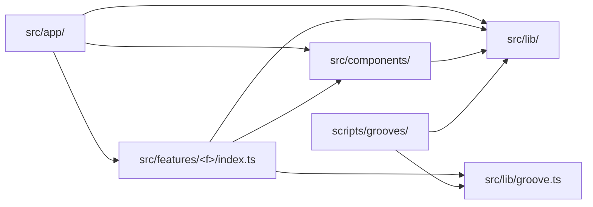

# PRD — Epic 4: Guidelines that lint enforces

Feature: [briefing.md](../briefing.md) · [roadmap.md](../roadmap.md)

## Summary

Epics 1–3 each append a section to `docs/coding-guidelines.md`. This epic turns
those three appendices into one coherent document, then makes the rules that can
be checked mechanically fail `npm run lint` instead of relying on review. It
also settles the two places where the groove generator reaches into `src/`.

## Problem

`docs/architecture.md` has stated the rules since the project began — no design
system import from a feature, no deep import past a feature's `index.ts` — and
the survey for this feature found violations of both. A rule that only exists in
prose gets broken silently. `eslint-plugin-import` is already installed via
`eslint-config-next`, so `import/no-restricted-paths` costs no new dependency.

## Scope

- Consolidate the three appended sections into one document.
- Add `import/no-restricted-paths` boundaries to `eslint.config.mjs`.
- Settle the generator's two crossings into `src/`.
- Cross-link `architecture.md` and `testing.md`, cutting what is now duplicated.

**Out of scope**
- A CI pipeline running lint on every PR. That is a candidate feature of its
  own in `specs/features.md`; this epic makes it worth having.
- New rules the codebase has not motivated. The briefing asks for rules derived
  from the project.
- Fixing violations. Epics 1–3 leave none behind, and AC5 is the proof.

## Requirements

- **R1** — `docs/coding-guidelines.md` reads as one document: no duplicated
  rules between sections, no contradictions, and a consistent voice.
- **R2** — Every rule in the document names the code that motivated it, and is
  marked as either lint-enforced or a convention a human checks.
- **R10** — Rules that no linter can check stay in the document rather than being
  dropped or exiled. Each is marked as human-checked and carries the example that
  motivated it. These include: design-system components are named generically, no
  I/O adapter is constructed in a component file, generated data lives in `data/`
  and never in `lib/`, feature components are grouped by screen region, and
  `src/lib/hash.ts` is frozen because changing it re-renders every groove and
  reassigns every past date's puzzle.
- **R3** — `eslint.config.mjs` enforces, as errors:
  - `src/components/**` may not import from `src/features/**`
  - no code *outside* `src/features/<f>/` may import `src/features/<f>/**`
    except through `src/features/<f>/index.ts`. The rule binds consumers, not
    the feature itself: inside its own folder a feature's files import each
    other freely by relative path, because `index.ts` is the surface for the
    outside world rather than an internal routing table.
  - no feature may import another feature
  - `src/lib/**` may not import from `src/features/**` or `src/components/**`
- **R4** — The rules apply to test files as well as source. Both violations the
  survey found were in tests.
- **R5** — A violation's lint message names the rule it broke and why, not just
  the restricted path.
- **R6** — The generator's crossings into `src/` are settled explicitly rather
  than banned by accident: `scripts/**` → `src/lib/**` is the intended channel
  and stays open, and it becomes the *only* one. After R11 the generator imports
  nothing from `src/features/**`, so the boundary needs no carve-out.
- **R11** — The types the generator and the app share move to `src/lib/groove.ts`:
  `Root`, `Flavour`, and `Groove`, which is defined in terms of the other two.
  `Answer`, `Attempt` and `DailyResult` stay in the feature's `types.ts` — they
  are gameplay and persistence concepts the generator has no knowledge of.
- **R12** — `scripts/grooves/manifest.ts` imports `Groove` from
  `../../src/lib/groove.ts`. No file under `scripts/` imports from
  `src/features/**`.
- **R13** — The manifest's emitted header changes with it: the generated
  `grooves.generated.ts` declares `import type { Groove } from '@/lib/groove'`
  rather than `from '../types'`. Because that changes the generated file's
  bytes, the manifest is regenerated and its hash in `grooves.lock.json` is
  updated.
- **R14** — Regenerating for R13 leaves every `.mp3` byte-identical and every
  audio hash in `grooves.lock.json` unchanged. This is not a freeze-rule
  violation: no groove's id, audio or answers change, only the import line at the
  top of the generated file.
- **R15** — The feature's `index.ts` exports the same names it exports today,
  re-exporting `Root`, `Flavour` and `Groove` from `src/lib/groove.ts`. Consumers
  of the feature see no change.
- **R7** — The hand-edit guard on the generated manifest is settled: either a
  lint rule forbids editing it, or the document states that
  `npm run grooves:verify` already covers it via the manifest hash and no second
  guard is added.
- **R8** — `docs/architecture.md` and `docs/testing.md` link to the guidelines
  and no longer restate what it says. Neither is deleted.
- **R9** — `npm run lint` passes clean on the tree as it stands after Epic 3.

## Behaviour details

The import boundaries, as enforced. An arrow is an import that is allowed; every
pair not drawn is an error.

Three things this makes visible. The design system may use `src/lib/` but never
a feature, which is what keeps it reusable. Features reach each other only by
not reaching each other — there is no arrow between two features, so shared code
moves up into `src/lib/` or `src/components/` rather than sideways. And
`src/lib/` is a leaf: it imports nothing from the app, which is what lets the
generator import it from outside the alias.

## Acceptance criteria

- **AC1** (R3) — Given a file in `src/components/` that imports
  `@/features/daily-groove`, when `npm run lint` is run, then it fails naming
  that file and the rule.
- **AC2** (R3) — Given a file in `src/app/` that imports
  `@/features/daily-groove/lib/theory/music`, when `npm run lint` is run, then it
  fails; and given the same file importing `@/features/daily-groove`, then it
  passes.
- **AC3** (R3) — Given a file in `src/lib/` that imports from `src/components/`,
  when `npm run lint` is run, then it fails.
- **AC9** (R3) — Given `src/features/daily-groove/components/puzzle/GuessCard.tsx`
  importing `../../lib/theory/music` — a relative import inside its own feature —
  when `npm run lint` is run, then it passes.
- **AC10** (R10, R2) — Given `docs/coding-guidelines.md`, when its rules are
  counted, then every one is tagged lint-enforced or human-checked, and each of
  the five conventions named in R10 is present and tagged human-checked.
- **AC11** (R11, R12) — Given the repo after this epic, when `scripts/` is
  searched for `src/features`, then there are no matches.
- **AC12** (R14) — Given the diff for this epic, when `public/grooves/` and the
  audio entries of `grooves.lock.json` are inspected, then nothing has changed;
  and when `npm run grooves:verify` is run, then it passes.
- **AC13** (R13) — Given the repo after this epic, when `npm run grooves` is run
  a second time, then `git status` reports no change, confirming the regenerated
  manifest is stable.
- **AC14** (R15) — Given `index.ts` before and after this epic, when their
  exported names are compared, then the two sets are identical.
- **AC4** (R4) — Given the deep import of AC2 written in a `.test.tsx` file
  instead, when `npm run lint` is run, then it fails the same way.
- **AC5** (R9) — Given the tree after Epic 3 with no deliberate violation added,
  when `npm run lint` is run, then it passes with no errors and no warnings.
- **AC6** (R6) — Given `scripts/grooves/rng.ts` importing
  `../../src/lib/hash.ts`, when `npm run lint` and `npm run grooves` are run,
  then both succeed.
- **AC7** (R1, R2) — Given `docs/coding-guidelines.md`, when every rule in it is
  read, then each names a motivating example from this repo and is marked
  lint-enforced or human-checked, and no rule appears twice.
- **AC8** (R8) — Given `docs/architecture.md` and `docs/testing.md`, when they
  are read, then each links to the guidelines and neither restates a rule the
  guidelines own.

## Dependencies

**Needs:** Epics 1, 2 and 3 complete. The rules are derived from what those epics
did, the paths they name are the paths those epics created, and AC5 is only
meaningful once the known violations are fixed.

**Hands to:** a future CI feature, which gains a lint step worth running.

## Assumptions

- `import/no-restricted-paths` is expressive enough for all four rules in R3. Its
  zone `except` clause is the mechanism for the index.ts rule's carve-out; if it
  cannot express it, the fallback is `no-restricted-imports` with path patterns,
  and the document says which rule is enforced by which mechanism.
- Rules are errors rather than warnings — a warning in a project with no CI is a
  rule nobody enforces.
- `scripts/**` is not linted for these boundaries beyond R6, since
  `eslint.config.mjs` currently ignores only `specs/**` and the generator has its
  own conventions in `scripts/grooves/README.md`.
- The guidelines document stays a single file. It is short enough that splitting
  it would cost more navigation than it saves.

## Question log

Answered questions, kept for traceability. The requirements above are the source
of truth — this records how they got there.

### Cycle 1 — 2026-08-30

**Q1. How is the generator's deep import of the feature's `types.ts` resolved?**
Answer: **A) Move `Groove` and the types the manifest needs to `src/lib/`** —
`Groove` is the contract between the generator and the app rather than something
the feature owns privately, and it belongs where `hashString` went in Epic 3.
Applied to: R6, R11, R12, R13, R14, R15, AC11–AC14, Behaviour details

**Contradiction resolved.** Epic 2's R5 states that `types.ts` stays at the
feature root because the generator imports it. That requirement is now amended
rather than reversed: `types.ts` does stay, holding `Answer`, `Attempt` and
`DailyResult`, but the three types the generator needs leave it for
`src/lib/groove.ts`. Epic 2 still performs no type move; this epic does, which is
why the change is recorded here and cross-referenced there.

**Q2. Does the `index.ts`-only rule permit a feature's own files to import each
other by relative path?**
Answer: **A) The rule binds only code outside the feature** — `architecture.md`
describes `index.ts` as the surface for consumers, so a feature is a black box
from outside and unrestricted within.
Applied to: R3, AC9

**Q3. What does the document do about rules that cannot be linted?**
Answer: **A) Keep them, clearly marked as human-checked, with the motivating
example** — the briefing asks that the refactorings be stored as rules derived
from the project, which includes the ones a linter cannot see, and marking them
honestly stops the document being read as fully enforced.
Applied to: R10, AC10, R2 (confirmed)
