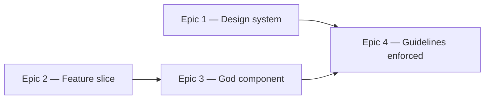

# Roadmap — Structure and guidelines

Source: [briefing.md](briefing.md)

## Overview

A refactoring feature: nothing changes for the player, so "visible when done" here
means visible to a developer — the shape of the tree, what an import line looks
like, and what `npm run lint` now rejects. The design system and the feature slice
are reorganised into named sub-folders in parallel, the anti-patterns found along
the way are fixed, and the rules that fall out are written into
`docs/coding-guidelines.md` and enforced by lint so they stop being aspirational.

**The safety net is the existing test suite** (~4,600 lines of tests across `src/`).
The governing rule for every epic: *a pure move may change import paths and file
locations, never a test's assertions.* If an assertion has to change, behaviour
changed, and that is out of scope. Epic 3 is the one exception — it redistributes
`GroovePuzzle.test.tsx` across new units — and there the rule becomes "every
assertion preserved, none deleted".

## Epics

### Epic 1 — A design system you can navigate

**Visible when done:** `src/components/` is five named groups instead of 38 flat
files, and an import says which kind of thing it is pulling in
(`@/components/controls/Button`, not `@/components/Button`).
**Depends on:** none
**Parallel with:** Epic 2

**Scope**
- Group the 19 design-system components into five role sub-folders, tests moving
  with them:
  - `layout/` — `Container`, `PageShell`, `Row`, `Stack`, `LabelledColumn`
  - `surfaces/` — `Card`, `MiniCard`, `Panel`
  - `controls/` — `Button`, `IconButton`, `Chip`, `ChipGroup`, `PlayControl`
  - `typography/` — `Heading`, `Text`, `EyebrowLabel`, `SectionLabel`
  - `display/` — `Pill`, `ProgressTrack`
- **No barrel files.** An import names the file it wants —
  `@/components/controls/Button` — so there is no re-export indirection and no
  way for one import to pull in the whole design system.
- `tokens.ts` stays at `src/components/tokens.ts` — it is the system's shared
  vocabulary, not a member of any one group.
- Update every import site across `src/app/` and `src/features/`.
- Create `docs/coding-guidelines.md` with the agreed section skeleton, and fill
  the design-system section: what belongs in each group, the naming rule
  (generic, never domain), and the never-import-a-feature rule.

**Out of scope**
- The lint rule that mechanically enforces the boundary — Epic 4.
- Splitting, merging or rewriting any component. This epic moves files and
  rewrites import lines; component source is otherwise untouched.
- Feature-specific components under `src/features/` — Epic 2.

**Validation**
- Demo path: open `src/components/`, see five folders; open any feature component
  and read its imports.
- `npm test`, `npm run lint`, `npm run build` all green with **zero changed
  assertions** — the diff is paths and moves only.
- Design-system component tests keep testing their own contract (props, states,
  a11y) independently of any feature, per `docs/testing.md`.

### Epic 2 — A feature slice with named seams

**Visible when done:** `src/features/daily-groove/lib/` is no longer eleven
unrelated modules as siblings — music theory, persistence, audio, puzzle
selection and presentation each have a folder, generated data is separated from
logic, and `hooks/` contains only hooks.
**Depends on:** none
**Parallel with:** Epic 1

**Scope**
- Split `lib/` by concern. Working proposal:
  - `lib/theory/` — `notes.ts`, `music.ts`, `options.ts`
  - `lib/puzzle/` — `selectGroove.ts`, `scoring.ts`
  - `lib/persistence/` — `storage.ts`, `streak.ts`
  - `lib/presentation/` — `feedback.ts`, `archive.ts`
  - `lib/audio/` — `audio.ts`
- Move `grooves.generated.ts` (329 lines of data) out of `lib/` into `data/`.
  It is the generator's output, not business logic, and `scripts/grooves/manifest.ts`
  writes to that path — the generator's write target moves with it.
- Move `hooks/useDailyGrooveStore.ts` to `state/`. It exports
  `createDailyGrooveStore`, a vanilla zustand store factory — not a hook. `hooks/`
  is left holding `useProgress.ts`, which genuinely is one.
- Tests move with their subjects, staying colocated.
- Keep `index.ts` as the feature's only public surface; its exports do not change.
- Append the feature-slice section to `docs/coding-guidelines.md`.

**Out of scope**
- Sub-grouping the 12 files in `components/` — twelve is navigable, and the
  churn is not obviously worth it. Revisit if Epic 3's split pushes it higher.
- Any change to what the modules do, or to the store/`useProgress` division of
  responsibility — that split is already sound (session state vs. persisted
  progress) and documented in both files.
- `GroovePuzzle.tsx` — Epic 3.

**Validation**
- Demo path: `find src/features/daily-groove -type d` reads as a table of contents.
- `npm run grooves:verify` still passes — the manifest path moved, so this proves
  the generator and the app still agree.
- `npm test`, `npm run lint`, `npm run build` green with zero changed assertions.

### Epic 3 — The god component, dismantled

**Visible when done:** `GroovePuzzle.tsx` is no longer a 353-line file that imports
ten of the feature's eleven lib modules, and `src/app/page.test.tsx` no longer
reaches past the feature's public surface.
**Depends on:** Epic 2 — it edits the same files and needs the final folder layout
**Parallel with:** none

**Scope**
- **Split `GroovePuzzle`.** It currently owns date, answer derivation, store
  creation, hydration, audio transport lifecycle, error handling and orchestration
  in one component; its test is 746 lines, the largest file in `src/`, which is the
  symptom rather than the cause. Extract exactly two seams — a
  `usePuzzleSession` hook (store creation, hydration, check) and a `useTransport`
  hook (transport lifecycle, error state) — leaving `GroovePuzzleView` as
  composition. Two, not four: these are the seams the 746-line test is already
  organised around, so its assertions redistribute cleanly rather than being rewritten.
- **Move `createTransport`** (currently `GroovePuzzle.tsx:62-115`) into
  `lib/audio/`, beside `createAudioPlayer`. An audio adapter in a component file
  is the reason the component needs a `useRef` and two `useEffect`s.
- **Fix `src/app/page.test.tsx`.** It deep-imports four feature internals
  (`lib/selectGroove`, `lib/music`, `lib/grooves.generated`, and a `vi.mock` of
  `lib/audio`) and tests 219 lines of feature behaviour from the route layer. This
  breaks both architecture.md's no-deep-imports rule and testing.md's colocation
  rule — delete the feature folder today and these tests fail. Relocate the
  feature-behaviour assertions into the feature; leave `page.test.tsx` asserting
  only what the route itself does: that it composes `PageShell`, `Container` and
  `GroovePuzzle`.
- **Un-duplicate `hashString` into `src/lib/hash.ts`.** `scripts/grooves/rng.ts`
  and `src/features/daily-groove/lib/puzzle/selectGroove.ts` hold the same
  function, and rng.ts's own comment asserts they are "byte-for-byte the same"
  with nothing checking it. Both now import the one copy, so the comment becomes
  a real dependency. This creates `src/lib/`, which `docs/architecture.md`
  already names as the home for cross-cutting utilities and which does not yet
  exist.
  - The generator imports it by relative path with the extension —
    `../../src/lib/hash.ts` — the same mechanism `scripts/grooves/manifest.ts:3`
    already uses to reach `src/features/daily-groove/types.ts`. Node 26 strips
    types natively, so no alias, bundler or build step is involved.
  - One new constraint: that is a *value* import where the existing precedent is
    `import type`, so `src/lib/hash.ts` must stay runtime-safe TypeScript — a
    plain function, no enums, namespaces or decorators, and no `@/` imports of
    its own, since Node will not resolve the alias.
  - Give the file a header stating what an edit costs. The same function seeds
    the generator's RNG *and* picks the player's groove of the day, so changing
    it both re-renders every groove (a freeze-rule violation per
    `scripts/grooves/README.md`) and reassigns every past date's puzzle. Making
    that shared-ness explicit is the point of the move.
- Append the anti-patterns section to `docs/coding-guidelines.md`, each rule
  written against the actual violation it came from.

**Out of scope**
- Changing puzzle behaviour, the store's state shape, or the `index.ts` surface.
- Re-rendering any groove audio. The freeze rule in `scripts/grooves/README.md`
  still holds: ids, audio and answers do not change.

**Validation**
- Demo path: play through a full puzzle in `npm run dev` — guess, miss, guess,
  solve, reload — and confirm nothing differs.
- `rm -rf src/features/daily-groove && rm src/app/page.tsx` leaves a tree with no
  dangling imports. This is architecture.md's own removability standard, and it is
  the check that currently fails because of `page.test.tsx`.
- Every assertion from the 746-line `GroovePuzzle.test.tsx` survives, redistributed
  across the extracted units; the integration test still covers the whole flow.
- `npm test`, `npm run lint`, `npm run build` green.

### Epic 4 — Guidelines that lint enforces

**Visible when done:** `docs/coding-guidelines.md` is one coherent document rather
than three appended sections, and a deliberate architecture violation — a design
system component importing a feature, or a deep import past a feature's
`index.ts` — fails `npm run lint` instead of passing review.
**Depends on:** Epics 1, 2, 3 — the rules are derived from what those epics actually did
**Parallel with:** none

**Scope**
- Consolidate `docs/coding-guidelines.md`: dedupe the three sections, resolve
  contradictions, and make every rule state the concrete violation it came from.
  The briefing's requirement is that the rules are *derived from the project* —
  so no rule goes in that this codebase did not motivate.
- Add `import/no-restricted-paths` to `eslint.config.mjs`. `eslint-plugin-import`
  is already present via `eslint-config-next`, so this needs no new dependency.
  Enforce, at minimum:
  - `src/components/**` may not import from `src/features/**`
  - nothing may import `src/features/<f>/**` except through `src/features/<f>/index.ts`
  - no feature may import another feature
  - `src/lib/**` may not import from `src/features/**` or `src/components/**`
- Settle the generator's two reaches into `src/` explicitly, rather than letting
  the new rules ban them by accident: `scripts/**` → `src/lib/**` is the intended
  channel and stays open, while `scripts/grooves/manifest.ts`'s deep `import type`
  of `src/features/daily-groove/types.ts` genuinely crosses a feature boundary.
  Either move the `Groove` type to `src/lib/` alongside the hash, or write the
  carve-out down as a named exception with its reason.
- Add a lint guard against hand-editing `src/features/daily-groove/data/grooves.generated.ts`,
  or note explicitly that `npm run grooves:verify` already covers it via the
  manifest hash and no second guard is needed.
- Cross-link `docs/architecture.md` and `docs/testing.md` to the new document, and
  cut anything now duplicated between them.

**Out of scope**
- A CI pipeline to run the lint on every PR — that is a candidate feature of its
  own in `specs/features.md`, and this epic makes it worth having.
- New rules the codebase has not motivated.

**Validation**
- Demo path: add `import { GroovePuzzle } from '@/features/daily-groove'` to a file
  in `src/components/`, run `npm run lint`, watch it fail with a readable message;
  revert.
- Same for a deep import: `@/features/daily-groove/lib/theory/music` from `src/app/`.
- `npm run lint` passes clean on the tree as it stands after Epic 3 — meaning the
  first three epics genuinely left no violations behind.
- Every rule in `coding-guidelines.md` is either lint-enforced or explicitly
  marked as a convention a human has to check.

## Dependency map

## Execution waves

- **Wave 1 (parallel):** Epic 1, Epic 2 — disjoint directories (`src/components/`
  vs `src/features/`). Both touch import sites and both write a section to
  `docs/coding-guidelines.md`; the sections are disjoint, so a merge is trivial,
  but whichever lands first creates the file from the agreed skeleton.
- **Wave 2:** Epic 3 — edits the same feature files as Epic 2 and needs its final
  layout.
- **Wave 3:** Epic 4 — the rules can only be written down and enforced once the
  refactors that motivate them exist.

## Assumptions

- **The refactor is behaviour-preserving end to end.** No user-visible change, no
  change to the `index.ts` surface, no re-rendered audio. The existing tests are
  the contract; assertions changing is the signal something went wrong.
- **One feature, so the removability rule is currently untested.**
  `daily-groove` is the whole app, which means architecture.md's "delete the
  folder and it still builds" standard has never actually been exercised. Epic 3
  exercises it, and Epic 4's lint rules are what keep it true when a second
  feature arrives. Splitting `daily-groove` into multiple features is *not* in
  scope — the briefing asks for sub-folders, not a re-slicing.
- **`scripts/grooves/` is out of scope except where the app touches it** — the
  manifest write path (Epic 2) and the duplicated `hashString` (Epic 3). The
  generator has its own README, its own vitest project and its own conventions.
- The generated manifest keeps its do-not-edit header and its lock-file guard
  wherever it lands.
- **`src/lib/` becomes a shared boundary with the generator, not just an app
  folder.** Sharing `hashString` puts anything else that lands there one relative
  import away from `scripts/`, so the guidelines must say what qualifies: pure,
  dependency-free, runtime-safe TypeScript. It is not a dumping ground for app
  utilities.

## Decisions settled

Answered on the first pass; the epics above already reflect them.

- **Component taxonomy** — five role folders (`layout/`, `surfaces/`, `controls/`,
  `typography/`, `display/`), not atomic-design tiers.
- **Barrel files** — none. An import names the file.
- **`hashString`** — moved to a shared `src/lib/hash.ts` that both the app and the
  generator import, rather than kept as two copies pinned by a contract test. This
  went against the recommendation, and it is workable: the generator already
  imports from `src/` by relative `.ts` path, and the move turns an asserted
  invariant into an enforced one. The cost is that `src/lib/` is now a shared
  boundary with real constraints — see Assumptions.
- **`GroovePuzzle` split** — two hooks (`usePuzzleSession`, `useTransport`) plus a
  composition component.
